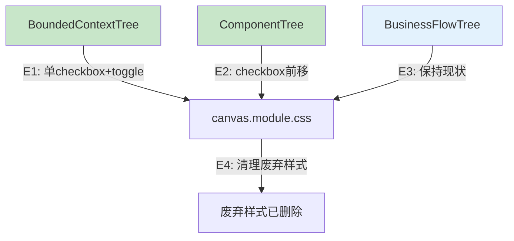

# Architecture: Canvas 卡片 UI 修复

**项目**: vibex-canvas-card-ui-fix
**版本**: v1.0
**日期**: 2026-04-02
**架构师**: architect
**状态**: ✅ 设计完成

---

## 执行摘要

修复 Canvas 三树组件卡片 UI 问题：删除冗余视觉元素，统一 checkbox toggle 行为。

**技术选型**: React + TypeScript + CSS Modules
**总工时**: 2h

---

## 1. Tech Stack

| 技术 | 选择 | 理由 |
|------|------|------|
| **框架** | React 18 + TypeScript | 已有，无变更 |
| **样式** | CSS Modules | 已有，补充样式变更 |
| **测试** | Jest + RTL | 已有 |

---

## 2. Architecture Diagram



---

## 3. Component API Changes

### 3.1 BoundedContextTree

- 删除 `selectionCheckbox`（绝对定位）
- 保留 `confirmCheckbox` 作为唯一 checkbox
- 删除 `nodeTypeBadge`
- 删除 `confirmedBadge`
- type 通过 border 颜色区分（core=橙/supporting=蓝/generic=灰）
- confirmed 通过 border 颜色区分（confirmed=绿色）

### 3.2 ComponentTree

- checkbox 前移到标题同一行
- 删除 `nodeTypeBadge`
- type 通过 border 颜色区分

### 3.3 BusinessFlowTree

保持现状（已正确）。

---

## 4. Testing Strategy

```typescript
describe('BoundedContextTree', () => {
  it('only 1 checkbox per node', () => { /* ... */ });
  it('toggle双向切换', () => { /* ... */ });
  it('no nodeTypeBadge', () => { /* ... */ });
  it('no confirmedBadge', () => { /* ... */ });
});

describe('ComponentTree', () => {
  it('checkbox inline with title', () => { /* ... */ });
  it('no nodeTypeBadge', () => { /* ... */ });
});
```

---

## 5. Performance Impact

无性能风险，删除冗余元素减少 DOM 节点。

---

## ADR-001: 用 border 颜色替代 badge

**状态**: Accepted

**决策**: 删除 nodeTypeBadge/confirmedBadge，type 和 confirmed 状态通过 border 颜色区分。

---

## 执行决策

- **决策**: 已采纳
- **执行项目**: vibex-canvas-card-ui-fix
- **执行日期**: 2026-04-02
