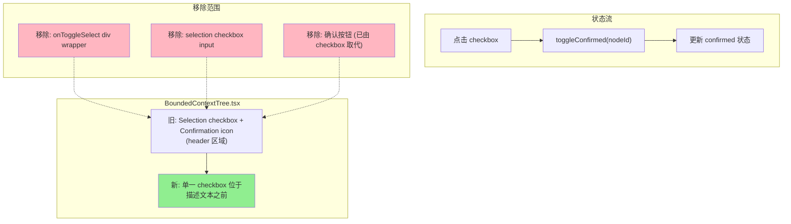

# ADR-XXX: VibeX Canvas Checkbox 去重 — 架构设计

**状态**: Accepted  
**日期**: 2026-03-30  
**角色**: Architect  
**项目**: vibex-canvas-checkbox-dedup

---

## Context

Canvas 卡片同时显示两个 checkbox：
1. **Selection checkbox**（header）：用于批量删除勾选
2. **Confirmation checkbox**（header）：表示节点已确认状态

用户经常混淆这两个 checkbox。需求是移除 selection checkbox，仅保留确认 checkbox，并将其移至描述文本之前。

---

## Decision

### Tech Stack

| 技术 | 用途 | 变更 |
|------|------|------|
| React | UI 框架 | 无变更 |
| TypeScript | 类型安全 | 移除 `selected` 相关类型 |
| Zustand | 状态管理 | 无变更（confirmed 状态已由父组件管理）|
| CSS Modules | 样式隔离 | 移除 selection checkbox 相关样式 |
| Vitest + Playwright | 测试 | 新增 E2E 测试用例 |

### 架构图



### UI 变更对比

| 区域 | 变更前 | 变更后 |
|------|--------|--------|
| Header | [□选择] [type] [✓已确认] | [type] |
| 描述前 | 无 | [✓确认 checkbox] |
| 按钮 | [确认] [编辑] [删除] | [编辑] [删除] |
| 全选 | "全选" | "确认所有" |

---

## 技术方案

### 组件结构变更

```tsx
// BoundedContextTree.tsx 变更点

// 1. 移除 selection checkbox wrapper (L233-244)
// 删除: {onToggleSelect && (...<div onClick=...>...<input type="checkbox" .../>...</div>)}

// 2. 简化 header (L247-252)
// 旧: <div className={styles.nodeCardHeader}>
//       <div className={styles.nodeTypeBadge}>{type}</div>
//       {node.confirmed && <CheckboxIcon checked />}
//     </div>
// 新: <div className={styles.nodeCardHeader}>
//       <div className={styles.nodeTypeBadge}>{type}</div>
//     </div>

// 3. 在描述前添加 confirmation checkbox
// 新增: <input type="checkbox" checked={node.confirmed}
//              onChange={() => onToggleConfirm(node.nodeId)}
//              aria-label="确认" />

// 4. 移除确认按钮 (L254-261)
// 删除: <button onClick={...}>确认</button>

// 5. 全选按钮文案变更 (L399)
// 旧: "全选"
// 新: "确认所有"
```

### 状态管理

| 状态 | 来源 | 变更 |
|------|------|------|
| `selected` | 批量选择 | **移除**（selection checkbox 删除） |
| `confirmed` | 节点确认 | **保留**（checkbox 直接切换） |

确认状态由父组件通过 `onToggleConfirm(nodeId)` 回调管理，BoundedContextTree 本身不持有状态。

### CSS 变更

| 选择器 | 操作 |
|--------|------|
| `.selectionCheckbox` | **删除** |
| `.nodeCardHeader` | **保留**（仅 type badge） |
| 新增 checkbox 位置样式 | 在 `.nodeCardTitle` 之前 |

---

## API 定义

### 组件 Props 变更

```typescript
// BoundedContextTreeProps 变更
interface BoundedContextTreeProps {
  // 移除
  // selectedIds?: string[];
  // onToggleSelect?: (nodeId: string) => void;

  // 保留
  confirmedIds?: string[];
  onToggleConfirm?: (nodeId: string) => void;  // 新增或确认已有
}
```

### 批量操作变更

```typescript
// 移除: handleSelectAll()
// 新增: handleConfirmAll()

// 移除: handleDeleteSelected()
// 保留: handleDeleteNode(nodeId) // 直接删除，无需预勾选
```

---

## 性能评估

| 指标 | 影响 | 说明 |
|------|------|------|
| 渲染性能 | 无显著影响 | 仅移除 2 个元素，减少 DOM 节点 |
| 状态更新 | 无影响 | confirmed 状态切换逻辑不变 |
| 包体积 | 减小 | 移除 selection checkbox 相关代码 ~50 行 |
| 样式文件 | 减小 | 删除 selection checkbox CSS ~8 行 |

---

## 测试策略

### 测试框架

- **Vitest**: 单元测试（组件逻辑）
- **Playwright**: E2E 测试（用户交互流程）

### 核心测试用例

```typescript
// 1. Checkbox 重构验证
test('单一 checkbox 存在于描述前', async () => {
  const checkboxes = page.locator('[type="checkbox"]');
  await expect(checkboxes).toHaveCount(1);
});

test('点击 checkbox 切换 confirmed 状态', async () => {
  await page.click('[aria-label="确认"]');
  await expect(api).toHaveBeenCalledWith(nodeId, true);
});

// 2. 移除验证
test('不包含 selection checkbox', async () => {
  await expect(page).not.toContainText('选择');
  await expect(page).not.toContainSelector('[aria-label*="选择"]');
});

test('不包含确认按钮', async () => {
  await expect(page).not.toHaveButton('确认');
});

// 3. 功能保留验证
test('删除按钮可用（无需预勾选）', async () => {
  await page.click('[aria-label="删除"]');
  await expect(deleteDialog).toBeVisible();
});

test('确认所有功能正常', async () => {
  await page.click('确认所有');
  await expect(api).toHaveBeenCalledWith('confirm-all');
});
```

### 覆盖率要求

- 单元测试: > 80%
- E2E: 覆盖 F1-F5 验收标准

---

## 风险评估

| 风险 | 等级 | 缓解措施 |
|------|------|----------|
| 父组件仍传递 `onToggleSelect` | 低 | 清理 Props 接口，TypeScript 编译检查 |
| 批量删除依赖 selection 状态 | 低 | 保留单个删除功能，移除批量选择 |
| 样式冲突 | 低 | CSS Modules 隔离，仅修改目标文件 |

---

## 执行决策

- **决策**: 已采纳
- **执行项目**: vibex-canvas-checkbox-dedup
- **执行日期**: 2026-03-30
