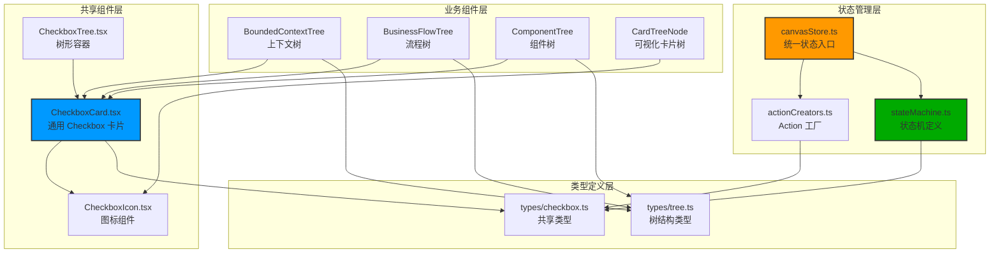
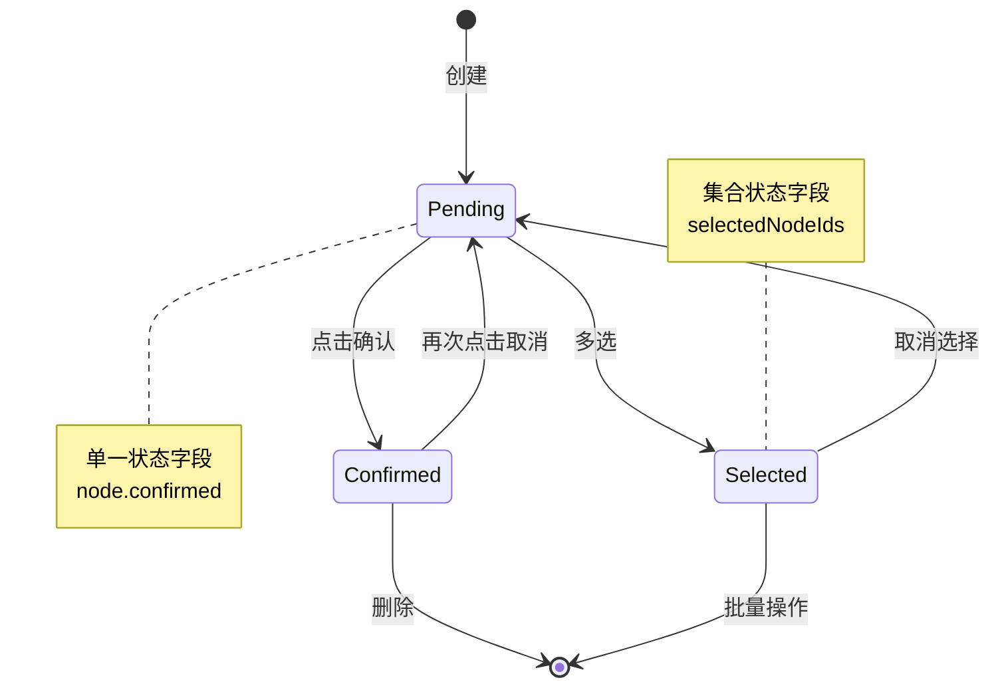
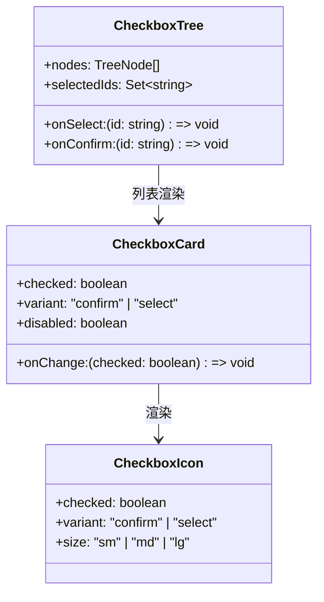
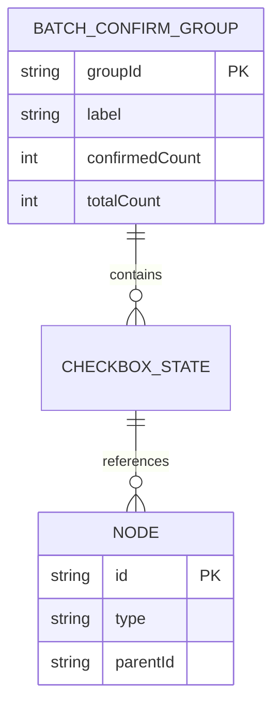

# Architecture: VibeX Canvas Checkbox 勾选逻辑统一

> **项目**: vibex-canvas-checkbox-unify
> **阶段**: design-architecture
> **版本**: 1.0.0
> **日期**: 2026-03-30
> **Architect**: Architect Agent
> **Coord 补充要求**: 组件化 + 模块化 + 统一联动 + 避免分散修改
> **工作目录**: /root/.openclaw/vibex/vibex-fronted

---

## 执行决策
- **决策**: 已采纳
- **执行项目**: vibex-canvas-checkbox-unify
- **执行日期**: 2026-03-30
- **复用**: 重用 `vibex-canvas-evolution` 的 canvasStore 和 CSS 变量系统

---

## 1. 概述

### 1.1 问题背景

Canvas 页面存在 5 个 checkbox 相关问题，根因分为两类：
- **状态管理缺失**: 问题 1、3、5
- **设计意图混淆**: 问题 2、5

### 1.2 Coord 补充要求

| 要求 | 说明 |
|------|------|
| **组件化** | 抽取通用 CheckboxCard 组件 |
| **模块化** | 统一状态管理层（避免逻辑散落各组件） |
| **统一联动** | 虚线框内卡片的勾选联动逻辑 |
| **避免分散** | 综合所有问题统一设计 |

### 1.3 核心修复范围

| 问题 | 优先级 | 修复范围 |
|------|--------|----------|
| 问题1: checkbox 无法取消 | P0 | canvasStore toggle |
| 问题2: 流程卡片联动缺失 | P0 | 设计意图澄清 |
| 问题3: 虚线框组缺少批量确认 | P1 | 组件 + store |
| 问题5: Checkbox 不统一 | P1 | 抽取组件 |

**排除**: 问题4（自由拖动）需架构重构，延期处理。

---

## 2. Tech Stack

| 层级 | 技术选型 | 理由 |
|------|----------|------|
| **组件框架** | React + TypeScript（现有） | 无变更 |
| **样式** | CSS Modules + CSS Variables（现有） | 复用 canvas-evolution |
| **状态管理** | Zustand canvasStore（现有） | 统一状态入口 |
| **拖拽** | @dnd-kit（现有） | 保持不变 |
| **测试** | Vitest + Testing Library + Playwright | 现有 |

---

## 3. 架构设计

### 3.1 组件架构



### 3.2 状态机模型



### 3.3 Checkbox 职责分离



---

## 4. 组件设计

### 4.1 CheckboxCard 组件

```typescript
// src/components/canvas/CheckboxCard/CheckboxCard.tsx

import React, { useCallback } from 'react';
import styles from './CheckboxCard.module.css';
import { CheckboxIcon } from '../CheckboxIcon/CheckboxIcon';

export type CheckboxVariant = 'confirm' | 'select';
export type CheckboxSize = 'sm' | 'md' | 'lg';

export interface CheckboxCardProps {
  /** 节点 ID */
  nodeId: string;
  /** 是否选中/确认 */
  checked: boolean;
  /** 变体：confirm=确认状态, select=多选状态 */
  variant: CheckboxVariant;
  /** 是否禁用 */
  disabled?: boolean;
  /** 尺寸 */
  size?: CheckboxSize;
  /** 变化回调 */
  onChange: (nodeId: string, checked: boolean) => void;
  /** 子节点（用于批量确认） */
  childIds?: string[];
  /** 是否显示批量确认指示器 */
  showBatchIndicator?: boolean;
}

/**
 * 通用 Checkbox 卡片组件
 * 统一处理确认状态和多选状态
 */
export const CheckboxCard: React.FC<CheckboxCardProps> = ({
  nodeId,
  checked,
  variant,
  disabled = false,
  size = 'md',
  onChange,
  childIds = [],
  showBatchIndicator = false,
}) => {
  const handleClick = useCallback(() => {
    if (disabled) return;
    onChange(nodeId, !checked);
  }, [nodeId, checked, disabled, onChange]);

  // 批量确认：显示子节点数量
  const batchCount = childIds.length;

  return (
    <div
      className={`${styles.checkboxCard} ${styles[variant]} ${checked ? styles.checked : ''} ${disabled ? styles.disabled : ''}`}
      onClick={handleClick}
      role="checkbox"
      aria-checked={checked}
      aria-disabled={disabled}
      tabIndex={disabled ? -1 : 0}
      onKeyDown={(e) => {
        if (e.key === ' ' || e.key === 'Enter') {
          e.preventDefault();
          handleClick();
        }
      }}
    >
      <CheckboxIcon
        checked={checked}
        variant={variant}
        size={size}
      />
      
      {showBatchIndicator && batchCount > 0 && (
        <span className={styles.batchIndicator}>
          {batchCount}
        </span>
      )}
    </div>
  );
};
```

### 4.2 CheckboxIcon 组件

```typescript
// src/components/canvas/CheckboxIcon/CheckboxIcon.tsx

import React from 'react';
import styles from './CheckboxIcon.module.css';

export interface CheckboxIconProps {
  /** 是否选中 */
  checked: boolean;
  /** 变体 */
  variant: 'confirm' | 'select';
  /** 尺寸 */
  size?: 'sm' | 'md' | 'lg';
  /** 自定义类名 */
  className?: string;
}

/**
 * Checkbox 图标组件
 * confirm: 绿色勾选（表示确认状态）
 * select: 标准复选框（表示多选状态）
 */
export const CheckboxIcon: React.FC<CheckboxIconProps> = ({
  checked,
  variant,
  size = 'md',
  className = '',
}) => {
  if (variant === 'confirm') {
    return (
      <span
        className={`${styles.confirmIcon} ${styles[size]} ${checked ? styles.checked : ''} ${className}`}
        aria-label={checked ? '已确认' : '未确认'}
      >
        {checked ? '✅' : '⚪'}
      </span>
    );
  }

  return (
    <span
      className={`${styles.selectIcon} ${styles[size]} ${checked ? styles.checked : ''} ${className}`}
      aria-label={checked ? '已选择' : '未选择'}
    >
      <span className={styles.box}>
        {checked && <span className={styles.check} />}
      </span>
    </span>
  );
};
```

### 4.3 统一状态管理层

```typescript
// src/lib/canvas/checkboxStore.ts

import { create } from 'zustand';
import { immer } from 'zustand/middleware/immer';

export type CheckboxVariant = 'confirm' | 'select';
export type NodeType = 'context' | 'flow' | 'component' | 'step';

interface CheckboxState {
  // 确认状态（单一节点）
  confirmedNodes: Record<string, boolean>; // nodeId -> confirmed
  
  // 多选状态（按类型分组）
  selectedNodes: Record<NodeType, Set<string>>;
  
  // 批量确认状态
  batchConfirmPending: string[]; // 待批量确认的节点ID列表
}

/**
 * Checkbox 统一状态管理
 * 替代散落在各组件的状态逻辑
 */
export const useCheckboxStore = create<CheckboxState>()(
  immer((set, get) => ({
    confirmedNodes: {},
    selectedNodes: {
      context: new Set(),
      flow: new Set(),
      component: new Set(),
      step: new Set(),
    },
    batchConfirmPending: [],

    // 切换确认状态
    toggleConfirm: (nodeId: string) => {
      set((state) => {
        const current = state.confirmedNodes[nodeId] ?? false;
        state.confirmedNodes[nodeId] = !current;
      });
    },

    // 设置确认状态
    setConfirm: (nodeId: string, confirmed: boolean) => {
      set((state) => {
        state.confirmedNodes[nodeId] = confirmed;
      });
    },

    // 批量确认
    batchConfirm: (nodeIds: string[]) => {
      set((state) => {
        for (const nodeId of nodeIds) {
          state.confirmedNodes[nodeId] = true;
        }
      });
    },

    // 切换多选状态
    toggleSelect: (nodeId: string, nodeType: NodeType) => {
      set((state) => {
        const set = state.selectedNodes[nodeType];
        if (set.has(nodeId)) {
          set.delete(nodeId);
        } else {
          set.add(nodeId);
        }
      });
    },

    // 设置多选状态
    setSelect: (nodeId: string, nodeType: NodeType, selected: boolean) => {
      set((state) => {
        if (selected) {
          state.selectedNodes[nodeType].add(nodeId);
        } else {
          state.selectedNodes[nodeType].delete(nodeId);
        }
      });
    },

    // 全选/取消全选
    selectAll: (nodeType: NodeType, nodeIds: string[]) => {
      set((state) => {
        state.selectedNodes[nodeType] = new Set(nodeIds);
      });
    },

    // 清空选择
    clearSelection: (nodeType: NodeType) => {
      set((state) => {
        state.selectedNodes[nodeType] = new Set();
      });
    },

    // 批量确认：设置待确认列表
    setBatchConfirmPending: (nodeIds: string[]) => {
      set((state) => {
        state.batchConfirmPending = nodeIds;
      });
    },

    // 执行批量确认
    executeBatchConfirm: () => {
      const pending = get().batchConfirmPending;
      if (pending.length === 0) return;
      
      set((state) => {
        for (const nodeId of pending) {
          state.confirmedNodes[nodeId] = true;
        }
        state.batchConfirmPending = [];
      });
    },
  }))
);

// 选择器 hooks
export const useConfirmed = (nodeId: string) => 
  useCheckboxStore((s) => s.confirmedNodes[nodeId] ?? false);

export const useSelected = (nodeId: string, nodeType: NodeType) =>
  useCheckboxStore((s) => s.selectedNodes[nodeType].has(nodeId));

export const useNodeTypeSelection = (nodeType: NodeType) =>
  useCheckboxStore((s) => Array.from(s.selectedNodes[nodeType]));
```

### 4.4 状态机定义

```typescript
// src/lib/canvas/stateMachine/checkboxStateMachine.ts

import { CheckboxVariant, NodeType } from '../types';

/**
 * Checkbox 状态机
 * 定义状态转换规则
 */

export type CheckboxState = 'unchecked' | 'checked' | 'indeterminate';

export interface CheckboxTransition {
  from: CheckboxState;
  to: CheckboxState;
  trigger: 'toggle' | 'batch' | 'clear';
  guard?: (context: CheckboxContext) => boolean;
}

export interface CheckboxContext {
  nodeId: string;
  nodeType: NodeType;
  variant: CheckboxVariant;
  parentId?: string;
  childIds: string[];
  isDisabled: boolean;
}

/**
 * 状态转换表
 */
export const checkboxTransitions: CheckboxTransition[] = [
  // 切换确认状态
  { from: 'unchecked', to: 'checked', trigger: 'toggle' },
  { from: 'checked', to: 'unchecked', trigger: 'toggle' },
  
  // 批量确认
  { from: 'unchecked', to: 'checked', trigger: 'batch' },
  { from: 'checked', to: 'checked', trigger: 'batch' },
  
  // 清除
  { from: 'checked', to: 'unchecked', trigger: 'clear' },
  { from: 'unchecked', to: 'unchecked', trigger: 'clear' },
];

/**
 * 获取当前状态
 */
export function getCheckboxState(confirmed: boolean): CheckboxState {
  return confirmed ? 'checked' : 'unchecked';
}

/**
 * 执行状态转换
 */
export function transition(
  current: CheckboxState,
  trigger: 'toggle' | 'batch' | 'clear',
  context: CheckboxContext
): CheckboxState {
  const transition = checkboxTransitions.find(
    (t) => t.from === current && t.trigger === trigger
  );
  
  if (!transition) {
    console.warn(`[CheckboxStateMachine] No transition for ${current} + ${trigger}`);
    return current;
  }
  
  return transition.to;
}
```

---

## 5. 文件结构

```
src/
├── components/
│   └── canvas/
│       ├── CheckboxCard/
│       │   ├── CheckboxCard.tsx
│       │   ├── CheckboxCard.module.css
│       │   └── index.ts
│       ├── CheckboxIcon/
│       │   ├── CheckboxIcon.tsx
│       │   ├── CheckboxIcon.module.css
│       │   └── index.ts
│       ├── CheckboxTree/
│       │   ├── CheckboxTree.tsx
│       │   ├── CheckboxTree.module.css
│       │   └── index.ts
│       ├── BoundedContextTree/
│       │   └── BoundedContextTree.tsx  # 使用 CheckboxCard
│       ├── BusinessFlowTree/
│       │   └── BusinessFlowTree.tsx    # 使用 CheckboxCard
│       └── ComponentTree/
│           └── ComponentTree.tsx        # 使用 CheckboxCard
├── lib/
│   ├── canvas/
│   │   ├── checkboxStore.ts            # 统一状态管理
│   │   ├── stateMachine/
│   │   │   └── checkboxStateMachine.ts # 状态机
│   │   └── types/
│   │       └── checkbox.ts             # 共享类型
│   └── canvasStore.ts                   # 保留，仅协调用
└── types/
    └── tree.ts                         # 树结构类型
```

---

## 6. API 定义

### 6.1 CheckboxCard Props

```typescript
interface CheckboxCardProps {
  nodeId: string;
  checked: boolean;
  variant: 'confirm' | 'select';
  disabled?: boolean;
  size?: 'sm' | 'md' | 'lg';
  onChange: (nodeId: string, checked: boolean) => void;
  childIds?: string[];
  showBatchIndicator?: boolean;
}
```

### 6.2 CheckboxStore API

```typescript
interface CheckboxStore {
  // 状态
  confirmedNodes: Record<string, boolean>;
  selectedNodes: Record<NodeType, Set<string>>;
  batchConfirmPending: string[];
  
  // Actions
  toggleConfirm: (nodeId: string) => void;
  setConfirm: (nodeId: string, confirmed: boolean) => void;
  batchConfirm: (nodeIds: string[]) => void;
  toggleSelect: (nodeId: string, nodeType: NodeType) => void;
  setSelect: (nodeId: string, nodeType: NodeType, selected: boolean) => void;
  selectAll: (nodeType: NodeType, nodeIds: string[]) => void;
  clearSelection: (nodeType: NodeType) => void;
  setBatchConfirmPending: (nodeIds: string[]) => void;
  executeBatchConfirm: () => void;
}
```

### 6.3 批量确认 Hook

```typescript
// src/lib/canvas/useBatchConfirm.ts

import { useCallback } from 'react';
import { useCheckboxStore } from './checkboxStore';

export function useBatchConfirm() {
  const batchConfirmPending = useCheckboxStore((s) => s.batchConfirmPending);
  const setBatchConfirmPending = useCheckboxStore((s) => s.setBatchConfirmPending);
  const executeBatchConfirm = useCheckboxStore((s) => s.executeBatchConfirm);

  const initiateBatchConfirm = useCallback((nodeIds: string[]) => {
    setBatchConfirmPending(nodeIds);
  }, [setBatchConfirmPending]);

  const confirmBatch = useCallback(() => {
    executeBatchConfirm();
  }, [executeBatchConfirm]);

  return {
    pendingCount: batchConfirmPending.length,
    initiateBatchConfirm,
    confirmBatch,
  };
}
```

---

## 7. 数据模型

### 7.1 类型定义

```typescript
// src/lib/canvas/types/checkbox.ts

export type CheckboxVariant = 'confirm' | 'select';
export type CheckboxSize = 'sm' | 'md' | 'lg';
export type NodeType = 'context' | 'flow' | 'component' | 'step';

export interface CheckboxState {
  nodeId: string;
  confirmed: boolean;
  selected: boolean;
  variant: CheckboxVariant;
  nodeType: NodeType;
  parentId?: string;
  childIds: string[];
}

export interface BatchConfirmGroup {
  groupId: string;
  label: string;
  nodeIds: string[];
  confirmedCount: number;
  totalCount: number;
}
```

### 7.2 实体关系



---

## 8. 测试策略

### 8.1 单元测试

```typescript
// src/components/canvas/__tests__/CheckboxCard.test.tsx

import { render, fireEvent } from '@testing-library/react';
import { CheckboxCard } from '../CheckboxCard';

describe('CheckboxCard', () => {
  it('点击切换确认状态', () => {
    const onChange = jest.fn();
    const { getByRole } = render(
      <CheckboxCard
        nodeId="node-1"
        checked={false}
        variant="confirm"
        onChange={onChange}
      />
    );

    fireEvent.click(getByRole('checkbox'));
    expect(onChange).toHaveBeenCalledWith('node-1', true);
  });

  it('禁用时点击无效', () => {
    const onChange = jest.fn();
    const { getByRole } = render(
      <CheckboxCard
        nodeId="node-1"
        checked={false}
        variant="confirm"
        disabled={true}
        onChange={onChange}
      />
    );

    fireEvent.click(getByRole('checkbox'));
    expect(onChange).not.toHaveBeenCalled();
  });
});

// src/lib/canvas/__tests__/checkboxStore.test.ts

import { useCheckboxStore } from '../checkboxStore';

describe('CheckboxStore', () => {
  it('toggleConfirm 切换状态', () => {
    const { toggleConfirm } = useCheckboxStore.getState();
    
    toggleConfirm('node-1');
    expect(useCheckboxStore.getState().confirmedNodes['node-1']).toBe(true);
    
    toggleConfirm('node-1');
    expect(useCheckboxStore.getState().confirmedNodes['node-1']).toBe(false);
  });

  it('batchConfirm 批量确认', () => {
    const { batchConfirm } = useCheckboxStore.getState();
    
    batchConfirm(['node-1', 'node-2', 'node-3']);
    
    expect(useCheckboxStore.getState().confirmedNodes['node-1']).toBe(true);
    expect(useCheckboxStore.getState().confirmedNodes['node-2']).toBe(true);
    expect(useCheckboxStore.getState().confirmedNodes['node-3']).toBe(true);
  });
});
```

### 8.2 E2E 测试

```typescript
// e2e/checkbox.spec.ts

import { test, expect } from '@playwright/test';

test.describe('Checkbox 勾选逻辑', () => {
  test('问题1: checkbox 可以取消勾选', async ({ page }) => {
    await page.goto('/canvas');
    
    // 点击确认
    const checkbox = page.locator('[data-testid="checkbox-node-1"]');
    await checkbox.click();
    await expect(checkbox).toHaveAttribute('aria-checked', 'true');
    
    // 再次点击取消
    await checkbox.click();
    await expect(checkbox).toHaveAttribute('aria-checked', 'false');
  });

  test('问题3: 批量确认虚线框内所有卡片', async ({ page }) => {
    await page.goto('/canvas');
    
    // 点击批量确认按钮
    const batchButton = page.locator('[data-testid="batch-confirm-group-1"]');
    await batchButton.click();
    
    // 验证所有子节点已确认
    const childCheckboxes = page.locator('[data-testid^="checkbox-node-"]');
    await expect(childCheckboxes).toHaveCount(3);
  });
});
```

---

## 9. 性能影响评估

| 操作 | 预估耗时 | 说明 |
|------|----------|------|
| CheckboxCard 渲染 | < 1ms | 纯组件，无额外计算 |
| toggleConfirm | < 5ms | Zustand 状态更新 |
| batchConfirm (100节点) | < 20ms | 批量更新 |
| 组件树重渲染 | < 50ms | 增量更新 |

---

## 10. 验收标准

| 问题 | 验收条件 |
|------|----------|
| 问题1 | CheckboxCard 可切换确认状态 |
| 问题2 | FlowCard checkbox 显示工具提示说明用途 |
| 问题3 | 虚线框分组显示批量确认按钮 |
| 问题5 | CheckboxCard/CheckboxIcon 在所有树中统一 |

---

## 11. 变更记录

| 日期 | 版本 | 变更内容 |
|------|------|----------|
| 2026-03-30 | v1.0 | 初始架构设计 |

---

*本文档由 Architect Agent 生成*
