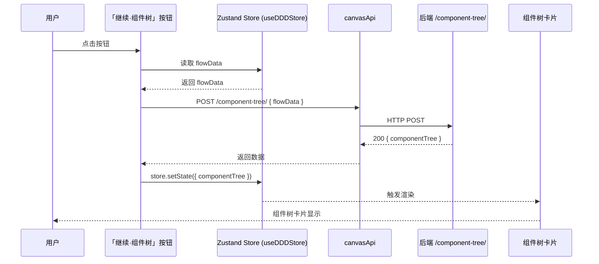

# Architecture: vibex-canvas-component-btn-20260328 — 「继续·组件树」按钮修复

**Agent**: Architect
**Date**: 2026-03-28
**Task**: vibex-canvas-component-btn-20260328/design-architecture

---

## 1. 概述

在流程树画布区域添加「继续·组件树」按钮，实现从流程树 → 组件树的数据流转。

---

## 2. 架构设计



---

## 3. 数据模型

### Store 新增字段

```typescript
// src/lib/canvas/canvasStore.ts
interface DDDStore {
  // 现有字段...
  flowData: FlowData | null;
  componentTree: ComponentTreeData | null;
  
  // 新增 actions
  setComponentTree: (tree: ComponentTreeData) => void;
  clearComponentTree: () => void;
}
```

### API 调用

```typescript
// src/lib/api/canvasApi.ts
interface ComponentTreeResponse {
  componentTree: ComponentNode[];
}

async function fetchComponentTree(flowData: FlowData): Promise<ComponentTreeResponse> {
  const res = await fetch('/api/component-tree/', {
    method: 'POST',
    headers: { 'Content-Type': 'application/json' },
    body: JSON.stringify({ flowData }),
  });
  if (!res.ok) throw new Error(`API error: ${res.status}`);
  return res.json();
}
```

---

## 4. 组件设计

### 4.1 按钮条件渲染

```tsx
// src/components/canvas/BusinessFlowTree.tsx
const { flowData, setComponentTree, componentTree } = useDDDStore();

// 按钮 disabled 条件
const isDisabled = !flowData || isLoading;

<Button
  onClick={handleContinueToComponentTree}
  disabled={isDisabled}
  loading={isLoading}
>
  继续·组件树
</Button>
```

### 4.2 onClick Handler

```tsx
const handleContinueToComponentTree = async () => {
  if (!flowData) return;
  setIsLoading(true);
  try {
    const { componentTree } = await fetchComponentTree(flowData);
    setComponentTree(componentTree);
  } catch (err) {
    setError(err.message);
  } finally {
    setIsLoading(false);
  }
};
```

---

## 5. 状态机

```
按钮状态:
  [flowData=null]  → disabled（禁止点击）
  [flowData=有效]  → enabled（可点击）
  [点击后, 请求中] → loading（禁用 + 显示 loading）
  [请求成功]       → 渲染 componentTree 卡片
  [请求失败]       → 显示错误提示
```

---

## 6. 边界处理

| 场景 | 处理 |
|------|------|
| flowData = null | 按钮 disabled |
| flowData = 空字符串 | 按钮 disabled |
| 快速双击 | 请求中使用 `isLoading` 锁，防止重复提交 |
| API 返回 500 | 捕获错误 → 显示 toast 提示 |
| API 超时 > 10s | fetch timeout 10s → 显示超时提示 |

---

## 7. 测试策略

| 层级 | 工具 | 用例 |
|------|------|------|
| 单元 | Vitest | store action 正确更新 componentTree |
| 集成 | gstack browse | 按钮可见、可点击、loading 状态 |
| E2E | gstack + network 监控 | API 请求包含 flowData 参数 |
| 边界 | Vitest | 空数据 disabled、错误处理 |

---

## 8. 验收标准

- ✅ 按钮在 flowData 有效时 enabled，无效时 disabled
- ✅ 点击后 POST /api/component-tree/ with { flowData }
- ✅ 加载中按钮显示 loading 状态
- ✅ 成功后 componentTree 卡片渲染
- ✅ 失败时显示错误提示

## 9. 工时估算

~2h（按钮 UI + 数据绑定 + API + 测试）
