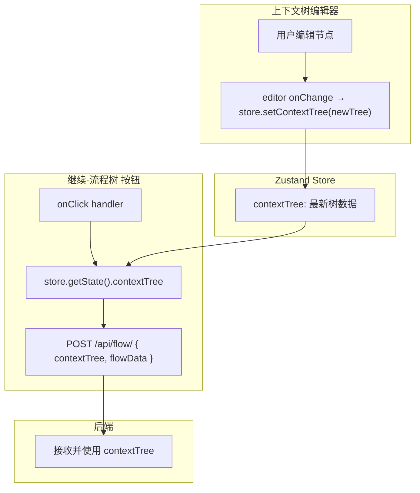

# Architecture: vibex-canvas-context-pass-20260328 — 上下文树数据传递修复

**Agent**: Architect
**Date**: 2026-03-28
**Task**: vibex-canvas-context-pass-20260328/design-architecture

---

## 1. 概述

修复「继续·流程树」按钮点击时未携带 `contextTree` 数据的问题，确保上下文树编辑后的数据正确传递到后端。

---

## 2. 根因分析

```
问题链路:
  用户编辑 contextTree → Zustand store 未同步更新 → 
  onClick handler 读取旧值 → API 请求缺少 contextTree → 
  后端生成流程基于空/旧上下文
```

**核心修复点**: 确保 `contextTree` 编辑后 → store 同步更新 → API 调用携带最新值

---

## 3. 数据流架构



---

## 4. Store 层修复

### 4.1 检查现有 Store

```typescript
// src/lib/canvas/canvasStore.ts
interface DDDStore {
  contextTree: ContextTree | null;
  flowData: FlowData | null;
  
  // 确认有以下 action
  setContextTree: (tree: ContextTree) => void;
}
```

### 4.2 editor → store 同步

```tsx
// src/components/canvas/ContextTreeEditor.tsx
const { setContextTree } = useDDDStore();

// 确保 onChange 触发 store 更新
const handleTreeChange = (newTree: ContextTree) => {
  setContextTree(newTree);
};

<Editor onChange={handleTreeChange} />
```

---

## 5. API 层修复

### 5.1 检查现有 API 调用

```typescript
// src/lib/api/canvasApi.ts
// 找到「继续·流程树」按钮的 onClick handler 调用的 API 函数
async function fetchFlowTree(params: {
  contextTree?: ContextTree;  // ← 需要确认此参数存在
  flowData?: FlowData;
}) {
  const res = await fetch('/api/flow/', {
    method: 'POST',
    body: JSON.stringify(params),  // ← params.contextTree 必须被传递
  });
  return res.json();
}
```

### 5.2 按钮 Handler 修复

```tsx
// src/components/canvas/.../ContinueFlowTreeButton.tsx
const { contextTree, flowData } = useDDDStore();

const handleContinue = async () => {
  setLoading(true);
  try {
    const result = await fetchFlowTree({
      contextTree,    // ← 确保传递 contextTree
      flowData,
    });
    store.setState({ flowTree: result.flowTree });
  } catch (err) {
    setError(err.message);
  } finally {
    setLoading(false);
  }
};
```

---

## 6. 验证断点

| 断点 | 验证方法 |
|------|---------|
| editor → store 同步 | `store.getState().contextTree` 在编辑后包含最新数据 |
| store → API 参数 | Network 监控 `POST /api/flow/` body 包含 `"contextTree"` |
| 后端使用参数 | 后端日志显示 contextTree 被解析 |

---

## 7. 测试策略

| 层级 | 工具 | 验证 |
|------|------|------|
| 单元 | Vitest | `setContextTree` → store 状态正确 |
| 集成 | gstack | 完整流程编辑 → 点击 → 查看结果 |
| Network | gstack network 监控 | API body 包含 contextTree |

---

## 8. 验收标准

- ✅ 编辑 contextTree 后 `store.getState().contextTree` 包含最新数据
- ✅ POST /api/flow/ 请求 body 包含 `"contextTree"` 字段
- ✅ 后端响应反映最新上下文数据

## 9. 工时估算

~1.5h（检查 store 同步 + API 参数传递 + 端到端验证）
