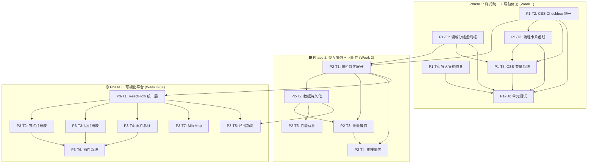

# IMPLEMENTATION_PLAN: VibeX Canvas 架构演进路线图

> **项目**: vibex-canvas-evolution-roadmap  
> **架构文档**: `docs/architecture/architecture.md`  
> **版本**: v1.0.0  
> **日期**: 2026-03-29  
> **Owner**: Architect  

---

## 1. 实施概述

### 1.1 总体目标

将 VibeX Canvas 从散点问题修复状态，演进为统一、可维护、可扩展的可视化平台。

### 1.2 实施周期

| Phase | 周期 | 总工时 | 优先级 |
|-------|------|--------|--------|
| Phase 1 | Week 1（2026-03-30 ~ 2026-04-05） | ~15-20h | 🔴 P0 |
| Phase 2 | Week 2（2026-04-06 ~ 2026-04-12） | ~20-28h | 🟠 P1 |
| Phase 3 | Week 3-5+（2026-04-13+） | ~60-80h | 🟡 P2 / ⚪ P3 |

**总工时**: ~95-128h（12-16 人天）

---

## 2. Phase 1: 样式统一 + 导航修复

> **周期**: Week 1（2026-03-30 ~ 2026-04-05）  
> **优先级**: 🔴 P0  
> **总工时**: ~15-20h  
> **前置条件**: 无  

### 2.1 任务分解

| 任务 ID | 任务名称 | 工时 | 依赖 | 产出物 |
|---------|---------|------|------|--------|
| P1-T1 | 限界上下文领域分组虚线框 | 4-5h | — | `BoundedContextTree.tsx`, CSS 变量 |
| P1-T2 | CSS Checkbox 统一样式 | 3-4h | — | `checkbox.module.css`, 3 组件更新 |
| P1-T3 | 流程卡片虚线边框 + 步骤类型 | 3-4h | P1-T2 | `FlowCard.tsx`, `StepEditor.tsx` |
| P1-T4 | 导入导航修复 | 3-4h | — | 降级逻辑, `/preview` 页面增强 |
| P1-T5 | CSS 变量系统统一 | 1h | P1-T1, P1-T2, P1-T3 | `canvas.variables.css` |
| P1-T6 | 单元测试 + 覆盖率达标 | 2-3h | P1-T1, P1-T2, P1-T3, P1-T4 | 测试用例 |

### 2.2 详细实施步骤

#### P1-T1: 限界上下文领域分组虚线框

**参考 ADR**: `vibex-canvas-bc-layout-20260328-arch.md`

**Step 1.1**: 在 `core/canvas/types.ts` 增加 `domainType` 类型定义
```typescript
type DomainType = 'core' | 'supporting' | 'generic' | 'external';
```

**Step 1.2**: 实现 `deriveDomainType()` 自动推导函数
```typescript
const domainKeywords = {
  core: ['core', 'central', '主要'],
  supporting: ['support', '支撑', 'supporting'],
  generic: ['generic', '通用', 'general'],
  external: ['external', '外部', 'third-party'],
};
```

**Step 1.3**: 创建 `canvas.variables.css` 统一变量文件
```css
[data-type="core"]       { --domain-color: #F97316; }
[data-type="supporting"]{ --domain-color: #3B82F6; }
[data-type="generic"]    { --domain-color: #6B7280; }
[data-type="external"]   { --domain-color: #8B5CF6; }
```

**Step 1.4**: 修改 `BoundedContextTree.tsx` 按 domainType 分组渲染

**Step 1.5**: 添加 Vitest 测试用例（覆盖率 > 90%）

#### P1-T2: CSS Checkbox 统一样式

**参考 ADR**: `vibex-canvas-checkbox-20260328-arch.md`

**涉及组件**:
- `ComponentSelectionStep.tsx`
- `NodeSelector.tsx`
- `BoundedContextTree.tsx`

**Step 2.1**: 创建 `components/ui/checkbox/Checkbox.module.css`
**Step 2.2**: 创建 `components/ui/checkbox/Checkbox.tsx` 封装组件
**Step 2.3**: 替换 3 个组件中的 emoji checkbox
**Step 2.4**: 添加 aria-* 属性
**Step 2.5**: 运行 axe-core 无障碍扫描

#### P1-T3: 流程卡片虚线边框 + 步骤类型

**参考 ADR**: `vibex-canvas-flow-card-20260328-arch.md`

**Step 3.1**: 在 `types.ts` 增加 `FlowStepType`
**Step 3.2**: 实现 `deriveStepType()` 自动推导
**Step 3.3**: 修改 `FlowCard.module.css` border: solid → dashed
**Step 3.4**: 修改 `BusinessFlowTree.tsx` 渲染步骤类型图标
**Step 3.5**: 修改 `StepEditor.tsx` 增加类型选择下拉框

#### P1-T4: 导入导航修复

**参考 ADR**: `vibex-canvas-import-nav-20260328-arch.md`

**Step 4.1**: 补充 `example-canvas.json` 的 `previewUrl` 字段
**Step 4.2**: 修改 `ComponentTree.tsx` handleNodeClick 降级逻辑
**Step 4.3**: 增强 `/preview` 页面 query param 处理
**Step 4.4**: 编写 Playwright E2E 测试

### 2.3 Phase 1 验收标准

| 检查项 | 标准 | 验证方式 |
|--------|------|---------|
| 限界上下文虚线框 | 4色分组 + 深色模式 | 截图对比 |
| CSS Checkbox 统一 | 3组件一致 + 无 emoji | `grep -r '[✓○×]'` |
| 流程卡片虚线 | border-style: dashed | CSS snapshot |
| 导入导航 | 100% 节点可点击 | Playwright E2E |
| 单元测试覆盖率 | Canvas 相关 > 80% | `pnpm coverage` |
| Console errors | 0 个 Error | `gstack canary 24h` |

---

## 3. Phase 2: 交互增强 + 可用性基础

> **周期**: Week 2（2026-04-06 ~ 2026-04-12）  
> **优先级**: 🟠 P1  
> **总工时**: ~20-28h  
> **前置条件**: Phase 1 完成  

### 3.1 任务分解

| 任务 ID | 任务名称 | 工时 | 依赖 | 产出物 |
|---------|---------|------|------|--------|
| P2-T1 | 三栏画布双向展开 | 6-8h | P1-T1 | CSS Grid 动态布局, Store 扩展 |
| P2-T2 | 数据持久化完善 | 4-5h | — | Zustand persist middleware |
| P2-T3 | 组件树批量操作 | 3-4h | P2-T1 | 工具栏组件 |
| P2-T4 | 画布拖拽排序 | 5-7h | P2-T1, P2-T2 | @dnd-kit 集成 |
| P2-T5 | 性能优化 | 2-3h | P2-T1, P2-T2 | 懒加载 + 骨架屏 |

### 3.2 详细实施步骤

#### P2-T1: 三栏画布双向展开

**参考 ADR**: `vibex-canvas-expand-dir-20260328-arch.md`

**Step 1.1**: 扩展 `canvasStore` 状态
```typescript
type PanelExpandState = 'default' | 'expand-left' | 'expand-right' | 'expand-both';
```

**Step 1.2**: 实现 `togglePanel()` 和 `expandToBoth()` Actions

**Step 1.3**: 修改 CSS Grid 布局支持动态切换
```css
.canvas-grid[data-expand="expand-both"] {
  --left-panel-width: 0fr;
  --canvas-width: 3fr;
  --right-panel-width: 0fr;
}
```

**Step 1.4**: 添加动画过渡（0.3s ease）

**Step 1.5**: 移动端适配（< 768px 禁用 expand-both）

#### P2-T2: 数据持久化完善

**Step 2.1**: 配置 Zustand persist middleware
```typescript
persist({
  name: 'vibex-canvas',
  storage: createJSONStorage(() => localStorage),
  partialize: (state) => ({
    contextNodes: state.contextNodes,
    flowNodes: state.flowNodes,
    componentNodes: state.componentNodes,
  }),
})
```

**Step 2.2**: 添加存储大小检查（< 5MB）

**Step 2.3**: 首次加载性能优化（< 2s）

#### P2-T3: 组件树批量操作

**Step 3.1**: 创建工具栏组件 `CanvasToolbar.tsx`
```tsx
[✓ 全选] [□ 取消全选] [🗑 清空画布]
```

**Step 3.2**: 实现批量勾选/取消逻辑
**Step 3.3**: 添加清空前二次确认弹窗
**Step 3.4**: 集成 undo 日志（可选）

#### P2-T4: 画布拖拽排序

**Step 4.1**: 安装 `@dnd-kit/core`
**Step 4.2**: 集成到 ComponentTree
**Step 4.3**: 实现 `reorderNodes()` 逻辑
**Step 4.4**: 添加拖拽占位符 UI

### 3.3 Phase 2 验收标准

| 检查项 | 标准 | 验证方式 |
|--------|------|---------|
| 双向展开 | expand-both 动画流畅 | Playwright 交互测试 |
| 数据持久化 | 刷新后数据完整 | E2E 刷新测试 |
| 批量操作 | 批量勾选/清空正常 | Testing Library |
| 拖拽排序 | order 字段正确更新 | Vitest + E2E |
| localStorage 大小 | < 5MB | 存储大小测试 |

---

## 4. Phase 3: 可视化平台

> **周期**: Week 3-5+（2026-04-13+）  
> **优先级**: 🟡 P2 / ⚪ P3  
> **总工时**: ~60-80h  
> **前置条件**: Phase 1, Phase 2 完成  

### 4.1 任务分解

| 任务 ID | 任务名称 | 工时 | 依赖 | 产出物 |
|---------|---------|------|------|--------|
| P3-T1 | ReactFlow 统一层架构 | 15-20h | P2-T1 | VibeXFlow 核心 |
| P3-T2 | 节点类型注册表 | 8-10h | P3-T1 | NodeRegistry |
| P3-T3 | 边类型注册表 | 6-8h | P3-T1 | EdgeRegistry |
| P3-T4 | 事件总线 | 4-5h | P3-T1, P3-T2 | EventBus |
| P3-T5 | 导出功能 | 8-10h | P3-T1 | JSON/OpenAPI/MD 导出器 |
| P3-T6 | 插件系统 | 15-20h | P3-T1~T4 | 插件 API |
| P3-T7 | MiniMap 缩略图 | 4-6h | P3-T1 | ReactFlow MiniMap |

### 4.2 详细实施步骤

#### P3-T1: ReactFlow 统一层架构

**Step 1.1**: 安装 `reactflow`
**Step 1.2**: 创建 `VibeXFlow` 包装组件
**Step 1.3**: 设计节点注册表架构
**Step 1.4**: 实现边注册表架构

#### P3-T2: 节点类型注册表

**Step 2.1**: 定义 NodeRegistry 接口
```typescript
interface NodeRegistry {
  register(type: string, config: NodeConfig): void;
  get(type: string): NodeConfig | undefined;
  list(): NodeConfig[];
}
```

**Step 2.2**: 注册三种节点类型
- `bounded-context-node`
- `flow-step-node`
- `component-node`

#### P3-T3: 边类型注册表

**Step 3.1**: 定义 EdgeRegistry 接口
**Step 3.2**: 注册三种边类型
- `domain-relation-edge`
- `flow-transition-edge`
- `component-dependency-edge`

#### P3-T4: 事件总线

```typescript
interface EventBus {
  onNodeSelect: (nodeId: string) => void;
  onEdgeConnect: (sourceId: string, targetId: string) => void;
  onCanvasUpdate: (changes: Change[]) => void;
}
```

#### P3-T5: 导出功能

**导出格式**:
- JSON（Canvas 完整数据）
- OpenAPI Schema（API 定义）
- Markdown（文档化）

#### P3-T6: 插件系统

**插件 API 设计**:
```typescript
interface CanvasPlugin {
  name: string;
  version: string;
  nodes?: NodeDefinition[];
  edges?: EdgeDefinition[];
  onInit?: (eventBus: EventBus) => void;
}
```

### 4.3 Phase 3 验收标准

| 检查项 | 标准 | 验证方式 |
|--------|------|---------|
| 节点注册表 | 新节点类型无需修改核心 | Vitest 插件加载测试 |
| 边注册表 | 三种边正确渲染 | Storybook 截图测试 |
| 事件总线 | 事件正确触发 | Vitest 单元测试 |
| 导出功能 | JSON/OpenAPI/MD 格式正确 | Playwright E2E |
| MiniMap | 缩略图正确显示 | 视觉回归测试 |

---

## 5. 依赖关系总图



---

## 6. 资源分配建议

| 角色 | Phase 1 | Phase 2 | Phase 3 |
|------|---------|---------|---------|
| **Dev** | 1 人（8-10h） | 1 人（10-14h） | 1-2 人（30-40h） |
| **Tester** | 1 人（3-5h） | 1 人（5-8h） | 1 人（10-15h） |
| **Designer** | 按需（review） | — | 按需（节点设计） |

---

## 7. 风险与缓解

| 风险 | 概率 | 影响 | 缓解策略 |
|------|------|------|---------|
| ReactFlow 迁移复杂度超预期 | 中 | 高 | Phase 3 分阶段交付，先小范围试点 |
| CSS 变量覆盖导致样式回退 | 低 | 高 | E2E 截图测试 + Storybook |
| 性能退化（拖拽/展开） | 中 | 中 | 提前做性能基准测试 |
| 导出格式变更需求 | 中 | 低 | 插件化设计，支持多格式 |
| 单元测试覆盖率不达标 | 低 | 中 | TDD 开发，测试先行 |

---

## Changelog

| 日期 | 版本 | 变更 |
|------|------|------|
| 2026-03-29 | v1.0.0 | 初始实施计划 |
