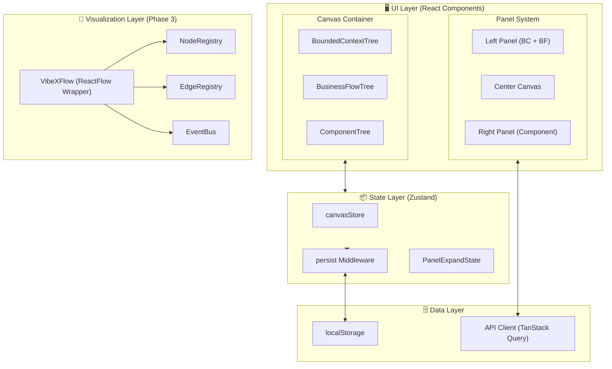
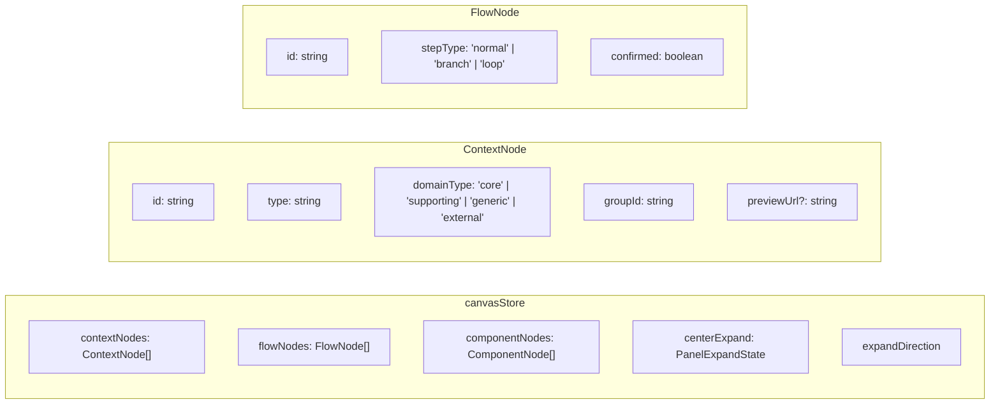
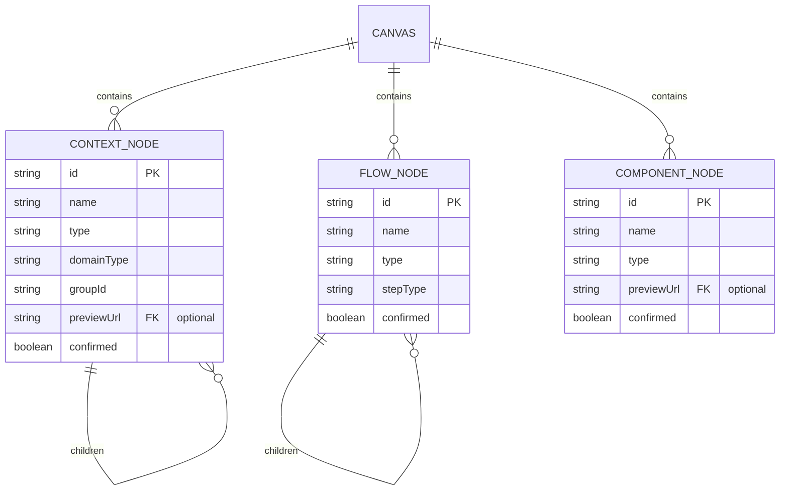

# Architecture: VibeX Canvas 架构演进路线图

> **项目**: vibex-canvas-evolution-roadmap  
> **版本**: v1.0.0  
> **日期**: 2026-03-29  
> **Owner**: Architect  
> **状态**: Active  

---

## 1. Tech Stack

### 1.1 技术选型

| 层级 | 技术选型 | 版本 | 选型理由 |
|------|---------|------|---------|
| **前端框架** | React | 19.x | 支持新 Hooks 特性，协同 Next.js App Router |
| **构建工具** | Next.js | App Router | 服务端渲染 + 路由管理 |
| **类型系统** | TypeScript | 5.x | 严格类型检查 |
| **样式方案** | CSS Modules + CSS Custom Properties | — | 组件级隔离 + 主题变量驱动 |
| **状态管理** | Zustand | 5.x | 轻量 Store，支持 persist middleware |
| **服务端状态** | TanStack Query (React Query) | 5.x | 缓存 + 加载状态管理 |
| **拖拽排序** | @dnd-kit/core | 6.x | 无障碍支持，可访问性良好 |
| **可视化** | ReactFlow | 12.x | 节点图统一渲染（Phase 3） |
| **单元测试** | Vitest + Testing Library | latest | Vite 原生集成，快速反馈 |
| **E2E 测试** | Playwright | 1.x | 跨浏览器，截图 diff |
| **样式规范** | axe-core | 4.x | 无障碍合规自动检测 |

### 1.2 技术约束

- **禁止引入 Tailwind 以外的 CSS 方案**（已有 Tailwind 不移除）
- **emoji 仅用于图标展示**，禁止作为交互元素
- **所有交互元素必须有 `aria-*` 属性**
- **禁止硬编码颜色值**，统一使用 CSS 变量
- **向后兼容**：已有数据自动推导新字段（type, domainType 等）

---

## 2. Architecture Diagram

### 2.1 系统整体架构



### 2.2 Canvas Store 状态模型



---

## 3. API Definitions

### 3.1 Canvas Store 接口

```typescript
// core/canvas/types.ts

// 限界上下文节点
interface ContextNode {
  id: string;
  name: string;
  description?: string;
  type: string;
  domainType: 'core' | 'supporting' | 'generic' | 'external';
  groupId: string;
  previewUrl?: string;
  confirmed?: boolean;
  children?: ContextNode[];
}

// 流程节点
interface FlowNode {
  id: string;
  name: string;
  type: string;
  stepType: 'normal' | 'branch' | 'loop';
  confirmed?: boolean;
  children?: FlowNode[];
}

// 组件节点
interface ComponentNode {
  id: string;
  name: string;
  type: string;
  previewUrl?: string;
  confirmed?: boolean;
}

// 面板展开状态
type PanelExpandState = 'default' | 'expand-left' | 'expand-right' | 'expand-both';

interface CanvasState {
  // 数据节点
  contextNodes: ContextNode[];
  flowNodes: FlowNode[];
  componentNodes: ComponentNode[];
  
  // 面板状态
  centerExpand: PanelExpandState;
  expandDirection: { left: boolean; center: boolean; right: boolean };
  
  // Actions
  togglePanel: (panel: 'left' | 'center' | 'right', direction?: PanelExpandState) => void;
  expandToBoth: () => void;
  resetExpand: () => void;
  
  // 数据操作
  addContextNode: (node: ContextNode) => void;
  updateContextNode: (id: string, updates: Partial<ContextNode>) => void;
  removeContextNode: (id: string) => void;
  
  addFlowNode: (node: FlowNode) => void;
  updateFlowNode: (id: string, updates: Partial<FlowNode>) => void;
  removeFlowNode: (id: string) => void;
  
  addComponentNode: (node: ComponentNode) => void;
  updateComponentNode: (id: string, updates: Partial<ComponentNode>) => void;
  removeComponentNode: (id: string) => void;
  
  // 批量操作
  selectAll: () => void;
  deselectAll: () => void;
  clearCanvas: () => void;
  
  // 拖拽排序
  reorderNodes: (treeType: 'context' | 'flow' | 'component', fromIndex: number, toIndex: number) => void;
  
  // 持久化
  resetCanvas: () => void;
}
```

### 3.2 导入导出接口

```typescript
// types/canvas-import-export.ts

interface CanvasExportData {
  version: string;
  exportedAt: string;
  contextNodes: ContextNode[];
  flowNodes: FlowNode[];
  componentNodes: ComponentNode[];
  metadata: {
    projectName: string;
    author?: string;
  };
}

type ExportFormat = 'json' | 'openapi' | 'markdown';

interface ExportOptions {
  format: ExportFormat;
  includeMetadata?: boolean;
}

// 导入接口
function importCanvas(data: CanvasExportData): Promise<void>;
function exportCanvas(options: ExportOptions): Promise<string>;
```

---

## 4. Data Model

### 4.1 核心实体关系



### 4.2 CSS 变量系统

```css
/* CSS Variables - 所有 Canvas 组件必须使用 */

/* 品牌色 */
:root {
  --primary-color: #3b82f6;
  --primary-hover: #2563eb;
  --primary-light: #dbeafe;
  
  /* 限界上下文领域色 */
  --domain-core: #F97316;
  --domain-supporting: #3B82F6;
  --domain-generic: #6B7280;
  --domain-external: #8B5CF6;
  
  /* 边框与分隔 */
  --color-border: #d1d5db;
  --color-border-light: #e5e7eb;
  
  /* 状态色 */
  --color-success: #10b981;
  --color-warning: #f59e0b;
  --color-error: #ef4444;
  
  /* 画布布局 */
  --left-panel-width: 1fr;
  --canvas-width: 1fr;
  --right-panel-width: 1fr;
  --panel-transition: 0.3s ease;
  
  /* Checkbox */
  --checkbox-size: 16px;
  --checkbox-border: 2px solid var(--color-border);
  --checkbox-checked-bg: var(--primary-color);
}
```

---

## 5. Testing Strategy

### 5.1 测试框架与覆盖率要求

| 测试类型 | 工具 | 覆盖率目标 | 关键指标 |
|---------|------|-----------|---------|
| **单元测试** | Vitest | > 80% | Canvas 相关模块 |
| **组件测试** | Testing Library | 100% 交互组件 | 所有事件处理 |
| **E2E 测试** | Playwright | 核心流程覆盖 | 导入/导航/展开 |
| **无障碍测试** | axe-core | 0 violations | 所有交互元素 |

### 5.2 核心测试用例

```typescript
// __tests__/canvas/canvasStore.test.ts

describe('canvasStore', () => {
  describe('domainType 推导', () => {
    it('无 domainType 字段时自动推导为 generic', () => {
      const node = { id: '1', name: 'Test', type: 'service' };
      const derived = deriveDomainType(node);
      expect(derived).toBe('generic');
    });
    
    it('core 关键词推导为 core 类型', () => {
      const node = { id: '1', name: 'Core Domain', type: 'service' };
      const derived = deriveDomainType(node);
      expect(derived).toBe('core');
    });
  });
  
  describe('stepType 推导', () => {
    it('undefined type → normal', () => {
      const step = { id: '1', name: 'Step 1' };
      const derived = deriveStepType(step);
      expect(derived).toBe('normal');
    });
    
    it('branch 类型正确识别', () => {
      const step = { id: '1', name: 'Branch Step', type: 'branch' };
      expect(deriveStepType(step)).toBe('branch');
    });
  });
  
  describe('面板展开状态', () => {
    it('expandToBoth 切换为 expand-both', () => {
      const store = createCanvasStore();
      store.expandToBoth();
      expect(store.centerExpand).toBe('expand-both');
    });
    
    it('togglePanel 无参数默认 expand-both', () => {
      const store = createCanvasStore();
      store.togglePanel('center');
      expect(store.centerExpand).toBe('expand-both');
    });
  });
  
  describe('批量操作', () => {
    it('selectAll 选中所有节点', () => {
      const store = createCanvasStore({
        contextNodes: [
          { id: '1', name: 'C1', type: 'service', domainType: 'core', groupId: 'g1' },
          { id: '2', name: 'C2', type: 'service', domainType: 'supporting', groupId: 'g2' },
        ],
      });
      store.selectAll();
      expect(store.contextNodes.every(n => n.confirmed)).toBe(true);
    });
    
    it('clearCanvas 清空所有节点', () => {
      const store = createCanvasStore({ contextNodes: [{ id: '1', name: 'Test', type: 'service', domainType: 'core', groupId: 'g1' }] });
      store.clearCanvas();
      expect(store.contextNodes).toHaveLength(0);
    });
  });
});

// __tests__/canvas/components/checkbox.test.tsx

describe('CSS Checkbox 组件', () => {
  it('无 emoji 字符', () => {
    render(<Checkbox checked />);
    expect(screen.queryByText(/[✓○×]/)).toBeNull();
  });
  
  it('aria-checked 属性正确', () => {
    render(<Checkbox checked />);
    expect(screen.getByRole('checkbox')).toHaveAttribute('aria-checked', 'true');
  });
  
  it('深色模式自适应', async () => {
    render(<Checkbox checked />);
    const lightBg = getComputedStyle(screen.getByRole('checkbox')).backgroundColor;
    
    // 模拟深色模式
    document.documentElement.setAttribute('data-theme', 'dark');
    const darkBg = getComputedStyle(screen.getByRole('checkbox')).backgroundColor;
    
    expect(darkBg).not.toBe(lightBg);
  });
});
```

### 5.3 E2E 测试场景

```typescript
// e2e/canvas/import-navigation.spec.ts

test.describe('导入导航', () => {
  test('导入示例后点击任意节点可跳转', async ({ page }) => {
    await page.goto('/canvas');
    
    // 导入示例
    await page.click('[data-testid="import-button"]');
    await page.setInputFiles('input[type="file"]', 'example-canvas.json');
    
    // 点击所有节点，验证无 404
    const nodes = page.locator('[data-testid="context-node"]');
    const count = await nodes.count();
    
    for (let i = 0; i < count; i++) {
      await nodes.nth(i).click();
      // 验证跳转成功或友好提示
      expect(page.url()).not.toContain('404');
    }
  });
});

test.describe('面板展开', () => {
  test('双向展开动画流畅', async ({ page }) => {
    await page.goto('/canvas');
    
    // 触发双向展开
    await page.click('[data-testid="expand-center"]');
    
    // 验证动画过渡
    const centerPanel = page.locator('[data-testid="center-panel"]');
    await expect(centerPanel).toHaveCSS('transition', /0\.3s/);
  });
});
```

### 5.4 覆盖率门禁

```bash
# package.json scripts
{
  "test:coverage": "vitest run --coverage",
  "test:coverage:check": "vitest run --coverage && pnpm coverage:threshold",
  "coverage:threshold": "vitest-threshold --minimum 80 --include '**/canvas/**'"
}
```

---

## 6. ADR Index

| ADR 文件 | 主题 | Phase | 状态 |
|---------|------|-------|------|
| `vibex-canvas-bc-layout-20260328-arch.md` | 领域分组虚线框 | Phase 1 | ✅ Accepted |
| `vibex-canvas-checkbox-20260328-arch.md` | CSS checkbox 统一 | Phase 1 | ✅ Accepted |
| `vibex-canvas-flow-card-20260328-arch.md` | 流程卡片虚线 + 步骤类型 | Phase 1 | ✅ Accepted |
| `vibex-canvas-expand-dir-20260328-arch.md` | 三栏双向展开 | Phase 2 | ✅ Accepted |
| `vibex-canvas-import-nav-20260328-arch.md` | 导入导航修复 | Phase 1 | ✅ Accepted |
| `vibex-canvas-evolution.md` | 统一演进路线图 | All | ✅ Active |

---

## Changelog

| 日期 | 版本 | 变更 |
|------|------|------|
| 2026-03-29 | v1.0.0 | 初始架构文档版本 |
