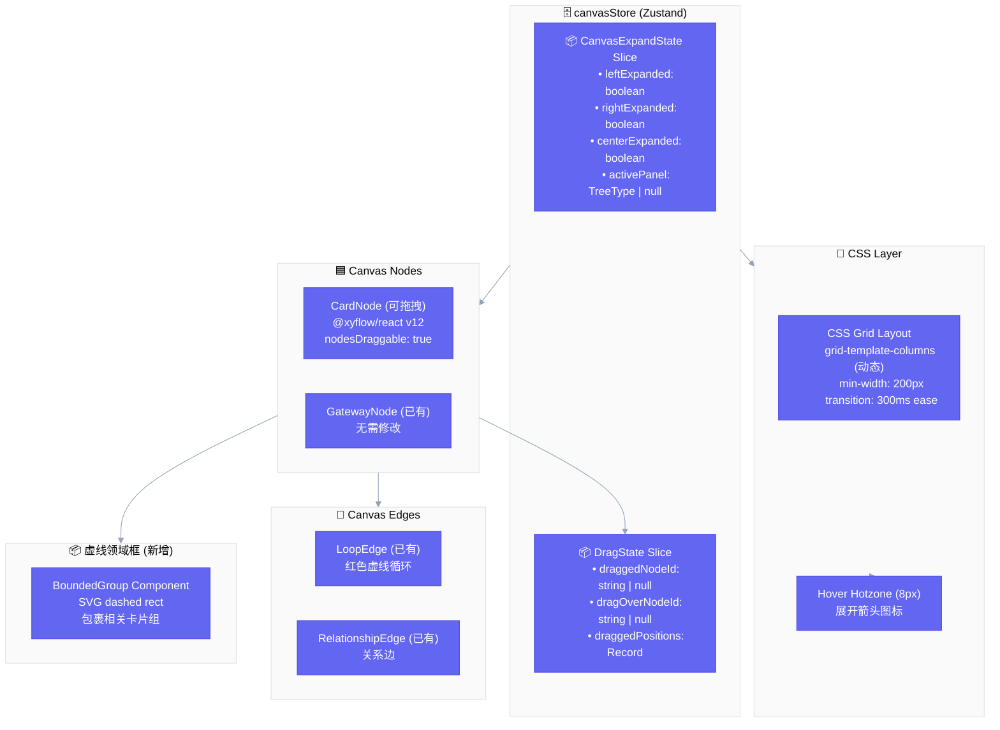

# Architecture: vibex-canvas-expandable-20260327

**Project**: VibeX 卡片画布增强 — 三栏双向展开 + 拖拽 + 虚线领域框
**Architect**: Architect Agent
**Date**: 2026-03-27
**Status**: ✅ Complete

---

## 1. Tech Stack

| 组件 | 版本 | 选择理由 |
|------|------|----------|
| ReactFlow | v12+ (升级) | v11.11.4 → v12 获取内置拖拽排序 API |
| Zustand | 现有~4.x | canvasStore 已用，扩展 CanvasExpandState slice |
| CSS Grid | 现有 | 已有三栏布局，扩展动态 grid-template-columns |
| @xyflow/react | v12+ | ReactFlow 12 包名变更 |
| dagre | v0.0.0-rc4 | 自动布局重算（可选 P1）|
| TypeScript | 现有 5.x | 保持一致 |

**升级策略**: 先升 ReactFlow v12，CI 全量回归测试，再开发新功能。

---

## 2. Architecture Diagram



---

## 3. Module Design

### 3.1 CanvasExpandState Slice

**文件**: `src/lib/canvas/canvasStore.ts`

```typescript
// 新增类型
type ExpandDirection = 'none' | 'expand-left' | 'expand-right' | 'full';
type TreeType = 'context' | 'canvas' | 'detail';

interface CanvasExpandState {
  leftExpand: ExpandDirection;
  centerExpand: ExpandDirection;
  rightExpand: ExpandDirection;
  activePanel: TreeType | null;

  // Actions
  setLeftExpand: (dir: ExpandDirection) => void;
  setCenterExpand: (dir: ExpandDirection) => void;
  setRightExpand: (dir: ExpandDirection) => void;
  togglePanel: (panel: TreeType) => void;
}

// Grid 计算
function computeGridTemplate(state: CanvasExpandState): string {
  // 见 2.2 宽度体系表格
}
```

### 3.2 DragState Slice

**文件**: `src/lib/canvas/canvasStore.ts`

```typescript
interface DragState {
  draggedNodeId: string | null;
  dragOverNodeId: string | null;
  draggedPositions: Record<string, Position>; // 持久化到 localStorage

  setDraggedNode: (id: string | null) => void;
  setDragOverNode: (id: string | null) => void;
  updatePosition: (id: string, pos: Position) => void;
}
```

### 3.3 BoundedGroup Component

**文件**: `src/components/canvas/groups/BoundedGroup.tsx`

```typescript
interface BoundedGroupProps {
  id: string;
  boundedContext: string;
  nodeIds: string[]; // 属于此领域的卡片 ID
  children: React.ReactNode;
}

// 渲染: SVG overlay，dashed rect 包裹子节点
```

---

## 4. Data Model

### 4.1 CanvasExpandState Entity

```typescript
// 领域实体：控制画布展开状态
interface CanvasExpandState {
  id: 'canvas-expand'; // 单例
  leftExpand: ExpandDirection;
  centerExpand: ExpandDirection;
  rightExpand: ExpandDirection;
  activePanel: TreeType | null;
  updatedAt: number; // timestamp
}
```

### 4.2 DraggedPosition Entity

```typescript
// 领域实体：卡片拖拽位置
interface DraggedPosition {
  nodeId: string;    // 卡片唯一 ID
  position: Position; // { x, y }
  updatedAt: number;
}

// 聚合根: CanvasDragAggregate
interface CanvasDragAggregate {
  positions: Map<string, DraggedPosition>;
  persistToStorage: () => void;
  restoreFromStorage: () => void;
}
```

---

## 5. API Definitions

### 5.1 CanvasStore Actions

```typescript
// === CanvasExpandState ===
setLeftExpand(dir: ExpandDirection): void
setCenterExpand(dir: ExpandDirection): void
setRightExpand(dir: ExpandDirection): void
togglePanel(panel: TreeType): void

// === DragState ===
setDraggedNode(id: string | null): void
setDragOverNode(id: string | null): void
updatePosition(id: string, pos: Position): void

// === BoundedGroup ===
addToBoundedGroup(groupId: string, nodeId: string): void
removeFromBoundedGroup(groupId: string, nodeId: string): void
```

### 5.2 ReactFlow Integration

```typescript
// CardTreeRenderer.tsx 改造点
const defaultEdgeOptions = {
  type: 'relationship',
  animated: false,
};

const nodeTypes = {
  card: CardNode,
  gateway: GatewayNode,
};

const onNodesChange: OnNodesChange = (changes) => {
  // v12: 支持 drag 事件
  applyNodeChanges(changes, nodes);
  // 同步位置到 DragState
  changes.forEach(c => {
    if (c.type === 'position' && c.dragging === false) {
      canvasStore.getState().updatePosition(c.id, c.position);
    }
  });
};
```

---

## 6. Key Trade-offs

| 决策 | 选择 | 权衡 |
|------|------|------|
| ReactFlow v11→v12 升级时机 | 先升后开发 | v12 破坏性风险 vs 拖拽 API 便利性。缓解：CI 回归 + 增量升级 |
| 拖拽持久化方案 | localStorage 扩展 | 简单但有容量限制；无后端需求时最优 |
| 领域框渲染层 | SVG overlay | 比 DOM absolute 性能好，支持缩放 |
| 动态 Grid vs CSS Variable | CSS Variable | 灵活但复杂度略高；现有工程能力可覆盖 |
| dagre 自动布局 | 可选 P1 | v2 无需，MVP 先不做 |

---

## 7. Non-Functional Requirements

| 维度 | 要求 |
|------|------|
| 展开动画 | 300ms ease-in-out，不卡顿 |
| 最小宽度 | 200px，防止卡片压扁 |
| ReactFlow 升级 | CI 100% 通过后再合入 |
| 拖拽位置持久化 | 刷新页面不丢失 |
| TypeScript | 严格模式，无 any |
