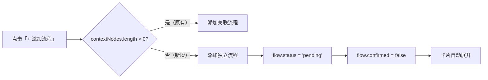
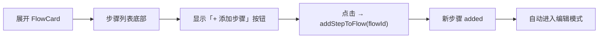

# Architecture: vibex-canvas-flowtree-edit-20260328 — 流程树编辑功能增强

**Agent**: Architect
**Date**: 2026-03-28
**Task**: vibex-canvas-flowtree-edit-20260328/design-architecture

---

## 1. 概述

三项独立的 UI/UX 增强：
1. **S1.1**: 新增独立流程入口（不依赖 contextNodes）
2. **S1.2**: 流程卡片内新增步骤按钮
3. **S1.3**: 节点样式标准化

---

## 2. 架构设计

### 2.1 S1.1 — 新增独立流程入口



**Store 修改**:
```typescript
// canvasStore.ts - addFlowNode 支持可选 contextId
addFlowNode: (name?: string, contextId?: string | null) => {
  const newFlow = {
    id: uuid(),
    name: name || '新建流程',
    status: 'pending',
    confirmed: false,
    contextId: contextId ?? null,  // ← 支持 null
    steps: [],
  };
  set(state => ({ flowNodes: [...state.flowNodes, newFlow] }));
}
```

**UI 修改**:
```tsx
// BusinessFlowTree.tsx - 移除 canManualAdd 条件
const handleManualAdd = () => {
  // 移除: if (!contextNodes.length) return;
  store.addFlowNode();  // 直接添加
};
```

### 2.2 S1.2 — 流程内新增步骤



**Store 新增 Action**:
```typescript
// canvasStore.ts
addStepToFlow: (flowNodeId: string, stepData?: Partial<FlowStep>) => {
  const newStep: FlowStep = {
    id: uuid(),
    name: stepData?.name || '',
    actor: stepData?.actor || '',
    status: 'pending',
    confirmed: false,
    autoFocus: true,  // ← 自动获焦进入编辑
  };
  set(state => ({
    flowNodes: state.flowNodes.map(flow =>
      flow.id === flowNodeId
        ? { ...flow, steps: [...flow.steps, newStep] }
        : flow
    ),
  }));
}
```

**UI 修改**:
```tsx
// FlowCard.tsx
{expanded && !readonly && (
  <button onClick={() => addStepToFlow(node.id)}>
    + 添加步骤
  </button>
)}
```

### 2.3 S1.3 — 节点样式标准化

**审查范围**: `canvas.module.css`

| CSS 类 | 状态 | 当前颜色 | 标准色 |
|--------|------|---------|--------|
| `stepRow` | pending | 需审查 | `#f59e0b` (amber) |
| `stepRow` | confirmed | 需审查 | `#10b981` (emerald) |
| `stepRow` | error | 需审查 | `#ef4444` (red) |
| `flowCard` | 同 stepRow 颜色映射 | 需审查 | 同上 |

> 注：`FlowNodes.tsx`（React Flow 画布深色主题）**不修改**，服务不同视图。

---

## 3. 改动清单

| 文件 | S1.1 | S1.2 | S1.3 |
|------|------|------|------|
| `canvasStore.ts` | `addFlowNode` 参数调整 | 新增 `addStepToFlow` | - |
| `BusinessFlowTree.tsx` | 移除 `canManualAdd` 条件 | - | - |
| `FlowCard.tsx` | - | 新增添加步骤按钮 | - |
| `canvas.module.css` | - | - | 审查修正颜色值 |

---

## 4. 测试策略

| 层级 | S1.1 覆盖 | S1.2 覆盖 | S1.3 覆盖 |
|------|----------|----------|----------|
| 单元 | Vitest: `addFlowNode(null)` | Vitest: `addStepToFlow` | 颜色值正则匹配 |
| E2E | gstack: 零上下文添加流程 | gstack: 添加步骤 → 编辑模式 | gstack: 截图对比 |
| 边界 | `contextNodes=[]` 添加 | 空步骤列表添加 | pending/confirmed/error 三态 |

---

## 5. 验收标准

### S1.1
- ✅ `contextNodes.length === 0` 时「+ 添加流程」可用
- ✅ 新增流程 `status='pending'`, `confirmed=false`
- ✅ 零上下文添加的流程 `contextId = null`

### S1.2
- ✅ 展开的 FlowCard 显示「+ 添加步骤」按钮
- ✅ 点击后步骤数 +1
- ✅ 新步骤自动获焦进入编辑

### S1.3
- ✅ pending 边框 `#f59e0b`
- ✅ confirmed 边框 `#10b981`
- ✅ error 边框 `#ef4444`

## 6. 工时估算

~3.5h（S1.1: 1h + S1.2: 1.5h + S1.3: 1h）
