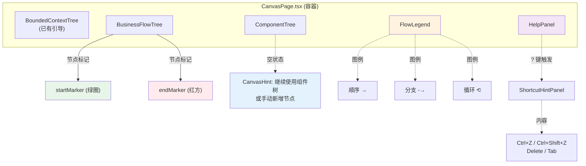

# Architecture: vibex-canvas-hint-guide

**Project**: P001 用户引导体系
**Agent**: architect
**Date**: 2026-03-31
**PRD**: docs/vibex-canvas-hint-guide/prd.md
**Analysis**: docs/vibex-canvas-hint-guide/analysis.md

---

## 1. 执行摘要

本项目为 Canvas 页面补充缺失的用户引导体系：ComponentTree 空状态引导、连线类型图例、节点标记 Tooltip、快捷键帮助面板。全部变更在前端组件层，无后端改动。

**技术决策**：
- 不引入新依赖，使用现有 CSS Modules + React tooltip API
- 组件保持受控模式，不改变现有状态管理

---

## 2. 架构图



---

## 3. 组件设计

### 3.1 ComponentTree 空状态引导 (Epic 1)

**文件**: `vibex-fronted/src/components/canvas/ComponentTree.tsx`

```tsx
// ComponentTree.tsx 改动 ~line 1024
// 改动前:
<p className={styles.emptySubtext}></p>

// 改动后:
<p className={styles.emptySubtext}>
  继续使用组件树，或手动新增节点
</p>
```

**样式** (ComponentTree.module.css):
```css
.emptySubtext {
  font-size: 0.75rem;
  color: var(--text-secondary, #6b7280);
  margin-top: 4px;
}
```

### 3.2 快捷键帮助面板 (Epic 2)

**文件**: `vibex-fronted/src/components/canvas/HelpPanel.tsx` (新增)

```tsx
// HelpPanel.tsx
interface ShortcutItem {
  keys: string;       // "Ctrl+Z"
  description: string; // "撤销"
}

const SHORTCUTS: ShortcutItem[] = [
  { keys: 'Ctrl+Z', description: '撤销' },
  { keys: 'Ctrl+Shift+Z', description: '重做' },
  { keys: 'Delete', description: '删除选中' },
  { keys: 'Tab', description: '切换面板' },
  { keys: '?', description: '打开帮助' },
];

interface HelpPanelProps {
  visible: boolean;
  onClose: () => void;
}

export function HelpPanel({ visible, onClose }: HelpPanelProps) {
  if (!visible) return null;
  return (
    <div role="dialog" aria-label="快捷键帮助" className={styles.helpPanel}>
      <h3>键盘快捷键</h3>
      <ul>
        {SHORTCUTS.map(s => (
          <li key={s.keys}>
            <kbd>{s.keys}</kbd> — {s.description}
          </li>
        ))}
      </ul>
      <button onClick={onClose} aria-label="关闭">×</button>
    </div>
  );
}
```

**CanvasPage.tsx 改动**:
```tsx
// 添加 ? 键监听
useEffect(() => {
  const handler = (e: KeyboardEvent) => {
    if (e.key === '?' && !e.ctrlKey && !e.metaKey) {
      setHelpPanelOpen(v => !v);
    }
  };
  window.addEventListener('keydown', handler);
  return () => window.removeEventListener('keydown', handler);
}, []);
```

### 3.3 连线类型图例 (Epic 3)

**文件**: `vibex-fronted/src/components/canvas/FlowLegend.tsx` (新增)

```tsx
// FlowLegend.tsx
export function FlowLegend() {
  return (
    <div
      className={styles.flowLegend}
      role="img"
      aria-label="连线类型图例"
      title="三种连线类型：顺序（实线）、分支（虚线）、循环（曲线）"
    >
      <div className={styles.legendItem}>
        <svg width="40" height="12">
          <line x1="0" y1="6" x2="40" y2="6" stroke="#6366f1" strokeWidth="2"/>
          <polygon points="40,6 34,2 34,10" fill="#6366f1"/>
        </svg>
        <span>顺序</span>
      </div>
      <div className={styles.legendItem}>
        <svg width="40" height="12">
          <line x1="0" y1="6" x2="15" y2="6" stroke="#f59e0b" strokeWidth="2" strokeDasharray="4,2"/>
          <line x1="15" y1="6" x2="40" y2="6" stroke="#f59e0b" strokeWidth="2" strokeDasharray="4,2"/>
          <polygon points="40,6 34,2 34,10" fill="#f59e0b"/>
        </svg>
        <span>分支</span>
      </div>
      <div className={styles.legendItem}>
        <svg width="40" height="12">
          <path d="M 0 6 Q 20 0 40 6" stroke="#10b981" strokeWidth="2" fill="none"/>
          <polygon points="40,6 34,2 34,10" fill="#10b981"/>
        </svg>
        <span>循环</span>
      </div>
    </div>
  );
}
```

**定位**: BusinessFlowTree 右上角，position: absolute，z-index: 10。

### 3.4 节点标记 Tooltip (Epic 4)

**文件**: `vibex-fronted/src/components/canvas/BusinessFlowTree.tsx`

SVG marker 的 title 属性直接提供 tooltip：

```tsx
// 在 marker definitions 中添加 title
<defs>
  <marker id="start-marker" markerWidth="10" markerHeight="10">
    <circle cx="5" cy="5" r="4" fill="#22c55e"/>
    <title>起始节点</title>
  </marker>
  <marker id="end-marker" markerWidth="10" markerHeight="10">
    <rect x="1" y="1" width="8" height="8" fill="#ef4444"/>
    <title>终点节点</title>
  </marker>
</defs>
```

SVG `<title>` 元素会在 hover 时自动显示为浏览器原生 tooltip。

---

## 4. 文件变更清单

| 文件 | 操作 | Epic |
|------|------|------|
| `src/components/canvas/ComponentTree.tsx` | 修改 | Epic 1 |
| `src/components/canvas/ComponentTree.module.css` | 修改 | Epic 1 |
| `src/components/canvas/HelpPanel.tsx` | 新增 | Epic 2 |
| `src/components/canvas/HelpPanel.module.css` | 新增 | Epic 2 |
| `src/components/canvas/FlowLegend.tsx` | 新增 | Epic 3 |
| `src/components/canvas/FlowLegend.module.css` | 新增 | Epic 3 |
| `src/components/canvas/BusinessFlowTree.tsx` | 修改 | Epic 3, 4 |
| `src/components/canvas/CanvasPage.tsx` | 修改 | Epic 2, 3 |

**无后端改动。**

---

## 5. 测试策略

| 测试类型 | 工具 | 覆盖 Epic |
|---------|------|----------|
| 组件单元测试 | Jest + Testing Library | Epic 1, 2, 3 |
| E2E 验证 | Playwright | 全流程 |
| 可访问性测试 | axe-core | Epic 1, 2 |

**关键测试用例**：
```typescript
// ComponentTree 空状态
test('ComponentTree empty state shows guidance text', () => {
  render(<ComponentTree nodes={[]} />);
  expect(screen.getByText(/继续使用组件树/)).toBeInTheDocument();
});

// HelpPanel 快捷键
test('? key opens help panel', async () => {
  render(<CanvasPage />);
  await userEvent.keyboard('?');
  expect(screen.getByRole('dialog', { name: /快捷键帮助/ })).toBeVisible();
});

// FlowLegend
test('FlowLegend shows all three edge types', () => {
  render(<FlowLegend />);
  expect(screen.getByText('顺序')).toBeVisible();
  expect(screen.getByText('分支')).toBeVisible();
  expect(screen.getByText('循环')).toBeVisible();
});

// 节点标记 tooltip
test('start marker has title attribute', () => {
  const marker = document.querySelector('[data-testid="node-marker-start"]');
  expect(marker).toHaveAttribute('title', expect.stringMatching(/起点|start/i));
});
```

---

## 6. 性能影响

| 指标 | 影响 | 评估 |
|------|------|------|
| Bundle size | +3 KB | 可忽略 |
| 首次渲染 | +0ms | 无额外计算 |
| Lighthouse | 无负面影响 | |

---

## 7. 实施计划

| Epic | Story | 工时 | 顺序 |
|------|-------|------|------|
| Epic 1 | ComponentTree 空状态 | 0.5h | 1 |
| Epic 2 | HelpPanel + ? 键 | 1h | 2 |
| Epic 3 | FlowLegend | 0.5h | 3 |
| Epic 4 | 节点标记 Tooltip | 0.5h | 4 |

**总工时**: 2.5h | **依赖**: 无 | **可并行**: Epic 1, 3, 4 可并行开发

---

*Architect 产出物 | 2026-03-31*
