# VibeX Canvas 三树并行画布 — 架构设计

**项目**: vibex-canvas-redesign-20260325
**日期**: 2026-03-25 13:27 (Asia/Shanghai)
**角色**: architect
**状态**: Proposed

---

## 执行摘要

基于 PRD（选项 B）设计全新单页画布 `app/canvas/page.tsx`，将当前分散在 6+ 页面的流程收敛到单一画布内。核心架构决策：

- **页面**: `app/canvas/page.tsx`（新主页面），现有 `app/page.tsx` 降级为引导页
- **状态**: 新建 `canvasStore.ts`，Zustand 分片管理（context/flow/component/phase/queue）
- **渲染**: 复用 `CardTreeRenderer` 作为三树渲染引擎，新增 `dagre` 布局计算
- **级联**: `CascadeUpdateManager` 处理上游变更触发下游重置
- **队列**: 扩展现有 `queue/` 模块，支持原型生成状态跟踪
- **持久化**: localStorage（`canvasSlice`），二期接入后端

---

## 1. ADR-001: 三树并行画布技术选型

### Status: Proposed

### Context

PRD 要求单页内三树（限界上下文/业务流程/组件）同时存在，阶段激活不同层。当前 VibeX 无此类画布基础设施，需在以下技术路线中选择：

| 路线 | 方案 | 优点 | 缺点 |
|------|------|------|------|
| A | React Flow | 节点图专用，拖拽/布局开箱即用 | 重量级，三树联动需深度定制 |
| B | 自研 dagre + SVG | 轻量，精确控制，复用现有 D3/可视化能力 | 需自行实现交互 |
| C | 纯 CSS Grid + 虚拟列表 | 最轻量，适合树形结构 | 复杂布局（横向三列+折叠+联动）难实现 |

### Decision

**路线 B：dagre 布局 + SVG 渲染**

理由：
1. VibeX 已有 D3/Mermaid 可视化基础设施，可直接复用
2. `CardTreeRenderer` 是成熟渲染引擎，扩展成本低于引入 React Flow
3. dagre 布局算法成熟（层级布局、自动避让），可处理 ≤100 节点
4. 三树并行是定制化需求，自研比改造 React Flow 更灵活

实现路径：
- `dagre` 计算节点坐标和边
- SVG 渲染树结构（复用 `VisualizationPlatform` 框架）
- 节点交互（点击/拖拽）通过 React 事件处理
- 节点确认状态通过 Zustand store 驱动样式

### Consequences

- **easier**: 复用现有可视化框架，减少新依赖
- **harder**: 交互逻辑（拖拽排序、折叠动画）需自行实现
- **harder**: 三树横向布局的响应式处理需额外实现（≥768px 三列，<768px Tab 切换）

---

## 2. ADR-002: 状态管理架构

### Status: Proposed

### Context

三树并行 + 阶段联动 + 原型队列涉及大量状态，且 PRD 要求任意阶段可逆、级联更新。当前 `confirmationStore.ts` 461 行，5 流程混排，不适合直接扩展。

### Decision

**新建 `canvasStore.ts`，Zustand 分片架构**：

```typescript
// stores/canvasStore.ts
canvasStore = {
  // === Phase Slice ===
  phase: 'input' | 'context' | 'flow' | 'component' | 'prototype',
  activeTree: 'context' | 'flow' | 'component',
  
  // === Context Slice ===
  contextNodes: BoundedContext[],
  contextDraft: Partial<BoundedContext> | null,
  
  // === Flow Slice ===
  flowNodes: BusinessFlow[],
  
  // === Component Slice ===
  componentNodes: ComponentNode[],
  
  // === Queue Slice ===
  projectId: string | null,
  prototypeQueue: PrototypePage[],
  
  // === Cascade Manager ===
  cascadeMarkPending(downstream: 'flow' | 'component'): void,
  
  // === Actions ===
  confirmNode(tree, nodeId): void,
  editNode(tree, nodeId, data): void,
  regenerateTree(tree): Promise<void>,
  createProject(): Promise<void>,
  regeneratePage(pageId): Promise<void>,
}
```

**向后兼容策略**: `confirmationStore` 保留，现有 Flow 组件逐步迁移到 `canvasStore`，迁移完成后废弃 `confirmationStore`。

### Consequences

- **easier**: 状态边界清晰，每个 slice 可独立测试
- **easier**: `CascadeUpdateManager` 内聚在 store 内，避免跨组件级联逻辑散落
- **harder**: 双 store 过渡期需同步状态（建议通过事件总线桥接）
- **harder**: localStorage 迁移需处理版本（STORAGE_VERSION 机制）

---

## 3. ADR-003: 原型生成队列架构

### Status: Proposed

### Context

PRD 要求原型生成队列支持：各页面并行/串行生成、状态跟踪（等待中/生成中/完成/错误）、单页重生成、错误重试。现有 `queue/` 模块提供基础能力。

### Decision

**扩展 `queue/` 模块，新建 `PrototypeQueueManager`**：

```
PrototypeQueueManager
├── queue: Map<pageId, PageGenerationTask>
├── pollingInterval: 5000ms
├── maxRetries: 3
├── createProject(projectData): Promise<projectId>
├── startQueue(): void
├── regeneratePage(pageId): void
└── subscribe(handler): Unsubscribe
```

**API 端点**：
- `POST /api/canvas/project` — 创建项目，返回 projectId
- `POST /api/canvas/generate` — 触发单页生成
- `GET /api/canvas/status/:projectId` — 轮询项目状态
- `GET /api/canvas/export/:projectId` — 导出 zip

### Consequences

- **easier**: 队列状态独立于 UI，可扩展为 SSE
- **harder**: 5s 轮询在高并发下需考虑请求合并
- **harder**: 错误重试需幂等性保证（后端需支持断点续传）

---

## 4. 系统架构图

```mermaid
flowchart TB
    subgraph pages["📁 app/"]
        CANVAS["canvas/page.tsx\n新主画布页面"]
        HOMEPAGE["page.tsx\n降级为引导页 → 跳转 canvas"]
        EDITOR["editor/page.tsx\n微调功能（保留）"]
        EXPORT["export/page.tsx\n导出功能（保留）"]
    end

    subgraph stores["📦 状态层"]
        CANVAS_STORE["canvasStore.ts\nZustand 分片"]
        subgraph slices["canvasStore Slices"]
            PS["phaseSlice\n当前阶段/激活树"]
            CS["contextSlice\n限界上下文树状态"]
            FS["flowSlice\n业务流程树状态"]
            COS["componentSlice\n组件树状态"]
            QS["queueSlice\n原型队列状态"]
        end
        OLD_CONF["confirmationStore.ts\n遗留（逐步迁移）"]
    end

    subgraph components["🧩 组件层"]
        subgraph canvas["Canvas Components (新)"]
            PCP["CanvasPage\n画布容器"]
            PPB["PhaseProgressBar\n阶段进度条"]
            TPP["TreePanel\n树面板容器"]
            BCT["BoundedContextTree\n限界上下文树"]
            BFT["BusinessFlowTree\n业务流程树"]
            CT["ComponentTree\n组件树"]
            PQ["PrototypeQueuePanel\n原型队列面板"]
        end
        
        subgraph renderer["Rendering Engine"]
            CTR["CardTreeRenderer\n核心渲染引擎（保留）"]
            LAYOUT["dagre Layout Engine\n布局计算"]
            SVG_RENDERER["SVG Renderer\nSVG 输出"]
        end
        
        subgraph legacy["遗留组件"]
            HOMEPAGE_COMP["homepage/*\n废弃→迁移"]
            CHAT["chat/*\n废弃→迁移"]
            DESIGN["design/*\n废弃→迁移"]
        end
    end

    subgraph cascade["🔄 级联管理"]
        CUM["CascadeUpdateManager\n上游变更→下游pending"]
    end

    subgraph queue["📋 原型队列"]
        PQM["PrototypeQueueManager\n队列状态+轮询"]
        QUEUE["queue/*\n现有队列模块扩展"]
    end

    subgraph api["🌐 API Layer"]
        PROJ_API["POST /api/canvas/project\n创建项目"]
        GEN_API["POST /api/canvas/generate\n触发生成"]
        STAT_API["GET /api/canvas/status/:id\n轮询状态"]
        EXP_API["GET /api/canvas/export/:id\n导出zip"]
    end

    subgraph backend["后端"]
        BACKEND["Next.js API Routes\n+ Python prototype-gen service"]
    end

    subgraph persist["💾 持久化"]
        LS["localStorage\ncanvasStore snapshot"]
        DB["DB (二期)\n项目数据持久化"]
    end

    PCP --> PPB & TPP & PQ
    TPP --> BCT & BFT & CT
    BCT --> CTR
    BFT --> CTR
    CT --> CTR
    CTR --> LAYOUT --> SVG_RENDERER
    BCT --> CS
    BFT --> FS
    CT --> COS
    PCP --> PS
    PQ --> QS
    CS --> CUM
    FS --> CUM
    COS --> CUM
    CUM -.-> FS & COS
    QS --> PQM
    PQM --> QUEUE
    PQM --> PROJ_API & GEN_API & STAT_API
    PROJ_API & GEN_API & EXP_API --> BACKEND
    STAT_API -.-> PQM
    CANVAS_STORE --> LS
    CANVAS_STORE -.-> OLD_CONF
```



---

## 5. 目录结构

```
vibex-fronted/src/
├── app/
│   ├── canvas/
│   │   ├── page.tsx              # 新主画布页面 ⭐
│   │   └── canvas.module.css     # 画布样式
│   ├── page.tsx                  # 降级为引导页（跳转 canvas）
│   ├── editor/page.tsx           # 保留（微调）
│   └── export/page.tsx           # 保留（导出）
├── components/
│   ├── canvas/                   # 新建 ⭐
│   │   ├── CanvasPage.tsx
│   │   ├── PhaseProgressBar.tsx
│   │   ├── TreePanel.tsx
│   │   ├── BoundedContextTree.tsx
│   │   ├── BusinessFlowTree.tsx
│   │   ├── ComponentTree.tsx
│   │   ├── PrototypeQueuePanel.tsx
│   │   └── canvas.module.css
│   ├── layout-engine/            # 新建 ⭐
│   │   ├── index.ts
│   │   ├── dagreLayout.ts        # dagre 布局计算
│   │   ├── svgRenderer.ts        # SVG 输出
│   │   └── nodeInteractions.ts   # 节点交互处理
│   └── CardTree/                 # 保留，重写数据适配层
│       ├── CardTreeRenderer.tsx  # 扩展支持三树数据适配
│       └── adapters/             # 新建 ⭐
│           ├── contextAdapter.ts
│           ├── flowAdapter.ts
│           └── componentAdapter.ts
├── stores/
│   ├── canvasStore.ts            # 新建 ⭐ Zustand 分片 store
│   └── ...
└── lib/
    ├── cascade/                  # 新建 ⭐
    │   ├── index.ts
    │   ├── CascadeUpdateManager.ts
    │   └── types.ts
    └── canvas-api.ts             # 新建 ⭐ API 客户端
```

---

## 6. 数据模型

### 核心实体

```typescript
// lib/canvas/types.ts

// 阶段枚举
type Phase = 'input' | 'context' | 'flow' | 'component' | 'prototype';

// 限界上下文节点
interface BoundedContextNode {
  nodeId: string;
  name: string;
  description: string;
  type: 'core' | 'supporting' | 'generic' | 'external';
  confirmed: boolean;
  status: 'pending' | 'generating' | 'confirmed' | 'error';
  parentId?: string;
  children: string[];
}

// 业务流程节点
interface BusinessFlowNode {
  nodeId: string;
  contextId: string;           // 关联的上下文节点
  name: string;
  steps: FlowStep[];
  confirmed: boolean;
  status: 'pending' | 'generating' | 'confirmed' | 'error';
  parentId?: string;
}

interface FlowStep {
  stepId: string;
  name: string;
  actor: string;
  description?: string;
  order: number;
}

// 组件节点
interface ComponentNode {
  nodeId: string;
  flowId: string;              // 关联的流程节点
  name: string;
  type: 'page' | 'form' | 'list' | 'detail' | 'modal';
  props: Record<string, unknown>;
  api: { method: 'GET' | 'POST'; path: string; params: string[] };
  children: string[];
  confirmed: boolean;
  status: 'pending' | 'generating' | 'confirmed' | 'error';
  previewUrl?: string;
}

// 原型队列项
interface PrototypePage {
  pageId: string;
  componentId: string;
  name: string;
  status: 'queued' | 'generating' | 'done' | 'error';
  progress: number;             // 0-100
  retryCount: number;
  errorMessage?: string;
  generatedAt?: number;
}

// 树节点（统一接口，用于渲染引擎）
interface TreeNode {
  id: string;
  label: string;
  type: 'context' | 'flow' | 'component';
  status: 'pending' | 'generating' | 'confirmed' | 'error';
  confirmed: boolean;
  parentId?: string;
  children: string[];
  data: BoundedContextNode | BusinessFlowNode | ComponentNode;
}
```

---

## 7. API 定义

### 7.1 创建项目

```
POST /api/canvas/project
Body: {
  requirementText: string,
  contexts: BoundedContextNode[],
  flows: BusinessFlowNode[],
  components: ComponentNode[]
}
Response: {
  projectId: string,
  status: 'created'
}
```

### 7.2 触发生成

```
POST /api/canvas/generate
Body: {
  projectId: string,
  pageIds: string[],           // 要生成的页面ID列表
  mode: 'parallel' | 'sequential'
}
Response: {
  queueId: string,
  pages: { pageId: string, status: string }[]
}
```

### 7.3 轮询状态

```
GET /api/canvas/status/:projectId
Response: {
  projectId: string,
  pages: PrototypePage[],
  overallProgress: number
}
```

### 7.4 导出

```
GET /api/canvas/export/:projectId
Response: Binary (application/zip)
```

---

## 8. 关键模块设计

### 8.1 CascadeUpdateManager

```typescript
// lib/canvas/cascade/CascadeUpdateManager.ts

class CascadeUpdateManager {
  constructor(private store: CanvasStore) {}

  /**
   * 上游变更时，级联标记下游为 pending
   * context 变更 → flow + component pending
   * flow 变更 → component pending
   */
  markDownstreamPending(upstream: 'context' | 'flow') {
    if (upstream === 'context') {
      this.store.setFlowNodes(
        this.store.flowNodes.map(n => ({ ...n, status: 'pending' as const }))
      );
      this.store.setComponentNodes(
        this.store.componentNodes.map(n => ({ ...n, status: 'pending' as const }))
      );
    } else if (upstream === 'flow') {
      this.store.setComponentNodes(
        this.store.componentNodes.map(n => ({ ...n, status: 'pending' as const }))
      );
    }
  }
}
```

### 8.2 dagre Layout Engine

```typescript
// components/canvas/layout-engine/dagreLayout.ts

import dagre from 'dagre';

interface LayoutOptions {
  direction: 'TB' | 'LR';     // Top-Bottom 或 Left-Right
  nodeWidth: number;
  nodeHeight: number;
  rankSep: number;
  nodeSep: number;
}

function computeLayout(nodes: TreeNode[], edges: Edge[], options: LayoutOptions): LayoutResult {
  const g = new dagre.graphlib.Graph();
  g.setGraph({
    rankdir: options.direction,
    ranksep: options.rankSep,
    nodesep: options.nodeSep,
  });
  g.setDefaultEdgeLabel(() => ({}));

  nodes.forEach(n => g.setNode(n.id, { width: options.nodeWidth, height: options.nodeHeight }));
  edges.forEach(e => g.setEdge(e.from, e.to));

  dagre.layout(g);

  return {
    nodes: nodes.map(n => ({
      ...n,
      x: g.node(n.id).x,
      y: g.node(n.id).y,
    })),
    edges: edges.map(e => ({
      ...e,
      points: g.edge(e.from, e.to).points,
    })),
  };
}
```

---

## 9. 测试策略

### 9.1 测试框架

- **单元**: Jest（`*.test.ts`）
- **集成**: Jest + React Testing Library（`*.test.tsx`）
- **E2E**: Playwright（`*.spec.ts`）

### 9.2 覆盖率要求

| 层级 | 目标覆盖率 | 关键测试用例 |
|------|-----------|-------------|
| canvasStore | > 90% | 每个 action + slice |
| CascadeUpdateManager | 100% | context→flow, flow→component, multi-level |
| dagreLayout | > 80% | 节点坐标计算、边生成 |
| CanvasPage | > 70% | 阶段切换、激活联动 |

### 9.3 核心测试用例示例

```typescript
// stores/canvasStore.test.ts

describe('canvasStore', () => {
  describe('phase transitions', () => {
    it('should activate flow tree when all context nodes confirmed', () => {
      const store = createCanvasStore();
      store.setContextNodes(mockContextNodes.map(n => ({ ...n, confirmed: true })));
      
      // Trigger phase advance
      store.advancePhase();
      
      expect(store.phase).toBe('flow');
      expect(store.activeTree).toBe('flow');
    });
  });

  describe('cascade updates', () => {
    it('should mark flow and component pending when context edited', () => {
      const store = createCanvasStore();
      store.setFlowNodes([{ ...mockFlowNode, confirmed: true }]);
      store.setComponentNodes([{ ...mockComponentNode, confirmed: true }]);
      
      store.editNode('context', mockContextNode.nodeId, { name: 'Updated' });
      
      const flow = store.flowNodes[0];
      const component = store.componentNodes[0];
      expect(flow.status).toBe('pending');
      expect(component.status).toBe('pending');
    });
  });
});

// lib/canvas/cascade/CascadeUpdateManager.test.ts

describe('CascadeUpdateManager', () => {
  it('should mark only component pending when flow edited (not context)', () => {
    const store = createCanvasStore();
    const manager = new CascadeUpdateManager(store);
    
    manager.markDownstreamPending('flow');
    
    // Context should NOT be marked pending
    expect(store.contextNodes.every(n => n.status !== 'pending')).toBe(true);
    expect(store.componentNodes.every(n => n.status === 'pending')).toBe(true);
  });
});
```

---

## 10. 性能考虑

| 场景 | 策略 |
|------|------|
| 三树同时渲染 ≤100 节点 | 直接渲染 |
| 三树同时渲染 100-500 节点 | 按阶段懒加载非激活树（只渲染激活树） |
| 三树同时渲染 >500 节点 | react-window 虚拟化，只渲染视口内节点 |
| 节点拖拽 | requestAnimationFrame 节流 |
| 级联更新 | 防抖 300ms，避免重复触发 |
| localStorage 快照 | 增量快照，只存 diff |

---

## 11. 架构缺口 & Open Questions

| # | 问题 | 建议方案 | 决策者 |
|---|------|---------|--------|
| OQ-1 | `app/page.tsx` 降级后，SEO/旧链接如何处理 | 301 重定向到 `/canvas`，旧链接保留兼容 | Alex |
| OQ-2 | `confirmationStore` → `canvasStore` 迁移策略 | v1 保留双 store，通过 bridge 事件同步；v2 废弃 | Dev |
| OQ-3 | 导出 zip 后端打包逻辑 | Python prototype-gen service 扩展 zip 打包接口 | Dev |
| OQ-4 | 画布截图/版本历史 | 二期需求，先用 localStorage snapshot | Alex |

---

## 12. 验收标准

**Dev 收到架构后请对 Architect 评分**
**评分命令**: 参考 `/root/.openclaw/team-evolution/SCORING_RUBRICS.md` 第3节，四维平均打分

- ✅ 技术选型有理有据（React Flow vs dagre 选择 dagre）
- ✅ Zustand 分片架构清晰，slice 边界合理
- ✅ CascadeUpdateManager 内聚，无跨组件散落
- ✅ API 定义完整（4 个端点，Request/Response 明确）
- ✅ 测试策略具体（覆盖率目标 + 核心用例示例）
- ✅ 目录结构明确（新建 vs 保留 vs 废弃）
- ✅ 性能策略分层（≤100 / 100-500 / >500）

---

*Architect — VibeX Canvas Redesign | 2026-03-25*
