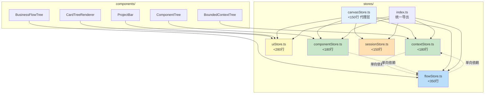
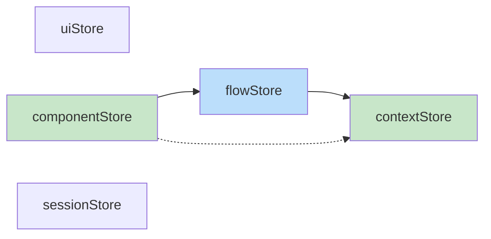

# Architecture: VibeX canvasStore 职责拆分重构

**项目**: vibex-canvasstore-refactor
**版本**: v1.0
**日期**: 2026-04-02
**架构师**: architect
**状态**: ✅ 设计完成

---

## 执行摘要

将 1433 行 `canvasStore.ts` 拆分为 5 个独立 Zustand store，每个职责单一、可独立测试。

**技术选型**: Zustand + Jest + React Testing Library
**总工时**: 19.25 天（5 Phase）

---

## 1. Tech Stack

| 技术 | 选择 | 理由 |
|------|------|------|
| **状态管理** | Zustand（保持） | 已有，拆分而非替换 |
| **中间件** | persist + devtools | 已有，迁移保持 |
| **测试** | Jest + RTL | 已有，单元测试目标 ≥ 80% |
| **迁移策略** | 渐进式，向后兼容 | 每 Phase 验证后进入下 Phase |

**无新增依赖**，无破坏性变更。

---

## 2. Architecture Diagram

### 2.1 目标文件结构



### 2.2 依赖方向约束



**关键约束**: 
- ✅ 无循环依赖
- ✅ componentStore → flowStore → contextStore（单向链）
- ✅ uiStore 和 sessionStore 独立，无依赖

---

## 3. Store API Design

### 3.1 contextStore

```typescript
// src/lib/canvas/stores/contextStore.ts
interface ContextStore {
  // State
  contextNodes: BoundedContextNode[];
  selectedNodeId: string | null;
  editingNodeId: string | null;

  // Actions
  addContextNode: (draft: BoundedContextDraft) => BoundedContextNode;
  updateContextNode: (nodeId: string, updates: Partial<BoundedContextNode>) => void;
  deleteContextNode: (nodeId: string) => void;
  confirmContextNode: (nodeId: string) => void;
  selectContextNode: (nodeId: string | null) => void;
  resetAll: () => void;
}

export const useContextStore = create<ContextStore>()(
  devtools(
    persist((set, get) => ({
      contextNodes: [],
      selectedNodeId: null,
      editingNodeId: null,

      addContextNode: (draft) => {
        const node = createContextNode(draft);
        set(state => ({ contextNodes: [...state.contextNodes, node] }));
        return node;
      },
      // ... 其他 actions
    }), { name: 'vibex-context-store' })
  )
);
```

### 3.2 uiStore

```typescript
// src/lib/canvas/stores/uiStore.ts
interface UIStore {
  // State
  contextPanelCollapsed: boolean;
  flowPanelCollapsed: boolean;
  componentPanelCollapsed: boolean;
  expandMode: 'normal' | 'expand-both' | 'maximize';
  scrollTop: number;
  isDragging: boolean;
  dragTarget: string | null;

  // Actions
  setPanelCollapsed: (panel: 'context' | 'flow' | 'component', collapsed: boolean) => void;
  setExpandMode: (mode: CanvasExpandMode) => void;
  setScrollTop: (top: number) => void;
  setDragging: (target: string | null) => void;
}

export const useUIStore = create<UIStore>()(
  devtools(persist((set) => ({ /* ... */ }), { name: 'vibex-ui-store' }))
);
```

### 3.3 flowStore

```typescript
// src/lib/canvas/stores/flowStore.ts
interface FlowStore {
  // State
  flowNodes: BusinessFlowNode[];
  selectedNodeId: string | null;
  autoGenerating: boolean;

  // Actions
  addFlowNode: (draft: BusinessFlowDraft) => BusinessFlowNode;
  updateFlowNode: (nodeId: string, updates: Partial<BusinessFlowNode>) => void;
  deleteFlowNode: (nodeId: string) => void;
  confirmFlowNode: (nodeId: string) => void;
  cascadeUpdate: (contextNodeId: string, status: NodeStatus) => void;
}

export const useFlowStore = create<FlowStore>()(
  devtools(persist((set, get) => ({ /* ... */ }), { name: 'vibex-flow-store' }))
);
```

### 3.4 componentStore

```typescript
// src/lib/canvas/stores/componentStore.ts
interface ComponentStore {
  // State
  componentNodes: ComponentNode[];
  selectedNodeIds: Set<string>;
  generating: boolean;

  // Actions
  addComponentNode: (draft: ComponentDraft) => ComponentNode;
  updateComponentNode: (nodeId: string, updates: Partial<ComponentNode>) => void;
  deleteComponentNode: (nodeId: string) => void;
  toggleSelect: (nodeId: string) => void;
  generateComponents: (flowNodeId: string) => Promise<void>;
}

export const useComponentStore = create<ComponentStore>()(
  devtools(persist((set, get) => ({ /* ... */ }), { name: 'vibex-component-store' }))
);
```

### 3.5 sessionStore

```typescript
// src/lib/canvas/stores/sessionStore.ts
interface SessionStore {
  // State
  sseStatus: SSEStatus;
  aiThinking: boolean;
  queue: ClarificationRound[];
  messages: MessageItem[];

  // Actions
  setSSEStatus: (status: SSEStatus) => void;
  addMessage: (msg: Omit<MessageItem, 'id' | 'timestamp'>) => void;
  clearMessages: () => void;
  enqueueRound: (round: ClarificationRound) => void;
}

export const useSessionStore = create<SessionStore>()(
  devtools((set) => ({ /* ... */ }))
);
```

### 3.6 canvasStore（代理层）

```typescript
// src/lib/canvas/canvasStore.ts（最终形态，<150行）
// 仅保留向后兼容 re-export
export const useCanvasStore = () => ({
  // 代理到各子 store
  contextNodes: useContextStore(s => s.contextNodes),
  addContextNode: useContextStore(s => s.addContextNode),
  confirmContextNode: useContextStore(s => s.confirmContextNode),
  flowNodes: useFlowStore(s => s.flowNodes),
  // ...
});
```

---

## 4. Data Model

无新增数据模型，纯拆分重构。

```typescript
// 共享类型（不变）
export interface BoundedContextNode { nodeId, nodeName, type, status, isActive }
export interface BusinessFlowNode { nodeId, flowName, steps, status, isActive }
export interface ComponentNode { nodeId, nodeName, type, status, isActive }
export type NodeStatus = 'pending' | 'confirmed' | 'error'
export type SSEStatus = 'idle' | 'connecting' | 'connected' | 'reconnecting' | 'error'
```

---

## 5. Testing Strategy

### 5.1 单元测试

| Store | 覆盖率目标 | 关键测试用例 |
|--------|-----------|-------------|
| contextStore | ≥ 80% | CRUD + 状态转换 |
| uiStore | ≥ 80% | 面板开关 + 拖拽状态 |
| flowStore | ≥ 80% | CRUD + cascadeUpdate |
| componentStore | ≥ 80% | CRUD + generate |
| sessionStore | ≥ 70% | SSE 状态 + messages |

### 5.2 回归测试

```typescript
// 每个 Phase 后运行
describe('Regression Suite', () => {
  it('should all 17 existing tests pass', async () => {
    const results = await runExistingTestSuite();
    expect(results.passed).toBe(17);
    expect(results.failed).toBe(0);
  });
});
```

---

## 6. Performance Impact

| 维度 | 影响 | 说明 |
|------|------|------|
| **Bundle Size** | 无变化 | Zustand 已有，拆分不影响体积 |
| **Runtime Performance** | 正向 | 小 store 更快订阅/更新 |
| **Memory** | 轻微正向 | Zustand 按需加载 |
| **Build Time** | 无变化 | 增量编译 |

**结论**: 无性能风险，拆分有助于长期性能优化。

---

## 7. 架构决策记录

### ADR-001: 按领域垂直拆分（而非水平切片）

**状态**: Accepted

**上下文**: canvasStore 1433 行包含 context/flow/component/ui/session 五个不同领域。

**决策**: 按领域垂直拆分为 5 个独立 store，而非按 state/actions 水平切片。

**后果**:
- ✅ 每个 store 职责单一
- ✅ 可独立测试
- ⚠️ 需要处理跨 store 依赖（如 componentStore → flowStore）

### ADR-002: 渐进迁移 + 向后兼容

**状态**: Accepted

**上下文**: 250+ 调用点依赖 canvasStore，无法一次性切换。

**决策**: 每 Phase 先 re-export 到 canvasStore，保持 API 不变，后续逐步迁移消费者。

**后果**:
- ✅ 零破坏迁移
- ⚠️ 迁移周期较长

### ADR-003: 单向依赖链

**状态**: Accepted

**上下文**: componentStore 读取 flowNodes，flowStore 级联更新 contextNodes。

**决策**: componentStore → flowStore → contextStore 单向链，禁止反向依赖。

**后果**:
- ✅ 无循环依赖
- ⚠️ 需要显式传递依赖

---

## 执行决策

- **决策**: 已采纳
- **执行项目**: vibex-canvasstore-refactor
- **执行日期**: 2026-04-02
