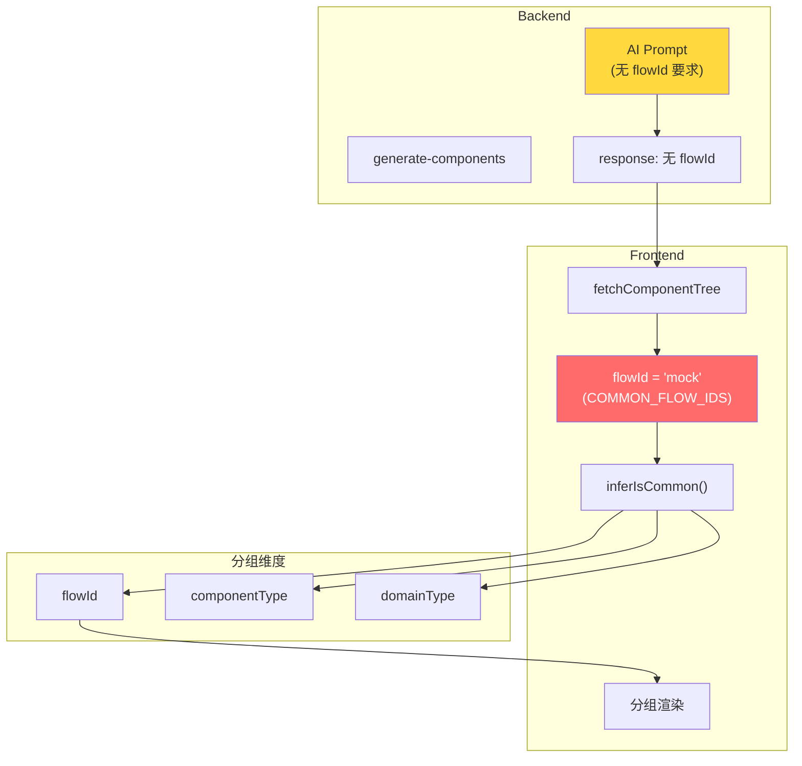

# ADR-XXX: VibeX Canvas 组件树分组异常 — 架构设计

**状态**: Accepted
**日期**: 2026-03-30
**角色**: Architect
**项目**: vibex-component-tree-grouping

---

## Context

Canvas 组件树中，所有 AI 生成的组件均被归入"🔧 通用组件"虚线框，无法按页面/流程正确分组。

**双层根因**：
1. **Backend**: AI prompt 未要求 `flowId`，响应中无 `flowId`
2. **Frontend**: `fetchComponentTree` 将默认值设为 `'mock'`（在 `COMMON_FLOW_IDS` 中）
3. **Frontend**: `inferIsCommon()` 以 `flowId` 唯一判断，导致所有组件进入通用组

---

## Decision

### Tech Stack

| 技术 | 用途 | 变更 |
|------|------|------|
| TypeScript | 类型安全 | ComponentNode 增加 domainType 字段 |
| React | UI 框架 | ComponentTree.tsx 分组逻辑 |
| Zustand | 状态管理 | canvasStore 字段调整 |
| Vitest + Playwright | 测试 | 新增分组逻辑测试 |

### 架构图



---

## 技术方案

### Epic 1 — 分组逻辑多维判断（P0）

**目标**：不依赖 `flowId` 唯一判断，改为 flowId + componentType + domainType 综合判断。

```typescript
// ComponentTree.tsx

interface ComponentNode {
  nodeId: string;
  flowId: string;
  name: string;
  type: ComponentType;  // 'page' | 'section' | 'modal' | 'form' | 'button' | ...
  domainType?: 'list' | 'detail' | 'form' | 'common';
  // ...
}

// 新 inferIsCommon: 多维判断
export function inferIsCommon(node: ComponentNode): boolean {
  // 1. 明确标记的通用 flowId
  if (COMMON_FLOW_IDS.has(node.flowId)) {
    return true;
  }

  // 2. 通用组件类型
  if (node.type === 'modal' || node.type === 'button') {
    return true;
  }

  // 3. 无有效 flowId 且无 domainType → 通用
  if (!node.flowId && !node.domainType) {
    return true;
  }

  // 4. 有效的 flowId → 非通用（即使不在 flowNodes 中也能正确处理）
  return false;
}

// 新 getPageLabel: 优先使用 domainType
function getPageLabel(node: ComponentNode, flowNodes: BusinessFlowNode[]): string {
  // 有 domainType → 用 domainType 标签
  if (node.domainType) {
    const labels: Record<string, string> = {
      list: '📋 列表页面',
      detail: '📄 详情页面',
      form: '📝 表单页面',
      common: '🔧 通用组件',
    };
    return labels[node.domainType] || `📄 ${node.flowId}`;
  }

  // 无 domainType → 降级到 flowId 匹配
  if (!node.flowId || COMMON_FLOW_IDS.has(node.flowId)) {
    return '🔧 通用组件';
  }

  const found = flowNodes.find((f) => f.nodeId === node.flowId);
  return found ? `📄 ${found.name}` : '❓ 未知页面';
}
```

### Epic 2 — Backend AI flowId 修复（P0）

**目标**：在 AI 生成组件时正确填充 `flowId`。

```typescript
// backend routes/v1/canvas/index.ts L286-318

// 修改 prompt，要求 AI 输出 flowId
const prompt = `
生成组件时，必须为每个组件指定 flowId：
- flowId 必须是 BusinessFlowNode.nodeId 之一
- 如果组件属于特定流程，使用该流程的 nodeId
- 只有跨流程复用的组件才使用 'common' 或 'mock'

输出格式：
{
  "data": [
    {
      "nodeId": "comp-xxx",
      "flowId": "flow-node-1",  // ← 必须填充
      "name": "组件名",
      "type": "page"
    }
  ]
}
`;
```

### Epic 3 — 手动重分组 UI（P1）

**目标**：允许用户手动调整组件分组。

```typescript
// ComponentTree.tsx — 右键重分组菜单
<ContextMenu>
  <MenuItem onClick={() => moveToGroup('common')}>
    移至通用组件
  </MenuItem>
  <MenuItem onClick={() => moveToGroup(node.flowId)}>
    移至 {getFlowName(node.flowId)}
  </MenuItem>
  <MenuItem onClick={() => setDomainType('list')}>
    标记为列表页面
  </MenuItem>
</ContextMenu>
```

---

## API 定义

### ComponentNode 类型变更

```typescript
// 新增字段
interface ComponentNode {
  nodeId: string;
  flowId: string;
  name: string;
  type: ComponentType;
  confirmed: boolean;
  domainType?: 'list' | 'detail' | 'form' | 'common';  // 新增
  previewUrl?: string;
  relationships?: ComponentRelationship[];
}
```

### 分组函数签名

```typescript
function inferIsCommon(node: ComponentNode): boolean;
function getPageLabel(node: ComponentNode, flowNodes: BusinessFlowNode[]): string;
function groupComponents(nodes: ComponentNode[]): ComponentGroup[];
```

---

## 性能评估

| 指标 | 影响 | 说明 |
|------|------|------|
| 渲染性能 | 无显著变化 | 分组逻辑在渲染前执行，O(n) |
| API 响应 | 轻微增加 | AI prompt 增加字段要求 |
| 状态大小 | 轻微增加 | domainType 字段 |

---

## 测试策略

### 核心测试用例

```typescript
describe('inferIsCommon', () => {
  test('flowId=mock → true', () => {
    expect(inferIsCommon({ flowId: 'mock', type: 'page' })).toBe(true);
  });

  test('flowId=有效值 + type=page → false', () => {
    expect(inferIsCommon({ flowId: 'flow-1', type: 'page' })).toBe(false);
  });

  test('type=modal → true（不受 flowId 影响）', () => {
    expect(inferIsCommon({ flowId: 'flow-1', type: 'modal' })).toBe(true);
  });

  test('无 flowId + 无 domainType → true', () => {
    expect(inferIsCommon({ flowId: '', type: 'page' })).toBe(true);
  });
});

describe('getPageLabel', () => {
  test('domainType=list → 📋 列表页面', () => {
    const node = { flowId: 'flow-1', domainType: 'list' as const, type: 'page' };
    expect(getPageLabel(node, [])).toBe('📋 列表页面');
  });

  test('flowId 匹配 → 📄 流程名', () => {
    const node = { flowId: 'flow-1', type: 'page' };
    const flows = [{ nodeId: 'flow-1', name: '订单流程' }];
    expect(getPageLabel(node, flows)).toBe('📄 订单流程');
  });
});
```

---

## 风险评估

| 风险 | 等级 | 缓解措施 |
|------|------|----------|
| domainType 字段增加导致数据迁移 | 低 | 可选字段，向后兼容 |
| 已有组件缺少 flowId | 中 | 默认分组到"通用组件"，不丢失 |
| AI prompt 变更影响生成质量 | 中 | 保留 fallback 逻辑 |

---

## 执行决策

- **决策**: 已采纳
- **执行项目**: vibex-component-tree-grouping
- **执行日期**: 2026-03-30
