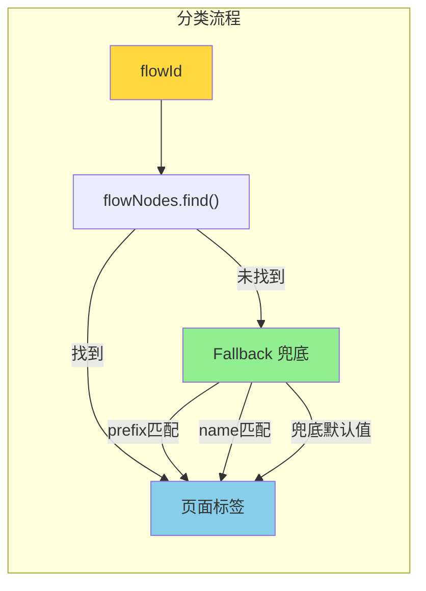

# ADR-XXX: VibeX Canvas 组件树页面分类异常 — 架构设计

**状态**: Accepted
**日期**: 2026-03-30
**角色**: Architect
**项目**: vibex-component-tree-page-classification

---

## Context

组件树中除"🔧 通用组件"外的所有组件被归类为"未知页面"，全塞在同一虚线框。

**根因**：`getPageLabel()` 中 `flowId` 无法匹配 `flowNodes.nodeId`，因为 AI 生成组件时 `flowId` 填充不正确。

---

## Decision

### 与 vibex-component-tree-grouping 的关系

> ⚠️ **同源问题**: 本项目与 `vibex-component-tree-grouping` **同源**（AI 生成阶段 `flowId` 填充错误）。Epic 2（Backend AI flowId 修复）的解决方案同时解决两个问题。

### Tech Stack

| 技术 | 用途 | 变更 |
|------|------|------|
| TypeScript | 类型安全 | getPageLabel 增强 |
| React | UI 框架 | ComponentTree.tsx |
| Vitest + Playwright | 测试 | 新增测试用例 |

### 架构图



---

## 技术方案

### 核心修复: getPageLabel Fallback 逻辑

```typescript
// ComponentTree.tsx — getPageLabel 增强

function getPageLabel(
  flowId: string,
  flowNodes: BusinessFlowNode[]
): string {
  // 0. 通用组件
  if (!flowId || COMMON_FLOW_IDS.has(flowId)) {
    return '🔧 通用组件';
  }

  // 1. 精确匹配
  const exact = flowNodes.find(f => f.nodeId === flowId);
  if (exact) {
    return `📄 ${exact.name}`;
  }

  // 2. Prefix 匹配 (flowId 可能带版本后缀)
  const prefixMatch = flowNodes.find(f =>
    flowId.startsWith(f.nodeId) || f.nodeId.startsWith(flowId)
  );
  if (prefixMatch) {
    return `📄 ${prefixMatch.name}`;
  }

  // 3. Name 模糊匹配 (忽略大小写、空格)
  const normalizedFlowId = flowId.toLowerCase().replace(/[\s-_]/g, '');
  const nameMatch = flowNodes.find(f =>
    f.name.toLowerCase().replace(/[\s-_]/g, '').includes(normalizedFlowId) ||
    normalizedFlowId.includes(f.name.toLowerCase().replace(/[\s-_]/g, ''))
  );
  if (nameMatch) {
    return `📄 ${nameMatch.name}`;
  }

  // 4. 兜底：显示 flowId（帮助调试）
  return `❓ ${flowId}`;
}
```

### Fallback 策略优先级

| 优先级 | 策略 | 示例 |
|--------|------|------|
| 1 | 精确匹配 `nodeId` | `flowId='flow-1'` → `flowNodes[0].nodeId='flow-1'` ✅ |
| 2 | Prefix 匹配 | `flowId='flow-1-v2'` → `flowNodes[0].nodeId='flow-1'` ✅ |
| 3 | Name 模糊匹配 | `flowId='order'` → `flowNodes[0].name='订单管理'` ✅ |
| 4 | 兜底显示 flowId | `flowId='unknown'` → `❓ unknown` |

---

## API 定义

### 分组函数签名

```typescript
function getPageLabel(
  flowId: string,
  flowNodes: BusinessFlowNode[]
): string;

function inferIsCommon(
  node: ComponentNode,
  flowNodes?: BusinessFlowNode[]
): boolean;
```

---

## 性能评估

| 指标 | 影响 | 说明 |
|------|------|------|
| 分类性能 | O(n) 增长 | Fallback 多重匹配，每节点最多 3 次遍历 |
| 渲染性能 | 无变化 | 分组在渲染前完成 |
| 包体积 | 无影响 | 仅修改已有函数 |

---

## 测试策略

### 核心测试用例

```typescript
describe('getPageLabel', () => {
  const flowNodes = [
    { nodeId: 'flow-1', name: '订单流程' },
    { nodeId: 'flow-2', name: '用户认证流程' },
  ];

  test('精确匹配 → 正确页面名', () => {
    expect(getPageLabel('flow-1', flowNodes)).toBe('📄 订单流程');
  });

  test('prefix 匹配 → 正确页面名', () => {
    expect(getPageLabel('flow-1-v2', flowNodes)).toBe('📄 订单流程');
  });

  test('name 模糊匹配 → 正确页面名', () => {
    expect(getPageLabel('order', flowNodes)).toBe('📄 订单流程');
  });

  test('flowId=mock → 通用组件', () => {
    expect(getPageLabel('mock', flowNodes)).toBe('🔧 通用组件');
  });

  test('flowId 无匹配 → 兜底显示', () => {
    expect(getPageLabel('unknown-id', flowNodes)).toBe('❓ unknown-id');
  });
});
```

---

## 与 vibex-component-tree-grouping 的协同

> 本项目的 `getPageLabel()` 修复与 `vibex-component-tree-grouping` 的 `inferIsCommon()` 修复共享 `flowNodes` 匹配逻辑。建议 Dev 在同一 PR 中处理两个项目。

**共享修复点**：
1. Backend AI prompt 增加 flowId 要求（两个项目都依赖）
2. `COMMON_FLOW_IDS` 常量统一管理
3. `flowNodes` 匹配逻辑复用

---

## 执行决策

- **决策**: 已采纳
- **执行项目**: vibex-component-tree-page-classification
- **执行日期**: 2026-03-30
