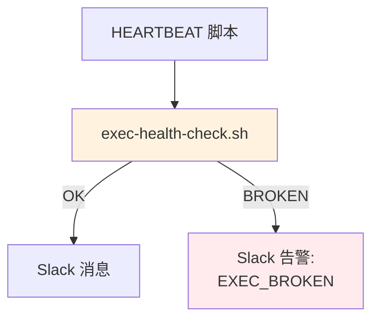

# Architecture: vibex-dev-proposals-20260331_060315

**Project**: Dev 自检提案 — exec 修复 + Vitest 优化 + task_manager 统一 + Health Check
**Agent**: architect
**Date**: 2026-03-31
**PRD**: docs/vibex-dev-proposals-20260331_060315/prd.md

---

## 1. Epic 1: Exec 管道修复

### 问题定位
Sandbox exec 工具 freeze 的根因是 stdout/stderr pipe 断裂。修复策略：

```typescript
// 复用 exec-wrapper.sh（vibex-exec-sandbox-freeze Epic1）
// 核心：检测 pipe 状态，异常时重置
exec-wrapper.sh:
  1. 创建 pipe 对
  2. 执行命令，捕获 stdout/stderr
  3. 检测 pipe 断裂（EPIPE）
  4. 异常时输出警告，不 block 结果返回
```

### 健康检查脚本
```bash
# scripts/exec-health-check.sh
exec --timeout 5 echo "HEALTH_CHECK" > /dev/null 2>&1
if [ $? -eq 0 ]; then
  echo "EXEC_OK"
else
  echo "EXEC_BROKEN"
  exit 1
fi
```

---

## 2. Epic 2: Vitest 速度优化

### 配置优化

```typescript
// vitest.config.ts
export default defineConfig({
  test: {
    // 增量测试：只运行变更文件
    changedSince: process.env.CI ? undefined : 'HEAD~1',
    // 限制并发
    maxWorkers: 2,
    // 测试文件缓存
    cache: { dir: 'node_modules/.vitest' },
    // 慢测试单独标记
    slowTestThreshold: 5000,
  },
});
```

### 增量测试 CI 配置
```yaml
# .github/workflows/test.yml
- name: Run tests
  run: |
    CHANGED_FILES=$(git diff --name-only origin/main -- '*.ts' '*.tsx')
    pnpm vitest run --changed $CHANGED_FILES
```

---

## 3. Epic 3: task_manager 路径统一

### 现状审计
```bash
# 查找所有 task_manager 位置
find /root/.openclaw -name "task_manager.py" -o -name "task_manager.js" 2>/dev/null
```

### 统一方案
Canonical path: `/root/.openclaw/skills/team-tasks/scripts/task_manager.py`

所有 agent workspace 的 HEARTBEAT.md 中引用统一路径：
```bash
export TASK_MANAGER="/root/.openclaw/skills/team-tasks/scripts/task_manager.py"
alias task-update="python3 $TASK_MANAGER update"
```

---

## 4. Epic 4: HEARTBEAT Health Check



```bash
# HEARTBEAT.sh 修改
HEALTH_RESULT=$(bash /root/.openclaw/scripts/exec-health-check.sh 2>&1)
if [[ "$HEALTH_RESULT" == "EXEC_BROKEN" ]]; then
  openclaw message send --message "⚠️ HEARTBEAT: exec 工具断裂，请检查！"
fi
```

---

*Architect 产出物 | 2026-03-31*
