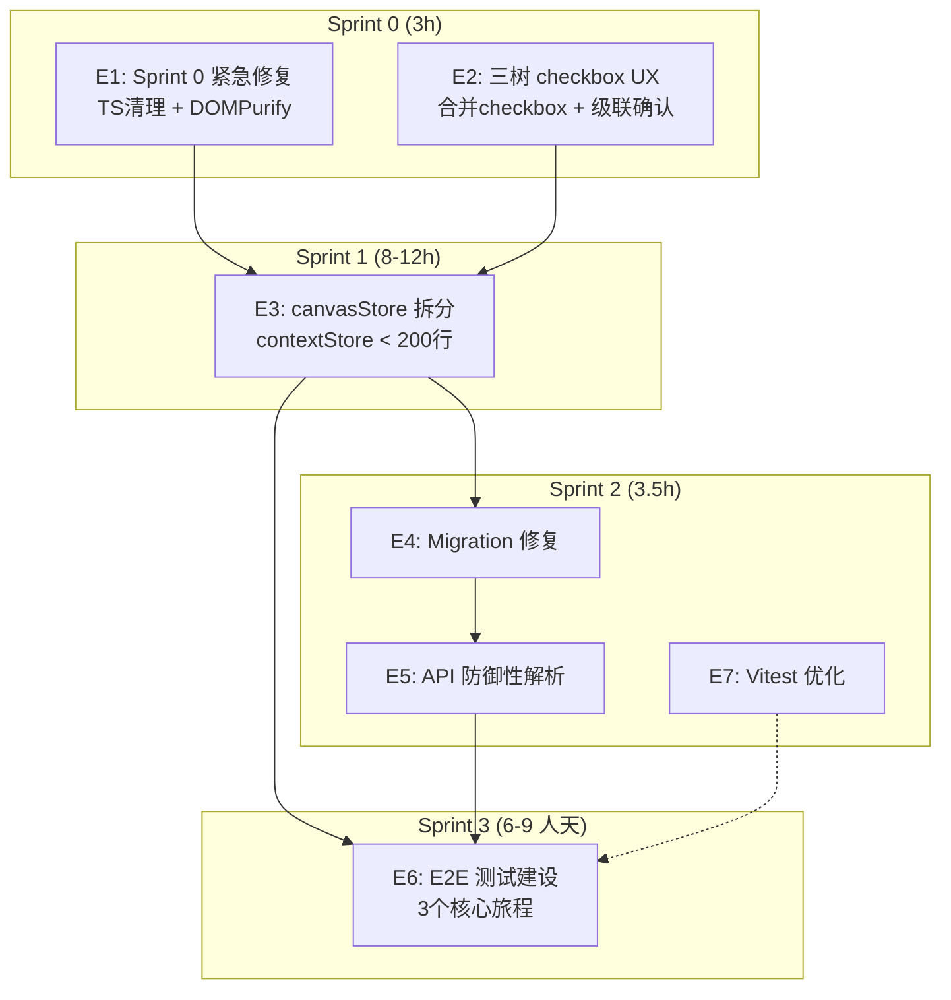

# Architecture: VibeX Dev 提案 — Sprint 路线图

**项目**: vibex-dev-proposals-20260402_201318
**版本**: v1.0
**日期**: 2026-04-02
**架构师**: architect
**状态**: ✅ 设计完成

---

## 执行摘要

从六方提案提取 dev 实现路线图，7 个 Epic 涵盖 Sprint 0 紧急修复到长尾 E2E 建设。

**总工时**: 20.5h + 6-9 人天

---

## 1. Tech Stack

| 技术 | 选择 | 理由 |
|------|------|------|
| React 18 + TypeScript | 现有 | 无变更 |
| Zustand | 现有 | canvasStore 拆分目标 |
| Vitest + RTL | 现有 | 测试加速目标 |
| Playwright | 现有 | E2E 建设目标 |

---

## 2. Sprint 架构



---

## 3. Epic 详细架构

### E1: Sprint 0 紧急修复（1.5h）

| 修复 | 方案 |
|------|------|
| D-001 TS 错误 | 定位 9 个 TS 错误，分类修复（废弃 API/类型缺失/路径别名）|
| D-002 DOMPurify | package.json overrides 覆盖 monaco-editor dompurify 版本 |

### E2: 三树 checkbox UX（1.5h）

| 修复 | 方案 |
|------|------|
| D-E1 合并 checkbox | BoundedContextTree: 删除 selectionCheckbox，保留 1 个 inline |
| D-E2 级联确认 | confirmFlowNode 增加 `steps.map(s => ({ ...s, status: 'confirmed' }))` |

### E3: canvasStore 职责拆分（8-12h）

详见 `vibex-canvasstore-refactor/architecture.md`。

```
canvasStore → contextStore + flowStore + componentStore + uiStore + sessionStore
```

### E4: Migration 修复（0.5h）

```typescript
// Migration 2→3
if (node.confirmed) {
  node.isActive = true;
  node.status = 'confirmed';  // 缺失的映射
}
```

### E5: API 防御性解析（1h）

```typescript
const parseComponentResponse = (data: unknown) => {
  const schema = z.object({
    type: z.string(),
    name: z.string(),
    method: z.string(),
    confidence: z.number().optional(),
    flowId: z.string().optional(),
  });
  const result = schema.safeParse(data);
  if (!result.success) return null;
  return {
    type: VALID_TYPES.includes(result.data.type) ? result.data.type : 'page',
    method: VALID_METHODS.includes(result.data.method?.toUpperCase()) ? result.data.method.toUpperCase() : 'GET',
    confidence: result.data.confidence ?? 0,
    flowId: result.data.flowId === 'unknown' ? '' : result.data.flowId ?? '',
  };
};
```

### E6: E2E 测试建设（6-9 人天）

| Journey | 覆盖场景 |
|---------|---------|
| journey-create-context | 创建上下文节点 → 勾选 → 生成 |
| journey-generate-flow | 创建流程 → 多选 → 生成组件 |
| journey-multi-select | Ctrl+Click 多选 → 批量确认 |

### E7: Vitest 优化（2h）

- 路径别名 `@/*` 已配置，优化 tsconfig paths
- 覆盖率报告 `npm test -- --coverage`

---

## 4. Performance Impact

| Epic | 影响 |
|------|------|
| E1 | 无 |
| E2 | 正向（减少 DOM 节点）|
| E3 | 低风险（拆分后各 store < 350 行）|
| E4 | 无 |
| E5 | 无 |
| E6 | 无 |
| E7 | 正向（测试 < 60s）|

---

## 5. 架构决策记录

### ADR-001: canvasStore 拆分策略

**状态**: Accepted（继承 vibex-canvasstore-refactor ADR-001）

### ADR-002: Defensive Parsing 优先

**状态**: Accepted

**决策**: 前端防御性解析替代等待后端修复，Zod safeParse + fallback。

### ADR-003: Sprint 0 阻断优先

**状态**: Accepted

**决策**: E1 + E2 Sprint 0 并行执行，解除 CI 阻断。

---

## 执行决策

- **决策**: 已采纳
- **执行项目**: vibex-dev-proposals-20260402_201318
- **执行日期**: 2026-04-02
