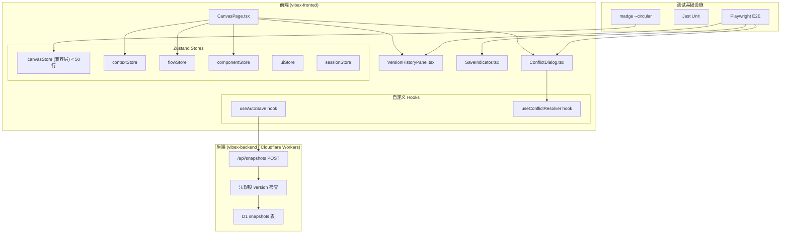
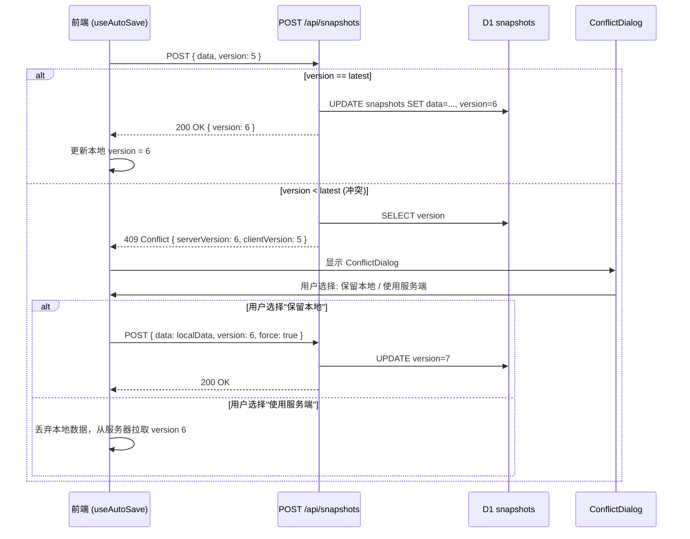
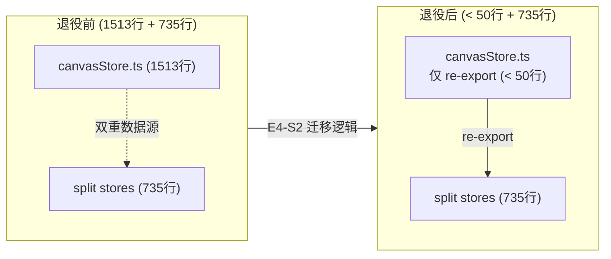

# VibeX Dev 提案评审与扩展 — 系统架构文档

**项目**: vibex-dev-proposals-20260403_024652
**版本**: v1.0
**日期**: 2026-04-03
**角色**: Architect

---

## 执行决策

- **决策**: 已采纳
- **执行项目**: vibex-dev-proposals-20260403_024652
- **执行日期**: 2026-04-03

---

## 1. Tech Stack

### 1.1 新增依赖

| 技术 | 版本 | 用途 | 选型理由 |
|------|------|------|---------|
| **madge** | 6.x | 循环依赖检测 | 验证 canvasStore 退役后无循环依赖 |
| **eslint-plugin-import** | 2.x | 重复 import 检测 | E1-S2 防复发规则 |

### 1.2 现有技术栈

| 技术 | 用途 |
|------|------|
| **Zustand** | 状态管理（已拆分 5 个子 store） |
| **Playwright** | E2E 测试（已配置） |
| **Jest** | 单元测试（已配置） |
| **nock** | HTTP 拦截（用于 beacon 测试 mock） |

---

## 2. 系统架构图

### 2.1 整体架构



### 2.2 E2: Sync Protocol 冲突检测架构



### 2.3 E4: canvasStore 退役架构



---

## 3. API Definitions

### 3.1 新增/修改端点

#### POST /api/snapshots

```
Request (修改):
{
  data: string,           // JSON.stringify(canvasData)
  version?: number,       // 可选：客户端持有的 version（乐观锁）
  force?: boolean        // 可选：true 时强制覆盖（忽略 version 检查）
}

Response (新增 409 场景):
{
  error: "VERSION_CONFLICT",
  code: "VERSION_CONFLICT",
  serverVersion: number,  // 服务端当前 version
  clientVersion: number   // 客户端提交的 version
}

状态码:
  200: 保存成功（version 一致或 force=true）
  400: 请求体验证失败
  409: 版本冲突（version < serverVersion 且 force=false）
  500: 服务器错误
```

#### GET /api/snapshots/:id

```
Response (修改):
{
  id: string,
  projectId: string,
  name: string,
  data: string,           // JSON.stringify(完整 canvas 数据)
  version: number,        // 新增：当前版本号
  createdAt: number,
  createdBy: string
}
```

### 3.2 前端 Hook 接口

#### useAutoSave

```typescript
interface UseAutoSaveOptions {
  debounceMs?: number;      // 默认 2000
  onSaveStart?: () => void;
  onSaveSuccess?: (version: number) => void;
  onSaveError?: (error: Error) => void;
  onConflict?: (serverVersion: number, clientVersion: number) => void;
}

// 返回
interface UseAutoSaveReturn {
  isSaving: boolean;
  lastSavedAt: number | null;
  currentVersion: number;     // 当前本地 version
  triggerSave: (force?: boolean) => Promise<void>;
}
```

#### useConflictResolver

```typescript
interface ConflictData {
  serverVersion: number;
  clientVersion: number;
  serverData: CanvasData;
  clientData: CanvasData;
}

interface UseConflictResolverReturn {
  resolve: (choice: 'local' | 'server') => Promise<void>;
  discardLocal: () => void;
  keepLocal: () => void;
}
```

---

## 4. Data Model

### 4.1 D1 Schema 变更

```sql
-- snapshots 表新增 version 字段（乐观锁）
ALTER TABLE snapshots ADD COLUMN version INTEGER NOT NULL DEFAULT 1;

-- 可选：创建 version 索引（用于冲突检测查询）
CREATE INDEX IF NOT EXISTS idx_snapshots_version ON snapshots(project_id, version DESC);
```

---

## 5. 性能影响评估

| Epic | 影响点 | 性能影响 | 缓解方案 |
|------|--------|---------|---------|
| E1 | TS 编译 | 无（仅修复类型） | — |
| E2 | ConflictDialog 渲染 | < 10ms | 纯 UI，无计算 |
| E2 | version 检查查询 | +1 D1 read，约 5-10ms | 已有索引 |
| E3 | Playwright E2E | 测试执行时间 +4min | 与主 CI 并行或放在慢速套件 |
| E4 | canvasStore 兼容层调用 | 无（re-export） | — |

**总体性能影响**: 极小。E2 version 检查 +1 次 D1 read，< 10ms，对 save 延迟无感知影响。

---

## 6. 安全考虑

| 方面 | 风险 | 缓解 |
|------|------|------|
| ConflictDialog XSS | 用户自定义版本名可能含 XSS | DOMPurify sanitize 版本名 |
| force flag 滥用 | force=true 可能覆盖他人数据 | 仅在用户主动点击"保留本地"时使用 |
| Version 推断攻击 | 攻击者猜测 version 号 | version 是内部数字，不暴露于 URL |
