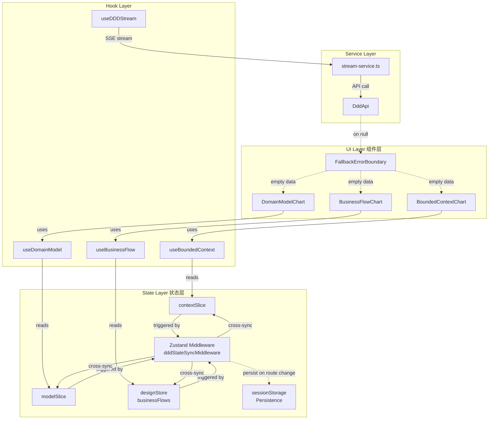
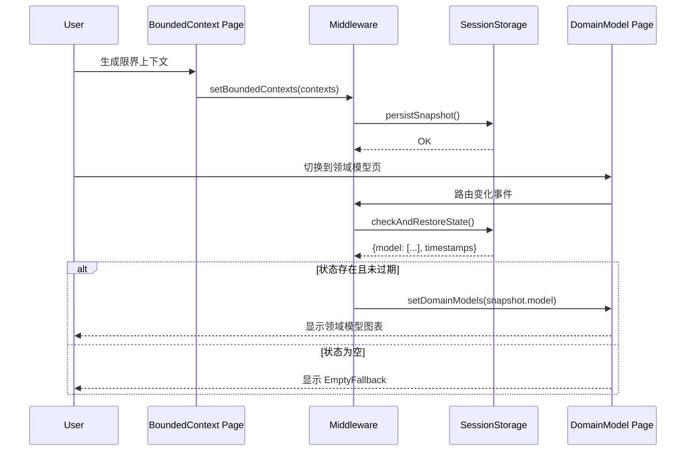
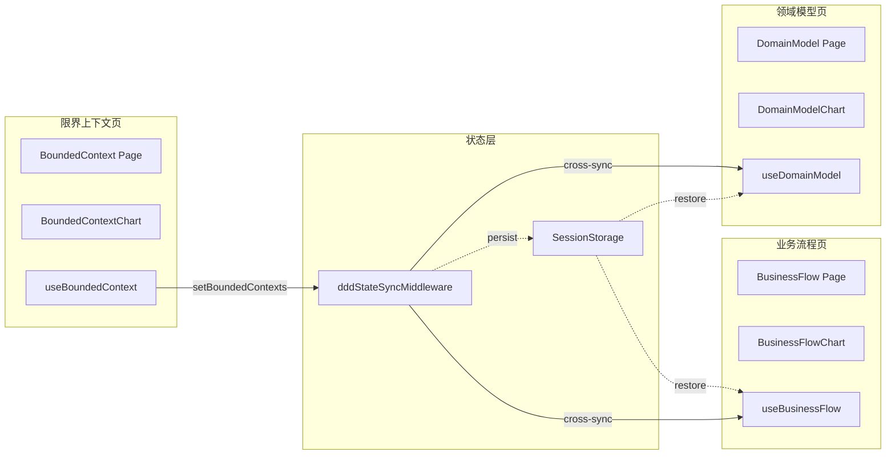

# ADR-001: 领域模型全流程空值保护与状态同步架构

## Status
Accepted

## Context
2026-03-16 领域模型渲染修复（commit 005279b）后存在两类遗漏问题：
1. **空值崩溃风险**：mermaidCode、流数据、组件 props 等场景缺乏空值保护
2. **状态切换不一致**：限界上下文→领域模型→业务流程三页面切换时状态可能丢失

现有架构为 Zustand + persist middleware，DDD 三个 slice（contextSlice/modelSlice/designStore）独立管理状态。

---

## Decision

### 技术选型

| 层级 | 技术方案 | 选型理由 |
|------|----------|----------|
| 状态管理 | Zustand Middleware + Immer | 最小侵入，不改现有 slice 签名 |
| 空值保护 | `?.` + `??` 操作符 + fallback 组件 | TypeScript 友好，无额外依赖 |
| 持久化 | sessionStorage（兜底） + Zustand persist | 双保险，不影响现有 persist |
| 测试 | Jest + React Testing Library | 现有测试栈一致 |

---

## 架构图



---

## Epic 1: 空值保护层

### 1.1 组件层（Component Layer）

**目标组件**（共 6 个）：

| 组件 | 文件路径 | 防护点 |
|------|----------|--------|
| `BoundedContextChart` | `components/canvas/BoundedContextGroup.tsx` | `contextMermaidCode` |
| `DomainModelDiagram` | `components/domain-model-diagram/DomainModelDiagram.tsx` | `modelMermaidCode` |
| `BusinessFlowChart` | `components/flow-diagram/` | `flowMermaidCode` |
| `VisualizationPlatform` | `components/visualization/VisualizationPlatform/VisualizationPlatform.tsx` | `code` prop |
| `MermaidRenderer` | `components/visualization/MermaidRenderer/MermaidRenderer.tsx` | `code` prop |
| `MermaidPreview` | `components/ui/MermaidPreview.tsx` | `code` prop |

**防护模式**：
```typescript
// ❌ 之前（崩溃风险）
const html = renderMermaid(code);

// ✅ 之后（安全渲染）
const safeCode = code ?? '';
if (!safeCode.trim()) {
  return <EmptyFallback message="暂无数据，请先生成" />;
}
try {
  const html = renderMermaid(safeCode);
} catch (e) {
  return <ErrorFallback message="渲染失败，请重试" error={e} />;
}
```

### 1.2 Hook 层（Hook Layer）

| Hook | 文件路径 | 防护策略 |
|------|----------|----------|
| `useBoundedContext` | `stores/contextSlice.ts` (inline) | 空数组 fallback |
| `useDomainModel` | `stores/modelSlice.ts` (inline) | 空对象 fallback |
| `useBusinessFlow` | `stores/designStore.ts` (inline) | 空数组 fallback |
| `useDDDStream` | `services/ddd/stream-service.ts` | try/catch + 默认值 |

### 1.3 Reducer 层（State Layer）

**防护原则**：所有 reducer action 添加输入校验，非法 payload 写入时被静默拦截。

```typescript
// contextSlice.ts 防护示例
const contextReducer = (state: ContextState, action: ContextAction): ContextState => {
  // F1.3: 防护非法 payload
  if (action.type === 'setBoundedContexts') {
    if (!Array.isArray(action.payload)) return state;
    if (action.payload.some(c => !c?.id)) return state; // 过滤脏数据
  }
  return produce(state, draft => { /* 原逻辑 */ });
};
```

---

## Epic 2: 状态同步层

### 2.1 Zustand Middleware 设计

```typescript
// stores/middleware/dddStateSyncMiddleware.ts

/**
 * DDD 三页面状态同步中间件
 * 
 * 职责：
 * 1. 监听 context/model/flow 三个 slice 的变更
 * 2. 路由切换时触发状态快照持久化到 sessionStorage
 * 3. 页面返回时恢复状态（兜底）
 */

import type { StateCreator } from 'zustand';
import { subscribeWithSelector } from 'zustand/middleware';

const SESSION_KEY = 'ddd-cross-page-state';

export interface DDDCrossPageState {
  context: BoundedContext[];
  model: DomainModel[];
  flow: BusinessFlow[];
  timestamps: {
    context: number;
    model: number;
    flow: number;
  };
}

export const dddStateSyncMiddleware: StateCreator<any, [], [], any> = (set, get, api) => {
  // 注册跨 slice 订阅
  let lastRoute = '';
  
  return (config) => {
    const store = config(set, get, api);
    
    // 路由变化检测（需要和 navigationStore 配合）
    const unsubscribe = subscribeWithSelector(store, (state, prevState) => {
      const currentRoute = state.currentRoute ?? lastRoute;
      
      // 任意 DDD slice 变更 → 持久化快照
      if (state.ddd?.context !== prevState.ddd?.context ||
          state.ddd?.model !== prevState.ddd?.model ||
          state.ddd?.flow !== prevState.ddd?.flow) {
        persistSnapshot(state);
      }
      
      // 路由切换 → 检查兜底恢复
      if (currentRoute !== lastRoute) {
        checkAndRestoreState(currentRoute);
      }
      
      lastRoute = currentRoute;
    });
    
    return store;
  };
};

function persistSnapshot(state: any) {
  if (typeof window === 'undefined') return;
  const snapshot: DDDCrossPageState = {
    context: state.ddd?.context ?? [],
    model: state.ddd?.model ?? [],
    flow: state.ddd?.flow ?? [],
    timestamps: {
      context: Date.now(),
      model: Date.now(),
      flow: Date.now(),
    },
  };
  sessionStorage.setItem(SESSION_KEY, JSON.stringify(snapshot));
}

function checkAndRestoreState(route: string) {
  if (typeof window === 'undefined') return;
  const raw = sessionStorage.getItem(SESSION_KEY);
  if (!raw) return;
  
  const snapshot: DDDCrossPageState = JSON.parse(raw);
  const now = Date.now();
  const TTL = 30 * 60 * 1000; // 30min
  
  // 过期则清除
  if (now - snapshot.timestamps.context > TTL) {
    sessionStorage.removeItem(SESSION_KEY);
    return;
  }
  
  // 如果当前状态为空但快照有数据，恢复（兜底）
  const store = get(); // 需要通过闭包访问
  if (route.includes('domain-model') && !store.ddd?.model?.length && snapshot.model.length) {
    store.setDomainModels(snapshot.model);
  }
}
```

### 2.2 页面切换时序图



---

## Epic 3: 回归验证

| 测试项 | 覆盖范围 | 工具 |
|--------|----------|------|
| 空值保护组件测试 | `EmptyFallback`, `ErrorFallback` | RTL + jest |
| Reducer 防御性测试 | contextSlice, modelSlice, designStore | jest |
| 状态同步中间件测试 | 跨 slice 同步, sessionStorage 读写 | jest + mock |
| E2E 页面切换 | 三页面来回切换≥3次 | Playwright |

---

## 性能影响评估

| 操作 | 预期耗时 | 说明 |
|------|----------|------|
| Middleware 快照 | < 5ms | JSON.stringify 小数据量 |
| sessionStorage 写入 | < 10ms | 仅在变更时触发 |
| 空值保护 `?.` | < 0.1ms | 无性能影响 |

**结论**：性能影响可忽略，不会阻塞 UI 渲染。

---

## 数据流总览



---

## 约束

1. **不破坏现有 API**：所有 slice 签名保持不变
2. **幂等性**：中间件重复触发不影响状态正确性
3. **向后兼容**：sessionStorage 无数据时静默降级，不影响现有逻辑
4. **测试覆盖**：状态同步逻辑覆盖率 ≥ 90%

---

## 风险与缓解

| 风险 | 概率 | 影响 | 缓解 |
|------|------|------|------|
| Middleware 导致循环触发 | 低 | 高 | 使用 `subscribeWithSelector` 精确订阅，避免递归 |
| sessionStorage 损坏数据 | 低 | 中 | JSON.parse 用 try/catch 包裹，异常时清除 |
| 空值保护过度过滤正常数据 | 低 | 中 | 保留原有 `undefined` 行为，仅添加额外 fallback |
