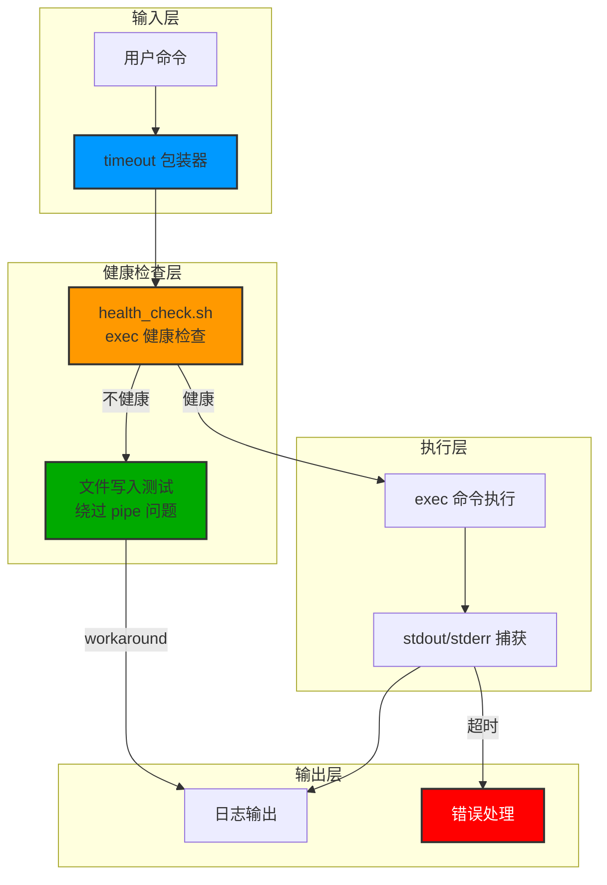
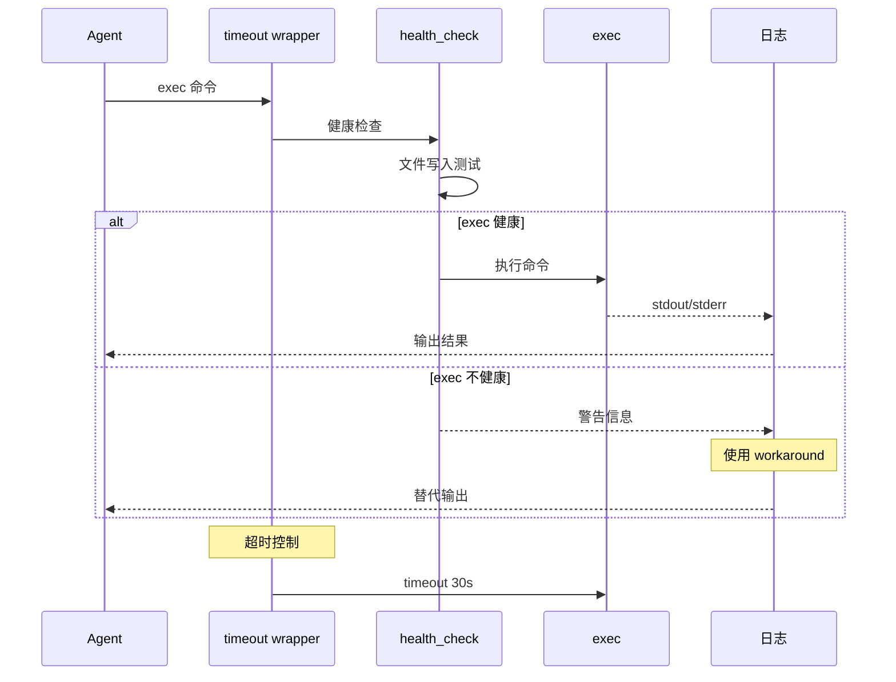

# Architecture: Sandbox Exec Freeze 修复方案

> **项目**: vibex-exec-sandbox-freeze
> **阶段**: design-architecture
> **版本**: 1.0.0
> **日期**: 2026-03-30
> **Architect**: Architect Agent
> **工作目录**: /root/.openclaw/vibex

---

## 执行决策
- **决策**: 已采纳
- **执行项目**: vibex-exec-sandbox-freeze
- **执行日期**: 2026-03-30

---

## 1. 概述

### 1.1 问题背景

Sandbox 模式下 `exec` 工具返回 exit code 0 但无任何 stdout/stderr 输出，所有命令静默失败。

### 1.2 影响范围
- OpenClaw exec 工具（sandbox 模式）
- 所有使用 sandbox exec 的 agent
- task_manager.py update/status 命令
- git commit/push 操作

### 1.3 Epic 拆分

| Epic | 目标 | 优先级 |
|------|------|---------|
| Epic 1 | 健康检查机制 | P0 |
| Epic 2 | 超时保护 | P0 |
| Epic 3 | 输出恢复 | P0 |

---

## 2. Tech Stack

| 层级 | 技术选型 | 理由 |
|------|----------|------|
| **健康检查** | Bash script | 快速部署，无需编译 |
| **超时控制** | `timeout` 命令 | 标准 Unix 工具 |
| **输出验证** | 文件写入测试 | 绕过 pipe 问题 |
| **日志** | stderr | 便于问题诊断 |

---

## 3. 架构设计

### 3.1 系统架构



### 3.2 执行流程



---

## 4. 文件设计

### 4.1 健康检查脚本

```bash
#!/bin/bash
# src/scripts/health_check.sh

# Sandbox exec 健康检查
# 使用文件写入测试绕过 pipe 问题

_exec_health_check() {
    local test_marker="EXEC_HEALTH_TEST_$(date +%s)_$$"
    local test_file="/tmp/exec_health_$$"
    
    # 尝试通过文件验证 exec
    echo "$test_marker" > "$test_file" 2>/dev/null
    
    if [ ! -f "$test_file" ]; then
        echo "ERROR: Cannot write to filesystem" >&2
        return 1
    fi
    
    local result=$(cat "$test_file" 2>/dev/null)
    rm -f "$test_file"
    
    if [ "$result" = "$test_marker" ]; then
        return 0  # 健康
    else
        echo "WARN: exec output may be broken" >&2
        return 1  # 不健康
    fi
}

# 执行带健康检查的命令
exec_with_health_check() {
    local cmd="$1"
    local timeout="${2:-30}"
    
    # 健康检查
    if ! _exec_health_check; then
        echo "WARN: exec may be broken, attempting workaround" >&2
        # 使用 workaround: 通过文件执行并捕获结果
        local result_file="/tmp/exec_result_$$"
        timeout "$timeout" bash -c "$cmd" > "$result_file" 2>&1 &
        local pid=$!
        wait $pid
        local exit_code=$?
        cat "$result_file" 2>/dev/null
        rm -f "$result_file"
        return $exit_code
    fi
    
    # 正常执行
    timeout "$timeout" bash -c "$cmd"
}
```

### 4.2 超时包装器

```bash
#!/bin/bash
# src/scripts/exec_wrapper.sh

# 默认超时时间（秒）
COMMAND_TIMEOUT="${COMMAND_TIMEOUT:-30}"

# 包装 exec 命令
exec_wrap() {
    local cmd="$*"
    local timeout="$COMMAND_TIMEOUT"
    
    # 检查是否有自定义超时
    if [[ "$cmd" =~ --timeout=([0-9]+) ]]; then
        timeout="${BASH_REMATCH[1]}"
        cmd="${cmd/--timeout=[0-9]+/}"
    fi
    
    # 使用 timeout 命令执行
    timeout "$timeout" bash -c "$cmd"
    local exit_code=$?
    
    case $exit_code in
        0)  return 0 ;;
        124) echo "ERROR: Command timed out after ${timeout}s" >&2 ;;
        *)   echo "ERROR: Command failed with exit code $exit_code" >&2 ;;
    esac
    
    return $exit_code
}

# 直接执行
exec_direct() {
    bash -c "$*"
}
```

### 4.3 主脚本入口

```bash
#!/bin/bash
# src/scripts/sandbox_exec.sh

# Sandbox Exec 包装脚本
# 用法: sandbox_exec.sh <command> [args...]

set -e

SCRIPT_DIR="$(cd "$(dirname "${BASH_SOURCE[0]}")" && pwd)"
source "$SCRIPT_DIR/exec_wrapper.sh"
source "$SCRIPT_DIR/health_check.sh"

COMMAND="${1:-}"
shift || true

if [ -z "$COMMAND" ]; then
    echo "Usage: sandbox_exec.sh <command> [args...]"
    exit 1
fi

# 重新组装命令
FULL_CMD="$COMMAND"
for arg in "$@"; do
    FULL_CMD="$FULL_CMD $(printf '%q' "$arg")"
done

# 执行
exec_with_health_check "$FULL_CMD"
```

---

## 5. 数据模型

### 5.1 健康状态

```typescript
// src/types/exec-health.ts

export type ExecHealthStatus = 'healthy' | 'broken' | 'unknown';

export interface ExecHealthCheck {
  status: ExecHealthStatus;
  checkedAt: string;     // ISO8601
  testMarker: string;
  workaroundUsed: boolean;
}

export interface ExecResult {
  stdout: string;
  stderr: string;
  exitCode: number;
  timedOut: boolean;
  healthCheck: ExecHealthCheck;
}
```

### 5.2 配置

```typescript
// src/types/exec-config.ts

export interface ExecConfig {
  /** 超时时间（秒），默认 30 */
  timeout: number;
  
  /** 是否启用健康检查 */
  healthCheckEnabled: boolean;
  
  /** 健康检查超时 */
  healthCheckTimeout: number;
  
  /** 启用 workaround */
  workaroundEnabled: boolean;
}
```

---

## 6. 测试策略

### 6.1 单元测试

```bash
# tests/test_health_check.sh

#!/bin/bash
set -e

echo "=== Testing health_check ==="

# 测试 1: 正常情况
result=$(bash -c 'source src/scripts/health_check.sh; _exec_health_check')
echo "Health check result: $?"

# 测试 2: 超时情况
timeout 35 bash -c 'sleep 30' && echo "FAIL: should timeout" || echo "OK: timeout works"

# 测试 3: 文件写入
test_file="/tmp/test_$$"
echo "test" > "$test_file"
[ "$(cat $test_file)" = "test" ] && echo "OK: file write works" || echo "FAIL"
rm -f "$test_file"
```

### 6.2 集成测试

```bash
# tests/integration/test_exec.sh

#!/bin/bash

echo "=== Integration Test ==="

# 测试正常命令
output=$(bash src/scripts/sandbox_exec.sh echo "hello")
[ "$output" = "hello" ] && echo "OK: echo works" || echo "FAIL: echo"

# 测试超时
bash src/scripts/sandbox_exec.sh "sleep 60" --timeout=2 && echo "FAIL: should timeout" || echo "OK: timeout works"

# 测试错误处理
bash src/scripts/sandbox_exec.sh "exit 1"
[ $? -ne 0 ] && echo "OK: error handling works" || echo "FAIL"
```

---

## 7. 部署方案

### 7.1 部署步骤

1. **创建脚本目录**
```bash
mkdir -p /root/.openclaw/vibex/src/scripts
```

2. **部署脚本**
```bash
cp health_check.sh /root/.openclaw/vibex/src/scripts/
cp exec_wrapper.sh /root/.openclaw/vibex/src/scripts/
cp sandbox_exec.sh /root/.openclaw/vibex/src/scripts/
chmod +x /root/.openclaw/vibex/src/scripts/*.sh
```

3. **配置环境变量**
```bash
export COMMAND_TIMEOUT=30
export EXEC_WORKAROUND_ENABLED=true
```

### 7.2 回滚方案

```bash
# 回滚：恢复原 exec 行为
unset COMMAND_TIMEOUT
# 或设置为一个较大的值
export COMMAND_TIMEOUT=3600
```

---

## 8. 风险评估

| 风险 | 概率 | 影响 | 缓解 |
|------|------|------|------|
| 健康检查本身失败 | 低 | 高 | 使用文件写入测试 |
| 超时设置不合理 | 中 | 中 | 提供可配置超时 |
| Workaround 引入新问题 | 低 | 低 | 严格测试覆盖 |
| 脚本权限问题 | 低 | 低 | 显式 chmod |

---

## 9. 验收标准

| Epic | 验收条件 |
|------|----------|
| Epic 1 | `_exec_health_check` 返回正确状态 |
| Epic 1 | 警告信息输出到 stderr |
| Epic 2 | `sleep 60` 在 30s 后被终止 |
| Epic 2 | 超时错误信息明确 |
| Epic 3 | `echo "test"` 输出 "test" |
| Epic 3 | stderr 正确捕获 |

---

## 10. 相关文档

| 文档 | 路径 |
|------|------|
| PRD | `docs/vibex-exec-sandbox-freeze/prd.md` |
| 分析 | `docs/vibex-exec-sandbox-freeze/analysis.md` |
| FIX | `docs/vibex-exec-sandbox-freeze/FIX.md` |

---

*本文档由 Architect Agent 生成*
