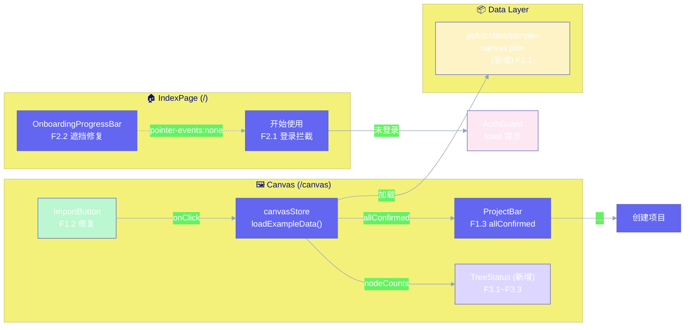

# Architecture: vibex-frontend-analysis-20260327

**Project**: VibeX 画布到创建项目流程修复（前端问题）
**Architect**: Architect Agent
**Date**: 2026-03-27
**Status**: ✅ Complete

> ⚠️ **Note**: 此项目与 `vibex-canvas-analysis` 分析同一问题域。Architecture 产出复用，文件路径基于本次 PRD 精确对齐。

---

## 1. Tech Stack

| 组件 | 版本 | 说明 |
|------|------|------|
| TypeScript | 5.x | 严格模式 |
| Zustand | 4.x | canvasStore 已用 |
| React | 18.x | 现有 |
| Vite | 5.x | 现有 |
| Playwright | 现有 | gstack browse |

**边界约束**: 不改 AI 生成逻辑、不改 DDD 数据模型、不改游客模式完整实现。

---

## 2. Architecture Diagram



---

## 3. Module Design

### 3.1 SampleData (F1.1)

**文件**: `public/data/sample-canvas.json` (新增)

```typescript
interface SampleCanvasData {
  requirement: string;
  contexts: CanvasNode[];
  flows: CanvasNode[];
  components: CanvasNode[];
}

interface CanvasNode {
  id: string;
  type: 'context' | 'flow' | 'component';
  label: string;
  confirmed: boolean; // 预设 true
  position?: { x: number; y: number };
}
```

### 3.2 CanvasStore Extension (F1.2)

**文件**: `src/lib/canvas/canvasStore.ts`

```typescript
// 新增 Action
loadSampleData(sample: SampleCanvasData): void

// 扩展 computed
allConfirmed: boolean
nodeCounts: { contexts: number; flows: number; components: number }
```

### 3.3 ProjectBar Enhancement (F1.3, F3.3)

**文件**: `src/components/ProjectBar.tsx`

```typescript
// 按钮状态联动
const allConfirmed = useCanvasStore(s => s.allConfirmed);

<button
  data-testid="create-project-btn"
  disabled={!allConfirmed}
  title={!allConfirmed ? '请先确认所有三树节点' : undefined}
>
  创建项目
</button>
```

### 3.4 IndexPage AuthGuard (F2.1)

**文件**: `src/pages/IndexPage.tsx`

```typescript
const handleStartClick = () => {
  if (!authStore.isAuthenticated) {
    toast.show({ message: '请先登录', type: 'warning', 'data-testid': 'auth-toast' });
    return;
  }
  navigate('/canvas');
};
```

### 3.5 OnboardingProgressBar Fix (F2.2)

**文件**: `src/components/OnboardingProgressBar.tsx`

```css
/* 修复遮挡 */
.onboarding-progress-bar .inactive-step {
  pointer-events: none;
}
```

### 3.6 TreeStatus Component (F3.1–F3.3)

**文件**: `src/components/canvas/TreeStatus.tsx` (新增)

```typescript
const TreeStatus: React.FC = () => {
  const counts = useCanvasStore(s => s.nodeCounts);
  return (
    <div data-testid="tree-status">
      <span>上下文 {counts.contexts} 个节点</span>
      <span>流程 {counts.flows} 个节点</span>
      <span>组件 {counts.components} 个节点</span>
    </div>
  );
};
```

---

## 4. Key Trade-offs

| 决策 | 选择 | 权衡 |
|------|------|------|
| 示例数据路径 | `public/data/` | 可通过 URL 直接加载，适合静态部署 |
| 导入策略 | 合并而非替换 | 保留用户已有输入 |
| IndexPage vs HomePage | 以 PRD 路径 `src/pages/IndexPage.tsx` 为准 | 待 Dev 确认实际文件位置 |

---

## 5. ADR

### ADR-001: 示例数据不触发 AI 覆盖

**Context**: AI 生成可能覆盖用户导入的示例数据。

**Decision**: 示例数据使用 `isSampleMode: true` flag，AI 生成时跳过已标记节点。

**Consequences**: + 保护示例数据；- 需在 AI 生成逻辑中增加条件判断。

---

*Architect — 2026-03-27*
