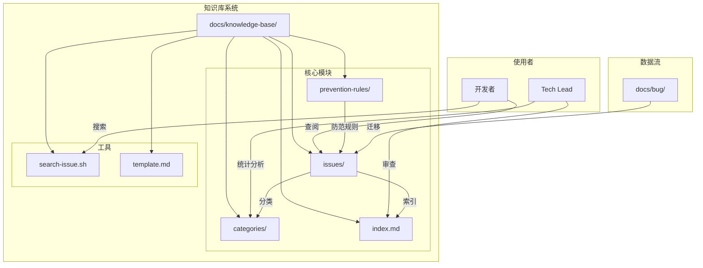
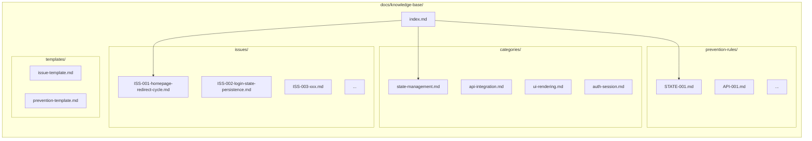
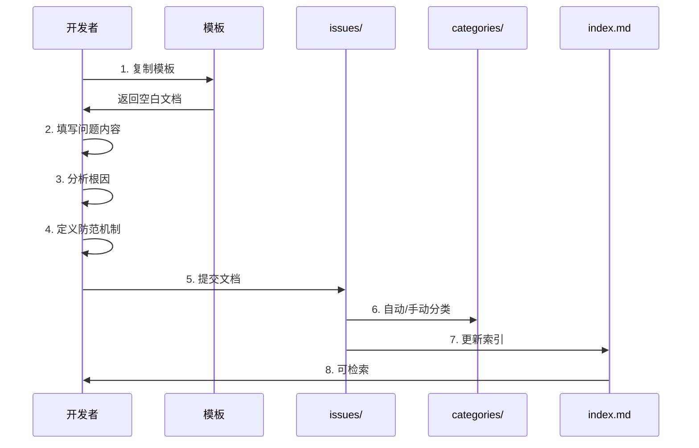
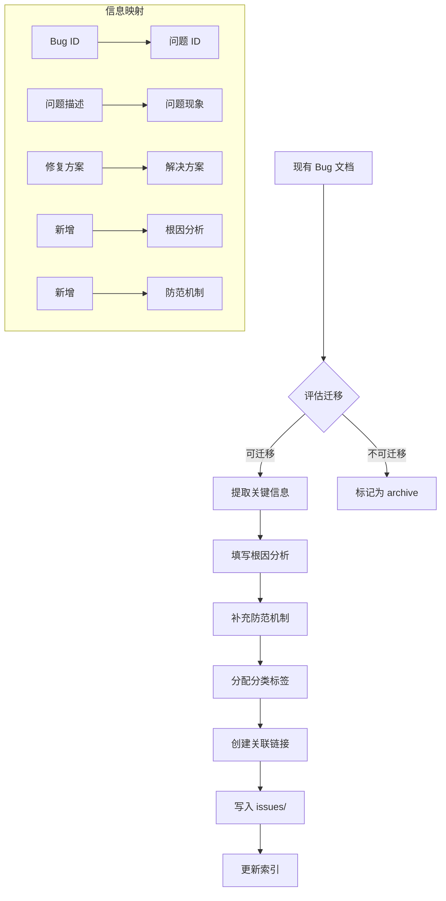
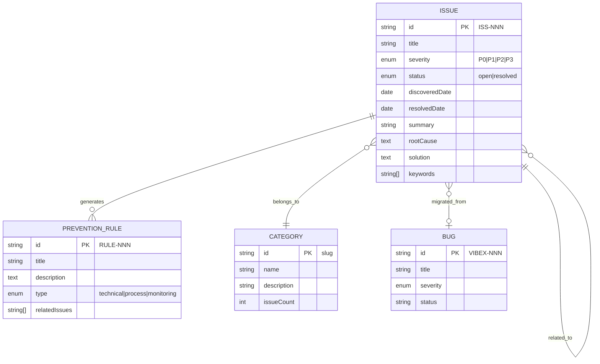

# 问题知识库系统 - 架构设计文档

**项目**: vibex-issue-knowledge-base  
**架构师**: Architect Agent  
**日期**: 2026-03-15  
**状态**: 架构设计完成

---

## 1. Tech Stack (技术栈)

| 技术 | 版本 | 选择理由 |
|-----|------|---------|
| Markdown | - | 文档格式，与现有项目一致 |
| Shell Script | Bash 4+ | 搜索工具，零依赖，跨平台 |
| jq | 1.6+ | JSON 处理（可选，用于结构化查询） |
| grep/find | 内置 | 文本搜索，高效可靠 |

### 技术决策说明

**ADR-001: 纯文档方案**

| 属性 | 决策 |
|------|------|
| 状态 | Accepted |
| 背景 | 需要建立问题知识库，可选择纯文档方案或数据库方案 |
| 决策 | 采用纯 Markdown 文档方案 |
| 理由 | 1) 与现有 Bug 文档格式一致；2) 零学习成本；3) 版本控制友好；4) 无需额外基础设施 |
| 后果 | 搜索效率依赖脚本，不适合大规模（>1000 条）场景 |

**ADR-002: Shell 脚本搜索**

| 属性 | 决策 |
|------|------|
| 状态 | Accepted |
| 背景 | 需要提供搜索功能 |
| 决策 | 使用 Shell 脚本 + grep/find |
| 理由 | 1) 无需依赖；2) 可集成到 CI；3) 可扩展 |
| 后果 | 功能相对简单，后续可升级为 Node.js 工具 |

---

## 2. Architecture Diagram (架构图)

### 2.1 系统结构



### 2.2 文件结构



### 2.3 问题文档生命周期



### 2.4 迁移流程



---

## 3. API Definitions (接口定义)

### 3.1 搜索脚本 API

```bash
# 基本用法
./scripts/search-issue.sh [OPTIONS]

# 选项
--keyword <text>      按关键词搜索（支持正则）
--category <name>     按分类过滤（state-management, api-integration, etc.）
--severity <level>    按严重级别过滤（P0, P1, P2, P3）
--id <ISS-NNN>        按问题 ID 精确查找
--recent <days>       按最近 N 天更新过滤
--format <type>       输出格式（text, json, markdown）

# 输出格式
# text（默认）
ISS-001: 首页重定向循环 [P0] [state-management]
  解决日期: 2026-03-11
  摘要: 首页路由配置错误导致无限重定向...

# json
{
  "id": "ISS-001",
  "title": "首页重定向循环",
  "severity": "P0",
  "category": "state-management",
  "resolvedDate": "2026-03-11",
  "summary": "..."
}

# markdown
- **ISS-001**: 首页重定向循环
  - 严重级别: P0
  - 分类: state-management
  - 解决日期: 2026-03-11
```

### 3.2 问题文档 Schema

```yaml
# 问题文档必需字段
IssueDocument:
  header:
    id: string           # 格式: ISS-NNN
    title: string        # 问题标题
    category: enum       # 分类标签
    severity: enum       # 严重级别 P0|P1|P2|P3
    discoveredDate: date # 发现日期
    resolvedDate: date?  # 解决日期（可选）
    relatedBug: string?  # 关联 Bug ID（可选）
  
  sections:
    - name: 问题现象
      required: true
      subsections:
        - 症状描述
        - 复现步骤
        - 影响范围
    
    - name: 根因分析
      required: true
      subsections:
        - 直接原因
        - 深层原因
        - 分析过程
    
    - name: 解决方案
      required: true
      subsections:
        - 修复方案
        - 代码变更
        - 验证方法
    
    - name: 防范机制
      required: true
      subsections:
        - 技术防范
        - 流程防范
        - 监控告警
    
    - name: 相关问题
      required: false
    
    - name: 经验总结
      required: false
      subsections:
        - 关键学习点
        - 最佳实践
```

### 3.3 分类汇总文件 Schema

```yaml
# 分类汇总文件结构
CategoryDocument:
  header:
    name: string           # 分类名称
    description: string    # 分类描述
    count: number          # 问题数量
  
  body:
    - subsection: 常见问题
      issues: IssueReference[]
    
    - subsection: 防范规则
      rules: PreventionRuleReference[]
    
    - subsection: 最佳实践
      practices: string[]

IssueReference:
  id: string
  title: string
  severity: enum
  summary: string
```

### 3.4 索引文件结构

```yaml
# index.md 结构
IndexDocument:
  summary:
    total: number
    byCategory: Map<string, number>
    bySeverity: Map<string, number>
  
  sections:
    - name: 按分类浏览
      content: CategoryGroup[]
    
    - name: 按严重级别浏览
      content: SeverityGroup[]
    
    - name: 最近更新
      content: RecentIssue[]
    
    - name: 快速链接
      content: QuickLink[]
```

---

## 4. Data Model (数据模型)

### 4.1 核心实体关系



### 4.2 分类体系定义

| 分类 ID | 名称 | 描述 | 关键词 |
|---------|------|------|--------|
| `state-management` | 状态管理 | 状态持久化、同步、更新问题 | state, zustand, persist, sync |
| `api-integration` | API 集成 | 请求、响应、错误处理问题 | api, fetch, axios, request, response |
| `ui-rendering` | UI 渲染 | 组件显示、样式、布局问题 | render, display, css, style, layout |
| `auth-session` | 认证会话 | 登录、登出、会话问题 | auth, login, session, token |
| `routing` | 路由导航 | 路由跳转、重定向问题 | route, redirect, navigation |
| `performance` | 性能 | 加载速度、内存问题 | slow, memory, load, leak |
| `data-flow` | 数据流 | 数据传递、更新问题 | data, flow, props, context |

### 4.3 问题 ID 分配规则

```
ISS-NNN

其中：
- ISS: 固定前缀（Issue）
- NNN: 三位数字，从 001 开始递增

示例：
- ISS-001: 首页重定向循环
- ISS-002: 登录状态未持久化
- ISS-003: 实时预览 API 超时
```

### 4.4 文件命名规范

```
# 问题文档
issues/ISS-NNN-<short-title>.md

示例：
issues/ISS-001-homepage-redirect-cycle.md
issues/ISS-002-login-state-persistence.md

# 分类汇总
categories/<category-id>.md

示例：
categories/state-management.md
categories/api-integration.md

# 防范规则
prevention-rules/<RULE-NNN>-<short-title>.md

示例：
prevention-rules/STATE-001-persist-check.md
prevention-rules/API-001-timeout-handling.md
```

---

## 5. Testing Strategy (测试策略)

### 5.1 测试框架

| 层级 | 工具 | 用途 |
|------|------|------|
| 文档格式验证 | Shell + grep | 验证必需字段 |
| 结构完整性 | Shell + find | 验证目录结构 |
| 搜索功能 | Shell + bats | 单元测试脚本 |
| 迁移验证 | Shell + diff | 对比迁移前后数据 |

### 5.2 覆盖率要求

| 指标 | 目标 |
|------|------|
| 文档格式合规率 | 100% |
| 必需字段完整率 | 100% |
| 分类覆盖率 | > 95% |
| 搜索脚本测试覆盖 | > 80% |

### 5.3 核心测试用例

#### 5.3.1 文档格式验证

```bash
#!/bin/bash
# test/issue-format.test.sh

describe "Issue Document Format"

it "should have required header fields" {
  for file in docs/knowledge-base/issues/*.md; do
    expect "$file" --to-contain "问题 ID"
    expect "$file" --to-contain "分类"
    expect "$file" --to-contain "严重级别"
    expect "$file" --to-contain "发现日期"
  done
}

it "should have required sections" {
  for file in docs/knowledge-base/issues/*.md; do
    expect "$file" --to-contain "## 1. 问题现象"
    expect "$file" --to-contain "## 2. 根因分析"
    expect "$file" --to-contain "## 3. 解决方案"
    expect "$file" --to-contain "## 4. 防范机制"
  done
}

it "should have valid severity level" {
  for file in docs/knowledge-base/issues/*.md; do
    severity=$(grep "严重级别" "$file" | grep -oE "P[0-3]")
    expect "$severity" --to-match "P[0-3]"
  done
}

it "should have valid category" {
  valid_categories="state-management|api-integration|ui-rendering|auth-session|routing|performance|data-flow"
  for file in docs/knowledge-base/issues/*.md; do
    category=$(grep "分类" "$file" | grep -oE "$valid_categories")
    expect "$category" --to-match "$valid_categories"
  done
}
```

#### 5.3.2 搜索脚本测试

```bash
#!/bin/bash
# test/search-issue.test.sh

describe "Search Issue Script"

setup() {
  export KB_ROOT="docs/knowledge-base"
  mkdir -p "$KB_ROOT/issues"
  
  # 创建测试数据
  cat > "$KB_ROOT/issues/ISS-001-test-issue.md" << 'EOF'
# 问题记录: 测试问题

**问题 ID**: ISS-001  
**分类**: state-management  
**严重级别**: P0  
**发现日期**: 2026-03-15  
**解决日期**: 2026-03-15  

## 1. 问题现象

测试问题描述...

## 2. 根因分析

根因分析内容...

## 3. 解决方案

解决方案内容...

## 4. 防范机制

防范机制内容...
EOF
}

teardown() {
  rm -rf "$KB_ROOT"
}

it "should search by keyword" {
  result=$(./scripts/search-issue.sh --keyword "测试问题")
  expect "$result" --to-contain "ISS-001"
}

it "should filter by category" {
  result=$(./scripts/search-issue.sh --category "state-management")
  expect "$result" --to-contain "ISS-001"
}

it "should filter by severity" {
  result=$(./scripts/search-issue.sh --severity "P0")
  expect "$result" --to-contain "ISS-001"
}

it "should output json format" {
  result=$(./scripts/search-issue.sh --keyword "测试问题" --format json)
  expect "$result" --to-contain '"id": "ISS-001"'
}

it "should return empty for no match" {
  result=$(./scripts/search-issue.sh --keyword "不存在的关键词xyz")
  expect "$result" --to-be-empty
}
```

#### 5.3.3 迁移验证测试

```bash
#!/bin/bash
# test/migration.test.sh

describe "Bug Migration"

it "should migrate all 7 bug documents" {
  issue_count=$(ls docs/knowledge-base/issues/*.md 2>/dev/null | wc -l)
  expect "$issue_count" --to-equal "7"
}

it "should preserve bug ID reference" {
  for file in docs/knowledge-base/issues/*.md; do
    # 每个迁移的文档应有 Bug ID 引用
    expect "$file" --to-contain "关联 Bug" || \
    expect "$file" --to-contain "VIBEX-"
  done
}

it "should have root cause analysis" {
  for file in docs/knowledge-base/issues/*.md; do
    # 根因分析不应为空
    root_cause=$(sed -n '/## 2. 根因分析/,/## 3. 解决方案/p' "$file" | grep -v "^#" | grep -v "^$")
    expect "$root_cause" --not-to-be-empty
  done
}

it "should have prevention mechanism" {
  for file in docs/knowledge-base/issues/*.md; do
    # 防范机制不应为空
    prevention=$(sed -n '/## 4. 防范机制/,/## 5. 相关问题/p' "$file" | grep -v "^#" | grep -v "^$")
    expect "$prevention" --not-to-be-empty
  done
}
```

#### 5.3.4 索引完整性测试

```bash
#!/bin/bash
# test/index.test.sh

describe "Index File"

it "should have index.md" {
  expect "docs/knowledge-base/index.md" --to-exist
}

it "should list all issues by category" {
  for category in state-management api-integration ui-rendering auth-session; do
    count=$(ls docs/knowledge-base/issues/*.md 2>/dev/null | xargs grep -l "分类.*$category" | wc -l)
    index_count=$(grep -c "$category" docs/knowledge-base/index.md || echo "0")
    expect "$index_count" --to-equal "$count"
  done
}

it "should list all issues by severity" {
  for severity in P0 P1 P2 P3; do
    count=$(ls docs/knowledge-base/issues/*.md 2>/dev/null | xargs grep -l "严重级别.*$severity" | wc -l)
    index_count=$(grep -c "$severity" docs/knowledge-base/index.md || echo "0")
    expect "$index_count" --to-equal "$count"
  done
}

it "should have recent updates section" {
  expect "docs/knowledge-base/index.md" --to-contain "最近更新"
}
```

### 5.4 验收测试清单

```markdown
## 功能验收

### F1: 知识库目录结构
- [ ] `docs/knowledge-base/` 目录存在
- [ ] `issues/` 子目录存在
- [ ] `categories/` 子目录存在
- [ ] `prevention-rules/` 子目录存在
- [ ] `index.md` 文件存在

### F2: 问题文档模板
- [ ] 模板文件存在
- [ ] 包含 "根因分析" 章节
- [ ] 包含 "防范机制" 章节
- [ ] 包含 "复现步骤" 章节
- [ ] 包含 "关联问题" 章节

### F3: 现有 Bug 迁移
- [ ] 迁移文档数量 >= 7
- [ ] 每个文档有根因分析
- [ ] 每个文档有防范机制
- [ ] 保留原 Bug ID 引用

### F4: 分类体系
- [ ] 包含 state-management 分类
- [ ] 包含 api-integration 分类
- [ ] 包含 ui-rendering 分类
- [ ] 包含 auth-session 分类

### F5: 索引文件
- [ ] 按分类列出问题
- [ ] 按严重级别列出问题
- [ ] 显示最近更新

### F6: 搜索脚本
- [ ] 支持关键词搜索
- [ ] 支持分类过滤
- [ ] 支持严重级别过滤
```

---

## 6. 目录结构实现

```
docs/knowledge-base/
├── index.md                          # 知识库索引
├── issues/
│   ├── ISS-001-homepage-redirect-cycle.md
│   ├── ISS-002-login-state-persistence.md
│   ├── ISS-003-realtime-preview-failure.md
│   ├── ISS-004-missing-preview-area.md
│   ├── ISS-005-homepage-ui-issues.md
│   ├── ISS-006-homepage-redesign.md
│   └── ISS-007-login-realtime-integration.md
├── categories/
│   ├── state-management.md           # 状态管理类问题汇总
│   ├── api-integration.md            # API 集成类问题汇总
│   ├── ui-rendering.md               # UI 渲染类问题汇总
│   ├── auth-session.md               # 认证会话类问题汇总
│   ├── routing.md                    # 路由类问题汇总
│   └── performance.md                # 性能类问题汇总
├── prevention-rules/
│   ├── STATE-001-state-persistence.md
│   ├── STATE-002-state-sync.md
│   ├── API-001-error-handling.md
│   ├── API-002-timeout-handling.md
│   └── AUTH-001-login-flow.md
├── templates/
│   ├── issue-template.md             # 问题文档模板
│   └── prevention-template.md         # 防范规则模板
└── scripts/
    └── search-issue.sh                # 搜索脚本
```

---

## 7. 性能评估

### 7.1 预期规模

| 指标 | 当前 | 1年后 | 3年后 |
|------|------|-------|-------|
| 问题文档数 | 7 | ~50 | ~200 |
| 分类数 | 7 | 10 | 15 |
| 搜索响应时间 | <100ms | <200ms | <500ms |

### 7.2 性能优化策略

1. **索引优化**: index.md 维护预计算统计
2. **懒加载**: 分类汇总按需生成
3. **缓存**: 常用搜索结果缓存（可选 Node.js 升级）

### 7.3 扩展性考虑

当问题数量超过 500 时，考虑：
1. 升级为 Node.js CLI 工具
2. 集成 SQLite 本地数据库
3. 添加 Web UI 界面

---

## 8. 兼容性设计

### 8.1 与现有架构兼容

| 现有组件 | 兼容方式 |
|---------|---------|
| `docs/bug/` | 迁移后保留原文件，添加迁移标记 |
| `docs/architecture/` | 知识库作为新模块，不干扰现有文档 |
| Markdown 格式 | 使用一致的 Markdown 风格 |

### 8.2 版本控制

```gitignore
# .gitignore 添加
docs/knowledge-base/.cache/
```

### 8.3 CI 集成（可选）

```yaml
# .github/workflows/kb-check.yml
name: Knowledge Base Check

on:
  pull_request:
    paths:
      - 'docs/knowledge-base/**'

jobs:
  validate:
    runs-on: ubuntu-latest
    steps:
      - uses: actions/checkout@v3
      - name: Validate issue format
        run: |
          for file in docs/knowledge-base/issues/*.md; do
            grep -q "问题 ID" "$file" || exit 1
            grep -q "根因分析" "$file" || exit 1
            grep -q "防范机制" "$file" || exit 1
          done
```

---

## 9. 风险评估

| 风险 | 可能性 | 影响 | 缓解措施 |
|------|--------|------|----------|
| 文档填写不完整 | 高 | 中 | 模板 + CI 检查 + Code Review |
| 搜索效率低 | 低 | 中 | 建立完善索引，后续升级工具 |
| 分类不准确 | 中 | 低 | 多标签支持，定期审查 |
| 信息过时 | 中 | 低 | 定期审查机制，关联 Bug 更新 |
| 迁移数据丢失 | 低 | 高 | 保留原文件，验证脚本 |

---

## 10. 检查清单

### 10.1 架构设计检查

- [x] 技术栈选择有明确理由
- [x] 架构图使用 Mermaid 格式
- [x] API 定义完整（脚本接口 + 数据 Schema）
- [x] 数据模型清晰（实体关系图）
- [x] 测试策略定义（框架 + 覆盖率 + 用例）

### 10.2 实施检查

- [ ] 创建目录结构
- [ ] 创建问题文档模板
- [ ] 迁移现有 Bug 文档（7个）
- [ ] 创建分类汇总文件
- [ ] 创建索引文件
- [ ] 实现搜索脚本
- [ ] 运行测试验证

---

**产出物**: `docs/vibex-issue-knowledge-base/architecture.md`  
**验证**: `test -f /root/.openclaw/vibex/docs/vibex-issue-knowledge-base/architecture.md`  
**下一步**: 交由 coord 决策是否开启阶段二开发