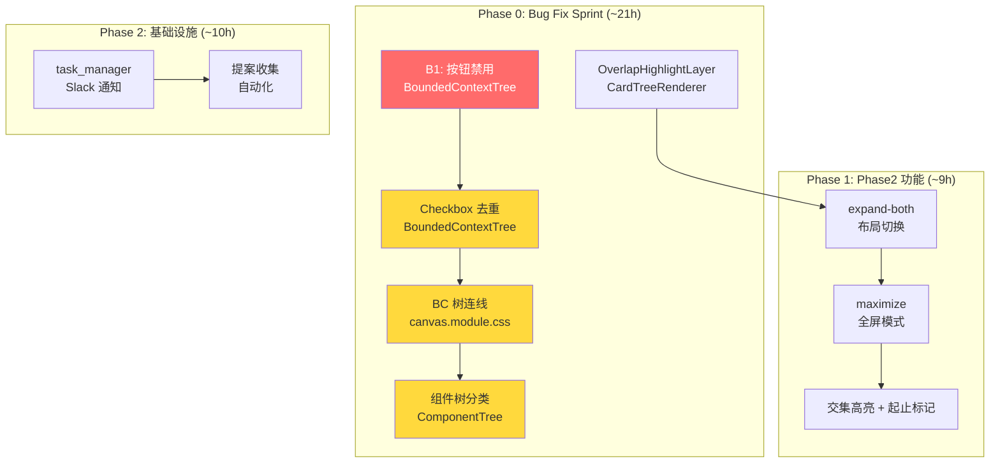

# ADR-XXX: VibeX 下一阶段路线图 — 架构设计

**状态**: Accepted
**日期**: 2026-03-30
**角色**: Architect
**项目**: vibex-next-roadmap-20260330

---

## Context

gstack QA 验证发现多个 P0/P1 bug 影响核心流程，需建立分阶段路线图消除 product-blocking 问题 → 完成 Phase2 → 建立基础设施。

---

## Decision

### 多阶段路线图概览

```mermaid
graph Gantt
    title VibeX 下一阶段路线图
    dateFormat X
    axisFormat %j

    section Phase 0
    Bug Fix Sprint          :done, p0-1, 2026-03-30, 21h

    section Phase 1
    Phase2 功能完成         :active, p1-1, 2026-04-01, 9h

    section Phase 2
    基础设施               :p2-1, 2026-04-03, 10h

    section Phase 3
    UX 增强               :p3-1, 2026-04-05, 12h
```

### Phase 架构总览



---

## Phase 0: Bug Fix Sprint

### 技术方案摘要

| Bug | 文件 | 核心改动 | 工时 |
|-----|------|---------|------|
| B1: 按钮禁用 | `BoundedContextTree.tsx:519` | 移除 `disabled={allConfirmed}` | 1h |
| Checkbox 去重 | `BoundedContextTree.tsx:233-256` | 移除 selection checkbox，统一确认 checkbox | 6h |
| BC 树连线堆叠 | `canvas.module.css:809` | `flex-direction: column` → `row` | 6h |
| 组件树分类 | `ComponentTree.tsx:51-53` | 多维分组判断 + AI flowId 修复 | 6h |
| OverlapHighlightLayer | `CardTreeRenderer.tsx` | 导入并渲染 | 2h |

### B1: 按钮禁用逻辑

```typescript
// BoundedContextTree.tsx — S1.1

// 旧逻辑（有问题）
<button disabled={allConfirmed} onClick={handleContinueToFlow}>
  {allConfirmed ? '✓ 已确认 → 继续到流程树' : '继续 → 流程树'}
</button>

// 新逻辑：移除 disabled，保留显示逻辑
<button onClick={handleContinueToFlow}>
  {allConfirmed ? '✓ 已确认 → 继续到流程树' : '继续 → 流程树'}
</button>
```

### Checkbox 去重方案

> 详见 `vibex-canvas-checkbox-dedup/architecture.md`

### BC 树连线修复方案

> 详见 `vibex-bc-canvas-edge-render/architecture.md`

### 组件树分类修复方案

> 详见 `vibex-component-tree-grouping/architecture.md`

---

## Phase 1: Phase2 功能完成

### F6: expand-both 模式

```typescript
// CanvasPage.tsx

interface CanvasState {
  expandMode: 'normal' | 'expand-both';
  maximize: boolean;
}

// CSS Grid 切换
const gridTemplateColumns = expandMode === 'expand-both'
  ? '1fr 1fr 1fr'  // 三栏并排
  : '1.5fr 2fr 0fr';  // 原始布局
```

### F7: maximize 模式

```typescript
// useEffect 监听快捷键
useEffect(() => {
  const handleKeyDown = (e: KeyboardEvent) => {
    if (e.key === 'F11') {
      e.preventDefault();
      toggleMaximize();
    }
    if (e.key === 'Escape' && maximize) {
      exitMaximize();
    }
  };
  window.addEventListener('keydown', handleKeyDown);
  return () => window.removeEventListener('keydown', handleKeyDown);
}, [maximize]);
```

### F8: 交集高亮

> 详见 `canvas-phase2/architecture.md` — OverlapHighlightLayer

### F9: 起止节点标记

> 详见 `canvas-phase2/architecture.md` — FlowNodeMarkerLayer

---

## Phase 2: 基础设施

### task_manager Slack 通知

> 详见 `task-manager-curl-integration/architecture.md`

### 提案收集自动化

```bash
# 每日提案收集脚本
# scripts/daily-proposal-collection.sh

#!/bin/bash
DATE=$(date +%Y%m%d)
DEST=/root/.openclaw/vibex/docs/proposals/${DATE}/
mkdir -p $DEST

# 汇总各 agent 提案
for agent in dev analyst architect pm tester reviewer; do
    cat /root/.openclaw/workspace-${agent}/FEATURE_REQUESTS.md >> $DEST/${agent}-proposals.md
done

# 生成汇总报告
cat > $DEST/SUMMARY.md << EOF
# 提案汇总 ${DATE}

## 提案列表
...
EOF
```

---

## 工时汇总

| Phase | 内容 | 工时 |
|-------|------|------|
| Phase 0 | Bug Fix Sprint | ~21h |
| Phase 1 | Phase2 功能 | ~9h |
| Phase 2 | 基础设施 | ~10h |
| Phase 3 | UX 增强 | ~12h |
| **合计** | | **~52h (~2.5周)** |

---

## 风险评估

| 风险 | 等级 | 缓解措施 |
|------|------|----------|
| Phase 0 Bug 修复引入新问题 | 中 | 每个 Epic 完成需 gstack 截图验证 |
| AI prompt 改动影响生成质量 | 中 | 保留 fallback 逻辑 |
| 布局改动影响响应式设计 | 中 | 媒体查询覆盖 |
| Phase 3 UX 改动范围不清 | 低 | 需更详细的需求澄清 |

---

## 执行决策

- **决策**: 已采纳
- **执行项目**: vibex-next-roadmap-20260330
- **执行日期**: 2026-03-30
