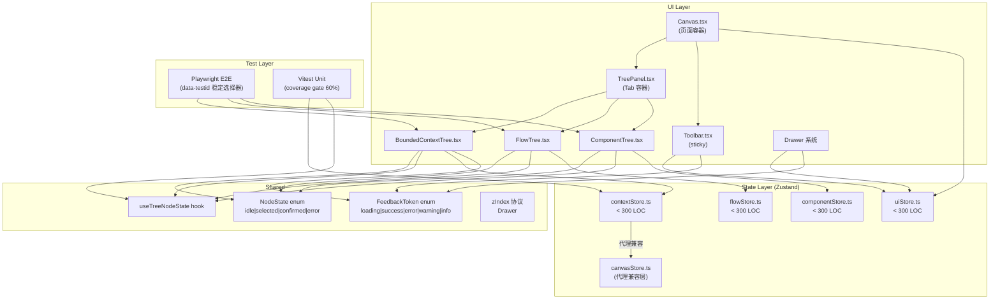
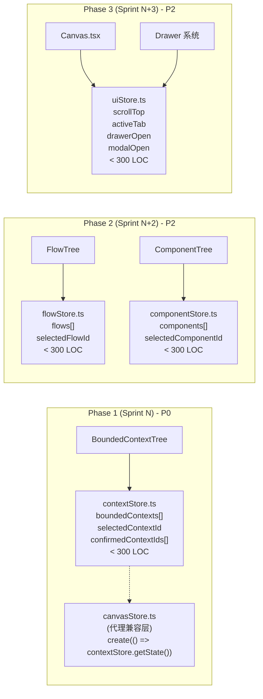
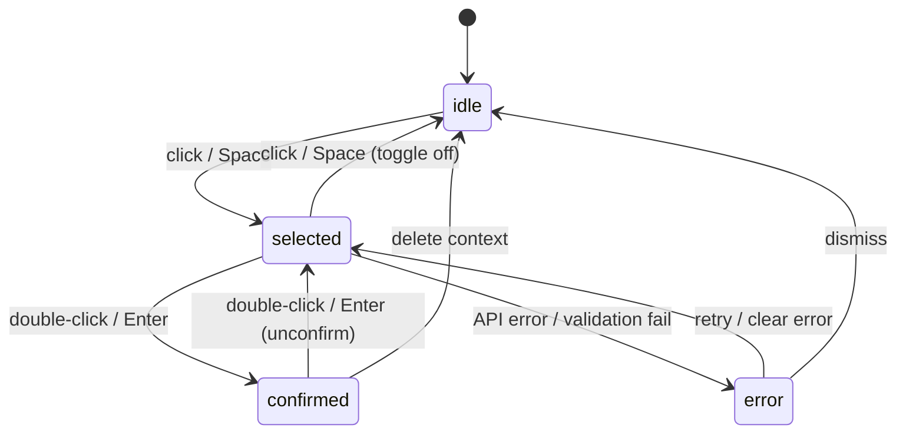
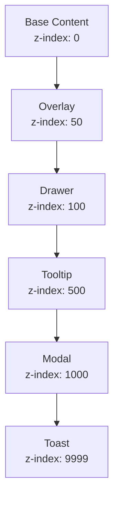
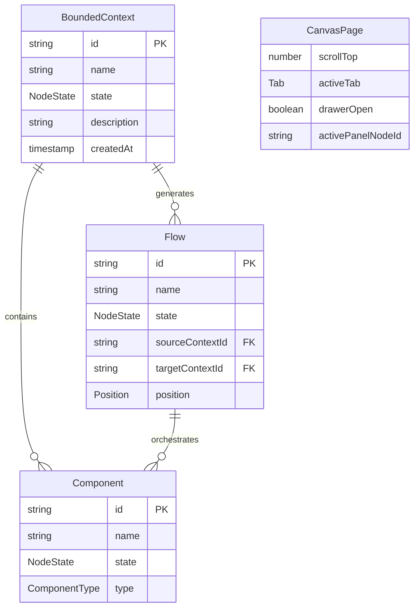

# VibeX 技术债务与体验优化 — 架构设计

**项目**: VibeX
**文档版本**: v1.0
**作者**: Architect Agent
**日期**: 2026-04-02
**状态**: 已采纳
**提案周期**: vibex-pm-proposals-20260402_061709

---

## 1. 执行摘要

本文档定义 VibeX 技术债务清理与 UX 优化项目的技术架构。核心策略：

1. **三树选择模型统一** — 通过共享 `NodeState` 枚举和 `useTreeNodeState` hook 消除三树状态分裂
2. **canvasStore 职责拆分** — 从 1433 行单文件拆分为 4 个领域 store（< 300 行/个）
3. **E2E 稳定性加固** — Playwright 条件等待替代 `waitForTimeout`，`data-testid` 稳定选择器
4. **页面状态规范** — scrollTop 重置 + sticky 工具栏 + z-index 层级协议
5. **交互反馈标准化** — FeedbackToken enum + toast 替代 `window.confirm()`

**协同说明**：本提案与以下已处理提案共享架构组件，避免重复实现：

| 已处理提案 | 共享组件 | 本提案 Epic |
|-----------|---------|-----------|
| analyst-proposals (E1) | `NodeState` 枚举、`useTreeNodeState` hook | Epic 1 |
| analyst-proposals (E2) | canvasStore 拆分模式 | Epic 2 |
| analyst-proposals (E4) | `FeedbackToken` 枚举 | Epic 6 |
| architect-proposals (E3) | z-index 层级协议（Drawer < Tooltip < Modal < Toast） | Epic 5-E5-S3 |

---

## 2. Tech Stack

### 2.1 技术栈版本表

| 技术 | 版本 | 现状 | 目标 | 理由 |
|------|------|------|------|------|
| **React** | 18.x | 18.2.0 | 不升级 | 稳定，无需升级 |
| **TypeScript** | 5.x | ~5.0 | 5.x（strict 渐进） | 已有 TS 基础设施，渐进启用 strict |
| **Zustand** | 4.x | 4.4.x | 保持 | 多 store 拆分后仍适用，API 稳定 |
| **Playwright** | 1.40+ | 1.40.x | 升级到最新 | `waitForResponse` 等条件等待需要 1.40+ |
| **Vitest** | 1.x | 未使用 | 1.5+ | 配合 Vite 项目，单元测试替代 Jest |
| **React Router** | 6.x | 6.x | 保持 | scrollTop = 0 需要路由层配合 |
| **CSS Modules** | — | 已使用 | 扩展 | 每个组件独立 CSS Module，消除 canvas.module.css 耦合 |
| **msw** | 2.x | 未使用 | 2.3+ | E2E 测试 mock API，减少外部依赖 |
| **npm overrides** | — | 未使用 | package.json 字段 | DOMPurify 间接依赖版本固定 |

### 2.2 依赖管理

```json
// package.json
{
  "overrides": {
    "dompurify": "3.3.3"
  },
  "scripts": {
    "type-check": "tsc --noEmit",
    "type-check:strict": "tsc --strict --noEmit",
    "coverage:check": "vitest run --coverage --coverage.thresholds.statements=60",
    "e2e": "playwright test",
    "e2e:headed": "playwright test --headed"
  }
}
```

---

## 3. Architecture Diagrams

### 3.1 系统整体架构



### 3.2 canvasStore 拆分架构



### 3.3 三树状态机



### 3.4 z-index 层级协议



---

## 4. API Definitions

### 4.1 Shared Types

```typescript
// src/types/NodeState.ts
export enum NodeState {
  idle = 'idle',
  selected = 'selected',
  confirmed = 'confirmed',
  error = 'error',
}

// src/types/FeedbackToken.ts
export enum FeedbackToken {
  loading = 'loading',
  success = 'success',
  error = 'error',
  warning = 'warning',
  info = 'info',
}

// src/types/canvas/index.ts
export interface BoundedContext {
  id: string;
  name: string;
  state: NodeState;
  description?: string;
  createdAt: Date;
}

export interface Flow {
  id: string;
  name: string;
  state: NodeState;
  sourceContextId?: string;
  targetContextId?: string;
  position?: { x: number; y: number };
}

export interface Component {
  id: string;
  name: string;
  state: NodeState;
  type: 'service' | 'repository' | 'controller' | 'entity';
}

export interface UIState {
  scrollTop: number;
  activeTab: 'context' | 'flow' | 'component';
  drawerOpen: boolean;
  modalOpen: boolean;
  activePanelNodeId: string | null;
}
```

### 4.2 Store Interfaces

```typescript
// src/stores/contextStore.ts
export interface ContextStore {
  contexts: BoundedContext[];
  selectedContextId: string | null;
  confirmedContextIds: string[];
  addContext: (context: Omit<BoundedContext, 'id' | 'state' | 'createdAt'>) => void;
  removeContext: (id: string) => void;
  selectContext: (id: string | null) => void;
  confirmContext: (id: string) => void;
  unconfirmContext: (id: string) => void;
  updateContextState: (id: string, state: NodeState) => void;
  getState: () => ContextStoreSnapshot;
}

export type ContextStoreSnapshot = Pick<ContextStore, 'contexts' | 'selectedContextId' | 'confirmedContextIds'>;

// src/stores/flowStore.ts
export interface FlowStore {
  flows: Flow[];
  selectedFlowId: string | null;
  addFlow: (flow: Omit<Flow, 'id' | 'state'>) => void;
  removeFlow: (id: string) => void;
  selectFlow: (id: string | null) => void;
  confirmFlow: (id: string) => void;
  updateFlowPosition: (id: string, position: { x: number; y: number }) => void;
  getState: () => FlowStoreSnapshot;
}

export type FlowStoreSnapshot = Pick<FlowStore, 'flows' | 'selectedFlowId'>;

// src/stores/componentStore.ts
export interface ComponentStore {
  components: Component[];
  selectedComponentId: string | null;
  addComponent: (component: Omit<Component, 'id' | 'state'>) => void;
  removeComponent: (id: string) => void;
  selectComponent: (id: string | null) => void;
  confirmComponent: (id: string) => void;
  getState: () => ComponentStoreSnapshot;
}

export type ComponentStoreSnapshot = Pick<ComponentStore, 'components' | 'selectedComponentId'>;

// src/stores/uiStore.ts
export interface UIStore {
  scrollTop: number;
  activeTab: 'context' | 'flow' | 'component';
  drawerOpen: boolean;
  drawerContent: DrawerContent | null;
  modalOpen: boolean;
  activePanelNodeId: string | null;
  setScrollTop: (value: number) => void;
  resetScrollTop: () => void;
  setActiveTab: (tab: UIStore['activeTab']) => void;
  openDrawer: (content: DrawerContent) => void;
  closeDrawer: () => void;
  setModalOpen: (open: boolean) => void;
  setActivePanelNodeId: (id: string | null) => void;
  resetPanelState: () => void;
}

export type DrawerContent =
  | { type: 'context-detail'; contextId: string }
  | { type: 'flow-detail'; flowId: string }
  | { type: 'settings' };
```

### 4.3 Hook APIs

```typescript
// src/hooks/useTreeNodeState.ts
export interface UseTreeNodeStateOptions<T extends { id: string; state: NodeState }> {
  items: T[];
  onStateChange?: (id: string, newState: NodeState, prevState: NodeState) => void;
}

export interface UseTreeNodeStateReturn<T> {
  getItemState: (id: string) => NodeState;
  handleClick: (id: string, event: React.MouseEvent) => void;
  handleDoubleClick: (id: string, event: React.MouseEvent) => void;
  handleKeyDown: (id: string, event: React.KeyboardEvent) => void;
  bulkConfirm: (ids: string[]) => void;
  bulkUnconfirm: (ids: string[]) => void;
}

export function useTreeNodeState<T extends { id: string; state: NodeState }>(
  options: UseTreeNodeStateOptions<T>
): UseTreeNodeStateReturn<T>;

// src/hooks/useScrollReset.ts
export function useScrollReset(containerRef: React.RefObject<HTMLElement>): void;

// src/hooks/useToast.ts
export interface ToastOptions {
  type: FeedbackToken;
  message: string;
  duration?: number;
  undoAction?: () => void;
}

export function useToast(): {
  toast: (options: ToastOptions) => void;
  success: (message: string) => void;
  error: (message: string) => void;
  warning: (message: string) => void;
  info: (message: string) => void;
  confirm: (message: string, onConfirm: () => void) => void;
};
```

### 4.4 E2E Test Selectors

```typescript
// tests/e2e/helpers/selectors.ts
export const testIds = {
  contextTreeNode: (id: string) => `[data-testid="tree-node-context-${id}"]`,
  flowTreeNode: (id: string) => `[data-testid="tree-node-flow-${id}"]`,
  componentTreeNode: (id: string) => `[data-testid="tree-node-component-${id}"]`,
  checkbox: (treeType: 'context' | 'flow' | 'component', nodeId: string) =>
    `[data-testid="tree-node-${treeType}-${nodeId}"] [data-testid="checkbox"]`,
  confirmedBadge: (treeType: 'context' | 'flow' | 'component', nodeId: string) =>
    `[data-testid="tree-node-${treeType}-${nodeId}"] [data-testid="confirmed-badge"]`,
  toolbar: '[data-testid="canvas-toolbar"]',
  drawer: '[data-testid="drawer"]',
  toast: '[data-testid="toast"]',
};
```

---

## 5. Data Models

### 5.1 Core Entity Relationships



### 5.2 NodeState Transition Table

| Current State | Trigger | Next State | Side Effect |
|--------------|---------|-----------|------------|
| `idle` | click/Space | `selected` | update `selectedId` |
| `selected` | click/Space | `idle` | clear `selectedId` |
| `selected` | dblclick/Enter | `confirmed` | add to `confirmedIds[]`, show green ✓ |
| `confirmed` | dblclick/Enter | `selected` | remove from `confirmedIds[]` |
| `selected` | API error | `error` | show error state, enable retry |
| `error` | retry | `selected` | clear error |
| `error` | dismiss | `idle` | clear error |

---

## 6. Testing Strategy

### 6.1 Test Framework & Coverage Requirements

| 测试层 | 框架 | 覆盖率目标 | 执行时机 |
|--------|------|-----------|---------|
| **单元测试** | Vitest | Statements > 60% (P2: > 80%) | pre-commit hook |
| **集成测试** | Vitest + RTL | 关键路径 100% | CI |
| **E2E 测试** | Playwright | 核心用户旅程 100% | CI (3 consecutive passes) |
| **视觉回归** | Playwright screenshot | 关键页面 | PR review |

**覆盖率门禁**: `vitest run --coverage --coverage.thresholds.statements=60`

### 6.2 Example Unit Tests

```typescript
// src/__tests__/stores/contextStore.test.ts
import { describe, it, expect, beforeEach } from 'vitest';
import { createContextStore } from '../../stores/contextStore';
import { NodeState } from '../../types/NodeState';

describe('contextStore — E2-S1', () => {
  let store: ReturnType<typeof createContextStore>;

  beforeEach(() => { store = createContextStore(); });

  it('confirmContext adds id to confirmedContextIds', () => {
    store.getState().addContext({ name: 'ctx1', description: 'test' });
    const ctxId = store.getState().contexts[0].id;
    store.getState().confirmContext(ctxId);
    expect(store.getState().confirmedContextIds).toContain(ctxId);
  });

  it('addContext initializes with idle state', () => {
    store.getState().addContext({ name: 'new-context', description: 'test' });
    expect(store.getState().contexts[0].state).toBe(NodeState.idle);
  });
});

// src/__tests__/hooks/useTreeNodeState.test.ts
describe('useTreeNodeState — E1-S4', () => {
  it('handleClick transitions idle → selected', () => {
    const items = [{ id: '1', state: NodeState.idle }];
    const { handleClick } = renderHook(() => useTreeNodeState({ items }));
    const mockEvent = { stopPropagation: vi.fn() } as any;
    handleClick('1', mockEvent);
    expect(mockEvent.stopPropagation).toHaveBeenCalled();
  });

  it('handleDoubleClick transitions selected → confirmed', () => {
    const items = [{ id: '1', state: NodeState.selected }];
    const { handleDoubleClick } = renderHook(() => useTreeNodeState({ items }));
    handleDoubleClick('1', {} as any);
  });
});

// src/__tests__/stores/uiStore.test.ts
describe('uiStore — E5-S1, E5-S4', () => {
  it('resetScrollTop always sets scrollTop to 0', () => {
    store.getState().setScrollTop(500);
    store.getState().resetScrollTop();
    expect(store.getState().scrollTop).toBe(0);
  });

  it('resetPanelState clears activePanelNodeId', () => {
    store.getState().setActivePanelNodeId('ctx-123');
    store.getState().resetPanelState();
    expect(store.getState().activePanelNodeId).toBeNull();
  });
});
```

### 6.3 Example E2E Tests

```typescript
// tests/e2e/journey-multi-select.spec.ts — E1-S2, E1-S3, E1-S4
test.describe('Three-tree Multi-Select — E1-S5', () => {
  test.beforeEach(async ({ page }) => { await page.goto('/canvas'); });

  test('checkbox appears before badge in all three trees', async ({ page }) => {
    const ctxCheckbox = page.locator(testIds.checkbox('context', '1'));
    const ctxBadge = page.locator(testIds.confirmedBadge('context', '1'));
    await expect(ctxCheckbox).toBeVisible();
    const cbBox = await ctxCheckbox.boundingBox();
    const bdBox = await ctxBadge.boundingBox();
    expect(cbBox!.right).toBeLessThanOrEqual(bdBox!.left);
  });

  test('no yellow border on unconfirmed nodes', async ({ page }) => {
    const node = page.locator(testIds.contextTreeNode('1'));
    await expect(node).not.toHaveClass(/nodeUnconfirmed/);
  });

  test('unified click/dblclick behavior across three trees', async ({ page }) => {
    await page.locator(testIds.contextTreeNode('1')).click();
    await expect(page.locator(testIds.contextTreeNode('1')))
      .toHaveAttribute('data-state', 'selected');
    await page.locator(testIds.contextTreeNode('1')).dblclick();
    await expect(page.locator(testIds.contextTreeNode('1')))
      .toHaveAttribute('data-state', 'confirmed');
    await expect(page.locator(testIds.confirmedBadge('context', '1'))).toBeVisible();
  });
});

// tests/e2e/canvas-page-state.spec.ts — E5-S1, E5-S2
test.describe('Canvas Page State — E5-S1, E5-S2', () => {
  test('scrollTop resets to 0 on page navigation', async ({ page }) => {
    await page.goto('/canvas');
    await page.evaluate(() => window.scrollTo(0, 500));
    await page.goto('/home');
    await page.goto('/canvas');
    const scrollTop = await page.evaluate(() => document.documentElement.scrollTop);
    expect(scrollTop).toBe(0);
  });

  test('toolbar remains visible on scroll (sticky)', async ({ page }) => {
    await page.goto('/canvas');
    const toolbar = page.locator(testIds.toolbar);
    await page.evaluate(() => window.scrollTo(0, 1000));
    const box = await toolbar.boundingBox();
    expect(box).not.toBeNull();
    expect(box!.y).toBeGreaterThanOrEqual(0);
  });
});

// tests/e2e/feedback-standard.spec.ts — E6-S1, E6-S2
test.describe('Feedback Standard — E6-S1, E6-S2', () => {
  test('no window.confirm — destructive action shows toast', async ({ page }) => {
    await page.goto('/canvas');
    await page.getByRole('button', { name: '删除' }).click();
    await expect(page.locator(testIds.toast)).toBeVisible();
  });

  test('dragging state has opacity 0.7 + scale 0.98', async ({ page }) => {
    await page.goto('/canvas');
    const node = page.locator(testIds.contextTreeNode('1'));
    await node.hover();
    await page.mouse.down();
    const opacity = await node.evaluate(el => window.getComputedStyle(el).opacity);
    expect(opacity).toBe('0.7');
  });
});
```

### 6.4 CI Stability Gate

```yaml
# .github/workflows/ci.yml (E3-S4)
e2e-stable-gate:
  strategy:
    matrix:
      attempt: [1, 2, 3]
  steps:
    - run: npm run e2e
  # All 3 matrix jobs must pass for gate green
  # Even 1 failure → CI fails
```

---

## 7. Performance Impact Assessment

### 7.1 Bundle Size Impact

| 变更 | 预期影响 | 理由 |
|------|---------|------|
| 新增 `NodeState` 枚举 | < 1 KB gzip | 枚举体积极小 |
| 新增 `useTreeNodeState` hook | < 2 KB gzip | 纯逻辑 hook，无依赖树 |
| 新增 `FeedbackToken` 枚举 | < 1 KB gzip | 枚举体积极小 |
| canvasStore 拆分 | 0 或轻微增加 | 代理层增加极少量，但按需加载改善 |
| CSS 模块拆分 | 0 或轻微减少 | 路由级 CSS 按需加载 |
| Toast 系统新增 | ~5-10 KB gzip | react-hot-toast 或自实现 |

**总体 bundle 影响**: 预计增加 < 20 KB gzip，视为可接受。

### 7.2 Runtime Performance

| 变更 | 性能影响 | 缓解措施 |
|------|---------|---------|
| 多 store 订阅 | 轻微增加 | 按组件订阅最小 state，Zustand shallow 比较 |
| scrollTop reset | 0 | 原生 DOM 操作，同步完成 |
| Toast 渲染 | 轻微增加 | 使用 portal，CSS transform 动画 |
| `useTreeNodeState` per node | 轻微 | React.memo 包装，id 比较优化 |

### 7.3 E2E Test Runtime

| 指标 | 当前基线 | 预期 | 变化 |
|------|---------|------|------|
| E2E 单次运行时间 | ~10 min | ~10 min | 0 |
| Flaky 率 | ~20% | < 5% | ↓↓ |
| CI 3次连续通过率 | ~51% | > 95% | ↑↑ |

---

## 8. ADR (Architecture Decision Records)

### ADR-001: NodeState 枚举作为三树共享类型

**Status**: Accepted | **Date**: 2026-04-02

**Context**: 三树各自维护独立状态机实现，checkbox 视觉不一致，交互行为分裂。

**Decision**:
- 创建 `src/types/NodeState.ts`，定义 `idle | selected | confirmed | error` 四个状态
- 三树组件均从同一文件 import
- 状态变更通过统一的 `useTreeNodeState` hook 封装

**Consequences**:
- ✅ 状态语义统一，消除视觉分裂
- ✅ 状态变更逻辑集中，易于测试
- ⚠️ 需要协调三树 PR 同时合并
- ⚠️ 历史分支需要 rebase 或 cherry-pick

### ADR-002: canvasStore 按领域拆分为四个子 store

**Status**: Accepted | **Date**: 2026-04-02

**Context**: canvasStore 单文件 1433 行，混合四类状态，所有组件直接依赖导致无法独立测试。

**Decision**:
- 拆分为 `contextStore` / `flowStore` / `componentStore` / `uiStore`
- 每个 store < 300 行（可测试性边界）
- Phase1 使用代理模式保持 API 兼容
- 逐步迁移组件引用，最终移除代理层

**Consequences**:
- ✅ 单个 store 可独立测试
- ✅ 按需加载减少初始 bundle
- ✅ 每个文件 < 300 行，代码审查聚焦
- ⚠️ Phase1-3 需维护代理兼容层
- ⚠️ 状态迁移过程可能短暂不一致

### ADR-003: E2E 使用 data-testid 稳定选择器

**Status**: Accepted | **Date**: 2026-04-02

**Context**: E2E 测试依赖 CSS 类名和 XPath，通过率 ~80%。CSS 重构或组件结构调整导致测试失败。

**Decision**:
- 所有可交互元素添加 `data-testid`（格式: `tree-node-{treeType}-{id}`）
- 替换所有 `waitForTimeout` 为 Playwright 条件等待 API
- 使用 `waitForSelector` / `waitForResponse` / `waitForLoadState`

**Consequences**:
- ✅ 选择器稳定性大幅提升，通过率 > 95%
- ✅ 测试失败时更易定位
- ⚠️ 需要为所有新组件补充 data-testid（纳入 DoD）
- ⚠️ data-testid 命名需规范（通过 testIds helper 统一）

### ADR-004: Toast 替代 window.confirm()

**Status**: Accepted | **Date**: 2026-04-02

**Context**: `window.confirm()` 阻塞主线程，打断用户流程，无法定制样式。

**Decision**:
- 删除所有 `window.confirm()` 调用
- 使用 `FeedbackToken` 枚举 + toast 系统
- 高危操作（删除等）：toast + 可选 undo 操作

**Consequences**:
- ✅ 用户体验更流畅，不阻塞 UI
- ✅ 支持 undo 操作（后悔药）
- ⚠️ 需要统一 toast 系统接入

### ADR-005: z-index 层级协议

**Status**: Accepted (inherited from architect-proposals E3) | **Date**: 2026-04-02

**Context**: 多 Drawer/Modal/Toast 并存时 z-index 冲突，覆盖关系混乱。

**Decision**:
- 层级定义: `Drawer(100) < Tooltip(500) < Modal(1000) < Toast(9999)`
- 使用 CSS 变量: `--z-drawer`, `--z-tooltip`, `--z-modal`, `--z-toast`
- 禁止硬编码 z-index 值

**Consequences**:
- ✅ 层级清晰，无覆盖冲突
- ✅ 全局修改一处即可
- ⚠️ 需要全局搜索替换硬编码 z-index

---

## 9. File Change Manifest

### 新增文件

```
src/types/NodeState.ts                        # E1-S1
src/types/FeedbackToken.ts                     # E6-S3
src/types/canvas/index.ts                      # E10-S2
src/hooks/useTreeNodeState.ts                  # E1-S4
src/hooks/useScrollReset.ts                    # E5-S1
src/hooks/useToast.ts                          # E6-S4
src/stores/contextStore.ts                     # E2-S1 (< 300 LOC)
src/stores/flowStore.ts                        # E2-S2 (< 300 LOC)
src/stores/componentStore.ts                   # E2-S3 (< 300 LOC)
src/stores/uiStore.ts                          # E2-S4 (< 300 LOC)
src/components/BoundedContextTree/BoundedContextTree.module.css   # E7-S1
src/components/FlowTree/FlowTree.module.css                     # E7-S2
src/components/ComponentTree/ComponentTree.module.css            # E7-S3
docs/adr/ADR-001-checkbox-semantics.md         # E11-S1
docs/canvas-information-architecture.md        # E5-S5
docs/design-system/feedback-tokens.md          # E6-S3
docs/templates/prd-template.md                  # E9-S1
docs/process/definition-of-done.md             # E9-S3
tests/e2e/journey-create-context.spec.ts       # E8-S1
tests/e2e/journey-generate-flow.spec.ts       # E8-S2
tests/e2e/journey-multi-select.spec.ts         # E8-S3
tests/e2e/helpers/selectors.ts                 # E3-S3
```

### 修改文件

```
src/stores/canvasStore.ts                      # E2 (代理兼容层)
src/components/BoundedContextTree/*            # E1-S2, E1-S3, E1-S4, E7-S1
src/components/FlowTree/*                      # E1-S2, E1-S3, E1-S4, E7-S2
src/components/ComponentTree/*                 # E1-S2, E1-S3, E1-S4, E7-S3
src/components/Canvas/Canvas.tsx                # E5-S1, E5-S2, E2-S4
src/components/TreePanel/TreePanel.tsx          # E5-S4
src/components/Drawer/*                        # E5-S3, E6-S1
src/components/Toolbar/Toolbar.tsx             # E5-S2, E6-S2
canvas.module.css                               # E7-S4 (1420行 → <800行)
package.json                                    # E3-S1, E4-S1, E8-S4
tsconfig.json                                   # E3-S1
CONTRIBUTING.md                                 # E6-S5, E9-S3, E11-S2
playwright.config.ts                           # E3-S3
.github/workflows/ci.yml                        # E3-S4
```

---

## 10. 执行决策

- **决策**: 已采纳
- **执行项目**: vibex-pm-proposals-20260402_061709
- **执行日期**: 2026-04-02

| Epic | 状态 | 关联子任务 |
|------|------|-----------|
| Epic 1: 三树选择模型统一 | 已采纳 | E1-S1 ~ E1-S5 |
| Epic 2: canvasStore 拆分 | 已采纳 | E2-S1 ~ E2-S5 |
| Epic 3: E2E 测试稳定性 | 已采纳 | E3-S1 ~ E3-S4 |
| Epic 4: DOMPurify 安全 | 已采纳 | E4-S1 |
| Epic 5: Canvas 页面 IA | 已采纳 | E5-S1 ~ E5-S5 |
| Epic 6: 交互反馈标准化 | 已采纳 | E6-S1 ~ E6-S5 |
| Epic 7: CSS 模块拆分 | 已采纳 | E7-S1 ~ E7-S5 |
| Epic 8: 测试覆盖率提升 | 已采纳 | E8-S1 ~ E8-S6 |
| Epic 9: PRD/Story 规范 | 已采纳 | E9-S1 ~ E9-S3 |
| Epic 10: TypeScript strict | 已采纳 | E10-S1 ~ E10-S3 |
| Epic 11: ADR 规范文档 | 已采纳 | E11-S1 ~ E11-S2 |
