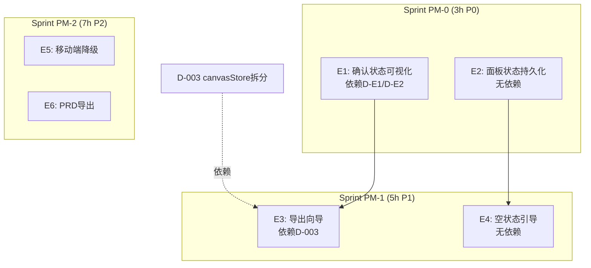

# Architecture: VibeX PM 提案 — 产品体验改进

**项目**: vibex-pm-proposals-20260402_201318
**版本**: v1.0
**日期**: 2026-04-02
**架构师**: architect
**状态**: ✅ 设计完成

---

## 执行摘要

6 项 PM 体验改进：确认状态可视化、面板持久化、导出向导、空状态引导、移动端降级、PRD 导出。

**总工时**: 15h

---

## 1. Tech Stack

React + TypeScript + CSS Modules（无新依赖）

---

## 2. Sprint 架构



---

## 3. Epic 详细方案

### E1: 确认状态可视化（2h，依赖 D-E1/E2）

```css
/* 未确认节点 */
.nodeUnconfirmed {
  border: 2px dashed var(--color-warning);
  opacity: 0.8;
}

/* 已确认节点 */
.nodeConfirmed {
  border: 2px solid var(--color-success);
}
```

工具栏添加筛选快捷操作：`[全部] [已确认] [未确认]`

### E2: 面板状态持久化（1h，无依赖）

```typescript
// localStorage 存储
const PANEL_KEY = 'vibex-panel-collapsed';
const getPanelState = () => JSON.parse(localStorage.getItem(PANEL_KEY) || '{}');
const setPanelState = (state) => localStorage.setItem(PANEL_KEY, JSON.stringify(state));
```

首次访问默认全部展开。

### E3: 导出向导（3h，依赖 D-003）

Step 1: 选择导出节点
Step 2: 配置导出选项
Step 3: 确认并导出

必填项红色星号，导出过程进度条，成功/失败明确提示。

### E4: 空状态引导（2h，无依赖）

```tsx
{!hasData && (
  <GuideCard>
    <h2>欢迎使用 VibeX Canvas</h2>
    <ol>
      <li>从左侧添加限界上下文</li>
      <li>定义业务流程</li>
      <li>映射组件结构</li>
    </ol>
    <Button onClick={startModeling}>开始建模</Button>
  </GuideCard>
)}
```

有历史数据时隐藏引导卡片。

### E5: 移动端降级（3h）

```typescript
const isMobile = /iPhone|iPad|iPod|Android/i.test(navigator.userAgent);
if (isMobile) return <MobileDegradedView />;
```

友好提示：使用桌面浏览器，提供只读预览入口。

### E6: PRD 导出（4h）

导出 Markdown 格式，包含：
- 限界上下文图（Mermaid）
- 业务流程说明
- 组件清单（表格）

---

## 4. 性能影响

| Epic | 影响 |
|------|------|
| E1 | 无（CSS 变更）|
| E2 | 无（localStorage O(1)）|
| E3 | 无 |
| E4 | 无（有数据时不渲染）|
| E5 | 无 |
| E6 | 无 |

---

## ADR-001: localStorage 替代 store 持久化

**状态**: Accepted

**决策**: E2 面板状态用 localStorage 实现（不依赖 canvasStore 拆分），可提前独立实施。

---

## 执行决策

- **决策**: 已采纳
- **执行项目**: vibex-pm-proposals-20260402_201318
- **执行日期**: 2026-04-02
