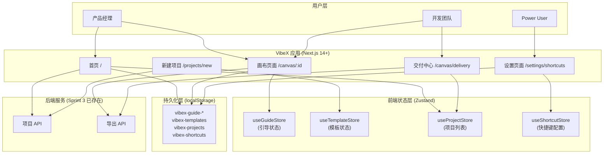
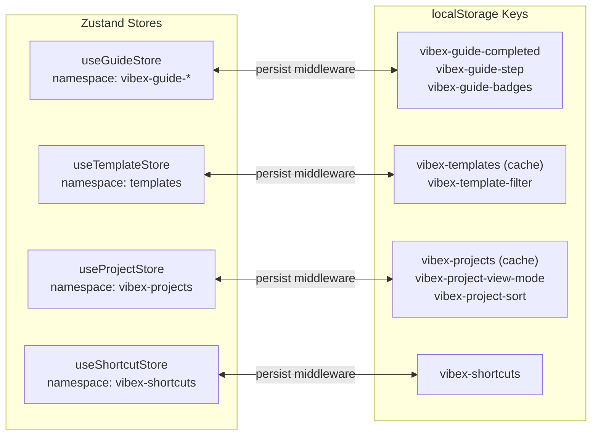

# 架构设计文档: VibeX 产品体验增强提案集

**项目**: vibex-pm-proposals-20260403_024652
**版本**: 1.0
**日期**: 2026-04-03
**角色**: Solution Architect
**状态**: 设计完成

---

## 1. 技术栈与选型

### 1.1 技术栈总览

| 层级 | 技术选型 | 版本 | 选型理由 |
|------|---------|------|---------|
| 框架 | Next.js | 14+ | App Router 支持、SSR/SSG 灵活切换、良好的 TypeScript 支持 |
| UI 框架 | React | 18+ | 组件化生态成熟、18 Concurrent Features 支持动画场景 |
| 状态管理 | Zustand | 4+ | 轻量、支持 middleware (persist)、与 localStorage 天然集成 |
| 样式方案 | Tailwind CSS | 3+ | PRD 约束，原子化样式，快速响应式开发 |
| 动画方案 | Framer Motion | 11+ | 引导高亮、徽章动画、Tab 切换动效 |
| 测试框架 | Vitest + RTL + Playwright | 最新 | PRD 约束的测试栈，与 Vite 生态集成 |
| 路由 | Next.js App Router | — | 交付中心独立路由 `/canvas/delivery` |
| 存储 | localStorage | — | 引导状态、快捷键配置；PRD 约束单项 ≤ 5MB |
| 导出 | 现有 ExportMenu 扩展 | — | 复用现有导出能力，减少重复建设 |

### 1.2 技术约束

- **localStorage 容量限制**: 单项 ≤ 5MB，预估本次所有特性数据量 < 500KB，无风险
- **导出 API 稳定性**: E3 依赖导出 API 稳定，需 dev 在 Sprint 3 交付后确认
- **Sprint 依赖**: E1 引导依赖 Sprint 3 E1 Checkbox 修复完成；E5 依赖 Sprint 3 E4 快捷键完成

---

## 2. 架构图

### 2.1 系统上下文图 (C4 L1)



### 2.2 组件架构图 (C4 L2)

```mermaid
graph TB
    subgraph "App Shell"
        App["App Root (layout.tsx)"]
        Router["Next.js App Router"]
        Providers["Providers (Theme/Store)"]
    end

    subgraph "共享组件库 components/ui"
        Modal["Modal / Dialog"]
        Card["Card"]
        Button["Button (variants)"]
        TabBar["TabBar"]
        Tooltip["Tooltip"]
        Badge["Badge / Chip"]
        Dropdown["DropdownMenu"]
    end

    subgraph "首页 / (E4)"
        HomePage["pages/index.tsx"]
        HeroSection["HeroSection<br/>(E4-S2: 快速开始入口)"]
        QuickStartActions["QuickStartActions"]
        RecentProjectsCarousel["RecentProjectsCarousel<br/>(E4-S1)"]
        ProjectGrid["ProjectGrid & ProjectList<br/>(E4-S3: 视图切换)"]
        ProjectCard["ProjectCard<br/>(E4-S4: 悬停操作)"]
        ViewToggle["ViewToggle: Grid/List"]
        FilterTabs["FilterTabs: 状态筛选"]
        SortDropdown["SortDropdown"]
        EmptyState["EmptyState<br/>(E4-S5)"]
    end

    subgraph "画布 /canvas/:id (E1)"
        CanvasPage["pages/canvas/[id]/index.tsx"]
        Toolbar["Toolbar (含交付中心入口)"]
        NewUserGuide["NewUserGuide<br/>(E1: 引导层)"]
        GuideTooltip["GuideTooltip<br/>(E1-S2: 单步气泡)"]
        GuideOverlay["GuideOverlay<br/>(E1: 全屏遮罩)"]
        GuideHighlightMask["GuideHighlightMask<br/>(E1: 高亮遮罩)"]
        MilestoneBadge["MilestoneBadge<br/>(E1-S3: 成就徽章)"]
    end

    subgraph "交付中心 /canvas/delivery (E3)"
        DeliveryPage["pages/canvas/delivery/index.tsx"]
        DeliveryTabBar["DeliveryTabBar (4个Tab)"]
        ContextExportTab["ContextExportTab (E3-S2)"]
        FlowExportTab["FlowExportTab (E3-S3)"]
        ComponentExportTab["ComponentExportTab (E3-S4)"]
        PrdExportTab["PrdExportTab (E3-S5)"]
        BatchExportBar["BatchExportBar (E3-S6)"]
    end

    subgraph "新建项目 /projects/new (E2)"
        NewProjectPage["pages/projects/new/index.tsx"]
        TemplateSelector["TemplateSelector (E2)"]
        TemplateCard["TemplateCard (E2-S2)"]
        TemplatePreview["TemplatePreview Modal (E2-S3)"]
        CategoryFilter["CategoryFilter (E2-S4)"]
    end

    subgraph "设置 /settings (E5)"
        SettingsPage["pages/settings/index.tsx"]
        ShortcutsTab["ShortcutsTab (E5)"]
        ShortcutCategory["ShortcutCategory (4类)"]
        ShortcutItem["ShortcutItem (可编辑行)"]
        ConflictWarning["ConflictWarning (E5-S3)"]
        ResetDefaultsBtn["ResetDefaultsBtn (E5-S5)"]
    end

    App --> Router
    Router --> HomePage
    Router --> CanvasPage
    Router --> DeliveryPage
    Router --> SettingsPage
    Router --> NewProjectPage

    HomePage --> HeroSection
    HomePage --> QuickStartActions
    HomePage --> RecentProjectsCarousel
    HomePage --> ProjectGrid
    ProjectGrid --> ProjectCard
    HomePage --> FilterTabs
    HomePage --> SortDropdown
    HomePage --> EmptyState

    CanvasPage --> Toolbar
    CanvasPage --> NewUserGuide
    NewUserGuide --> GuideTooltip
    NewUserGuide --> GuideOverlay
    NewUserGuide --> GuideHighlightMask
    NewUserGuide --> MilestoneBadge

    DeliveryPage --> DeliveryTabBar
    DeliveryTabBar --> ContextExportTab
    DeliveryTabBar --> FlowExportTab
    DeliveryTabBar --> ComponentExportTab
    DeliveryTabBar --> PrdExportTab
    DeliveryPage --> BatchExportBar

    NewProjectPage --> TemplateSelector
    TemplateSelector --> TemplateCard
    TemplateSelector --> TemplatePreview
    TemplateSelector --> CategoryFilter

    SettingsPage --> ShortcutsTab
    ShortcutsTab --> ShortcutCategory
    ShortcutCategory --> ShortcutItem
    ShortcutItem --> ConflictWarning
    ShortcutsTab --> ResetDefaultsBtn
```



### 2.3 状态管理架构



---

## 3. 核心数据模型

### 3.1 引导系统 (E1: New User Guide)

```typescript
// src/types/guide.ts

/** 引导状态 */
interface GuideState {
  status: 'unseen' | 'in_progress' | 'completed' | 'skipped';
  currentStep: number;         // 0-based，当前步骤索引
  completedSteps: number[];    // 已完成的步骤索引
  badges: Badge[];             // 获得的徽章
  startedAt?: number;         // 开始时间戳
  completedAt?: number;        // 完成时间戳
}

/** 成就徽章 */
interface Badge {
  id: 'context-explorer' | 'flow-designer' | 'component-architect' | 'ddd-novice';
  name: string;               // 展示名称
  description: string;        // 徽章描述
  earnedAt: number;           // 获得时间戳
}

/** 引导步骤定义 */
interface GuideStep {
  id: number;
  phase: 'context' | 'flow' | 'component';
  targetSelector: string;     // CSS selector，目标 DOM 元素
  title: string;              // 步骤标题
  description: string;        // 引导说明
  highlightRect?: DOMRect;   // 运行时计算的高亮区域
  action?: 'click' | 'input' | 'hover' | 'none';
  validator?: () => boolean; // 步骤完成验证
  badgeOnComplete?: Badge['id'];
}

/** 预定义引导步骤 (lib/guide-steps.ts) */
const GUIDE_STEPS: GuideStep[] = [
  {
    id: 0,
    phase: 'context',
    targetSelector: '[data-testid="add-context-btn"]',
    title: '添加你的第一个限界上下文',
    description: '点击"添加上下文"按钮，创建你的第一个限界上下文',
    action: 'click',
    badgeOnComplete: 'context-explorer',
  },
  {
    id: 1,
    phase: 'context',
    targetSelector: '[data-testid="context-name-input"]',
    title: '命名你的上下文',
    description: '输入上下文名称，例如"商品域"或"用户域"',
    action: 'input',
  },
  {
    id: 2,
    phase: 'flow',
    targetSelector: '[data-testid="add-flow-btn"]',
    title: '创建业务流程',
    description: '现在添加你的第一个业务流程',
    action: 'click',
    badgeOnComplete: 'flow-designer',
  },
  {
    id: 3,
    phase: 'component',
    targetSelector: '[data-testid="component-tree-btn"]',
    title: '查看组件树',
    description: '打开组件树视图，查看和管理你的组件结构',
    action: 'click',
    badgeOnComplete: 'component-architect',
  },
  {
    id: 4,
    phase: 'component',
    targetSelector: '[data-testid="component-add-btn"]',
    title: '添加组件',
    description: '在组件树中添加你的第一个组件',
    action: 'click',
    badgeOnComplete: 'ddd-novice',
  },
];
```

### 3.2 模板系统 (E2: Project Templates)

```typescript
// src/types/template.ts

/** 模板分类 */
type TemplateCategory = 'all' | 'business' | 'user-management' | 'ecommerce' | 'generic';

/** 项目模板元数据 */
interface ProjectTemplate {
  id: string;
  name: string;
  description: string;
  thumbnail: string;         // 缩略图 URL: /thumbnails/{id}.png
  category: Exclude<TemplateCategory, 'all'>;
  tags: string[];
  version: string;             // Schema 版本，用于迁移校验
  createdAt: string;          // ISO date string
  contexts: TemplateContext[];
  flows: TemplateFlow[];
  components: TemplateComponent[];
}

/** 模板中的限界上下文定义 */
interface TemplateContext {
  id: string;
  name: string;
  description: string;
  color?: string;             // 节点颜色，十六进制
}

/** 模板中的流程定义 */
interface TemplateFlow {
  id: string;
  name: string;
  contextId: string;          // 引用的上下文 ID
  steps: TemplateFlowStep[];
}

interface TemplateFlowStep {
  id: string;
  name: string;
  order: number;
  description?: string;
}

/** 模板中的组件定义 */
interface TemplateComponent {
  id: string;
  name: string;
  type: string;               // 'entity' | 'value-object' | 'service' | 'repository'
  contextId: string;
  properties?: Record<string, unknown>;
}

/** 模板选择器状态 */
interface TemplateStoreState {
  templates: ProjectTemplate[];
  selectedTemplateId: string | null;
  previewTemplateId: string | null;
  activeFilter: TemplateCategory;
  isLoading: boolean;
  error: string | null;
}
```

**模板 JSON Schema 示例** (`public/templates/ecommerce.json`):

```json
{
  "id": "ecommerce",
  "name": "电商系统",
  "description": "适合电商平台领域建模，包含商品、订单、用户三大核心域",
  "thumbnail": "/thumbnails/ecommerce.png",
  "category": "ecommerce",
  "tags": ["电商", "标准", "入门"],
  "version": "1.0.0",
  "createdAt": "2026-04-01T00:00:00Z",
  "contexts": [
    { "id": "ctx-product", "name": "商品域", "description": "商品目录和库存管理", "color": "#3B82F6" },
    { "id": "ctx-order", "name": "订单域", "description": "订单处理和履约", "color": "#10B981" },
    { "id": "ctx-user", "name": "用户域", "description": "用户账户和会员体系", "color": "#8B5CF6" }
  ],
  "flows": [
    {
      "id": "flow-order",
      "name": "下单流程",
      "contextId": "ctx-order",
      "steps": [
        { "id": "step-1", "name": "选择商品", "order": 1 },
        { "id": "step-2", "name": "提交订单", "order": 2 },
        { "id": "step-3", "name": "支付", "order": 3 },
        { "id": "step-4", "name": "履约发货", "order": 4 }
      ]
    }
  ],
  "components": [
    { "id": "comp-product", "name": "Product", "type": "entity", "contextId": "ctx-product" },
    { "id": "comp-order", "name": "Order", "type": "entity", "contextId": "ctx-order" },
    { "id": "comp-user", "name": "User", "type": "entity", "contextId": "ctx-user" }
  ]
}
```

### 3.3 交付中心 (E3: Delivery Center)

```typescript
// src/types/delivery.ts

/** 交付中心 Tab 类型 */
type DeliveryTab = 'contexts' | 'flows' | 'components' | 'prd';

/** 导出格式类型 */
type ExportFormat =
  | 'json'           // 通用 JSON
  | 'markdown'       // Markdown 文本
  | 'plantuml'       // PlantUML 图文本
  | 'typescript'     // TypeScript 接口
  | 'json-schema'    // JSON Schema
  | 'bpmn-json'      // BPMN JSON
  | 'feishu';        // 飞书文档格式

/** 导出项接口 */
interface ExportItem {
  id: string;
  name: string;
  type: string;
  exportFormats: ExportFormat[];
}

/** 限界上下文导出项 */
interface ContextExportItem extends ExportItem {
  type: 'context';
  description: string;
  nodeCount: number;
  exportFormats: Extract<ExportFormat, 'json' | 'markdown' | 'plantuml'>[];
}

/** 流程导出项 */
interface FlowExportItem extends ExportItem {
  type: 'flow';
  contextName: string;
  stepCount: number;
  exportFormats: Extract<ExportFormat, 'bpmn-json' | 'markdown'>[];
}

/** 组件导出项 */
interface ComponentExportItem extends ExportItem {
  type: 'component';
  componentType: string;
  refCount: number;
  exportFormats: Extract<ExportFormat, 'typescript' | 'json-schema'>[];
}

/** PRD 大纲结构 */
interface PrdOutline {
  projectName: string;
  sections: PrdSection[];
}

interface PrdSection {
  id: string;
  title: string;
  level: 1 | 2 | 3;
  content?: string;
  children?: PrdSection[];
}

/** PRD Tab 导出项 */
interface PrdExportItem extends ExportItem {
  type: 'prd';
  outline: PrdOutline;
  exportFormats: Extract<ExportFormat, 'markdown' | 'feishu'>[];
}

/** 交付中心页面状态 */
interface DeliveryCenterState {
  activeTab: DeliveryTab;
  projectId: string;
  contexts: ContextExportItem[];
  flows: FlowExportItem[];
  components: ComponentExportItem[];
  prd: PrdExportItem | null;
  isLoading: boolean;
  exportingItemId: string | null;
}
```

### 3.4 项目浏览器 (E4: Project Browser)

```typescript
// src/types/project.ts

/** 项目状态 */
type ProjectStatus = 'active' | 'completed' | 'archived';

/** Phase 进度 */
interface PhaseProgress {
  currentPhase: number;      // 1-5
  totalPhases: number;      // 通常为 5
  phases: Phase[];
}

interface Phase {
  id: number;
  name: string;              // '限界上下文' | '业务流程' | '组件树' | '原型预览' | '导出交付'
  status: 'pending' | 'in_progress' | 'completed';
  completionRate: number;    // 0-100
}

/** 项目元数据 */
interface ProjectMeta {
  id: string;
  name: string;
  thumbnail?: string;        // Canvas 截图 URL
  createdAt: number;        // Unix timestamp
  updatedAt: number;        // Unix timestamp
  status: ProjectStatus;
  phaseProgress: PhaseProgress;
  ownerId: string;
  tags?: string[];
}

/** 视图模式 */
type ViewMode = 'grid' | 'list';

/** 排序方式 */
type SortBy = 'updatedAt' | 'name' | 'createdAt';

/** 状态筛选 */
type StatusFilter = 'all' | 'active' | 'completed' | 'archived';

/** 项目卡片操作 */
type ProjectCardAction = 'open' | 'duplicate' | 'delete';

/** 项目列表状态 */
interface ProjectListState {
  projects: ProjectMeta[];
  viewMode: ViewMode;
  sortBy: SortBy;
  filter: StatusFilter;
  isLoading: boolean;
  error: string | null;
  /** 排序后的项目列表 */
  sortedFilteredProjects: ProjectMeta[];
}
```

### 3.5 快捷键配置 (E5: Shortcuts)

```typescript
// src/types/shortcut.ts

/** 快捷键分类 */
type ShortcutCategory = 'navigation' | 'edit' | 'view' | 'phase-switch';

/** 修饰键 */
type Modifier = 'ctrl' | 'alt' | 'shift' | 'meta' | 'mod';

/** 快捷键按键绑定 */
interface ShortcutBinding {
  key: string;              // 展示文本: '⌘S', 'Ctrl+Shift+P'
  modifiers: Modifier[];
  displayKey: string;       // 纯键名: 'S', 'P'
}

/** 快捷键定义（默认值） */
interface ShortcutDefinition {
  id: string;              // 唯一标识: 'save', 'undo', 'redo'
  category: ShortcutCategory;
  label: string;           // 中文操作名称
  description?: string;    // 操作描述
  defaultBinding: ShortcutBinding;
  /** 是否允许用户重绑 */
  rebindable: boolean;
}

/** 用户自定义绑定 */
interface CustomShortcutBinding {
  id: string;              // ShortcutDefinition.id
  key: string;
  modifiers: Modifier[];
}

/** 冲突检测结果 */
interface ConflictResult {
  hasConflict: boolean;
  conflictingShortcut?: {
    id: string;
    label: string;
    key: string;
  };
}

/** 快捷键存储状态 */
interface ShortcutStoreState {
  definitions: ShortcutDefinition[];
  /** 用户自定义绑定，key 为 definition.id */
  customBindings: Map<string, CustomShortcutBinding>;
  isEditing: string | null; // 当前正在编辑的 shortcut id
  editingKey: string | null;
  editingModifiers: Modifier[];
}

/** 快捷键默认定义 (lib/shortcut-definitions.ts) */
const DEFAULT_SHORTCUT_DEFINITIONS: ShortcutDefinition[] = [
  // 导航类
  { id: 'go-home', category: 'navigation', label: '返回首页', defaultBinding: { key: 'H', modifiers: ['meta'], displayKey: 'H' }, rebindable: true },
  { id: 'go-settings', category: 'navigation', label: '打开设置', defaultBinding: { key: ',', modifiers: ['meta'], displayKey: ',' }, rebindable: true },

  // 编辑类
  { id: 'save', category: 'edit', label: '保存', defaultBinding: { key: 'S', modifiers: ['meta'], displayKey: 'S' }, rebindable: true },
  { id: 'undo', category: 'edit', label: '撤销', defaultBinding: { key: 'Z', modifiers: ['meta'], displayKey: 'Z' }, rebindable: true },
  { id: 'redo', category: 'edit', label: '重做', defaultBinding: { key: 'Z', modifiers: ['meta', 'shift'], displayKey: 'Z' }, rebindable: true },

  // 视图类
  { id: 'toggle-sidebar', category: 'view', label: '切换侧边栏', defaultBinding: { key: 'B', modifiers: ['meta', 'shift'], displayKey: 'B' }, rebindable: true },
  { id: 'zoom-in', category: 'view', label: '放大', defaultBinding: { key: '+', modifiers: ['meta'], displayKey: '+' }, rebindable: true },
  { id: 'zoom-out', category: 'view', label: '缩小', defaultBinding: { key: '-', modifiers: ['meta'], displayKey: '-' }, rebindable: true },

  // Phase 切换类
  { id: 'phase-context', category: 'phase-switch', label: 'Phase 1: 限界上下文', defaultBinding: { key: '1', modifiers: ['meta'], displayKey: '1' }, rebindable: true },
  { id: 'phase-flow', category: 'phase-switch', label: 'Phase 2: 业务流程', defaultBinding: { key: '2', modifiers: ['meta'], displayKey: '2' }, rebindable: true },
  { id: 'phase-component', category: 'phase-switch', label: 'Phase 3: 组件树', defaultBinding: { key: '3', modifiers: ['meta'], displayKey: '3' }, rebindable: true },
];
```

---

## 4. API 定义（前端内部接口）

### 4.1 Zustand Store Actions

所有跨组件状态通过 Zustand actions 操作，不涉及 HTTP 调用。

```typescript
// src/stores/guideStore.ts

interface GuideActions {
  /** 初始化：从 localStorage 恢复状态 */
  init(): void;

  /** 开始引导流程 */
  start(): void;

  /** 进入下一步 */
  nextStep(): void;

  /** 进入上一步 */
  prevStep(): void;

  /** 完成当前步骤（触发徽章授予） */
  completeStep(stepId: number): void;

  /** 跳过引导 */
  skip(): void;

  /** 重置引导（测试/调试用） */
  reset(): void;
}

// src/stores/templateStore.ts

interface TemplateActions {
  /** 加载模板列表（从 public/templates/*.json） */
  loadTemplates(): Promise<void>;

  /** 按分类筛选 */
  setFilter(category: TemplateCategory): void;

  /** 选择模板进行预览 */
  selectForPreview(templateId: string): void;

  /** 从模板创建项目（调用 Project API） */
  createFromTemplate(templateId: string, projectName?: string): Promise<ProjectMeta>;

  /** 关闭预览 */
  closePreview(): void;
}

// src/stores/projectStore.ts

interface ProjectActions {
  /** 加载项目列表（首次从 API，后续优先从 cache） */
  loadProjects(): Promise<void>;

  /** 切换视图模式并持久化 */
  setViewMode(mode: ViewMode): void;

  /** 设置排序方式并持久化 */
  setSortBy(sort: SortBy): void;

  /** 设置状态筛选并持久化 */
  setFilter(filter: StatusFilter): void;

  /** 复制项目 */
  duplicateProject(id: string): Promise<ProjectMeta>;

  /** 删除项目 */
  deleteProject(id: string): Promise<void>;

  /** 刷新项目缩略图（使用 html2canvas） */
  refreshThumbnail(id: string): Promise<void>;
}

// src/stores/shortcutStore.ts

interface ShortcutActions {
  /** 初始化：从 localStorage 加载自定义绑定 */
  init(): void;

  /** 进入编辑模式 */
  startEditing(shortcutId: string): void;

  /** 捕获按键输入 */
  captureKey(key: string, modifiers: Modifier[]): ConflictResult;

  /** 保存编辑（无冲突时） */
  saveEditing(): void;

  /** 取消编辑 */
  cancelEditing(): void;

  /** 重置全部为默认值 */
  resetAll(): void;

  /** 导出配置（JSON 格式） */
  exportConfig(): CustomShortcutBinding[];

  /** 导入配置 */
  importConfig(config: CustomShortcutBinding[]): void;

  /** 获取当前生效的绑定（自定义优先，否则默认） */
  getActiveBinding(shortcutId: string): ShortcutBinding;
}
```

### 4.2 组件 Props 接口

```typescript
// E1: NewUserGuide 组件 Props
interface NewUserGuideProps {
  projectId: string;
  onComplete?: () => void;
  onSkip?: () => void;
}

interface GuideTooltipProps {
  step: GuideStep;
  position: 'top' | 'bottom' | 'left' | 'right';
  onNext?: () => void;
  onPrev?: () => void;
  onSkip?: () => void;
}

interface MilestoneBadgeProps {
  badge: Badge;
  animate?: boolean;  // 是否播放 confetti 动画
}

// E2: TemplateSelector 组件 Props
interface TemplateSelectorProps {
  onSelect: (template: ProjectTemplate) => void;
  onCancel: () => void;
}

interface TemplateCardProps {
  template: ProjectTemplate;
  onClick: () => void;
  onPreview: () => void;
}

interface TemplatePreviewProps {
  template: ProjectTemplate;
  onCreate: (template: ProjectTemplate) => void;
  onClose: () => void;
}

interface CategoryFilterProps {
  active: TemplateCategory;
  onChange: (category: TemplateCategory) => void;
}

// E3: DeliveryCenter 组件 Props
interface DeliveryCenterProps {
  projectId: string;
}

interface DeliveryTabBarProps {
  activeTab: DeliveryTab;
  onTabChange: (tab: DeliveryTab) => void;
  counts?: Partial<Record<DeliveryTab, number>>;
}

interface ExportButtonProps {
  item: ExportItem;
  format: ExportFormat;
  label?: string;
  onExport: (format: ExportFormat) => Promise<void>;
  isLoading?: boolean;
}

interface BatchExportBarProps {
  tab: DeliveryTab;
  itemCount: number;
  onExportAll: () => Promise<void>;
  isLoading?: boolean;
}

// E4: ProjectBrowser 组件 Props
interface ProjectBrowserProps {
  initialViewMode?: ViewMode;
  initialSort?: SortBy;
  initialFilter?: StatusFilter;
}

interface ProjectCardProps {
  project: ProjectMeta;
  viewMode: 'grid' | 'list';
  onOpen: () => void;
  onDuplicate: () => void;
  onDelete: () => void;
}

interface QuickStartActionsProps {
  onCreateNew: () => void;
  onCreateFromTemplate: () => void;
}

interface EmptyStateProps {
  onCreateFirst: () => void;
}

// E5: Shortcuts 组件 Props
interface ShortcutsTabProps {
  onConflictDetected?: (conflict: ConflictResult) => void;
}

interface ShortcutItemProps {
  definition: ShortcutDefinition;
  activeBinding: ShortcutBinding;
  isEditing: boolean;
  conflict?: ConflictResult;
  onEdit: () => void;
  onSave: (key: string, modifiers: Modifier[]) => void;
  onCancel: () => void;
}

interface ConflictWarningProps {
  conflictingShortcut: ShortcutDefinition;
  proposedKey: string;
}
```

---

## 5. 目录结构

```
vibex/src/
├── app/
│   ├── page.tsx                          # 首页 (E4: 项目浏览器)
│   ├── canvas/
│   │   ├── [id]/page.tsx                # 画布页面 (E1 引导入口)
│   │   └── delivery/page.tsx           # 交付中心 (E3)
│   ├── projects/
│   │   └── new/page.tsx                 # 新建项目页 (E2: 模板选择)
│   └── settings/page.tsx                # 设置页 (E5: 快捷键)
│
├── components/
│   ├── ui/                              # 共享基础组件
│   │   ├── Modal.tsx
│   │   ├── Card.tsx
│   │   ├── Button.tsx
│   │   ├── TabBar.tsx
│   │   ├── Tooltip.tsx
│   │   ├── Badge.tsx
│   │   └── Dropdown.tsx
│   │
│   ├── guide/                           # E1: 新手引导
│   │   ├── NewUserGuide.tsx             # 引导流程控制器
│   │   ├── GuideOverlay.tsx              # 全屏遮罩层
│   │   ├── GuideTooltip.tsx             # 单步提示气泡
│   │   ├── GuideHighlightMask.tsx        # 高亮裁剪遮罩
│   │   └── MilestoneBadge.tsx           # 成就徽章 + confetti
│   │
│   ├── template/                        # E2: 项目模板
│   │   ├── TemplateSelector.tsx         # 模板选择器
│   │   ├── TemplateCard.tsx             # 模板卡片
│   │   ├── TemplatePreview.tsx          # 预览弹窗
│   │   └── CategoryFilter.tsx           # 分类筛选
│   │
│   ├── delivery/                        # E3: 交付中心
│   │   ├── DeliveryCenter.tsx           # 交付中心主组件
│   │   ├── DeliveryTabBar.tsx           # Tab 切换
│   │   ├── ContextExportTab.tsx         # 上下文导出
│   │   ├── FlowExportTab.tsx            # 流程导出
│   │   ├── ComponentExportTab.tsx       # 组件导出
│   │   ├── PrdExportTab.tsx             # PRD 导出
│   │   ├── ExportButton.tsx             # 单项导出
│   │   └── BatchExportBar.tsx           # 批量导出
│   │
│   ├── project/                         # E4: 项目浏览
│   │   ├── ProjectBrowser.tsx           # 主组件
│   │   ├── ProjectCard.tsx              # 项目卡片
│   │   ├── ProjectList.tsx              # 列表视图
│   │   ├── ProjectGrid.tsx              # 网格视图
│   │   ├── RecentProjectsCarousel.tsx   # 最近项目
│   │   ├── QuickStartActions.tsx        # 快速开始
│   │   ├── ViewToggle.tsx               # 视图切换
│   │   ├── FilterTabs.tsx               # 状态筛选
│   │   ├── SortDropdown.tsx             # 排序下拉
│   │   ├── ProjectActions.tsx           # 悬停操作菜单
│   │   └── EmptyState.tsx               # 空状态
│   │
│   └── shortcuts/                       # E5: 快捷键配置
│       ├── ShortcutsTab.tsx             # 快捷键 Tab
│       ├── ShortcutCategory.tsx        # 分类视图
│       ├── ShortcutItem.tsx             # 可编辑行
│       ├── ShortcutEditInput.tsx        # 按键捕获输入
│       ├── ConflictWarning.tsx          # 冲突警告
│       └── ResetDefaultsButton.tsx      # 重置按钮
│
├── stores/                              # Zustand Stores
│   ├── guideStore.ts                    # E1: 引导状态
│   ├── templateStore.ts                 # E2: 模板状态
│   ├── projectStore.ts                  # E4: 项目列表
│   └── shortcutStore.ts                 # E5: 快捷键配置
│
├── hooks/                               # 自定义 Hooks
│   ├── useGuide.ts                      # E1: 引导逻辑
│   ├── useTemplate.ts                   # E2: 模板逻辑
│   ├── useKeyboardShortcuts.ts          # E5: 可配置快捷键
│   ├── useLocalStorage.ts               # 通用 localStorage
│   └── useExport.ts                     # E3: 导出逻辑
│
├── lib/                                 # 工具库
│   ├── guide-steps.ts                   # 引导步骤预定义
│   ├── shortcut-definitions.ts          # 快捷键默认值
│   ├── shortcut-conflict.ts             # 冲突检测算法
│   ├── export-formats.ts                # 导出格式处理器
│   ├── prd-generator.ts                 # PRD 大纲生成
│   └── id-generator.ts                  # ID 生成工具
│
└── types/                               # TypeScript 类型
    ├── guide.ts
    ├── template.ts
    ├── delivery.ts
    ├── project.ts
    └── shortcut.ts

vibex/public/templates/                  # E2: 模板 JSON 文件
    ├── ecommerce.json
    ├── user-management.json
    ├── business-system.json
    └── generic.json

vibex/tests/
    ├── unit/
    │   ├── stores/
    │   │   ├── guideStore.test.ts
    │   │   ├── templateStore.test.ts
    │   │   ├── projectStore.test.ts
    │   │   └── shortcutStore.test.ts
    │   └── lib/
    │       ├── shortcut-conflict.test.ts
    │       └── export-formats.test.ts
    ├── integration/
    │   ├── guide-flow.test.ts
    │   ├── template-creation.test.ts
    │   └── delivery-export.test.ts
    └── e2e/
        ├── e1-new-user-guide.spec.ts
        ├── e2-template-selector.spec.ts
        ├── e3-delivery-center.spec.ts
        ├── e4-project-browser.spec.ts
        └── e5-shortcut-config.spec.ts
```

---

## 6. 测试策略

### 6.1 测试金字塔

| 层级 | 工具 | 数量目标 | 覆盖范围 |
|------|------|---------|---------|
| E2E | Playwright | ~30 tests | PRD 验收标准，每个 Epic ≥ 3 条 |
| 集成 | Vitest + RTL | ~50 tests | Store + Component 集成 |
| 单元 | Vitest | ~80 tests | Store actions、冲突检测、导出格式 |

**覆盖率目标**: 核心逻辑 > 80%；引导流程 > 85%；快捷键冲突检测 100%

### 6.2 单元测试
```typescript
// tests/unit/stores/guideStore.test.ts
describe('useGuideStore', () => {
  beforeEach(() => localStorage.clear());

  it('should start guide and set status to in_progress', () => {
    const store = createGuideStore();
    store.start();
    expect(store.getState().state.status).toBe('in_progress');
    expect(store.getState().state.currentStep).toBe(0);
  });

  it('should earn badge when completing a step', () => {
    const store = createGuideStore();
    store.start();
    store.completeStep(0);
    expect(store.getState().state.badges.some(b => b.id === 'context-explorer')).toBe(true);
  });

  it('should skip and record skipped status', () => {
    const store = createGuideStore();
    store.skip();
    expect(store.getState().state.status).toBe('skipped');
  });

  it('should persist completed state to localStorage', () => {
    const store = createGuideStore();
    store.start();
    store.completeStep(0);
    store.completeStep(1);
    store.completeStep(2);
    store.completeStep(3);
    store.completeStep(4);
    expect(localStorage.getItem('vibex-guide-completed')).toBe('true');
    expect(localStorage.getItem('vibex-guide-badges')).toBeTruthy();
  });
});

// tests/unit/lib/shortcut-conflict.test.ts
describe('detectConflict', () => {
  const definitions: ShortcutDefinition[] = [
    { id: 'save', category: 'edit', label: '保存', defaultBinding: { key: 'S', modifiers: ['meta'], displayKey: 'S' }, rebindable: true },
    { id: 'search', category: 'navigation', label: '搜索', defaultBinding: { key: 'P', modifiers: ['meta'], displayKey: 'P' }, rebindable: true },
  ];

  it('should detect conflict for identical binding', () => {
    const result = detectConflict('S', ['meta'], definitions, 'save');
    expect(result.hasConflict).toBe(true);
    expect(result.conflictingShortcut?.id).toBe('save'); // 与自己冲突（不应该触发）
  });

  it('should detect conflict with another shortcut', () => {
    const result = detectConflict('P', ['meta'], definitions, 'save');
    expect(result.hasConflict).toBe(true);
    expect(result.conflictingShortcut?.id).toBe('search');
  });

  it('should allow different modifiers for same key', () => {
    const result = detectConflict('S', ['ctrl'], definitions, 'save');
    expect(result.hasConflict).toBe(false);
  });

  it('should not conflict with self when rebinding', () => {
    const result = detectConflict('P', ['meta'], definitions, 'search');
    expect(result.hasConflict).toBe(false);
  });
});
```

### 6.3 集成测试

```typescript
// tests/integration/guide-flow.test.tsx
describe('Guide Flow Integration', () => {
  it('should complete full guide flow and persist state', async () => {
    const { userEvent } = renderWithUser(<CanvasPage projectId="test-123" />);

    // Step 1: Welcome card visible
    expect(screen.getByText('欢迎使用 VibeX！')).toBeVisible();
    await userEvent.click(screen.getByRole('button', { name: '开始引导' }));

    // Step 2: Guide tooltip visible for step 0
    expect(screen.getByText('添加你的第一个限界上下文')).toBeVisible();

    // Complete step by clicking the highlighted add button
    await userEvent.click(screen.getByTestId('add-context-btn'));

    // Badge should appear
    expect(screen.getByText('上下文探索者')).toBeVisible();

    // Navigate through all steps
    for (let i = 1; i < GUIDE_STEPS.length; i++) {
      await userEvent.click(screen.getByTestId('guide-next-btn'));
    }

    // Guide should be complete
    expect(screen.getByText('🎉 你已完成基础建模！')).toBeVisible();
    expect(localStorage.getItem('vibex-guide-completed')).toBe('true');
  });

  it('should not show guide for returning users', async () => {
    localStorage.setItem('vibex-guide-completed', 'true');

    renderWithUser(<CanvasPage projectId="test-123" />);

    // Welcome card should not be visible
    expect(screen.queryByText('欢迎使用 VibeX！')).not.toBeInTheDocument();
  });
});

// tests/integration/template-creation.test.tsx
describe('Template Creation Integration', () => {
  it('should create project from template and navigate to canvas', async () => {
    const { userEvent } = renderWithUser(<NewProjectPage />);

    await waitFor(() => {
      expect(screen.getAllByTestId('template-card').length).toBeGreaterThanOrEqual(3);
    });

    // Preview template
    await userEvent.click(screen.getAllByTestId('template-preview-btn')[0]);
    expect(screen.getByTestId('template-preview-modal')).toBeVisible();

    // Create project
    const createBtn = screen.getByRole('button', { name: '创建项目' });
    await userEvent.click(createBtn);

    // Should navigate to canvas
    await waitFor(() => {
      expect(window.location.pathname).toMatch(/^\/canvas\/.+$/);
    });
  });
});
```

### 6.4 E2E 测试 (Playwright)

```typescript
// tests/e2e/e1-new-user-guide.spec.ts
test.describe('E1: New User Guide', () => {
  test('E1-S1: Welcome card displays for first-time users', async ({ page }) => {
    await page.goto('/canvas/new-user-test');
    await expect(page.getByText('欢迎使用 VibeX！')).toBeVisible();
    await expect(page.getByRole('button', { name: '开始引导' })).toBeVisible();
    await expect(page.getByRole('button', { name: '跳过' })).toBeVisible();
  });

  test('E1-S3: Milestone badges display with animation', async ({ page }) => {
    await page.goto('/canvas/badge-test');
    await page.getByRole('button', { name: '开始引导' }).click();

    // Complete first step
    await page.getByTestId('add-context-btn').click();

    // Badge should appear with animation
    const badge = page.getByText('上下文探索者');
    await expect(badge).toBeVisible();
  });

  test('E1-S4: Guide state persists across sessions', async ({ page, context }) => {
    await page.goto('/canvas/persist-test');
    await page.getByRole('button', { name: '开始引导' }).click();

    // Complete guide
    for (let i = 0; i < 5; i++) {
      await page.getByTestId('guide-next-btn').click();
    }

    // Reopen page
    const newPage = await context.newPage();
    await newPage.goto('/canvas/persist-test');

    // Guide should not show again
    await expect(newPage.queryByText('欢迎使用 VibeX！')).toBeNull();
  });
});

// tests/e2e/e5-shortcut-config.spec.ts
test.describe('E5: Shortcut Configuration', () => {
  test('E5-S2: Can rebind shortcut', async ({ page }) => {
    await page.goto('/settings');

    const saveRow = page.getByTestId('shortcut-item-save');
    await saveRow.getByTestId('edit-btn').click();

    // Capture new key
    await page.keyboard.press('Control+S');
    await expect(saveRow.getByTestId('new-key')).toContainText('⌃S');
  });

  test('E5-S3: Conflict detection prevents saving', async ({ page }) => {
    await page.goto('/settings');

    const saveRow = page.getByTestId('shortcut-item-save');
    await saveRow.getByTestId('edit-btn').click();

    // Try to bind to a conflicting key
    await page.keyboard.press('Meta+S'); // Already used by save

    // Warning should appear
    await expect(page.getByTestId('conflict-warning')).toBeVisible();
    await expect(saveRow.getByTestId('save-btn')).toBeDisabled();
  });

  test('E5-S5: Reset defaults restores original bindings', async ({ page }) => {
    await page.goto('/settings');

    // Change a shortcut first
    const saveRow = page.getByTestId('shortcut-item-save');
    await saveRow.getByTestId('edit-btn').click();
    await page.keyboard.press('Control+Shift+S');

    // Reset
    await page.getByTestId('reset-defaults-btn').click();
    await page.getByRole('button', { name: '确认重置' }).click();

    // Should restore default
    await expect(saveRow.getByTestId('current-key')).toContainText('⌘S');
  });
});
```

### 6.5 性能测试用例

| 场景 | 指标 | 阈值 | 测试方法 |
|------|------|------|---------|
| 首页加载 (50 项目) | 列表渲染 | < 2s | Performance.mark() |
| 引导卡片首次渲染 | 引导 UI | < 100ms | Performance.mark() |
| 模板列表 (10 个) | 列表渲染 | < 500ms | Performance.mark() |
| 交付中心 Tab 切换 | 内容切换 | < 200ms | Performance.mark() |
| 快捷键响应 | 按键到响应 | < 50ms | performance.now() |

---

## 7. 关键实现细节

### 7.1 引导高亮遮罩实现

使用 `box-shadow: 0 0 0 9999px` 实现非矩形高亮，pointer-events: none 允许点击穿透：

```typescript
// GuideHighlightMask.tsx
function GuideHighlightMask({ targetRect }: { targetRect: DOMRect }) {
  const PADDING = 12; // 高亮扩展像素

  return (
    <div
      className="fixed inset-0 z-[9998] pointer-events-none"
      style={{
        background: 'rgba(0, 0, 0, 0.5)',
      }}
    >
      <div
        className="absolute rounded-xl transition-all duration-300"
        style={{
          top: targetRect.top - PADDING,
          left: targetRect.left - PADDING,
          width: targetRect.width + PADDING * 2,
          height: targetRect.height + PADDING * 2,
          boxShadow: '0 0 0 9999px rgba(0, 0, 0, 0.5)',
          border: '2px solid rgba(59, 130, 246, 0.8)',
          background: 'transparent',
          pointerEvents: 'none',
        }}
      />
    </div>
  );
}
```

### 7.2 快捷键冲突检测算法

```typescript
// lib/shortcut-conflict.ts
/**
 * 规范化按键绑定为唯一字符串，用于比较
 * mod 修饰键会按字母序排序，保证 "Ctrl+Meta+S" 和 "Meta+Ctrl+S" 等价
 */
function normalizeBinding(key: string, modifiers: Modifier[]): string {
  const sortedMods = [...modifiers].sort().join('+');
  return `${sortedMods}+${key.toLowerCase()}`;
}

/**
 * 检测快捷键冲突
 * @param key 新按键
 * @param modifiers 新修饰键
 * @param definitions 所有快捷键定义
 * @param excludeId 排除的 ID（编辑自身时不与自身冲突）
 */
export function detectConflict(
  key: string,
  modifiers: Modifier[],
  definitions: ShortcutDefinition[],
  customBindings: Map<string, CustomShortcutBinding>,
  excludeId: string
): ConflictResult {
  const normalizedNew = normalizeBinding(key, modifiers);

  for (const def of definitions) {
    if (def.id === excludeId) continue;

    // 获取当前生效的绑定（自定义优先）
    let existingBinding: ShortcutBinding;
    const custom = customBindings.get(def.id);
    if (custom) {
      existingBinding = { key: custom.key, modifiers: custom.modifiers, displayKey: custom.key };
    } else {
      existingBinding = def.defaultBinding;
    }

    if (normalizeBinding(existingBinding.key, existingBinding.modifiers) === normalizedNew) {
      return {
        hasConflict: true,
        conflictingShortcut: { id: def.id, label: def.label, key: existingBinding.displayKey },
      };
    }
  }

  return { hasConflict: false };
}
```

### 7.3 模板项目创建流程

```typescript
// lib/template-creation.ts
import { generateId } from './id-generator';

interface CreateFromTemplateResult {
  success: boolean;
  project?: ProjectMeta;
  error?: string;
}

/**
 * 从模板创建项目
 * 流程: 加载模板 → 深度克隆 → 创建项目记录 → 跳转画布
 */
export async function createFromTemplate(
  templateId: string,
  projectName?: string
): Promise<CreateFromTemplateResult> {
  // 1. 加载模板 JSON
  const templateRes = await fetch(`/templates/${templateId}.json`);
  if (!templateRes.ok) return { success: false, error: '模板加载失败' };

  const template: ProjectTemplate = await templateRes.json();

  // 2. 深度克隆模板结构（生成新 ID）
  const idMap = new Map<string, string>(); // oldId -> newId

  const newContexts = template.contexts.map(ctx => {
    const newId = generateId();
    idMap.set(ctx.id, newId);
    return { ...ctx, id: newId };
  });

  const newFlows = template.flows.map(flow => {
    const newId = generateId();
    return {
      ...flow,
      id: newId,
      contextId: idMap.get(flow.contextId) ?? flow.contextId,
      steps: flow.steps.map(step => ({ ...step, id: generateId() })),
    };
  });

  const newComponents = template.components.map(comp => ({
    ...comp,
    id: generateId(),
    contextId: idMap.get(comp.contextId) ?? comp.contextId,
  }));

  // 3. 调用项目 API 创建
  const projectData = {
    name: projectName ?? `${template.name} - ${new Date().toLocaleDateString()}`,
    contexts: newContexts,
    flows: newFlows,
    components: newComponents,
  };

  const apiRes = await fetch('/api/projects', {
    method: 'POST',
    headers: { 'Content-Type': 'application/json' },
    body: JSON.stringify(projectData),
  });

  if (!apiRes.ok) return { success: false, error: '项目创建失败' };

  const project: ProjectMeta = await apiRes.json();
  return { success: true, project };
}
```

### 7.4 交付中心批量导出 (ZIP)

```typescript
// lib/batch-export.ts
import JSZip from 'jszip';

/**
 * 批量导出为 ZIP 文件
 */
export async function exportAllAsZip(
  items: ExportItem[],
  tab: DeliveryTab
): Promise<Blob> {
  const zip = new JSZip();

  for (const item of items) {
    const folder = zip.folder(item.name);
    if (!folder) continue;

    for (const format of item.exportFormats) {
      const content = await generateExportContent(item, format);
      const filename = `${item.name}.${getExtension(format)}`;
      folder.file(filename, content);
    }
  }

  return zip.generateAsync({ type: 'blob' });
}

function getExtension(format: ExportFormat): string {
  const map: Record<ExportFormat, string> = {
    json: 'json',
    markdown: 'md',
    plantuml: 'puml',
    typescript: 'ts',
    'json-schema': 'schema.json',
    'bpmn-json': 'bpmn.json',
    feishu: 'json',
  };
  return map[format];
}
```

---

## 8. 执行决策

- **决策**: 已采纳
- **执行项目**: vibex-pm-proposals-20260403_024652
- **执行日期**: 2026-04-03

## 9. 架构决策记录 (ADRs)

### ADR-001: 使用 Zustand + localStorage 作为状态持久化方案

**状态**: Accepted

**上下文**: Sprint 4 的 5 个 Epic 都需要客户端状态持久化（引导状态、模板缓存、项目列表缓存、快捷键配置）。需要选择一种方案。

**决策**: 使用 Zustand 的 persist middleware 对接 localStorage。所有 stores 都通过 `persist` 选项自动同步到 localStorage，无需手动管理。

**理由**:
- Zustand 已在 Sprint 3 中使用，团队熟悉
- `persist` middleware 零配置，代码量最少
- 存储结构按 store name 隔离，易于清理
- localStorage 足够满足 5 个 Epic 的数据量（< 500KB）

**后果**:
- localStorage 依赖浏览器的 localStorage，若被清除则状态丢失（可接受，因为都是非关键用户偏好数据）
- 多个 Tab 间状态不同步（可接受，暂不支持多 Tab 协作）

### ADR-002: 引导系统使用 CSS 遮罩而非 Canvas 层叠

**状态**: Accepted

**上下文**: 引导高亮需要覆盖其他 UI 元素，同时允许点击穿透到被高亮的元素。

**决策**: 使用 `box-shadow: 0 0 0 9999px` 实现遮罩 + 绝对定位高亮框。

**理由**:
- 纯 CSS 实现，性能优于 Canvas
- `pointer-events: none` 可精确控制穿透行为
- 与 Framer Motion 集成良好（支持 transition）

**后果**:
- 被高亮元素的父容器若设置 `overflow: hidden` 会裁剪遮罩（需确保 Canvas 外层无 overflow hidden）
- 复杂布局下定位计算需要 `getBoundingClientRect()`，resize 时需要重新计算
