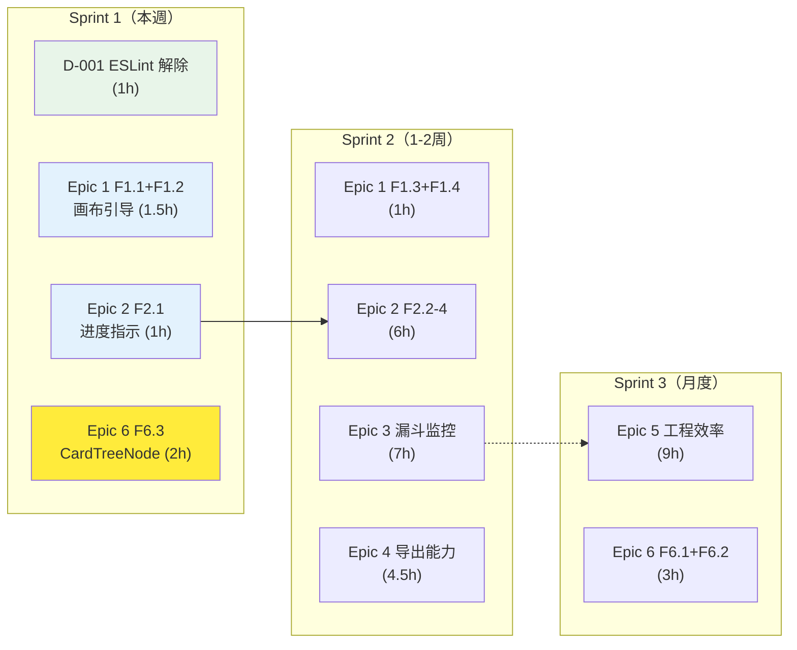

# Architecture: vibex-proposals-summary-20260331_060315

**Project**: VibeX 提案汇总实施路线图
**Agent**: architect
**Date**: 2026-03-31
**PRD**: docs/vibex-proposals-summary-20260331_060315/prd.md

---

## 1. 执行摘要

本项目是 16 条提案的整合路线图，分为 6 个 Epic，3 个 Sprint。总工时约 33h，跨用户-facing 功能、工程效率、测试保障三个维度。

**架构决策**：
- Epic 1-4 为用户-facing 功能，涉及前端状态和 UI 组件改动
- Epic 5-6 为内部工程工具，涉及 CI/CD 和测试基础设施
- Epic 之间无强依赖，可独立开发

---

## 2. 提案依赖关系图

---

## 3. 前端架构影响

### 3.1 状态管理

| 提案 | 影响 | 变更范围 |
|------|------|---------|
| Epic 2 F2.1-F2.4 | homePageStore 新增 sessionId 字段 | HomepageStore.ts |
| Epic 1 画布引导 | 新增 HelpPanel、FlowLegend 组件 | components/canvas/ |
| Epic 5 F5.1 | checkbox 状态与 store 统一 | contextSlice.ts |

### 3.2 新增依赖

| 依赖 | 用途 | 版本 |
|------|------|------|
| `@tanstack/react-virtual` | 大列表虚拟化 | ^3.0.0 |
| `@plausible/analytics` 或 `@umami/react` | 轻量 analytics | latest |

---

## 4. 后端架构影响

| 提案 | 影响 | 变更范围 |
|------|------|---------|
| Epic 3 漏斗监控 | 新增事件上报 endpoint | routes/analytics.ts（新增） |
| Epic 4 导出能力 | 新增 export routes | routes/export.ts（新增） |
| Epic 3 F3.4 | Session 事件存储 | D1 sessions 表 |

---

## 5. 实施路径

| Sprint | 内容 | 关键里程碑 |
|--------|------|-----------|
| Sprint 1 | ESLint 解除 + 基础引导 + 进度指示 + React19 兼容 | npm test 恢复正常 |
| Sprint 2 | 完整引导 + Session 持久化 + 漏斗监控 + 导出 | 三栏利用率 ≥60% |
| Sprint 3 | 工程效率 + 测试规范 | 执行率 ≥60%，E2E 5+ |

**注意**：Epic 1（画布引导）和 Epic 2（首页稳定）是核心用户体验闭环，必须优先完成。

---

*Architect 产出物 | 2026-03-31*
