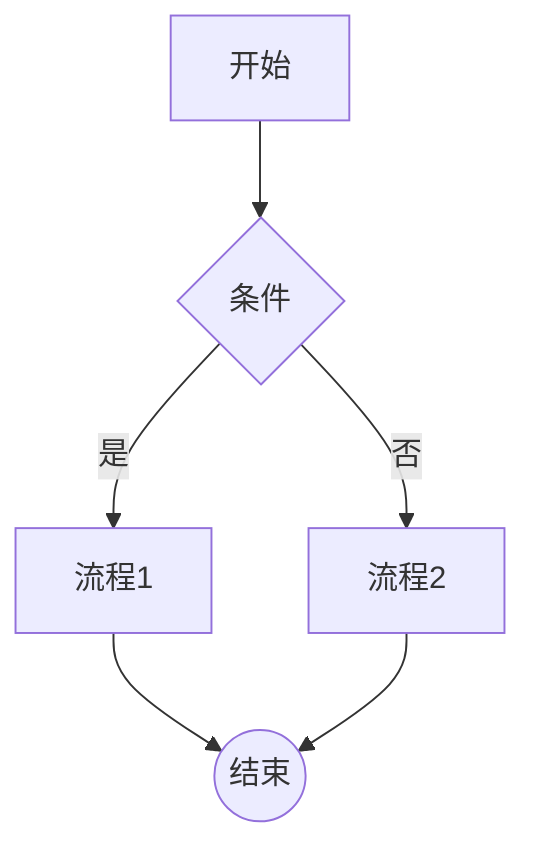

# Spec: Epic 4 — 项目导出能力

**Epic ID**: F4
**文件路径**: /root/.openclaw/vibex/vibex-fronted/src/
**状态**: Pending

---

## F4.1 JSON 导出

### 数据结构
```typescript
interface ExportedProject {
  version: '1.0';
  exportedAt: string; // ISO timestamp
  boundedContexts: BoundedContext[];
  businessFlows: BusinessFlow[];
  components: Component[];
}
```

### 导出方式
```typescript
function exportJSON() {
  const data: ExportedProject = {
    version: '1.0',
    exportedAt: new Date().toISOString(),
    boundedContexts: boundedContextStore.getAll(),
    businessFlows: businessFlowStore.getAll(),
    components: componentStore.getAll(),
  };
  const blob = new Blob([JSON.stringify(data, null, 2)], { type: 'application/json' });
  downloadBlob(blob, `vibex-export-${Date.now()}.json`);
}
```

### 验收标准
```javascript
// F4.1
const json = JSON.parse(downloadedContent);
expect(json).toHaveProperty('boundedContexts');
expect(json).toHaveProperty('businessFlows');
expect(json).toHaveProperty('components');
expect(json.version).toBe('1.0');
```

---

## F4.2 Markdown 导出

### 文档结构
```markdown
# VibeX 导出报告

## 限界上下文
| 名称 | 类型 | 描述 |
|------|------|------|
| BC1 | aggregate | ... |

## 业务流程
### Flow 1: xxx
...
```

### 验收标准
```javascript
// F4.2
expect(md).toMatch(/^# /);
expect(md).toMatch(/\|\s*\w+\s*\|\s*\w+\s*\|/); // 表格
expect(md).toMatch(/```/); // 代码块
```

---

## F4.3 Mermaid 导出

### 导出格式


### 验收标准
```javascript
// F4.3
// Mermaid Live Editor 验证
const validated = mermaid.parse(mermaidText);
expect(validated).toBe(true);
```

---

## F4.4 导出入口 UI

### 位置
- CanvasToolbar 右侧新增 "导出" 按钮
- 或 Canvas 右上角下拉菜单

### 导出菜单
```
导出
├── JSON (.json)
├── Markdown (.md)
└── Mermaid (.mmd)
```

### 组件文件
- 新建 `src/components/canvas/ExportMenu.tsx`
- 复用 CanvasToolbar 样式
