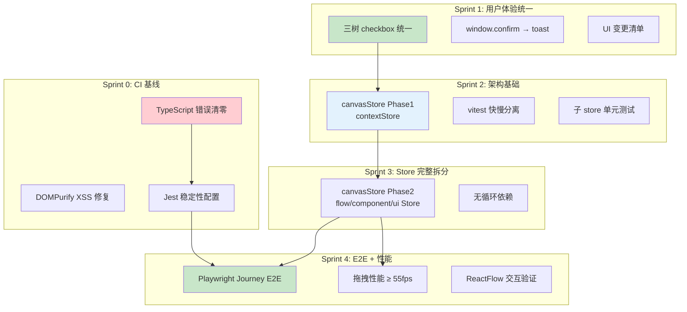
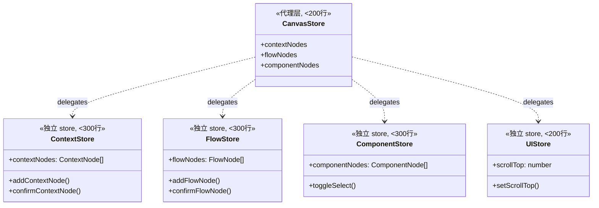

# Architecture: VibeX 系统性风险治理路线图

**项目**: vibex-proposals-summary-20260402_061709
**版本**: v1.0
**日期**: 2026-04-02
**架构师**: architect
**状态**: ✅ 设计完成

---

## 执行摘要

本项目通过 5 个 Sprint 系统性治理 VibeX 三类核心风险：
1. **技术债务** — canvasStore 1433行、renderer.ts 2175行、9个TS错误
2. **交互不一致** — 三树 checkbox 实现各异
3. **质量门禁失效** — CI不稳定、E2E缺失

**技术选型**: Next.js 16.2.0 + React 19.2.3 + Zustand + Playwright + Jest
**总工时**: 49.5-65.5h（5 Sprint）

---

## 1. Tech Stack

| 技术 | 选择 | 理由 |
|------|------|------|
| **框架** | Next.js 16.2.0 + React 19.2.3 | 已有 |
| **状态管理** | Zustand（渐进拆分） | 已有，按领域拆分 |
| **测试** | Jest + Playwright | 已有，补充 Journey E2E |
| **依赖安全** | npm audit + Dependabot + overrides | 已有工具链 |
| **性能优化** | React.memo + react-virtual + rAF | react-virtual < 5KB |

---

## 2. Architecture Diagram

### 2.1 整体架构



### 2.2 Store 拆分架构



---

## 3. Component Architecture

### 3.1 NodeState + FeedbackToken 共享类型

```typescript
// src/components/canvas/types/NodeState.ts
export enum NodeState {
  Idle = 'idle',
  Selected = 'selected',
  Confirmed = 'confirmed',
  Error = 'error',
}

export const NodeStatus = {
  Pending: 'pending',
  Confirmed: 'confirmed',
  Error: 'error',
} as const;

// src/components/canvas/types/FeedbackToken.ts
export enum FeedbackToken {
  Success = 'success',
  Warning = 'warning',
  Error = 'error',
  Info = 'info',
}

export interface DeleteFeedback extends FeedbackConfig {
  token: FeedbackToken.Warning | FeedbackToken.Error;
  undoAction: () => void; // 必须提供撤销
}
```

### 3.2 canvasStore 拆分

```typescript
// 最终文件结构
src/lib/canvas/
├── canvasStore.ts          // 代理层（<200行）
├── contextStore.ts         // <300行
├── flowStore.ts            // <300行
├── componentStore.ts       // <300行
├── uiStore.ts             // <200行
└── types/
    ├── NodeState.ts
    ├── FeedbackToken.ts
    └── index.ts
```

### 3.3 CSS Token

```css
/* src/styles/canvas-tokens.css */
:root {
  --z-panel: 10;
  --z-toolbar: 20;
  --z-drawer: 50;
  --z-modal: 100;
  --z-toast: 200;
}
```

---

## 4. Testing Strategy

### 4.1 测试分层

| 层 | 框架 | 覆盖率目标 |
|----|------|-----------|
| 单元测试 | Jest + RTL | > 70%（子 store） |
| E2E Journey | Playwright | > 90% 通过率 |
| 视觉回归 | pixelmatch | 关键页面 |

### 4.2 Journey E2E

```typescript
// e2e/journey-create-context.spec.ts
it('should create and confirm a bounded context', async ({ page }) => {
  await page.goto('/canvas');
  await page.click('[data-testid="add-context-btn"]');
  await page.fill('[data-testid="context-name"]', 'TestContext');
  await page.click('[data-testid="confirm-btn"]');
  await expect(page.locator('.node-confirmed')).toBeVisible();
});
```

### 4.3 性能基准

| 测试 | 目标 |
|------|------|
| vitest 单元测试 | < 60s |
| 拖拽帧率 | ≥ 55fps |
| 50节点渲染 | < 16ms |

---

## 5. Performance Impact

| 维度 | 影响 |
|------|------|
| Bundle Size | 无显著变化 |
| Runtime | **正向**（memo + 虚拟化 + rAF） |
| Memory | 轻微正向 |
| Test Time | **缩短**（快慢分离） |

---

## 6. 架构决策记录

### ADR-001: Sprint 0 先行（CI 基线）

**状态**: Accepted

**上下文**: 9 个 TS 错误使 CI 门禁失效，所有后续提案无法可靠验证。

**决策**: Sprint 0 优先修复 TS 错误和 DOMPurify XSS。

### ADR-002: canvasStore 按领域拆分

**状态**: Accepted

**上下文**: 1433 行单文件，所有状态混合。

**决策**: 拆分为 4 个独立 store + 1 个代理层。

### ADR-003: 三树统一通过 NodeState 枚举

**状态**: Accepted

**上下文**: 三树 checkbox 语义混乱。

**决策**: 定义 NodeState enum，三树共享。

### ADR-004: FeedbackToken 替换 window.confirm

**状态**: Accepted

**上下文**: window.confirm 阻塞 UI。

**决策**: 统一 FeedbackToken + useFeedback hook。

---

## 执行决策

- **决策**: 已采纳
- **执行项目**: vibex-proposals-summary-20260402_061709
- **执行日期**: 2026-04-02
