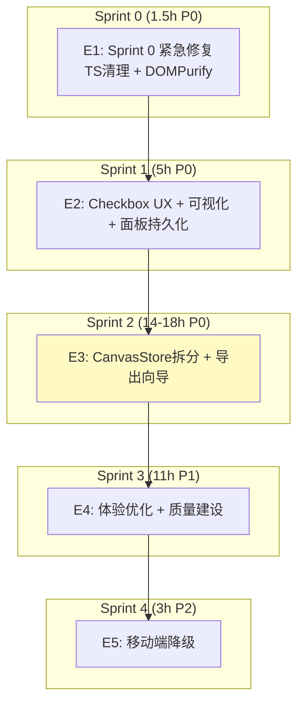

# Architecture: VibeX 提案汇总 — 研发路线图

**项目**: vibex-proposals-summary-20260402_201318
**版本**: v1.0
**日期**: 2026-04-02
**架构师**: architect
**状态**: ✅ 设计完成

---

## 执行摘要

六方提案综合汇总，5 个 Epic 涵盖 CI 门禁修复、UX 改进、架构重构、体验优化。

**总工时**: 34.5-38.5h + 6-9 人天

---

## 1. Tech Stack

| 技术 | 选择 | 理由 |
|------|------|------|
| React 18 + TypeScript | 现有 | 无变更 |
| Zustand | 现有 | canvasStore 拆分目标 |
| Vitest + RTL + Playwright | 现有 | 测试加速目标 |
| CSS Modules | 现有 | 样式规范目标 |

---

## 2. Sprint 架构



---

## 3. Epic 详细架构

### E1: Sprint 0 紧急修复（1.5h）

| Story | 方案 |
|-------|------|
| D-001 TS清理 | `npm run build` 定位 9 个 TS 错误，分类修复 |
| D-002 DOMPurify | `package.json overrides` 覆盖 monaco-editor dompurify |

### E2: Checkbox UX + 可视化 + 面板（5h）

| Story | 方案 |
|-------|------|
| D-E1 合并checkbox | BoundedContextTree: 删除 selectionCheckbox，保留 1 个 inline |
| D-E2 级联确认 | confirmFlowNode 增加 `steps.map(s => ({ ...s, status: 'confirmed' }))` |
| P-001 确认可视化 | 未确认=黄色虚线边框，已确认=绿色实线边框 |
| D-004 Migration | confirmed → status: 'confirmed' |
| P-002 面板持久化 | localStorage `vibex-panel-collapsed`，首次默认展开 |

### E3: CanvasStore 拆分 + 导出向导（14-18h）

**canvasStore 拆分**:
```
canvasStore (入口 < 150行)
├── contextStore      // ~180行
├── flowStore       // ~350行
├── componentStore  // ~180行
├── uiStore        // ~280行
└── sessionStore   // ~150行
```

**导出向导**: Step 1 选择节点 → Step 2 配置 → Step 3 导出

**API 防御性解析**: Zod safeParse + fallback

**vitest 优化**: 路径别名 + 覆盖率报告 < 60s

### E4: 体验优化 + 质量建设（11h）

| Story | 方案 |
|-------|------|
| P-004 空状态引导 | GuideCard + 快捷操作，有数据时隐藏 |
| D-006 E2E 框架 | Playwright 3 核心旅程 |
| P-006 PRD导出 | Markdown 格式 + Mermaid 图 + 飞书兼容 |

### E5: 移动端降级（3h）

`isMobile` 检测，友好提示 + 只读预览入口。

---

## 4. 性能影响

| Epic | 影响 |
|------|------|
| E1 | 无 |
| E2 | 正向（减少 DOM 节点）|
| E3 | 低风险（各 store < 350 行）|
| E4 | 无 |
| E5 | 无 |

---

## 5. 架构决策记录

### ADR-001: Sprint 0 阻断优先

**状态**: Accepted

### ADR-002: canvasStore 拆分单向依赖

**状态**: Accepted

### ADR-003: 状态持久化分层

**状态**: Accepted

### ADR-004: Playwright E2E 优先

**状态**: Accepted

---

## 执行决策

- **决策**: 已采纳
- **执行项目**: vibex-proposals-summary-20260402_201318
- **执行日期**: 2026-04-02
