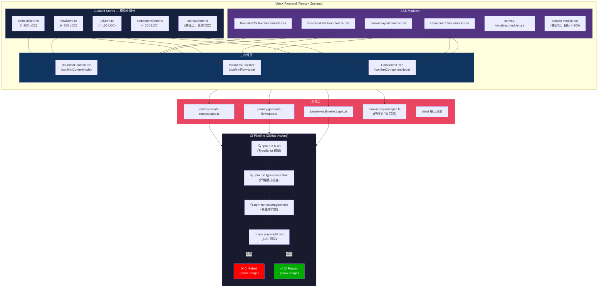
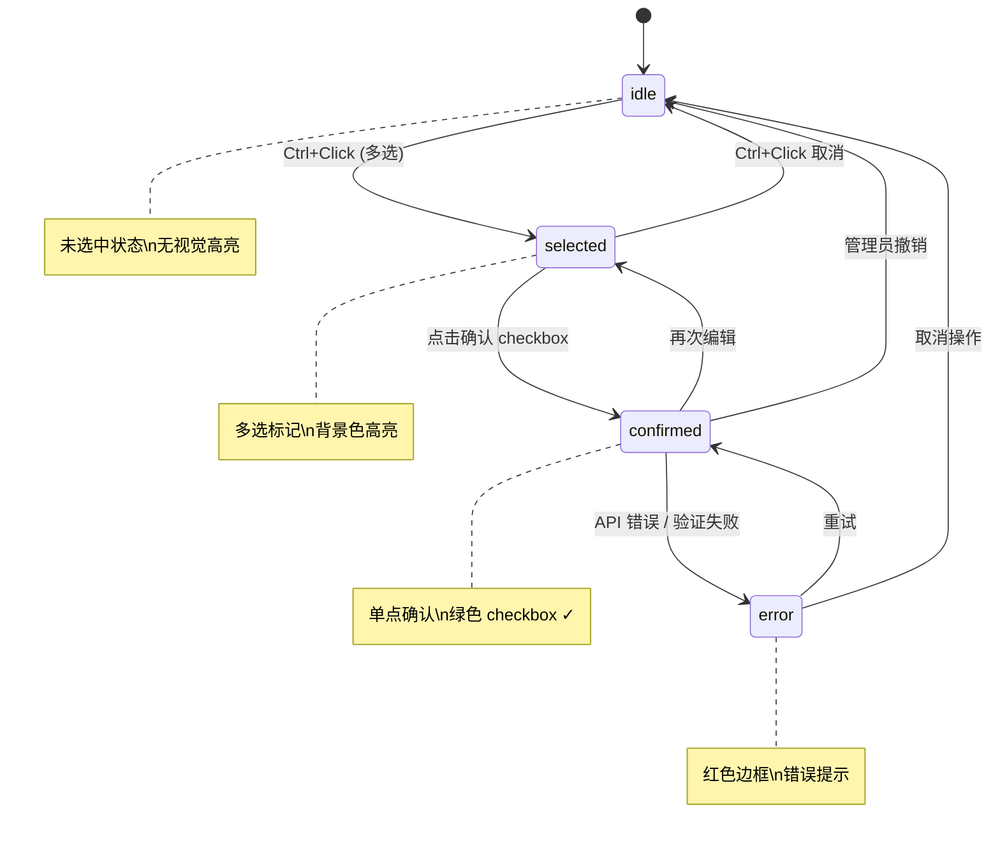
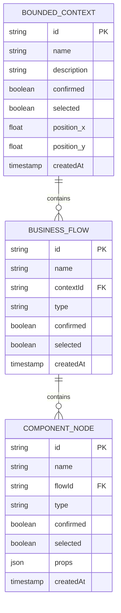
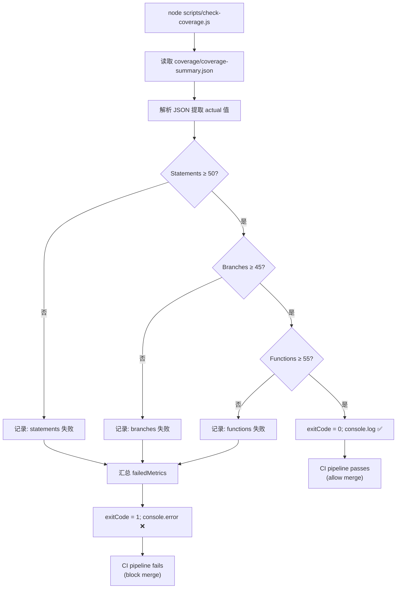

# VibeX 代码质量治理 — 架构设计文档

**项目**: vibex-reviewer-proposals-20260402_061709
**版本**: 1.0
**日期**: 2026-04-02
**作者**: Architect Agent
**状态**: Proposed

---

## 1. Tech Stack

### 1.1 核心依赖版本表

| 类别 | 工具 | 当前版本 | 目标版本 | 选型理由 |
|------|------|---------|---------|---------|
| **语言** | TypeScript | 未指定 | `5.x` (strict mode) | 类型安全是质量治理核心 |
| **运行时** | Node.js | 未指定 | `20.x LTS` | 匹配 Playwright v1.50+ 需求 |
| **前端框架** | React | 未指定 | 保持当前 | 状态管理拆分需 React 18+ context 兼容 |
| **状态管理** | Zustand | 未指定 | `5.x` | 轻量、devtools 支持好、最适合 store 拆分 |
| **样式** | CSS Modules | 原生支持 | 保持 | 无需引入新工具，按组件拆分天然支持 |
| **单元测试** | Vitest | 未指定 | `2.x` | 与 Vite 深度集成，coverage v8 内置，CI 友好 |
| **覆盖率** | `@vitest/coverage-v8` | 未指定 | `2.x` | V8 引擎，指标精准，与 Vitest 2.x 配套 |
| **E2E 测试** | Playwright | 未指定 | `1.50+` | 条件等待 API 成熟，CI 支持完善，TypeScript 友好 |
| **安全修复** | DOMPurify | 间接依赖 | `3.3.3` (override) | 强制 override 修复 XSS 漏洞 |
| **构建工具** | Vite | 未指定 | 保持当前 | TS 类型检查 + 覆盖率集成成熟 |

### 1.2 工具链决策

```
包管理器: npm (overrides 机制 npm 7+ 原生支持，无需 yarn resolutions)
测试入口: vitest
E2E 入口: playwright
覆盖率脚本: node scripts/check-coverage.js (纯 Node，无额外依赖)
CI 门禁: GitHub Actions (npm run precommit)
```

---

## 2. Architecture Diagram

### 2.1 系统架构总览



### 2.2 Store 拆分领域模型

```mermaid
classDiagram
    class ContextStore {
        <<Zustand Store>>
        -nodes: ContextNode[]
        -selectedIds: Set~string~
        -activeId: string | null
        +addContext(name): void
        +removeContext(id): void
        +confirmContextNode(id): void
        +selectContext(id): void
        +deselectContext(id): void
        +getSelected(): ContextNode[]
    }
    
    class FlowStore {
        <<Zustand Store>>
        -nodes: FlowNode[]
        -selectedIds: Set~string~
        -activeId: string | null
        +addFlow(name): void
        +confirmFlowNode(id): void
        +selectFlow(id): void
        +getFlowsByContext(ctxId): FlowNode[]
    }
    
    class ComponentStore {
        <<Zustand Store>>
        -nodes: ComponentNode[]
        -selectedIds: Set~string~
        -activeId: string | null
        +addComponent(name): void
        +confirmComponentNode(id): void
        +selectComponent(id): void
        +getComponentsByFlow(flowId): ComponentNode[]
    }
    
    class UIStore {
        <<Zustand Store>>
        -activeTab: 'context' | 'flow' | 'component'
        -panelOpen: boolean
        -scrollTop: number
        +setActiveTab(tab): void
        +togglePanel(): void
        +setScrollTop(pos): void
    }
    
    class CanvasStore {
        <<Zustand Store>>
        (deprecation target)
        -legacy: CanvasState
        +getState(): LegacyCanvasState
    }
    
    ContextStore -- CanvasStore : proxy (过渡期)
    FlowStore -- CanvasStore : proxy (过渡期)
    ComponentStore -- CanvasStore : proxy (过渡期)
    
    ContextStore "1" --> "0..*" ContextNode
    FlowStore "1" --> "0..*" FlowNode
    ComponentStore "1" --> "0..*" ComponentNode
    
    class ContextNode {
        id: string
        name: string
        confirmed: boolean
        selected: boolean
        position: {x, y}
    }
    class FlowNode {
        id: string
        name: string
        contextId: string
        confirmed: boolean
        selected: boolean
    }
    class ComponentNode {
        id: string
        name: string
        flowId: string
        confirmed: boolean
        selected: boolean
    }
```

### 2.3 三树 Checkbox 语义状态机



---

## 3. API Definitions

### 3.1 Store 接口签名

```typescript
// ─────────────────────────────────────────────
// contextStore.ts — BoundedContextTree 专用
// ─────────────────────────────────────────────
interface ContextNode {
  id: string;
  name: string;
  description?: string;
  confirmed: boolean;
  selected: boolean;
  position: { x: number; y: number };
  createdAt: number;
}

interface ContextStore {
  // State
  nodes: ContextNode[];
  
  // Actions
  addContext(payload: { name: string; description?: string }): ContextNode;
  removeContext(id: string): void;
  updateContext(id: string, patch: Partial<Omit<ContextNode, 'id' | 'createdAt'>>): void;
  
  // Selection (多选)
  selectContext(id: string): void;
  deselectContext(id: string): void;
  toggleContextSelection(id: string): void;
  clearSelection(): void;
  getSelected(): ContextNode[];
  
  // Confirmation (单点确认)
  confirmContextNode(id: string): void;
  unconfirmContextNode(id: string): void;
  isContextConfirmed(id: string): boolean;
}

// ─────────────────────────────────────────────
// flowStore.ts — BusinessFlowTree 专用
// ─────────────────────────────────────────────
interface FlowNode {
  id: string;
  name: string;
  contextId: string; // 所属 Context
  description?: string;
  confirmed: boolean;
  selected: boolean;
  type: 'user-flow' | 'system-flow';
  createdAt: number;
}

interface FlowStore {
  nodes: FlowNode[];
  addFlow(payload: { name: string; contextId: string; type?: FlowNode['type'] }): FlowNode;
  removeFlow(id: string): void;
  updateFlow(id: string, patch: Partial<Omit<FlowNode, 'id' | 'createdAt'>>): void;
  
  // Selection
  selectFlow(id: string): void;
  deselectFlow(id: string): void;
  toggleFlowSelection(id: string): void;
  clearFlowSelection(): void;
  getSelected(): FlowNode[];
  
  // Confirmation
  confirmFlowNode(id: string): void;
  unconfirmFlowNode(id: string): void;
  isFlowConfirmed(id: string): boolean;
  
  // Queries
  getFlowsByContext(contextId: string): FlowNode[];
}

// ─────────────────────────────────────────────
// componentStore.ts — ComponentTree 专用
// ─────────────────────────────────────────────
interface ComponentNode {
  id: string;
  name: string;
  flowId: string; // 所属 Flow
  type: 'page' | 'module' | 'component' | 'hook' | 'util';
  confirmed: boolean;
  selected: boolean;
  props?: Record<string, unknown>;
  createdAt: number;
}

interface ComponentStore {
  nodes: ComponentNode[];
  addComponent(payload: { name: string; flowId: string; type: ComponentNode['type'] }): ComponentNode;
  removeComponent(id: string): void;
  updateComponent(id: string, patch: Partial<Omit<ComponentNode, 'id' | 'createdAt'>>): void;
  
  // Selection
  selectComponent(id: string): void;
  deselectComponent(id: string): void;
  toggleComponentSelection(id: string): void;
  clearComponentSelection(): void;
  getSelected(): ComponentNode[];
  
  // Confirmation
  confirmComponentNode(id: string): void;
  unconfirmComponentNode(id: string): void;
  isComponentConfirmed(id: string): boolean;
  
  // Queries
  getComponentsByFlow(flowId: string): ComponentNode[];
}

// ─────────────────────────────────────────────
// uiStore.ts — 三树面板 UI 状态
// ─────────────────────────────────────────────
type ActiveTab = 'context' | 'flow' | 'component';

interface UIStore {
  activeTab: ActiveTab;
  panelOpen: boolean;
  scrollTop: { context: number; flow: number; component: number };
  expandedNodes: Set<string>;
  
  setActiveTab(tab: ActiveTab): void;
  togglePanel(): void;
  setScrollTop(tab: ActiveTab, pos: number): void;
  expandNode(id: string): void;
  collapseNode(id: string): void;
  toggleNodeExpansion(id: string): void;
}
```

### 3.2 覆盖率检查脚本 API

```typescript
// scripts/check-coverage.js — 纯 Node，无框架依赖

interface CoverageThresholds {
  statements: number;  // >= 50
  branches: number;    // >= 45
  functions: number;   // >= 55
  lines: number;       // >= 50
}

interface CoverageResult {
  passed: boolean;
  thresholds: CoverageThresholds;
  actual: {
    statements: number;
    branches: number;
    functions: number;
    lines: number;
  };
  failedMetrics: string[];  // e.g. ['branches: 42% < 45%']
  exitCode: 0 | 1;
}

// 导出接口 (供 CI 调用)
declare function checkCoverage(configPath?: string): Promise<CoverageResult>;
```

### 3.3 E2E 旅程测试接口

```typescript
// tests/e2e/journey-*.spec.ts — Playwright Page Object Pattern

interface JourneyContext {
  page: import('@playwright/test').Page;
  baseURL: string;
}

interface JourneyResult {
  passed: boolean;
  screenshot?: Buffer;
  error?: Error;
}

// Journey 1: 创建 BoundedContext
declare async function journeyCreateContext(ctx: JourneyContext): Promise<JourneyResult>;

// Journey 2: 从 Context 生成 Flow
declare async function journeyGenerateFlow(ctx: JourneyContext): Promise<JourneyResult>;

// Journey 3: 多选节点并批量确认
declare async function journeyMultiSelect(ctx: JourneyContext): Promise<JourneyResult>;
```

---

## 4. Data Models

### 4.1 核心实体关系



### 4.2 TypeScript 配置模型

```typescript
// tsconfig.json 目标配置片段
interface TSConfigModel {
  compilerOptions: {
    strict: boolean;                      // S1-1: 启用
    noUncheckedIndexedAccess: boolean;   // S1-1: 启用
    exactOptionalPropertyTypes: boolean; // S1-1: 启用（可选）
    baseUrl: string;
    paths: Record<string, string[]>;
    // ...
  };
  include: string[];  // S0-2: 必须包含 "tests"
  exclude: string[];
}

// package.json 覆盖配置
interface PackageOverrideModel {
  overrides: {
    dompurify: string;  // S0-3: "3.3.3"
  };
  scripts: {
    'type-check:strict': string;   // tsc --noEmit --strict
    'coverage:check': string;      // vitest --coverage + check-coverage.js
    'precommit': string;           // coverage:check && type-check:strict
  };
}
```

---

## 5. Testing Strategy

### 5.1 测试金字塔

```
         ▲
        /E2E\         Sprint 2: 3 个核心旅程 (Playwright)
       /──────\
      / Vitest \       Sprint 1-2: 单元测试 (Vitest)
     / unit &  \
    /integration\
   ───────────────  Sprint 0: TS 编译验证 (tsc)
   CI Quality Gate
```

### 5.2 测试框架配置

| 层 | 框架 | 覆盖引擎 | 配置方式 |
|----|------|---------|---------|
| 单元/集成 | Vitest 2.x | `@vitest/coverage-v8` | `vitest.config.ts` |
| E2E | Playwright 1.50+ | 内置 | `playwright.config.ts` |
| TS 类型检查 | `tsc --noEmit` | 内置 | `tsconfig.json` |

### 5.3 覆盖率门禁标准

| 指标 | Sprint 0 基线 | Sprint 1 目标 | Sprint 2 目标 |
|------|------------|-------------|-------------|
| Statements | — | ≥ 50% | ≥ 60% |
| Branches | — | ≥ 45% | ≥ 50% |
| Functions | — | ≥ 55% | ≥ 60% |
| Lines | — | ≥ 50% | ≥ 55% |

> **增长策略**: 每个 Sprint 结束后 +5%，保持 CI 不阻塞，给予团队适应期。

### 5.4 覆盖率检查脚本逻辑



### 5.5 核心测试用例示例

#### 5.5.1 单元测试 (Vitest)

```typescript
// src/lib/canvas/stores/__tests__/contextStore.test.ts

import { describe, it, expect, beforeEach } from 'vitest';
import { createContextStore } from '../contextStore';

describe('ContextStore', () => {
  let store: ReturnType<typeof createContextStore>;
  
  beforeEach(() => {
    store = createContextStore();
  });
  
  // S1-2: Store 拆分 — 每个 store 独立可测
  describe('addContext', () => {
    it('添加后节点包含 id 和 createdAt', () => {
      const ctx = store.getState().addContext({ name: 'Order Service' });
      expect(ctx.id).toBeDefined();
      expect(ctx.createdAt).toBeGreaterThan(0);
      expect(ctx.name).toBe('Order Service');
      expect(ctx.confirmed).toBe(false);
      expect(ctx.selected).toBe(false);
    });
  });
  
  // S1-3: ADR-001 Checkbox 语义 — confirmation 状态
  describe('confirmContextNode', () => {
    it('confirm 后 isContextConfirmed 返回 true', () => {
      const ctx = store.getState().addContext({ name: 'Payment' });
      store.getState().confirmContextNode(ctx.id);
      expect(store.getState().isContextConfirmed(ctx.id)).toBe(true);
    });
    
    it('已确认节点再次 confirm 不抛错', () => {
      const ctx = store.getState().addContext({ name: 'Inventory' });
      store.getState().confirmContextNode(ctx.id);
      expect(() => store.getState().confirmContextNode(ctx.id)).not.toThrow();
    });
  });
  
  // S1-3: ADR-001 — selection 多选状态
  describe('selectContext (多选)', () => {
    it('Ctrl+Click 多选后可获取多个 selected 节点', () => {
      const ctx1 = store.getState().addContext({ name: 'A' });
      const ctx2 = store.getState().addContext({ name: 'B' });
      store.getState().selectContext(ctx1.id);
      store.getState().selectContext(ctx2.id);
      const selected = store.getState().getSelected();
      expect(selected).toHaveLength(2);
    });
  });
  
  // S1-4: 覆盖率 — 数据层必须有测试
  describe('getSelected', () => {
    it('空选择返回空数组', () => {
      expect(store.getState().getSelected()).toHaveLength(0);
    });
  });
});
```

#### 5.5.2 E2E 旅程测试 (Playwright)

```typescript
// tests/e2e/journey-create-context.spec.ts

import { test, expect } from '@playwright/test';

// S2-2: Playwright E2E 核心旅程覆盖

test.describe('Journey: Create BoundedContext', () => {
  
  test.beforeEach(async ({ page }) => {
    // S0-2: 使用条件等待，不用 waitForTimeout
    await page.goto('/canvas');
    await page.waitForSelector('[data-testid="context-tree"]', { state: 'visible' });
  });
  
  test('用户成功创建一个 BoundedContext', async ({ page }) => {
    // 触发添加按钮
    await page.getByRole('button', { name: /add context/i }).click();
    
    // 填写表单
    await page.getByPlaceholder('Context Name').fill('Order Service');
    await page.getByRole('button', { name: /confirm/i }).click();
    
    // S2-2: 断言 — 节点出现在树中
    const contextNode = page.locator('[data-testid="context-node"]').first();
    await expect(contextNode).toBeVisible();
    await expect(contextNode).toContainText('Order Service');
  });
  
  test('确认 checkbox 后节点变为 confirmed 状态', async ({ page }) => {
    // 前提：已创建一个 context
    await page.getByRole('button', { name: /add context/i }).click();
    await page.getByPlaceholder('Context Name').fill('Payment');
    await page.getByRole('button', { name: /confirm/i }).click();
    
    // 点击确认 checkbox
    const checkbox = page.locator('[data-testid="context-node"]').first()
      .locator('[data-testid="confirm-checkbox"]');
    await checkbox.click();
    
    // S1-3: ADR-001 验证 — confirmed 状态视觉反馈
    await expect(
      page.locator('[data-testid="context-node"]').first()
    ).toHaveAttribute('data-confirmed', 'true');
  });
  
  test('Ctrl+Click 多选两个节点', async ({ page }) => {
    // 创建两个 context
    await page.getByRole('button', { name: /add context/i }).click();
    await page.getByPlaceholder('Context Name').fill('Service A');
    await page.getByRole('button', { name: /confirm/i }).click();
    
    await page.getByRole('button', { name: /add context/i }).click();
    await page.getByPlaceholder('Context Name').fill('Service B');
    await page.getByRole('button', { name: /confirm/i }).click();
    
    // Ctrl+Click 多选
    const nodeA = page.locator('[data-testid="context-node"]').nth(0);
    const nodeB = page.locator('[data-testid="context-node"]').nth(1);
    await nodeA.click();
    await nodeB.click({ modifiers: ['Control'] });
    
    // S1-3: ADR-001 — 多选状态验证
    await expect(nodeA).toHaveAttribute('data-selected', 'true');
    await expect(nodeB).toHaveAttribute('data-selected', 'true');
  });
});
```

#### 5.5.3 TypeScript 严格模式验证测试

```typescript
// S1-1: TypeScript 严格模式

// 验证 tsconfig.json 配置
test('tsconfig.json 包含 strict 相关配置', async () => {
  const config = await fs.readJSON('tsconfig.json');
  expect(config.compilerOptions.strict).toBe(true);
  expect(config.compilerOptions.noUncheckedIndexedAccess).toBe(true);
});

// 验证 type-check:strict 退出码为 0
test('npm run type-check:strict passes', async () => {
  const result = await exec('npm run type-check:strict');
  expect(result.exitCode).toBe(0);
  expect(result.stderr).not.toContain('error TS');
}, { timeout: 60_000 });
```

---

## 6. Performance Impact Assessment

### 6.1 CI Pipeline 性能影响

| 阶段 | 当前基线 | 目标 | 增量 | 原因 |
|------|---------|------|------|------|
| `npm run build` | 基准 | 持平或 +30s | 极小 | TypeScript 严格模式可能发现更多错误，不会影响构建速度 |
| `npm run type-check:strict` | 无基线 | < 60s | 新增 | 增量检查，非全量扫描 |
| `npm run coverage:check` | 无基线 | < 120s | 新增 | Vitest v8 coverage 优化，V8 引擎快 |
| `npm playwright test` | 基准或不可用 | < 180s | 中等 | Playwright 条件等待减少 flaky 重试，实际更快 |
| **CI 总计** | — | **< 5 分钟** | **+ 3-4 分钟** | 在 CI 预算内 |

### 6.2 运行时性能影响

| 改造 | 性能影响 | 评估 |
|------|---------|------|
| Zustand store 拆分 | 极小（Zustand 5.x 零开销代理） | ✅ 无额外 re-render |
| CSS Modules 拆分 | 零性能影响 | ✅ CSS Modules 本身零开销 |
| DOMPurify override 3.3.3 | 极小（可能更快） | ✅ 新版本有性能优化 |
| Playwright 条件等待替代 timeout | **正向影响** | ✅ 减少不必要的等待时间 |
| 覆盖率 gate 首次运行 | 冷启动 +30-60s | ✅ 仅首次，后续有缓存 |

### 6.3 Store 拆分后的订阅策略

```typescript
// 优化：三树组件只订阅自己需要的 store 切片
// S1-2: 避免过度订阅导致性能下降

// ✅ 正确：只订阅需要的字段
const nodes = useContextStore(s => s.nodes);

// ❌ 错误：订阅整个 store（会因其他字段变化而 re-render）
// const store = useContextStore(); // 不要这样
```

---

## 7. Architecture Decision Records (ADRs)

### ADR-001: canvasStore 最小化拆分方案

**Status**: Proposed
**Date**: 2026-04-02
**Deciders**: Architect, Dev, Reviewer, PM

#### Context
`canvasStore.ts` 当前为 1433 行单文件，承载了 BoundedContextTree、BusinessFlowTree、ComponentTree 三种完全不同领域的状态。这是系统内最大的单点风险——任何修改都可能影响所有树，且难以单独测试。

#### Decision
采用**领域最小化拆分**（方案 B-1）：
```
lib/canvas/stores/
  contextStore.ts    (< 200 行)
  flowStore.ts       (< 200 行)
  componentStore.ts  (< 200 行)
  uiStore.ts         (< 150 行)
  canvasStore.ts     (兼容层，最终清空至 < 100 行)
```

**不采用**完全 DDD 拆分（方案 B-3）的原因：
- 当前阶段以"止血"为目标，完全 DDD 拆分工时是 B-1 的 2-3 倍
- B-1 提供明确的迁移路径（canvasStore 作为代理）
- Zustand 5.x 的 store 订阅模式天然支持渐进式拆分

#### Consequences
- **Positive**: 每个 store 独立可测，修改范围明确，regression 风险低
- **Negative**: 过渡期 canvasStore.ts 作为兼容层存在重复代码，需在 Sprint 2 后清空
- **Risk**: 过渡期两个 store 同步状态存在一致性问题 → 缓解：使用 Zustand `subscribeWithSelector`

---

### ADR-002: CSS Modules 按组件拆分策略

**Status**: Proposed
**Date**: 2026-04-02

#### Context
`canvas.module.css` 行数过多，多个组件共享样式，存在冲突风险。

#### Decision
采用按组件拆分（方案 D-1）：
```
src/components/canvas/
  BoundedContextTree.module.css  (~200 行)
  BusinessFlowTree.module.css    (~200 行)
  ComponentTree.module.css      (~150 行)
  canvas-layout.module.css      (~300 行，公共布局)
  canvas-variables.module.css   (~50 行，CSS 变量)
  canvas.module.css            (兼容层，目标 < 200 行)
```

**不采用**设计系统重构（方案 D-2）的原因：
- D-2 工时是 D-1 的 2-3 倍，不符合当前 Sprint 2 时间预算
- 当前痛点是"行数过多难维护"，而非"缺乏设计系统"

#### Consequences
- **Positive**: 每个组件样式独立，减少命名冲突，review 可读性提高
- **Negative**: 公共样式迁移到 canvas-layout 需谨慎，重复期需要并行维护
- **Risk**: 迁移期间样式不一致 → 缓解：每个迁移步骤后截图对比

---

### ADR-003: Playwright 替代 waitForTimeout

**Status**: Proposed
**Date**: 2026-04-02

#### Context
E2E 测试当前使用 `waitForTimeout` 硬编码等待，导致 CI 环境与本地表现不一致（flaky）且拖慢测试速度。

#### Decision
所有 E2E 测试必须使用 Playwright 条件等待 API：

| ❌ 禁止 | ✅ 推荐 |
|--------|--------|
| `page.waitForTimeout(1000)` | `page.waitForSelector(locator, { state: 'visible' })` |
| `page.waitForTimeout(2000)` | `page.waitForFunction(() => !isLoading)` |
| `page.waitForNavigation()` | `page.waitForURL('**/target')` |
| 固定 sleep | `page.waitForResponse(url => url.url().includes('/api'))` |

#### Consequences
- **Positive**: 消除 flaky，CI 稳定性大幅提升，测试速度加快
- **Negative**: 需要改造所有现有测试（S0-2 已覆盖）
- **Risk**: 条件等待在元素不存在时 timeout → 使用 `try/catch` + 明确的 timeout 配置

---

### ADR-004: 测试覆盖率门禁标准

**Status**: Proposed
**Date**: 2026-04-02

#### Context
无测试覆盖率基线，关键路径缺乏回归屏障。需要设置 CI 门禁，但标准过高会导致 CI 阻塞，标准过低则形同虚设。

#### Decision
Sprint 1 基线标准（保守起步）:
- Statements ≥ 50%
- Branches ≥ 45%
- Functions ≥ 55%
- Lines ≥ 50%

**增长机制**: 每个 Sprint 结束后 +5%，分阶段达标：
- Sprint 1 末: 50/45/55/50
- Sprint 2 末: 55/50/60/55
- Sprint 3+: 60/55/65/60

#### Consequences
- **Positive**: 明确的量化标准，CI 门禁可执行，长期可追踪改进趋势
- **Negative**: 初期可能需要补充"测试桩"（mock/stub）来提升覆盖率
- **Risk**: 覆盖率 ≠ 代码质量，盲追覆盖率 → 缓解：纳入 PR review 时检查测试价值

---

### ADR-005: TypeScript 严格模式渐进启用

**Status**: Proposed
**Date**: 2026-04-02

#### Context
启用 `strict: true` 会产生大量新增类型错误，一次性启用会阻塞 Sprint 1 所有其他工作。

#### Decision
分三阶段启用：

| 阶段 | 配置 | 目标 |
|------|------|------|
| Phase 1 | `strict: true` | 修复 S0 错误后立即启用（原有错误已清） |
| Phase 2 | `noUncheckedIndexedAccess: true` | Sprint 1 前半（4h 工时） |
| Phase 3 | `exactOptionalPropertyTypes: true` | Sprint 1 末（作为挑战项，可延后） |

#### Consequences
- **Positive**: 每个阶段错误量可控，CI 不阻塞
- **Negative**: 分阶段配置增加 tsconfig 维护复杂度
- **Decision**: Phase 3 作为可选优化项，Phase 1 + 2 是必选

---

## 8. 执行决策

### Epic S0: 紧急止血

| 决策项 | 状态 | 执行项目 | 执行日期 |
|--------|------|---------|---------|
| S0-1: 修复 9 个预存 TS 错误 | ✅ **已采纳** | vibex-reviewer-proposals-20260402_061709 | 2026-04-02 |
| S0-2: 修复 E2E 测试 TS 错误 | ✅ **已采纳** | vibex-reviewer-proposals-20260402_061709 | 2026-04-02 |
| S0-3: DOMPurify override "3.3.3" | ✅ **已采纳** | vibex-reviewer-proposals-20260402_061709 | 2026-04-02 |

### Epic S1: 架构基础建设

| 决策项 | 状态 | 执行项目 | 执行日期 |
|--------|------|---------|---------|
| S1-1: TypeScript 严格模式渐进启用 | ✅ **已采纳** | vibex-reviewer-proposals-20260402_061709 | 2026-04-02 |
| S1-2: canvasStore 领域最小化拆分 (B-1) | ✅ **已采纳** | vibex-reviewer-proposals-20260402_061709 | 2026-04-02 |
| S1-3: ADR-001 checkbox 语义规范 | ✅ **已采纳** | vibex-reviewer-proposals-20260402_061709 | 2026-04-02 |
| S1-4: 覆盖率门禁基线 (50/45/55/50) | ✅ **已采纳** | vibex-reviewer-proposals-20260402_061709 | 2026-04-02 |

### Epic S2: 质量提升

| 决策项 | 状态 | 执行项目 | 执行日期 |
|--------|------|---------|---------|
| S2-1: CSS Modules 按组件拆分 (D-1) | ✅ **已采纳** | vibex-reviewer-proposals-20260402_061709 | 2026-04-02 |
| S2-2: 3 个 Playwright E2E 旅程测试 | ✅ **已采纳** | vibex-reviewer-proposals-20260402_061709 | 2026-04-02 |
| S2-3: CONTRIBUTING.md Git 工作流规范 | ✅ **已采纳** | vibex-reviewer-proposals-20260402_061709 | 2026-04-02 |

---

*Architect Agent | VibeX 代码质量治理架构设计 | 2026-04-02*
