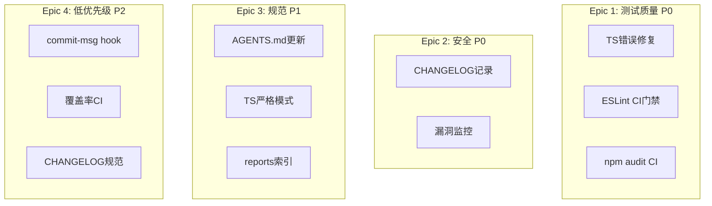

# Architecture: Vibex Reviewer 提案落地

**项目**: vibex-reviewer-proposals-20260402_201318
**版本**: v1.0
**日期**: 2026-04-02
**架构师**: architect
**状态**: ✅ 设计完成

---

## 执行摘要

Reviewer 8 项提案落地：测试质量、安全监控、代码规范、流程治理。

**总工时**: 16h

---

## 1. Tech Stack

GitHub Actions + ESLint + TypeScript（无新依赖）

---

## 2. Epic 架构



---

## 3. Epic 详细方案

### E1: 前端测试质量（P0, 4h）

**E1-S1: TS 错误修复**
- 修复 `tests/e2e/canvas-expand.spec.ts` TS 语法错误

**E1-S2: ESLint CI 门禁**
```yaml
# .github/workflows/ci.yml
- name: TypeScript check
  run: npx tsc --noEmit
- name: ESLint
  run: npm run lint
```

**E1-S3: npm audit CI**
```yaml
- name: Security audit
  run: npm audit --audit-level=moderate
```

### E2: 安全监控（P0, 0.5h + 2h）

**E2-S1**: CHANGELOG 记录 `GHSA-v2wj-7wpq-c8vv`
**E2-S2**: 每 sprint 检查间接依赖更新

### E3: 代码规范（P1, 6.5h）

**E3-S1**: AGENTS.md 更新多 Epic 共 commit 规范
**E3-S2**: TS 严格模式，`as any` 减少 50%，启用 `@typescript-eslint/no-explicit-any`
**E3-S3**: `reports/INDEX.md` 索引机制

### E4: 低优先级（P2, 5h）

**E4-S1**: commit-msg hook 验证 `Refs #xxx` 格式
**E4-S2**: 覆盖率 diff CI，>1% 下降 warning
**E4-S3**: `CHANGELOG_CONVENTION.md`

---

## 4. 性能影响

无风险。

---

## 执行决策

- **决策**: 已采纳
- **执行项目**: vibex-reviewer-proposals-20260402_201318
- **执行日期**: 2026-04-02
