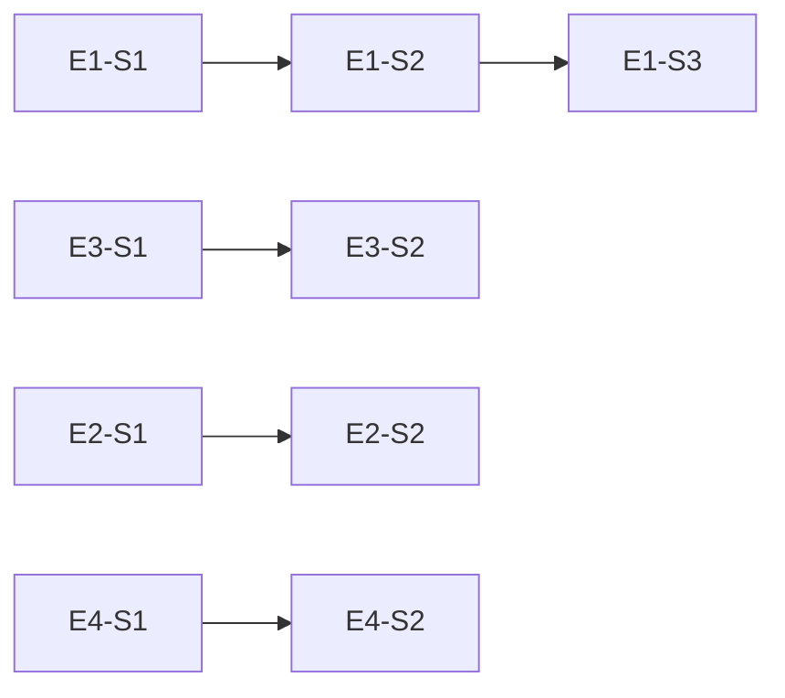

# PRD: Vibex Reviewer 提案落地 — 2026-04-02

> **状态**: Draft
> **负责人**: PM Agent
> **基于提案**: `workspace-coord/proposals/20260402_201318/reviewer-proposals.md`
> **生成日期**: 2026-04-02

---

## 1. 执行摘要

Reviewer Agent 于 2026-04-02 完成自我检查，提交 8 项提案（2 × P0、3 × P1、3 × P2），涵盖测试质量、安全、代码规范与流程优化四大领域。

**核心决策**：
- **P0-1**（TypeScript 错误）→ 立即修复，建立 ESLint 门禁阻断 CI
- **P0-2**（npm audit 漏洞）→ CI 集成 `npm audit`，CHANGELOG 记录追踪
- **P1-1**（多 Epic 共 commit）→ 成文规范，AGENTS.md 更新
- **P1-2**（TS 严格模式）→ 分阶段治理，ESLint 规则引入
- **P1-3**（报告归档）→ 建立 `reports/INDEX.md` 索引机制
- **P2 系列**（Git 规范、覆盖率、Changelog）→ 低优先级，纳入后续 sprint 规划

---

## 2. Epic 拆分与工时估算

### Epic 1: 前端测试质量保障（P0）
**目标**: 修复 TypeScript 阻塞错误，建立 ESLint 门禁

| ID | Story | 优先级 | 工时 | 验收条件 |
|----|-------|--------|------|---------|
| E1-S1 | 修复 canvas-expand.spec.ts TypeScript 错误 | P0 | 1h | `npm run test` pre-test-check 通过，ESLint 无 error |
| E1-S2 | 建立 ESLint TypeScript 错误门禁（CI 阻断） | P0 | 2h | PR 包含 TS error 时 CI 失败，main 分支零 TS error |
| E1-S3 | npm audit CI 集成 | P0 | 1h | `npm audit --audit-level=moderate` 失败时 CI 阻断 |

### Epic 2: 安全漏洞监控（P0）
**目标**: 建立持续安全监控机制

| ID | Story | 优先级 | 工时 | 验收条件 |
|----|-------|--------|------|---------|
| E2-S1 | dompurify XSS 漏洞追踪文档 | P0 | 0.5h | CHANGELOG 记录漏洞 ID（GHSA-v2wj-7wpq-c8vv）及状态 |
| E2-S2 | 建立上游漏洞监控机制 | P1 | 2h | 每 sprint 检查一次间接依赖更新 |

### Epic 3: 代码规范与流程治理（P1）
**目标**: 规范化团队协作约定，提升代码质量基线

| ID | Story | 优先级 | 工时 | 验收条件 |
|----|-------|--------|------|---------|
| E3-S1 | AGENTS.md 更新：多 Epic 共 commit 约定 | P1 | 0.5h | AGENTS.md 包含共 commit 审查规范 |
| E3-S2 | TypeScript 严格模式升级（as any 替换） | P1 | 4h | canvasStore.ts `as any` 减少 50%，ESLint `@typescript-eslint/no-explicit-any` 启用 |
| E3-S3 | reports/INDEX.md 建立 | P1 | 2h | 索引文件存在，所有历史报告可查，新增报告自动追加 |

### Epic 4: 低优先级规范建设（P2）
**目标**: Git 规范成文、测试覆盖率提升、Changelog 规范化

| ID | Story | 优先级 | 工时 | 验收条件 |
|----|-------|--------|------|---------|
| E4-S1 | commit-msg hook 验证 Refs 格式 | P2 | 2h | commit 缺少 Refs 时被 hook 拒绝 |
| E4-S2 | CI 覆盖率下降检测 | P2 | 2h | 覆盖率下降 >1% 时 CI warning |
| E4-S3 | CHANGELOG_CONVENTION.md 创建 | P2 | 1h | 规范文档存在，格式示例完整 |

---

## 3. 验收标准

| ID | Given | When | Then |
|----|-------|------|------|
| AC1 | 修改 canvas-expand.spec.ts | 运行 `npm run test` | pre-test-check 无 error |
| AC2 | PR 包含 TS error | push 到 main 分支 | CI 构建失败并报告错误文件 |
| AC3 | npm audit 发现 moderate+ 漏洞 | push 到 main 分支 | CI 构建失败并输出漏洞报告 |
| AC4 | GHSA-v2wj-7wpq-c8vv 漏洞 | 每次 sprint 审查 | CHANGELOG 记录当前状态 |
| AC5 | 多 Epic 共 commit | Reviewer 审查 | AGENTS.md 有明确约定 |
| AC6 | 新增审查报告 | 审查完成 | 自动追加到 reports/INDEX.md |
| AC7 | 覆盖率下降 | PR merge | CI 输出覆盖率 diff，下降 >1% 标记 warning |
| AC8 | commit message | git commit | 包含 Refs 格式或被 hook 拒绝 |

---

## 4. 完成的定义（DoD）

| Story | Done 条件 |
|-------|---------|
| E1-S1 | TypeScript 编译无 error，ESLint 无 TS error |
| E1-S2 | CI pipeline 配置完成，main 分支实测零 TS error |
| E1-S3 | package.json 或 CI 配置包含 npm audit 检查 |
| E2-S1 | CHANGELOG.md 包含漏洞条目 |
| E2-S2 | 文档记录每 sprint 检查流程 |
| E3-S1 | AGENTS.md 包含多 Epic 共 commit 约定 |
| E3-S2 | canvasStore.ts 中 `as any` 减少 ≥50%，ESLint 规则激活 |
| E3-S3 | reports/INDEX.md 存在且包含所有历史报告条目 |
| E4-S1 | .husky/commit-msg hook 验证 Refs 格式 |
| E4-S2 | CI 包含覆盖率 diff 检测逻辑 |
| E4-S3 | CHANGELOG_CONVENTION.md 存在且格式示例完整 |

---

## 5. 工时汇总

| Epic | Story 数 | 估算工时 |
|------|---------|---------|
| Epic 1: 前端测试质量保障 | 3 | 4h |
| Epic 2: 安全漏洞监控 | 2 | 2.5h |
| Epic 3: 代码规范与流程治理 | 3 | 6.5h |
| Epic 4: 低优先级规范建设 | 3 | 5h |
| **合计** | **11** | **18h** |

---

## 6. 优先级矩阵

```
         Impact
           ↑
           |  P0          P1          P2
    High   | ─────────────┼────────────┤
           |  E1-S1       E3-S2       ───
           |  E1-S2       E3-S3       ───
           |  E1-S3       E2-S2       ───
           |  E2-S1       ───         ───
    Low    | ─────────────┼────────────┤
           └────────────────────────────────→ Urgency
                               Time-constrained (This sprint)
```

---

## 7. 依赖关系



---

## 8. 风险与缓解

| 风险 | 影响 | 缓解措施 |
|------|------|---------|
| dompurify 上游未修复 | 持续 XSS 风险 | 记录 CHANGELOG，每 sprint 复查，等待上游 |
| TS 严格模式升级破坏现有功能 | 回归风险 | 分阶段替换，CI 门禁保底 |
| 间接依赖漏洞误报 | CI 假阳性 | 设置 audit-level=moderate，过滤已知误报 |
