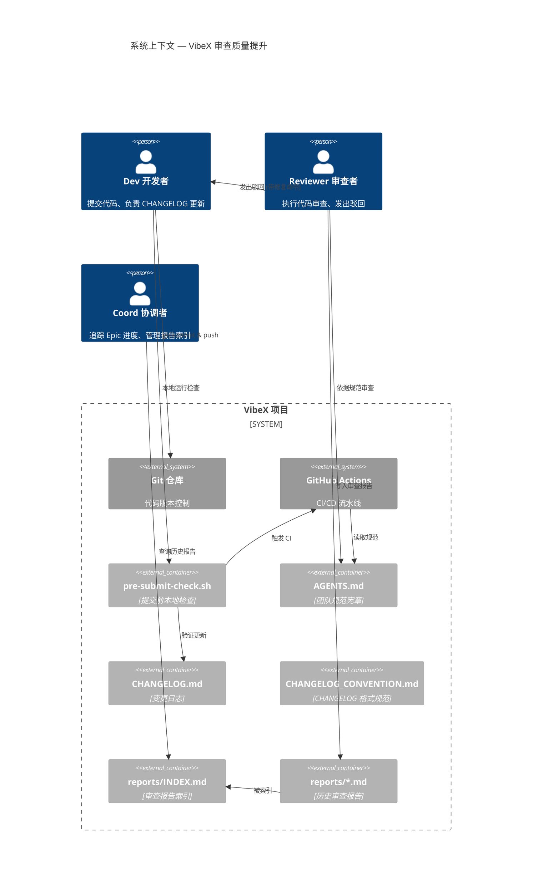
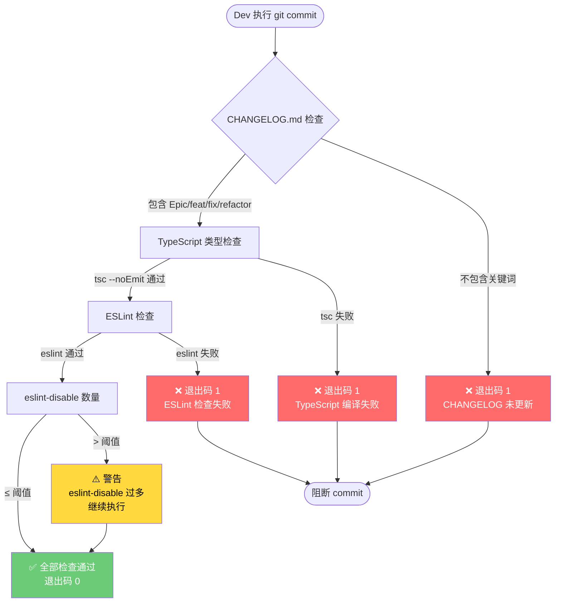
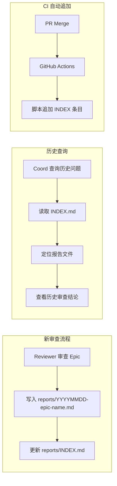
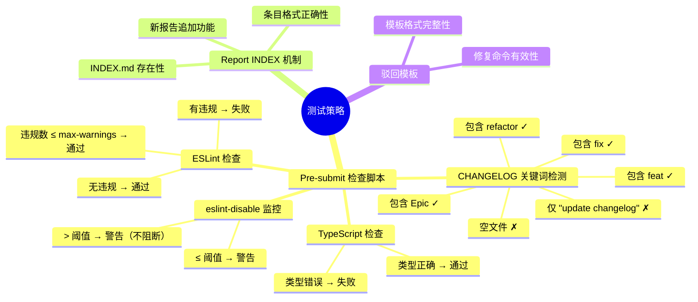

# VibeX Reviewer 提案 — 架构设计文档

**项目**: vibex-reviewer-proposals-20260403_024652
**版本**: v1.0
**日期**: 2026-04-03
**角色**: Architect
**状态**: 架构设计完成

---

## 1. 执行决策

- **决策**: 已采纳
- **执行项目**: vibex-reviewer-proposals-20260403_024652
- **执行日期**: 2026-04-03

---

## 2. 技术栈

| 组件 | 技术选型 | 版本 | 选型理由 |
|------|---------|------|---------|
| **Pre-submit 检查脚本** | Bash (POSIX) | 5.1+ | 零外部依赖，兼容 Linux/macOS，团队已有使用经验 |
| **CI 集成** | GitHub Actions | — | 现有 CI 基础设施，无额外成本 |
| **文档格式** | Markdown | — | 便于版本管理和 grep 搜索，团队熟悉 |
| **Report 索引** | Markdown + YAML Frontmatter | — | 机器可解析，人类可读，无需数据库 |
| **ESLint 规则检查** | ESLint 8+ | 8.x | 已有配置，直接复用 |
| **TypeScript 检查** | tsc | 5.x | 已有项目依赖 |
| **Husky (Sprint 4)** | husky | 9.x | 标准 Git hooks 管理工具 |
| **Commit Lint (Sprint 4)** | commitlint | 17.x | 配合 husky 使用，成熟方案 |

**技术约束**:
- `pre-submit-check.sh` 只能依赖系统已有工具（bash, grep, git, npm/npx）
- 不引入额外 runtime 依赖
- 脚本兼容 bash 5.1+（Linux/macOS 均满足）

---

## 3. 架构总览

### 3.1 系统上下文



### 3.2 组件架构

```mermaid
componentDiagram
  package "vibex-fronted" {
    [AGENTS.md] --> [CHANGELOG规范章节]
    [AGENTS.md] --> [Reviewer驳回模板]
    [AGENTS.md] --> [Reviewer Constraints]
    
    [CHANGELOG_CONVENTION.md] --> [Epic格式模板]
    [CHANGELOG_CONVENTION.md] --> [变更类型标签]
    
    [scripts/pre-submit-check.sh] --> [CHANGELOG检查器]
    [scripts/pre-submit-check.sh] --> [TypeScript检查器]
    [scripts/pre-submit-check.sh] --> [ESLint检查器]
    [scripts/pre-submit-check.sh] --> [ESLintDisable监控器]
    
    [reports/INDEX.md] --> [报告条目列表]
    [reports/*.md] --> [被INDEX索引]
  }

  package "vibex-backend" {
    [AGENTS.md] --> [CHANGELOG规范章节]
  }

  package "CI/CD" {
    [.github/workflows/*.yml] --> [pre-submit-check.sh 集成]
  }
```

### 3.3 Pre-submit 检查流程



### 3.4 报告索引数据流



---

## 4. 数据模型

### 4.1 审查报告 (Review Report)

```yaml
# 文件路径: reports/YYYYMMDD-epic-name.md
---
id: "RR-YYYYMMDD-NNN"        # 报告唯一 ID，格式: RR-{日期}-{序号}
date: "YYYY-MM-DD"           # 审查日期
epic: "epic-name"            # 关联 Epic 名称
scope: "frontend|backend|full"
reviewer: "@reviewer-handle"  # Reviewer 的 Slack handle
status: "passed|rejected|conditional"
rounds: 1                     # 审查轮次
duration_minutes: 45         # 审查耗时
summary: "简要总结（1-2 句话）"
---

## 审查结论

**状态**: ✅ 通过 / ❌ 驳回 / ⚠️ 条件通过

## 驳回记录（如有）

<!-- 驳回使用标准化模板 -->
### 驳回 #N

❌ 审查驳回: <问题描述>
📍 文件: <文件路径>
🔧 修复命令: <具体命令>
📋 参考: AGENTS.md §<章节>

### 驳回 #N+1
...
```

### 4.2 CHANGELOG 条目 (Change Log Entry)

```yaml
# 文件路径: vibex-fronted/CHANGELOG.md  或  vibex-backend/CHANGELOG.md
# 格式: 追加到文件顶部（保持时间倒序）

## [Epic 名称] — YYYY-MM-DD

**Epic**: E<N>-<Name>
**类型**: feat | fix | refactor | docs | test | chore
**范围**: frontend | backend | full
**Commit**: <commit-hash> (可选)

### 变更摘要
- <变更点 1>
- <变更点 2>

### 依赖 Epic
- <前置 Epic（如有）>
```

### 4.3 CHANGELOG 规范约定 (CHANGELOG_CONVENTION.md)

```yaml
# 文件路径: vibex-fronted/CHANGELOG_CONVENTION.md
---
convention_version: "1.0"
last_updated: "2026-04-03"
scope: "frontend"  # frontend | backend
---

## 格式规范

### Epic 条目结构
每个 Epic 结束时，必须在 CHANGELOG.md 顶部追加新条目：

\`\`\`markdown
## [Epic 名称] — YYYY-MM-DD

**Epic**: E<N>-<Name>
**类型**: <type>
**范围**: <scope>

### 变更摘要
- <变更点>
\`\`\`

### 变更类型标签
| 标签 | 含义 | 示例 |
|------|------|------|
| feat | 新功能 | 添加 X 功能 |
| fix | Bug 修复 | 修复 Y 组件 Z 问题 |
| refactor | 重构 | 重构 A 模块提升性能 |
| docs | 文档更新 | 更新 README |
| test | 测试 | 新增单元测试 |
| chore | 维护 | 升级依赖版本 |

### 禁止事项
- ❌ 禁止在 `src/app/changelog/page.tsx` 中手动添加内容
- ❌ 禁止仅记录 "update changelog" 而无实质变更摘要
- ❌ 禁止跨项目记录（Frontend 和 Backend 分开维护）
```

### 4.4 ESLint Disable 豁免记录 (ESLINT_DISABLES.md)

```yaml
# 文件路径: vibex-fronted/ESLINT_DISABLES.md
---
last_updated: "YYYY-MM-DD"
total_disables: 16
review_cycle: "每 Sprint 审查一次"
---

##豁免记录

| # | 文件路径 | 行号 | 规则 | 理由 | 添加日期 | 复查状态 |
|---|---------|------|------|------|---------|---------|
| 1 | src/canvas/... | 42 | @typescript-eslint/no-explicit-any | 第三方库类型定义缺失，临时方案 | 2026-01-15 | 待复查 |
| 2 | src/components/... | 78 | react-hooks/exhaustive-deps | 性能优化，避免不必要重渲染 | 2026-02-20 | 合理保留 |
```

---

## 5. 文件结构

```
vibex-fronted/
├── AGENTS.md                           # 团队规范宪章（更新版）
│   ├── §CHANGELOG 规范                 # E1-S1 新增章节
│   ├── §Reviewer Constraints           # E1-S1 新增约束
│   └── §Reviewer 驳回模板              # E3-S1 新增章节
├── CHANGELOG_CONVENTION.md             # E1-S2 新建文件
├── ESLINT_DISABLES.md                  # E6-S1 规划文件
├── scripts/
│   └── pre-submit-check.sh             # E2-S1 新建脚本
│       ├── CHANGELOG 检查逻辑
│       ├── TypeScript 检查逻辑
│       ├── ESLint 检查逻辑
│       └── eslint-disable 数量监控逻辑
├── reports/
│   ├── INDEX.md                        # E3-S2 新建文件
│   └── *.md                            # 历史报告
├── .github/
│   └── workflows/
│       ├── ci.yml                     # E2-S3 更新：集成 pre-submit-check
│       └── accessibility.yml          # （现有文件，不改动）
└── README.md                           # E4-S1 更新：新增 Reviewer 工作流

vibex-backend/
└── AGENTS.md                           # E1-S3 更新：同步 CHANGELOG 规范
    └── §CHANGELOG 规范                 # Backend 专属规范章节
```

---

## 6. API 定义（脚本接口）

### 6.1 pre-submit-check.sh

```bash
#!/bin/bash
# ============================================================
# pre-submit-check.sh — VibeX 提交前质量检查脚本
# ============================================================
# 用法: ./scripts/pre-submit-check.sh [--warn-only]
# 参数:
#   --warn-only   以警告模式运行（不阻断提交）
#   --skip-changelog  跳过 CHANGELOG 检查
#   --skip-ts     跳过 TypeScript 检查
#   --skip-eslint 跳过 ESLint 检查
# 环境变量:
#   ESLINT_DISABLE_THRESHOLD  eslint-disable 数量警告阈值（默认 20）
#   PROJECT_ROOT             项目根目录（默认 .）
# 退出码:
#   0   所有检查通过
#   1   至少一项检查失败（阻断性错误）
#   2   ESLint disable 数量超过阈值（仅在 --warn-only 时）
# ============================================================

## 核心函数签名

# check_changelog() → exit_code
#   验证 CHANGELOG.md 包含 Epic/feat/fix/refactor 关键词
#   输出: ❌ 或 ✅
check_changelog() { ... }

# check_typescript() → exit_code
#   运行 npx tsc --noEmit
#   输出: 编译错误列表 或 ✅ 通过
check_typescript() { ... }

# check_eslint() → exit_code
#   运行 npx eslint ./src --max-warnings=0
#   输出: ESLint 错误列表 或 ✅ 通过
check_eslint() { ... }

# check_eslint_disable_count() → warning_code
#   统计 eslint-disable 数量，超过阈值输出警告
#   输出: ⚠️ eslint-disable 数量过多 或 无输出
check_eslint_disable_count() { ... }

# main() → exit_code
#   依次执行所有检查，聚合退出码
main() { ... }
```

### 6.2 CI 集成 (GitHub Actions)

```yaml
# .github/workflows/pre-submit.yml (新增文件)
name: Pre-submit Quality Gate

on:
  pull_request:
    branches: [main, develop]
  push:
    branches: [main, develop]

jobs:
  pre-submit:
    runs-on: ubuntu-latest
    steps:
      - uses: actions/checkout@v4
        
      - name: Setup Node.js
        uses: actions/setup-node@v4
        with:
          node-version: '22'
          cache: 'npm'
          
      - run: npm ci
      
      - name: Run pre-submit checks
        run: |
          chmod +x scripts/pre-submit-check.sh
          ./scripts/pre-submit-check.sh || true  # Sprint 3: warn-only
      
      - name: Report ESLint disable count
        run: |
          COUNT=$(grep -rn "eslint-disable" src/ --include="*.ts" --include="*.tsx" | wc -l)
          echo "::notice::ESLint disable count: $COUNT (threshold: ${{ vars.ESLINT_DISABLE_THRESHOLD || 20 }})"
```

### 6.3 Report INDEX 追加脚本 (可选)

```bash
#!/bin/bash
# scripts/append-report-index.sh
# 用法: ./scripts/append-report-index.sh <report_file>
#
# 在 reports/INDEX.md 追加新报告条目
# 格式: | RR-YYYYMMDD-NNN | YYYY-MM-DD | epic-name | summary | reports/file.md |

# 参数验证
if [ $# -lt 1 ]; then
  echo "Usage: $0 <report_file>"
  exit 1
fi

REPORT_FILE="$1"
INDEX_FILE="reports/INDEX.md"

# 解析 YAML Frontmatter
REPORT_ID=$(grep "^id:" "$REPORT_FILE" | cut -d'"' -f2)
REPORT_DATE=$(grep "^date:" "$REPORT_FILE" | cut -d'"' -f2)
REPORT_EPIC=$(grep "^epic:" "$REPORT_FILE" | cut -d'"' -f2)
REPORT_SUMMARY=$(grep "^summary:" "$REPORT_FILE" | cut -d'"' -f2)

# 追加到 INDEX.md
echo "| $REPORT_ID | $REPORT_DATE | $REPORT_EPIC | $REPORT_SUMMARY | $REPORT_FILE |" >> "$INDEX_FILE"
```

---

## 7. 驳回模板规范

### 7.1 标准驳回格式（AGENTS.md 中定义）

```markdown
### ❌ 审查驳回: <问题标题>

**Epic**: E<N>-<Name>
**日期**: YYYY-MM-DD
**Reviewer**: @reviewer-handle

**问题描述**:
<清晰描述问题，引用具体代码或规范条款>

**文件位置**:
- 📍 `<文件路径>:<行号>`

**修复命令**:
```bash
# 🔧 具体可执行的修复命令
<command>
```

**参考规范**:
- 📋 AGENTS.md §<章节编号>
- 📋 CHANGELOG_CONVENTION.md §<章节编号>

---
```

### 7.2 驳回类型示例

**类型 A: CHANGELOG 遗漏**

```markdown
### ❌ 审查驳回: CHANGELOG.md 未更新

**问题描述**:
Epic `<epic-name>` 已完成，但 `CHANGELOG.md` 中未找到对应的变更记录。

**文件位置**:
- 📍 `CHANGELOG.md`

**修复命令**:
\`\`\`bash
# 1. 编辑 CHANGELOG.md，在顶部添加：
# ## [<Epic 名称>] — $(date +%Y-%m-%d)
# **Epic**: E<N>-<Name>
# **类型**: <feat|fix|refactor>
# **范围**: frontend
# 
# ### 变更摘要
# - <变更点 1>
# - <变更点 2>

# 2. 验证格式符合规范
cat CHANGELOG_CONVENTION.md
\`\`\`

**参考规范**:
- 📋 AGENTS.md §CHANGELOG 规范
- 📋 CHANGELOG_CONVENTION.md §Epic 条目结构
```

**类型 B: TypeScript 类型错误**

```markdown
### ❌ 审查驳回: TypeScript 编译失败

**问题描述**:
`npx tsc --noEmit` 检测到 <N> 个类型错误，请修复后重新提交。

**文件位置**:
- 📍 `src/<affected-file>.ts:<行号>`

**修复命令**:
\`\`\`bash
# 查看详细错误
npx tsc --noEmit 2>&1 | head -50

# 修复类型定义后验证
npx tsc --noEmit && echo "✅ TypeScript 检查通过"
\`\`\`

**参考规范**:
- 📋 AGENTS.md §代码质量标准
```

**类型 C: ESLint 规则违反**

```markdown
### ❌ 审查驳回: ESLint 检查失败

**问题描述**:
ESLint 检测到 <N> 个规则违反，代码不符合团队代码规范。

**文件位置**:
- 📍 `src/<affected-file>.tsx:<行号>`

**修复命令**:
\`\`\`bash
# 查看详细 ESLint 错误
npx eslint src/<affected-file>.tsx

# 自动修复可自动修复的问题
npx eslint src/<affected-file>.tsx --fix

# 验证修复
npx eslint src/<affected-file>.tsx
\`\`\`

**参考规范**:
- 📋 AGENTS.md §代码规范
```

---

## 8. 测试策略

### 8.1 测试覆盖范围



### 8.2 核心测试用例

#### 8.2.1 pre-submit-check.sh 测试用例

| ID | 用例 | 输入 | 预期输出 | 退出码 |
|----|------|------|---------|--------|
| T1 | CHANGELOG 包含 Epic | CHANGELOG 含 "## [My Epic]" | ✅ 通过 | 0 |
| T2 | CHANGELOG 包含 feat | CHANGELOG 含 "- feat:" | ✅ 通过 | 0 |
| T3 | CHANGELOG 包含 fix | CHANGELOG 含 "- fix:" | ✅ 通过 | 0 |
| T4 | CHANGELOG 为空 | CHANGELOG 为空 | ❌ CHANGELOG 未更新 | 1 |
| T5 | CHANGELOG 仅 "update" | CHANGELOG 仅 "update changelog" | ❌ CHANGELOG 未更新 | 1 |
| T6 | TS 编译通过 | 无类型错误 | ✅ 通过 | 0 |
| T7 | TS 编译失败 | 有类型错误 | ❌ TypeScript 错误列表 | 1 |
| T8 | ESLint 无违规 | 无 ESLint 错误 | ✅ 通过 | 0 |
| T9 | ESLint 有违规 | 有 ESLint 错误 | ❌ ESLint 错误列表 | 1 |
| T10 | ESLint 违规 ≤ max-warnings | 违规数 = max-warnings | ✅ 通过 | 0 |
| T11 | eslint-disable ≤ 阈值 | 数量 = 15, 阈值 = 20 | ⚠️ 警告 | 0 |
| T12 | eslint-disable > 阈值 | 数量 = 25, 阈值 = 20 | ⚠️ 警告 | 0 |
| T13 | --warn-only 模式 | 任何失败 | ⚠️ 警告（不阻断） | 0 |
| T14 | --skip-changelog | CHANGELOG 为空 | 跳过检查 | 0 |
| T15 | CI 环境 | GitHub Actions | 报告上传 artifact | 0 |

#### 8.2.2 Report INDEX 测试用例

| ID | 用例 | 输入 | 预期 |
|----|------|------|------|
| R1 | INDEX.md 存在 | reports/INDEX.md | 文件存在 |
| R2 | 初始条目数 | 现有历史报告 | 所有报告已索引 |
| R3 | 新增报告追加 | 新报告文件 | 条目追加到 INDEX.md |
| R4 | 追加格式正确 | YAML frontmatter | 格式符合规范 |

#### 8.2.3 驳回模板测试用例

| ID | 用例 | 输入 | 预期 |
|----|------|------|------|
| M1 | 模板包含 ❌ | AGENTS.md | 包含 "❌ 审查驳回" |
| M2 | 模板包含 🔧 | AGENTS.md | 包含 "🔧 修复命令" |
| M3 | 模板包含 📍 | AGENTS.md | 包含 "📍 文件" |
| M4 | 模板包含 📋 | AGENTS.md | 包含 "📋 参考" |
| M5 | CHANGELOG 驳回示例 | 驳回记录 | 包含具体修复命令 |

### 8.3 测试框架与覆盖率要求

| 组件 | 测试框架 | 覆盖率要求 | 备注 |
|------|---------|-----------|------|
| pre-submit-check.sh | Bash 测试框架 (bats-core) | > 80% | 核心路径全覆盖 |
| Report INDEX 追加 | Jest + shelljs | > 80% | 路径验证、正则匹配 |
| AGENTS.md 规范 | Jest + fs | 100% | expect() 断言全通过 |
| CI 集成 | GitHub Actions mock | N/A | 手动验证 |

**Bash 测试示例 (bats-core)**:

```bash
#!/usr/bin/env bats

load 'test_helper/bats-support/load'
load 'test_helper/bats-assert/load'

setup() {
  cp test/fixtures/changelog-with-epic.md test/CHANGELOG.md
}

teardown() {
  rm -f test/CHANGELOG.md
}

@test "CHANGELOG 包含 Epic 关键词时应通过" {
  run ./scripts/pre-submit-check.sh --skip-ts --skip-eslint
  assert_output --partial "✅"
  assert_success
}

@test "CHANGELOG 为空时应失败" {
  > test/CHANGELOG.md
  run ./scripts/pre-submit-check.sh --skip-ts --skip-eslint
  assert_output --partial "❌"
  assert_failure
}
```

---

## 9. 风险与缓解

| 风险 | 级别 | 缓解措施 |
|------|------|---------|
| Dev 不运行 pre-submit 脚本 | 中 | CI 作为兜底；Sprint 4 增加 Git hooks 强制 |
| AGENTS.md 规范更新后历史 Epic 追溯 | 低 | 新规范仅约束新 Epic，历史问题不追溯 |
| eslint-disable 豁免过多 | 中 | 创建 ESLINT_DISABLES.md，强制定期复查 |
| INDEX.md 自动化与手动编辑冲突 | 低 | CI 追加而非覆盖；提供冲突解决指南 |
| 驳回模板增加 Reviewer 负担 | 低 | 提供模板片段，Reviewer 只需复制填充 |
| 脚本在 macOS 上行为不一致 | 低 | 使用 POSIX 兼容语法，避免 bash 特有功能 |
| CI pre-submit 检查耗时过长 | 低 | 目标 ≤ 120s；超时 CI 配置 timeout-minutes |

---

## 10. 监控与度量

| 指标 | 当前基线 | Sprint 3 目标 | 监控方式 |
|------|---------|--------------|---------|
| CHANGELOG 相关驳回次数 | Epic3 已驳回 4 轮 | 新 Epic 驳回次数 ≤ 1 轮 | reports/INDEX.md 统计 |
| 平均审查轮次 | 2-3 轮/Epic | ≤ 1.5 轮/Epic | reports/INDEX.md 统计 |
| 驳回包含修复命令比例 | 0% | 100% | 抽查报告文件 |
| reports/INDEX.md 覆盖率 | 0%（不存在） | 100% | 脚本验证 |
| eslint-disable 数量 | 16+ | ≤ 20（阈值内） | pre-submit 脚本监控 |
| pre-submit 脚本执行时间 | N/A | ≤ 120s | CI 日志 |

---

*架构设计文档完成。下一阶段: IMPLEMENTATION_PLAN.md*
