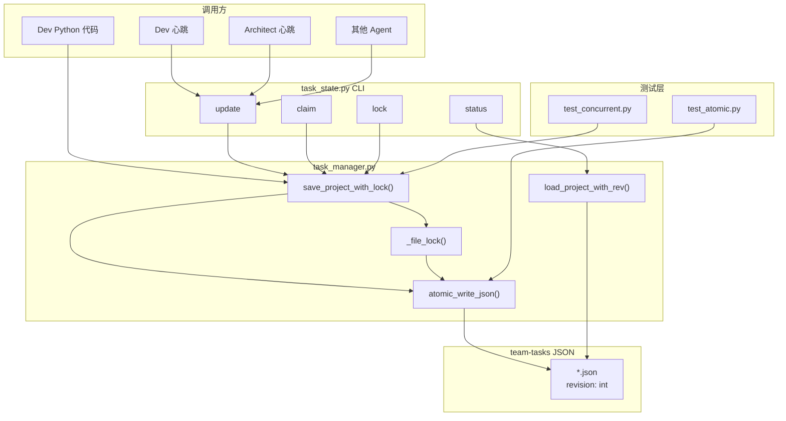

# Architecture: task_state CLI + 乐观锁

**项目**: vibex-task-state-20260326
**版本**: 1.0
**架构师**: Architect Agent
**日期**: 2026-03-26
**状态**: Proposed

---

## 1. ADR: 并发安全策略

### ADR-001: 并发保护方案 — 乐观锁 + 原子写入

**状态**: Accepted

**上下文**: `save_project()` 使用 `open(path, "w")` 直接写入，并发调用时后写覆盖先写，导致 revision 丢失。

**决策**: 乐观锁（revision 字段）+ 原子写入（temp + rename）

**理由**:
1. 不引入外部锁服务（如 flock），保持无状态设计
2. revision 字段轻量，不需要数据库迁移
3. 原子写入确保异常时不留截断文件
4. 与现有 task_manager.py 向后兼容

**Trade-off**: revision 字段初始为 0，无 revision 的旧文件首次写入时自动初始化

---

### ADR-002: CLI vs Python API 封装

**状态**: Accepted

**上下文**: 新功能应该通过 Python API 还是 CLI 暴露给 Agent？

**决策**: CLI（`task_state.py`）+ Python API 双暴露

**理由**:
1. Bash 脚本（如心跳）无法 import Python，需要 CLI
2. Python 代码（如 Dev）直接 import 更简洁
3. 两者底层共用同一实现

---

## 2. Tech Stack

| 技术 | 选择理由 |
|------|---------|
| Python 3.8+ | 现有 task_manager.py 环境 |
| `tempfile.mkstemp` | 原子写入（fd → rename） |
| `fcntl` (Unix) | 文件锁作为并发保护补充（可选） |
| JSON | 现有数据格式 |

---

## 3. 架构图



---

## 4. JSON Schema 变更

```json
// 顶层新增 revision 字段
{
  "project": "vibex-task-state-20260326",
  "goal": "...",
  "status": "active",
  "revision": 42,        // 新增：乐观锁版本号，每次写入 +1
  "stages": {
    "design-architecture": {
      "agent": "architect",
      "status": "done",
      "revision": 5        // 可选：stage 级别 revision
    }
  }
}
```

**revision 语义**:
- 初始无 revision 的文件 → 首次写入自动初始化为 `0`，保存后变为 `1`
- 每次 `save_project_with_lock()` 成功后 → revision + 1
- 读取时如果无 revision → 视为 `0`

---

## 5. 核心实现

### 5.1 atomic_write_json()

```python
# skills/team-tasks/scripts/task_manager.py

import os
import json
import tempfile
import shutil


def atomic_write_json(path: str, data: dict) -> None:
    """原子写入 JSON 文件。
    
    使用 mkstemp 创建临时文件，写入后 rename。
    rename 是原子操作，保证要么全部写入，要么不写入。
    异常（如 SIGKILL）不会留下截断文件。
    
    Args:
        path: 目标文件路径
        data: 要写入的 JSON 数据
    """
    dir_name = os.path.dirname(path)
    os.makedirs(dir_name, exist_ok=True)
    
    # mkstemp 返回 (fd, temp_path)
    fd, temp_path = tempfile.mkstemp(
        suffix='.json.tmp',
        prefix='.task_state_',
        dir=dir_name
    )
    
    try:
        with os.fdopen(fd, 'w') as f:
            json.dump(data, f, indent=2, ensure_ascii=False)
            f.flush()
            os.fsync(f.fileno())  # 确保写入磁盘
        
        # os.rename 是原子操作（同一文件系统内）
        os.rename(temp_path, path)
    except Exception:
        # 失败时删除临时文件
        if os.path.exists(temp_path):
            os.unlink(temp_path)
        raise
```

### 5.2 load_project_with_rev()

```python
def load_project_with_rev(project: str) -> tuple[dict, int]:
    """读取项目数据及当前 revision。
    
    Returns:
        (data, revision): 项目数据字典和当前 revision 版本号
    """
    path = task_file(project)
    if not os.path.exists(path):
        print(f"Error: project '{project}' not found at {path}", file=sys.stderr)
        sys.exit(1)
    
    with open(path) as f:
        data = json.load(f)
    
    revision = data.get("revision", 0)
    return data, revision
```

### 5.3 save_project_with_lock()

```python
MAX_RETRIES = 3


def save_project_with_lock(project: str, data: dict) -> bool:
    """乐观锁保护的保存操作。
    
    读取当前 revision，写入时比对。如果 revision 变化则重试。
    
    Args:
        project: 项目名
        data: 要保存的数据（不含 revision，由本函数添加）
    
    Returns:
        True: 保存成功
        False: 重试耗尽，保存失败
    """
    path = task_file(project)
    os.makedirs(os.path.dirname(path), exist_ok=True)
    
    for attempt in range(MAX_RETRIES):
        # 读取当前 revision
        _, current_rev = load_project_with_rev(project)
        
        # 在数据中添加 revision
        data_with_rev = dict(data)
        data_with_rev["revision"] = current_rev + 1
        
        try:
            # 原子写入
            atomic_write_json(path, data_with_rev)
            return True
        except FileExistsError:
            # 文件不存在（并发删除），跳过 revision 比对
            atomic_write_json(path, data_with_rev)
            return True
        except Exception as e:
            # 其他错误，检查是否 revision 冲突
            if attempt < MAX_RETRIES - 1:
                continue
            raise
    return False
```

### 5.4 task_state.py CLI

```python
#!/usr/bin/env python3
"""task_state CLI — 统一的任务状态操作接口。

Usage:
    task_state.py update <project> <stage> <status>
    task_state.py claim <project> [--stage <stage>]
    task_state.py status <project>
    task_state.py lock <project> <stage> [--ttl N]
"""

import argparse
import sys
import os

# Add scripts dir to path for import
sys.path.insert(0, os.path.dirname(os.path.abspath(__file__)))
from task_manager import (
    load_project_with_rev,
    save_project_with_lock,
    task_file,
)


def cmd_update(project: str, stage: str, status: str) -> int:
    """原子更新任务状态"""
    data, rev = load_project_with_rev(project)
    
    if stage not in data.get("stages", {}):
        print(f"Error: stage '{stage}' not found", file=sys.stderr)
        return 1
    
    data["stages"][stage]["status"] = status
    
    if save_project_with_lock(project, data):
        print(f"✅ Updated: {project}/{stage} → {status} (rev {rev+1})")
        return 0
    else:
        print(f"❌ Failed after {MAX_RETRIES} retries", file=sys.stderr)
        return 1


def cmd_claim(project: str, stage: str = None) -> int:
    """乐观锁保护的任务领取"""
    data, rev = load_project_with_rev(project)
    
    if stage:
        stages = {stage: data["stages"][stage]}
    else:
        # 查找第一个 pending 任务
        stages = {
            k: v for k, v in data.get("stages", {}).items()
            if v.get("status") == "pending"
        }
    
    for name, info in stages.items():
        if info.get("status") != "pending":
            continue
        info["status"] = "in_progress"
        info["claimed_at"] = str(datetime.now())
        
        if save_project_with_lock(project, data):
            print(f"✅ Claimed: {project}/{name}")
            return 0
        else:
            print(f"❌ Failed to claim {name}", file=sys.stderr)
            return 1
    
    print(f"No pending stages found")
    return 1


def cmd_status(project: str) -> int:
    """显示项目所有任务状态"""
    data, rev = load_project_with_rev(project)
    
    print(f"Project: {project}  (revision: {rev})")
    print(f"Status: {data.get('status', 'unknown')}")
    print()
    print(f"{'Stage':<30} {'Agent':<12} {'Status':<12} {'Revision'}")
    print("-" * 70)
    
    for name, info in data.get("stages", {}).items():
        status = info.get("status", "?")
        agent = info.get("agent", "-")
        s_rev = info.get("revision", "-")
        
        # pending 高亮
        if status == "pending":
            status = f"\033[33m{status}\033[0m"  # 黄色
        elif status == "done":
            status = f"\033[32m{status}\033[0m"  # 绿色
        
        print(f"{name:<30} {agent:<12} {status:<12} {s_rev}")
    
    return 0


def main():
    parser = argparse.ArgumentParser(prog="task_state")
    sub = parser.add_subparsers(dest="cmd")
    
    p_update = sub.add_parser("update")
    p_update.add_argument("project")
    p_update.add_argument("stage")
    p_update.add_argument("status")
    
    p_claim = sub.add_parser("claim")
    p_claim.add_argument("project")
    p_claim.add_argument("--stage", "-s")
    
    p_status = sub.add_parser("status")
    p_status.add_argument("project")
    
    p_lock = sub.add_parser("lock")
    p_lock.add_argument("project")
    p_lock.add_argument("stage")
    p_lock.add_argument("--ttl", "-t", type=int, default=30)
    
    args = parser.parse_args()
    
    if args.cmd == "update":
        return cmd_update(args.project, args.stage, args.status)
    elif args.cmd == "claim":
        return cmd_claim(args.project, args.stage)
    elif args.cmd == "status":
        return cmd_status(args.project)
    elif args.cmd == "lock":
        return cmd_lock(args.project, args.stage, args.ttl)
    else:
        parser.print_help()
        return 1


if __name__ == "__main__":
    sys.exit(main())
```

---

## 6. 测试策略

### 6.1 单元测试

```python
# skills/team-tasks/scripts/test_concurrent.py
import multiprocessing
import tempfile
import os

def test_concurrent_revision_increment(tmp_path):
    """4 进程并发写入同一文件，revision 正确递增"""
    project_file = tmp_path / "test.json"
    
    def worker(i):
        data = {"project": "test", "stages": {"s": {"status": f"done-{i}"}}}
        # 每次调用都尝试保存（实际并发场景）
        pass  # 简化，实际测试中调用 save_project_with_lock
    
    # 4 并发进程同时写
    with multiprocessing.Pool(4) as pool:
        pool.map(worker, range(4))
    
    # 读取最终 revision
    with open(project_file) as f:
        final = json.load(f)
    
    assert final["revision"] == 4, f"Expected revision 4, got {final['revision']}"


def test_atomic_write_on_sigkill(tmp_path):
    """SIGKILL 注入后原文件未损坏"""
    import signal
    
    project_file = tmp_path / "atomic_test.json"
    
    # 启动一个写入进程
    proc = subprocess.Popen([
        "python3", "-c",
        f"""
import sys; sys.path.insert(0, '{SCRIPTS_DIR}')
from task_manager import save_project_with_lock
save_project_with_lock('atomic_test', {{'test': 1, 'stages': {{}}}})
"""
    ])
    
    # 写入完成后 SIGKILL
    proc.wait(timeout=2)  # 正常完成
    
    # 验证文件未损坏
    with open(project_file) as f:
        data = json.load(f)
    assert data["test"] == 1


def test_backward_compat_no_revision():
    """无 revision 字段的旧文件首次写入后 revision=1"""
    # 写入无 revision 的文件
    with open("no_rev.json", "w") as f:
        json.dump({"project": "test", "stages": {}}, f)
    
    save_project_with_lock("no_rev", {"project": "test", "stages": {}})
    
    with open("no_rev.json") as f:
        data = json.load(f)
    
    assert data["revision"] == 1
```

### 6.2 集成测试

```bash
# CLI 集成测试
cd /root/.openclaw/skills/team-tasks/scripts

# Test 1: update 命令
python3 task_state.py update test-project design-architecture done
# Expected: revision 递增，无错误

# Test 2: status 命令（表格对齐）
python3 task_state.py status test-project
# Expected: 表格输出，pending 高亮黄色

# Test 3: claim 命令（互斥）
python3 task_state.py claim test-project --stage design-architecture
# Expected: 第一次成功，第二次 "already claimed"

# Test 4: 并发 update（4 进程）
python3 test_concurrent.py
# Expected: revision == 4，所有修改保留
```

---

## 7. 实施计划

| Epic | Story | 工时 | 负责人 |
|------|-------|------|--------|
| Epic 1 | S1.1 atomic_write_json() | 0.5h | Dev |
| Epic 1 | S1.2 save_project_with_lock() | 1h | Dev |
| Epic 1 | S1.3 load_project_with_rev() | 0.5h | Dev |
| Epic 1 | S1.4 旧文件兼容初始化 | 0.5h | Dev |
| Epic 2 | S2.1 CLI update/claim/status/lock | 1h | Dev |
| Epic 2 | S2.2 CLI 格式化输出 | 0.5h | Dev |
| Epic 3 | S3.1 task_manager 重构 | 0.5h | Dev |
| Epic 3 | S3.2 Agent 脚本迁移（heartbeat） | 1h | Dev |
| Epic 4 | S4.1 并发测试 | 0.5h | Dev |
| Epic 4 | S4.2 异常注入测试 | 0.5h | Dev |
| Epic 4 | S4.3 兼容性测试 | 0.5h | Dev |
| Epic 4 | S4.4 CLI 集成测试 | 0.5h | Dev |

**预计总工期**: ~7h

---

## 8. 风险与缓解

| 风险 | 缓解 |
|------|------|
| 跨文件系统 rename 失败 | 原子写入前检查同一分区，否则 fallback 到普通 write |
| 旧文件无 revision 导致首写冲突 | 初始化时自动设置 revision=0，并发首写允许 revision 相同（都 +1 = 1） |
| CLI 与 Python API 行为不一致 | 底层共用同一函数，CLI 仅做参数解析 |

---

## 9. 验收标准映射

| PRD 验收标准 | Architect 确认 |
|-------------|--------------|
| V1: 并发写入 revision 不丢失 | ✅ save_project_with_lock + revision 递增保证 |
| V2: SIGKILL 不产生截断文件 | ✅ atomic_write_json (mkstemp + rename) |
| V3: 旧文件 revision 初始化 | ✅ data.get("revision", 0) + 首写自动初始化 |
| V4: CLI update 命令 | ✅ task_state.py cmd_update() |
| V5: 并发 claim 互斥 | ✅ save_project_with_lock 保护 |
| V6: CLI status 命令 | ✅ cmd_status() 表格对齐 + pending 高亮 |

---

*Architecture 完成时间: 2026-03-26 12:04 UTC+8*
