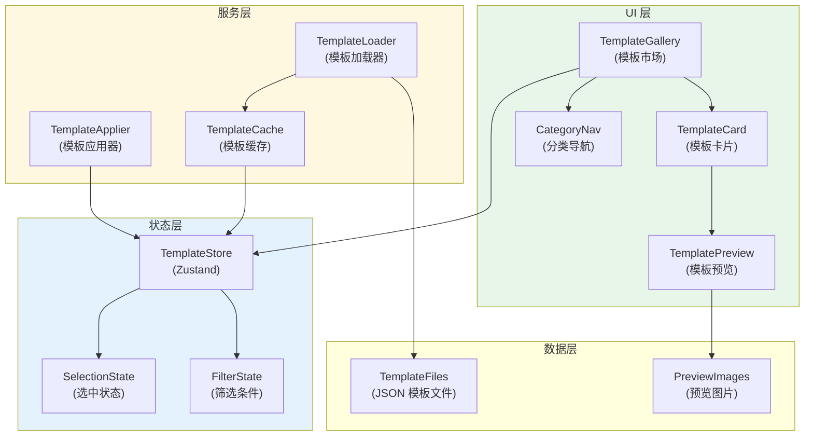
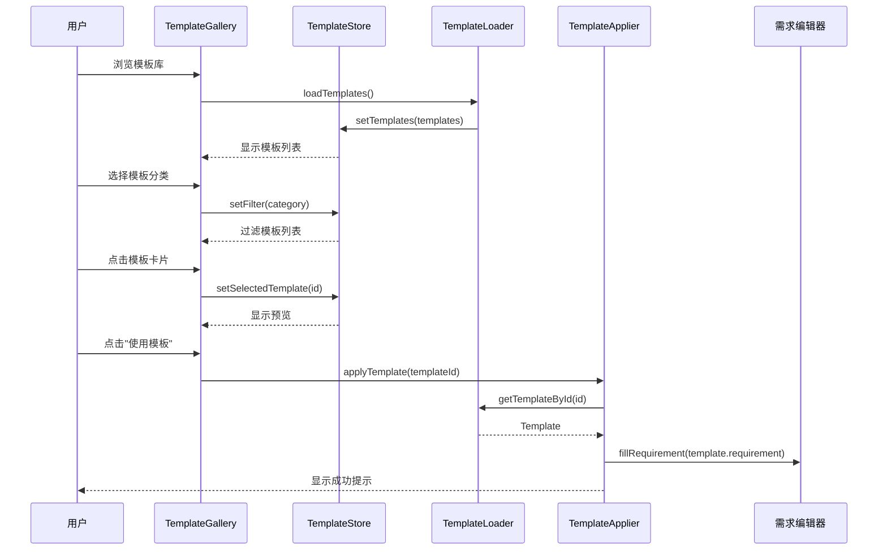
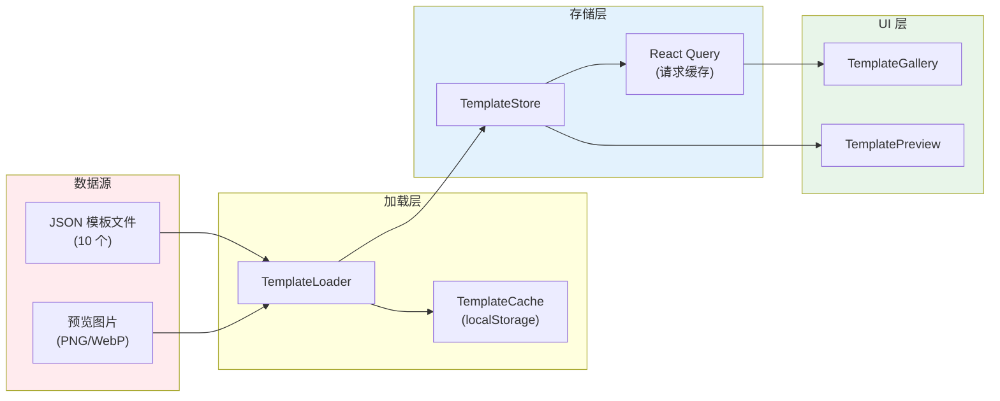
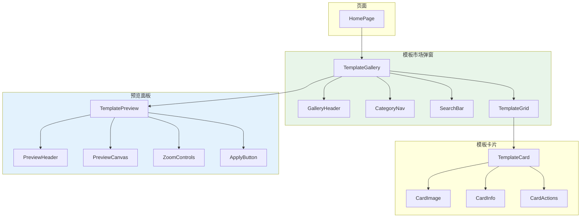

# 架构设计: 模板生态建设

**项目**: vibex-template-ecosystem  
**架构师**: Architect Agent  
**版本**: 1.0  
**日期**: 2026-03-15

---

## 1. 技术栈

| 技术 | 版本 | 用途 | 选择理由 |
|------|------|------|----------|
| React | 19.x | UI 框架 | 已有项目基础 |
| TypeScript | 5.x | 类型系统 | 已有项目基础 |
| Zustand | 4.x | 状态管理 | 已有项目基础 |
| CSS Modules | - | 样式方案 | 已有样式架构 |
| React Query | 5.x | 数据缓存 | 已安装，支持模板缓存 |

---

## 2. 架构图

### 2.1 模板系统架构



### 2.2 模板应用流程



### 2.3 模板数据流



### 2.4 组件层级



---

## 3. API 定义

### 3.1 模板数据结构

```typescript
// types/template.ts

interface Template {
  /** 模板唯一标识 */
  id: string
  /** 模板名称 */
  name: string
  /** 模板描述 */
  description: string
  /** 所属行业 */
  industry: Industry
  /** 复杂度 */
  complexity: 'low' | 'medium' | 'high'
  /** 预置需求描述 */
  requirement: string
  /** 限界上下文预置 */
  boundedContexts: TemplateBoundedContext[]
  /** 预览图片 URL */
  previewImage: string
  /** 使用次数 */
  useCount: number
  /** 标签 */
  tags: string[]
  /** 创建时间 */
  createdAt: string
  /** 更新时间 */
  updatedAt: string
}

type Industry = 
  | 'ecommerce'
  | 'education'
  | 'corporate'
  | 'tools'
  | 'social'
  | 'bi'
  | 'content'
  | 'service'
  | 'saas'
  | 'marketing'

interface TemplateBoundedContext {
  name: string
  type: 'core' | 'supporting' | 'generic'
  entities: string[]
  services: string[]
}

interface TemplateCategory {
  id: string
  name: string
  icon: string
  description: string
}
```

### 3.2 组件接口

```typescript
// components/template/TemplateGallery.tsx

interface TemplateGalleryProps {
  /** 是否显示 */
  isOpen: boolean
  /** 关闭回调 */
  onClose: () => void
  /** 模板应用回调 */
  onApply: (template: Template) => void
  /** 初始分类 */
  defaultCategory?: string
  /** 自定义类名 */
  className?: string
}

export function TemplateGallery({
  isOpen,
  onClose,
  onApply,
  defaultCategory,
  className,
}: TemplateGalleryProps): JSX.Element

// components/template/TemplateCard.tsx

interface TemplateCardProps {
  /** 模板数据 */
  template: Template
  /** 是否选中 */
  isSelected: boolean
  /** 点击回调 */
  onClick: (template: Template) => void
  /** 应用回调 */
  onApply: (template: Template) => void
  /** 自定义类名 */
  className?: string
}

export function TemplateCard({
  template,
  isSelected,
  onClick,
  onApply,
  className,
}: TemplateCardProps): JSX.Element

// components/template/TemplatePreview.tsx

interface TemplatePreviewProps {
  /** 模板数据 */
  template: Template | null
  /** 是否显示 */
  isOpen: boolean
  /** 关闭回调 */
  onClose: () => void
  /** 应用回调 */
  onApply: (template: Template) => void
  /** 自定义类名 */
  className?: string
}

export function TemplatePreview({
  template,
  isOpen,
  onClose,
  onApply,
  className,
}: TemplatePreviewProps): JSX.Element
```

### 3.3 Store 接口

```typescript
// stores/template-store.ts

interface TemplateState {
  // 模板列表
  templates: Template[]
  // 分类列表
  categories: TemplateCategory[]
  // 选中的模板
  selectedTemplate: Template | null
  // 筛选条件
  filter: {
    category: string | null
    search: string
    complexity: string | null
  }
  // 加载状态
  isLoading: boolean
  // 错误信息
  error: Error | null
  
  // 操作方法
  loadTemplates: () => Promise<void>
  setSelectedTemplate: (template: Template | null) => void
  setFilter: (filter: Partial<TemplateState['filter']>) => void
  resetFilter: () => void
  incrementUseCount: (templateId: string) => void
}

export const useTemplateStore = create<TemplateState>((set, get) => ({
  templates: [],
  categories: DEFAULT_CATEGORIES,
  selectedTemplate: null,
  filter: {
    category: null,
    search: '',
    complexity: null,
  },
  isLoading: false,
  error: null,
  
  loadTemplates: async () => {
    set({ isLoading: true, error: null })
    try {
      const templates = await TemplateLoader.loadAll()
      set({ templates, isLoading: false })
    } catch (error) {
      set({ error: error as Error, isLoading: false })
    }
  },
  
  setSelectedTemplate: (template) => set({ selectedTemplate: template }),
  
  setFilter: (filter) => set((state) => ({
    filter: { ...state.filter, ...filter }
  })),
  
  resetFilter: () => set({
    filter: { category: null, search: '', complexity: null }
  }),
  
  incrementUseCount: (templateId) => set((state) => ({
    templates: state.templates.map((t) =>
      t.id === templateId ? { ...t, useCount: t.useCount + 1 } : t
    )
  })),
}))
```

### 3.4 服务接口

```typescript
// services/template-loader.ts

interface TemplateLoader {
  /** 加载所有模板 */
  loadAll(): Promise<Template[]>
  /** 根据 ID 加载模板 */
  loadById(id: string): Promise<Template | null>
  /** 根据分类加载模板 */
  loadByCategory(category: string): Promise<Template[]>
  /** 搜索模板 */
  search(query: string): Promise<Template[]>
}

export const TemplateLoader: TemplateLoader = {
  async loadAll() {
    // 从静态 JSON 文件加载
    const modules = import.meta.glob('@/data/templates/*.json')
    const templates: Template[] = []
    
    for (const path in modules) {
      const module = await modules[path]()
      templates.push(module.default)
    }
    
    return templates
  },
  
  async loadById(id) {
    const templates = await this.loadAll()
    return templates.find((t) => t.id === id) || null
  },
  
  async loadByCategory(category) {
    const templates = await this.loadAll()
    return templates.filter((t) => t.industry === category)
  },
  
  async search(query) {
    const templates = await this.loadAll()
    const lowerQuery = query.toLowerCase()
    return templates.filter((t) =>
      t.name.toLowerCase().includes(lowerQuery) ||
      t.description.toLowerCase().includes(lowerQuery) ||
      t.tags.some((tag) => tag.toLowerCase().includes(lowerQuery))
    )
  },
}

// services/template-applier.ts

interface TemplateApplier {
  /** 应用模板到编辑器 */
  apply(template: Template): void
  /** 替换模板变量 */
  replaceVariables(template: Template, variables: Record<string, string>): string
}

export const TemplateApplier: TemplateApplier = {
  apply(template) {
    const { requirement } = template
    // 填充需求编辑器
    const editor = document.querySelector('[data-requirement-editor]')
    if (editor) {
      editor.textContent = requirement
      // 触发事件
      editor.dispatchEvent(new Event('input', { bubbles: true }))
    }
  },
  
  replaceVariables(template, variables) {
    let result = template.requirement
    for (const [key, value] of Object.entries(variables)) {
      result = result.replace(new RegExp(`\\{\\{${key}\\}\\}`, 'g'), value)
    }
    return result
  },
}
```

---

## 4. 数据模型

### 4.1 模板 JSON 结构

```json
{
  "id": "ecommerce-store",
  "name": "电商商城",
  "description": "完整的电商商城模板，包含商品管理、购物车、订单流程等核心功能",
  "industry": "ecommerce",
  "complexity": "high",
  "requirement": "开发一个电商商城，包含商品展示、分类浏览、购物车、订单管理、在线支付、用户中心等功能",
  "boundedContexts": [
    {
      "name": "商品上下文",
      "type": "core",
      "entities": ["商品", "分类", "品牌", "库存"],
      "services": ["商品服务", "分类服务", "搜索服务"]
    },
    {
      "name": "订单上下文",
      "type": "core",
      "entities": ["订单", "订单项", "购物车", "支付"],
      "services": ["订单服务", "购物车服务", "支付服务"]
    },
    {
      "name": "用户上下文",
      "type": "supporting",
      "entities": ["用户", "地址", "会员等级"],
      "services": ["用户服务", "认证服务"]
    }
  ],
  "previewImage": "/images/templates/ecommerce-preview.png",
  "tags": ["电商", "购物", "支付", "商城"],
  "useCount": 0
}
```

### 4.2 分类定义

```typescript
// constants/template-categories.ts

export const TEMPLATE_CATEGORIES: TemplateCategory[] = [
  {
    id: 'ecommerce',
    name: '电商',
    icon: '🛒',
    description: '在线商城、购物平台',
  },
  {
    id: 'education',
    name: '教育',
    icon: '📚',
    description: '在线课程、学习平台',
  },
  {
    id: 'corporate',
    name: '企业',
    icon: '🏢',
    description: '企业官网、品牌展示',
  },
  {
    id: 'tools',
    name: '工具',
    icon: '🔧',
    description: '项目管理、团队协作',
  },
  {
    id: 'social',
    name: '社交',
    icon: '👥',
    description: '社区、论坛、社交网络',
  },
  {
    id: 'bi',
    name: '数据',
    icon: '📊',
    description: '数据看板、报表分析',
  },
  {
    id: 'content',
    name: '内容',
    icon: '📝',
    description: '博客、CMS、内容管理',
  },
  {
    id: 'service',
    name: '服务',
    icon: '📅',
    description: '预约、订餐、服务预订',
  },
  {
    id: 'saas',
    name: 'SaaS',
    icon: '☁️',
    description: '订阅系统、会员管理',
  },
  {
    id: 'marketing',
    name: '营销',
    icon: '🎯',
    description: '落地页、营销活动',
  },
]
```

### 4.3 缓存模型

```typescript
// types/template-cache.ts

interface TemplateCache {
  /** 缓存的模板列表 */
  templates: Template[]
  /** 缓存时间 */
  cachedAt: number
  /** 过期时间 (毫秒) */
  ttl: number
  /** 版本号 */
  version: string
}

// 缓存策略
const CACHE_TTL = 24 * 60 * 60 * 1000 // 24 小时
const CACHE_VERSION = '1.0.0'

// localStorage key
const CACHE_KEY = 'vibex-template-cache'
```

---

## 5. 模块划分

### 5.1 文件结构

```
src/
├── components/template/
│   ├── TemplateGallery.tsx         # 模板市场主组件
│   ├── TemplateGallery.module.css
│   ├── TemplateCard.tsx            # 模板卡片
│   ├── TemplateCard.module.css
│   ├── TemplatePreview.tsx         # 模板预览
│   ├── TemplatePreview.module.css
│   ├── CategoryNav.tsx             # 分类导航
│   ├── CategoryNav.module.css
│   ├── SearchBar.tsx               # 搜索栏
│   ├── SearchBar.module.css
│   └── index.ts
│
├── stores/
│   └── template-store.ts           # 模板状态管理
│
├── services/
│   ├── template-loader.ts          # 模板加载器
│   ├── template-applier.ts         # 模板应用器
│   └── template-cache.ts           # 模板缓存
│
├── data/templates/
│   ├── ecommerce-store.json        # 电商商城
│   ├── education-platform.json     # 在线教育
│   ├── corporate-website.json      # 企业官网
│   ├── project-management.json     # 项目管理
│   ├── social-community.json       # 社交社区
│   ├── dashboard.json              # 数据看板
│   ├── blog-system.json            # 博客系统
│   ├── booking-system.json         # 预约系统
│   ├── membership-system.json      # 会员系统
│   └── landing-page.json           # 营销落地页
│
├── constants/
│   └── template-categories.ts      # 分类定义
│
├── types/
│   └── template.ts                 # 类型定义
│
└── images/templates/
    ├── ecommerce-preview.png
    ├── education-preview.png
    ├── corporate-preview.png
    └── ... (10 张预览图)
```

### 5.2 模块职责

| 模块 | 职责 | 类型 |
|------|------|------|
| TemplateGallery | 模板市场入口 | 组件 |
| TemplateCard | 模板卡片展示 | 组件 |
| TemplatePreview | 模板预览面板 | 组件 |
| CategoryNav | 分类导航 | 组件 |
| SearchBar | 搜索栏 | 组件 |
| template-store | 状态管理 | Store |
| template-loader | 模板加载 | 服务 |
| template-applier | 模板应用 | 服务 |

---

## 6. 核心实现

### 6.1 TemplateGallery 组件

```typescript
// components/template/TemplateGallery.tsx

import { useEffect, useMemo } from 'react'
import { useTemplateStore } from '@/stores/template-store'
import { CategoryNav } from './CategoryNav'
import { SearchBar } from './SearchBar'
import { TemplateCard } from './TemplateCard'
import { TemplatePreview } from './TemplatePreview'
import styles from './TemplateGallery.module.css'

export function TemplateGallery({
  isOpen,
  onClose,
  onApply,
  defaultCategory,
  className,
}: TemplateGalleryProps) {
  const {
    templates,
    selectedTemplate,
    filter,
    isLoading,
    error,
    loadTemplates,
    setSelectedTemplate,
    setFilter,
  } = useTemplateStore()
  
  // 初始加载
  useEffect(() => {
    if (isOpen && templates.length === 0) {
      loadTemplates()
    }
  }, [isOpen, templates.length, loadTemplates])
  
  // 设置默认分类
  useEffect(() => {
    if (defaultCategory) {
      setFilter({ category: defaultCategory })
    }
  }, [defaultCategory, setFilter])
  
  // 过滤模板
  const filteredTemplates = useMemo(() => {
    return templates.filter((t) => {
      if (filter.category && t.industry !== filter.category) return false
      if (filter.complexity && t.complexity !== filter.complexity) return false
      if (filter.search) {
        const query = filter.search.toLowerCase()
        return (
          t.name.toLowerCase().includes(query) ||
          t.description.toLowerCase().includes(query)
        )
      }
      return true
    })
  }, [templates, filter])
  
  if (!isOpen) return null
  
  return (
    <div className={`${styles.overlay} ${className || ''}`}>
      <div className={styles.modal}>
        <div className={styles.header}>
          <h2>选择模板</h2>
          <button onClick={onClose} className={styles.closeBtn}>×</button>
        </div>
        
        <div className={styles.toolbar}>
          <CategoryNav
            selected={filter.category}
            onSelect={(category) => setFilter({ category })}
          />
          <SearchBar
            value={filter.search}
            onChange={(search) => setFilter({ search })}
          />
        </div>
        
        {isLoading && <div className={styles.loading}>加载中...</div>}
        {error && <div className={styles.error}>{error.message}</div>}
        
        <div className={styles.grid}>
          {filteredTemplates.map((template) => (
            <TemplateCard
              key={template.id}
              template={template}
              isSelected={selectedTemplate?.id === template.id}
              onClick={setSelectedTemplate}
              onApply={onApply}
            />
          ))}
        </div>
        
        <TemplatePreview
          template={selectedTemplate}
          isOpen={!!selectedTemplate}
          onClose={() => setSelectedTemplate(null)}
          onApply={onApply}
        />
      </div>
    </div>
  )
}
```

### 6.2 样式

```css
/* TemplateGallery.module.css */

.overlay {
  position: fixed;
  top: 0;
  left: 0;
  right: 0;
  bottom: 0;
  background: rgba(0, 0, 0, 0.7);
  display: flex;
  align-items: center;
  justify-content: center;
  z-index: 1000;
}

.modal {
  background: #1a1a1a;
  border-radius: 12px;
  width: 90%;
  max-width: 1200px;
  height: 80vh;
  display: flex;
  flex-direction: column;
  overflow: hidden;
}

.header {
  display: flex;
  justify-content: space-between;
  align-items: center;
  padding: 16px 24px;
  border-bottom: 1px solid rgba(255, 255, 255, 0.1);
}

.header h2 {
  margin: 0;
  font-size: 20px;
  color: #fff;
}

.closeBtn {
  background: none;
  border: none;
  color: #fff;
  font-size: 24px;
  cursor: pointer;
  padding: 4px 8px;
}

.closeBtn:hover {
  background: rgba(255, 255, 255, 0.1);
  border-radius: 4px;
}

.toolbar {
  display: flex;
  justify-content: space-between;
  padding: 12px 24px;
  border-bottom: 1px solid rgba(255, 255, 255, 0.1);
}

.grid {
  flex: 1;
  display: grid;
  grid-template-columns: repeat(auto-fill, minmax(280px, 1fr));
  gap: 16px;
  padding: 24px;
  overflow-y: auto;
}

.loading,
.error {
  display: flex;
  align-items: center;
  justify-content: center;
  flex: 1;
  color: rgba(255, 255, 255, 0.6);
}

.error {
  color: #ef4444;
}
```

### 6.3 首页集成

```typescript
// app/page.tsx (添加模板入口)

import { TemplateGallery } from '@/components/template'

export default function HomePage() {
  const [showTemplates, setShowTemplates] = useState(false)
  const { setRequirementText } = useHomeState()
  
  const handleApplyTemplate = useCallback((template: Template) => {
    setRequirementText(template.requirement)
    setShowTemplates(false)
    // 显示成功提示
    toast.success(`已应用模板: ${template.name}`)
  }, [setRequirementText])
  
  return (
    <div className={styles.container}>
      {/* ... 其他组件 */}
      
      {/* 模板入口按钮 */}
      <button
        className={styles.templateBtn}
        onClick={() => setShowTemplates(true)}
      >
        📋 选择模板
      </button>
      
      {/* 模板市场弹窗 */}
      <TemplateGallery
        isOpen={showTemplates}
        onClose={() => setShowTemplates(false)}
        onApply={handleApplyTemplate}
      />
    </div>
  )
}
```

---

## 7. 测试策略

### 7.1 单元测试

```typescript
// __tests__/components/TemplateGallery.test.tsx

import { render, screen, fireEvent } from '@testing-library/react'
import { TemplateGallery } from '@/components/template'

const mockTemplates = [
  {
    id: 'test-1',
    name: 'Test Template',
    description: 'Test Description',
    industry: 'ecommerce',
    complexity: 'medium',
    requirement: 'Test requirement',
    boundedContexts: [],
    previewImage: '/test.png',
    tags: ['test'],
    useCount: 0,
  },
]

describe('TemplateGallery', () => {
  it('renders template list', async () => {
    render(
      <TemplateGallery
        isOpen={true}
        onClose={jest.fn()}
        onApply={jest.fn()}
      />
    )
    
    // 等待加载
    await screen.findByText('选择模板')
  })
  
  it('filters by category', async () => {
    render(
      <TemplateGallery
        isOpen={true}
        onClose={jest.fn()}
        onApply={jest.fn()}
      />
    )
    
    const categoryBtn = await screen.findByText('电商')
    fireEvent.click(categoryBtn)
    
    // 验证过滤结果
  })
})

// __tests__/services/template-loader.test.ts
describe('TemplateLoader', () => {
  it('loads all templates', async () => {
    const templates = await TemplateLoader.loadAll()
    expect(templates).toHaveLength(10)
  })
  
  it('filters by category', async () => {
    const templates = await TemplateLoader.loadByCategory('ecommerce')
    expect(templates.every((t) => t.industry === 'ecommerce')).toBe(true)
  })
})
```

### 7.2 集成测试

```typescript
// __tests__/integration/template-flow.test.tsx

describe('Template Application Flow', () => {
  it('applies template to editor', async () => {
    render(<HomePage />)
    
    // 打开模板市场
    fireEvent.click(screen.getByText('选择模板'))
    
    // 选择模板
    await screen.findByText('电商商城')
    fireEvent.click(screen.getByText('电商商城'))
    
    // 应用模板
    fireEvent.click(screen.getByText('使用模板'))
    
    // 验证需求填充
    const editor = screen.getByRole('textbox')
    expect(editor).toHaveValue(expect.stringContaining('电商'))
  })
})
```

### 7.3 覆盖率目标

| 模块 | 覆盖率目标 |
|------|-----------|
| TemplateGallery | 80% |
| TemplateCard | 85% |
| TemplatePreview | 75% |
| template-store | 90% |
| template-loader | 85% |

---

## 8. 性能评估

### 8.1 性能指标

| 指标 | 目标值 |
|------|--------|
| 模板加载时间 | < 500ms |
| 模板过滤响应 | < 100ms |
| 预览图片加载 | < 1s |
| 缓存命中率 | > 80% |

### 8.2 优化策略

| 策略 | 实现 |
|------|------|
| 懒加载预览图 | Intersection Observer |
| 缓存策略 | localStorage + TTL |
| 搜索防抖 | debounce 300ms |
| 虚拟列表 | react-window (模板 > 50 时) |

---

## 9. 风险评估

| 风险 | 概率 | 影响 | 缓解措施 |
|------|------|------|----------|
| 模板需求与实际不符 | 中 | 中 | 提供修改入口 |
| 预览图加载慢 | 中 | 低 | 缩略图 + 懒加载 |
| 缓存失效 | 低 | 低 | 版本号控制 |
| 搜索性能差 | 低 | 低 | 防抖 + 索引 |

---

## 10. 实施计划

| 阶段 | 内容 | 工时 |
|------|------|------|
| Phase 1 | 数据结构 + 类型定义 | 0.5 天 |
| Phase 2 | TemplateLoader + Cache | 0.5 天 |
| Phase 3 | TemplateGallery UI | 1.5 天 |
| Phase 4 | TemplateCard + Preview | 1 天 |
| Phase 5 | 10 个模板 JSON 文件 | 3 天 |
| Phase 6 | 首页集成 + 测试 | 1.5 天 |
| Phase 7 | 预览图设计 | 1 天 |

**总计**: 9 天

---

## 11. 检查清单

- [x] 技术栈选型 (React + Zustand + CSS Modules)
- [x] 架构图 (系统架构 + 应用流程 + 数据流)
- [x] API 定义 (组件 + Store + 服务接口)
- [x] 数据模型 (Template + Category + Cache)
- [x] 核心实现 (TemplateGallery + 样式 + 集成)
- [x] 测试策略 (单元 + 集成)
- [x] 性能评估
- [x] 风险评估
- [x] 10 个模板规划

---

**产出物**: `/root/.openclaw/vibex/docs/vibex-template-ecosystem/architecture.md`