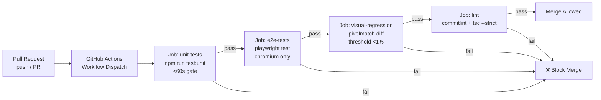
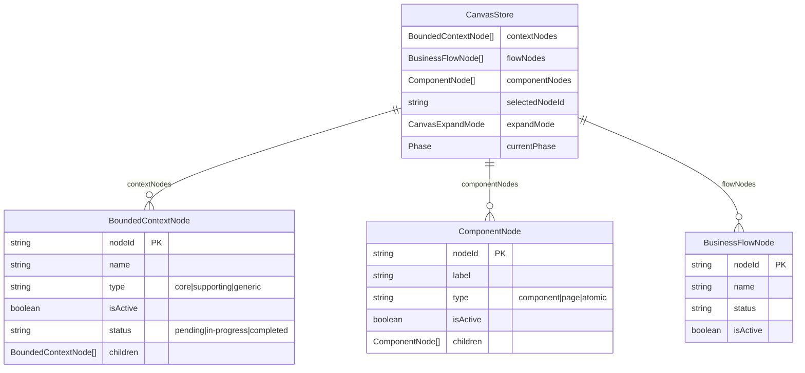
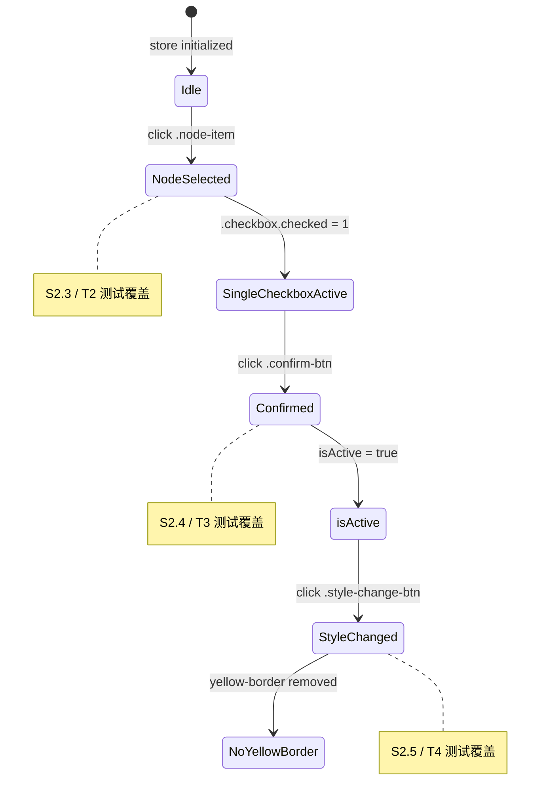

# VibeX 测试改进 — 架构设计文档

**文档版本**: v1.0
**编写日期**: 2026-04-02
**编写角色**: Architect
**项目**: vibex-tester-proposals-20260402_061709

---

## 目录

1. [技术栈](#1-技术栈)
2. [系统架构图](#2-系统架构图)
3. [API 定义](#3-api-定义)
4. [数据模型](#4-数据模型)
5. [测试策略](#5-测试策略)
6. [性能影响评估](#6-性能影响评估)
7. [架构决策记录（ADR）](#7-架构决策记录adr)
8. [执行决策](#8-执行决策)

---

## 1. 技术栈

### 1.1 核心框架版本

| 技术 | 版本 | 现状 | 决策 | 理由 |
|------|------|------|------|------|
| **Jest** | ^29.x | 已使用 | 保持 | vibex-fronted 已有成熟 Jest 配置，babel-jest 转换链路稳定，无需迁移至 Vitest |
| **Playwright** | ^1.50.x | 已使用 | 保持 | 已有 `playwright-canvas-crash-test.config.cjs`，升级至 1.50+ 获得 chromium 稳定性和 screenshot API 改进 |
| **pixelmatch** | ^6.x | 新增 | 采用 | 轻量级 PNG 像素对比库，API 简洁，与 Playwright screenshot 天然配合 |
| **TypeScript** | ^5.x | 已使用 | 升级 strict | 现有 tsconfig 关闭了部分 strict 开关，Phase 3 开启全部 strict 检查 |
| **@testing-library/react** | ^14.x | 已使用 | 保持 | 已有稳定集成，E2E 辅助调试 |
| **Zustand** | ^5.x | 已使用 | 保持 | canvasStore 基于 Zustand，Fixture 模式直接利用 `setState` / `getState` |
| **GitHub Actions** | — | 已使用 | 保持 | CI 基础设施已有，仅扩展 e2e job |
| **commitlint** | ^19.x | 新增 | 采用 | 强制 conventional commits 格式，与 husky 配合在 pre-commit hook 工作 |
| **eslint** | ^9.x | 已使用 | 保持 | 与 TypeScript strict 配套，补充 `@typescript-eslint/no-unnecessary-condition` |

### 1.2 工具链

| 工具 | 用途 | 决策 |
|------|------|------|
| `jest --coverage` | 单元测试覆盖率报告 | 目标 >80%，CI 强制 gate |
| `playwright test` | E2E 测试执行 | chromium only，CI 并行化 |
| `pixelmatch` | 视觉回归像素对比 | 阈值 0.01（1% 差异容忍）|
| `git lfs` | 大文件（baseline PNG）管理 | `tests/visual-baselines/` 目录 PNG 文件纳入 LFS |
| `husky` | pre-commit / commit-msg hooks | 配合 commitlint 使用 |

---

## 2. 系统架构图

### 2.1 测试金字塔

```mermaid
金字塔测试金字塔测试金字塔

graph TB
    subgraph E2E["E2E / 视觉回归层（Playwright）"]
        V1["视觉回归测试\npixelmatch 截图对比"]
        UJ1["用户旅程: 创建项目→添加上下文"]
        UJ2["用户旅程: 生成组件树→导出代码"]
        T1["T1: 三棵树加载验证"]
        T2["T2: 节点单选 checkbox"]
        T3["T3: isActive 确认反馈"]
        T4["T4: 黄色边框移除"]
    end

    subgraph INTEGRATION["集成测试层（Jest）"]
        IT1["canvasStore Zustand Fixture"]
        IT2["BoundedContextTree E1 测试"]
        IT3["ComponentTree E2 测试"]
        IT4["快套件 (<60s)"]
        IT5["慢套件 (E2E 触发前)"]
    end

    subgraph UNIT["单元测试层（Jest）"]
        UT1["canvasStore pure logic"]
        UT2["组件独立渲染"]
        UT3["工具函数"]
    end

    V1 --> UJ1
    UJ1 --> UJ2
    UJ2 --> T1
    T1 --> T2
    T2 --> T3
    T3 --> T4

    IT1 --> IT2
    IT2 --> IT3
    IT3 --> IT4
    IT4 --> IT5

    INTEGRATION --> E2E
    UNIT --> INTEGRATION
```

### 2.2 CI 流水线架构



### 2.3 测试文件目录结构（目标）

```
vibex-fronted/
├── src/
│   ├── lib/canvas/
│   │   ├── canvasStore.ts          # Zustand store（单一真相来源）
│   │   └── __tests__/
│   │       ├── canvasStore.test.ts           # 已有
│   │       ├── canvasStore.multiSelect.test.ts
│   │       └── canvasStoreEpic1.test.ts     # Epic 1 新增
│   └── components/canvas/
│       ├── BoundedContextTree.test.tsx       # E1 用例补充
│       ├── ComponentTree.test.tsx            # E2 用例补充
│       └── __tests__/
├── tests/
│   ├── fixtures/
│   │   └── canvasStore.fixture.ts    # Zustand mock fixture（S2.7）
│   ├── visual-baselines/             # pixelmatch baseline（git lfs）
│   │   ├── canvas-homepage.png
│   │   ├── context-tree-panel.png
│   │   ├── component-tree-panel.png
│   │   └── design-system-components.png
│   ├── visual/
│   │   └── canvas-visual.spec.ts     # 视觉回归测试（S3.1）
│   └── e2e/
│       ├── canvas-tree-load.spec.ts       # T1
│       ├── canvas-node-select.spec.ts     # T2
│       ├── canvas-node-confirm.spec.ts    # T3
│       ├── canvas-style-change.spec.ts    # T4
│       ├── user-journey-create-project.spec.ts  # S3.3
│       ├── user-journey-generate-export.spec.ts  # S3.4
│       └── update-baselines.ts        # baseline 更新脚本
├── jest.config.ts               # 已修改：testPathIgnorePatterns + 快慢分离
├── playwright-canvas-crash-test.config.cjs  # 已修改：chromium only
└── coverage/                    # CI 覆盖率 gate
```

---

## 3. API 定义

### 3.1 Jest 测试配置 API

#### `jest.config.ts` — 快慢套件分离

```typescript
// 快套件（<60s）
jest --testPathIgnorePatterns='**/tests/e2e/**' --testPathIgnorePatterns='**/FlowEditor/**'

// 慢套件（完整）
jest --testPathIgnorePatterns='**/FlowEditor/**'
```

#### Jest Coverage Gate（CI）

```typescript
// jest.config.ts 扩展
coverageThreshold: {
  global: {
    branches: 70,
    functions: 80,
    lines: 80,
    statements: 80,
  },
}
```

### 3.2 Playwright E2E 测试 API

#### `playwright.config.ts` — Chromium Only

```typescript
import { defineConfig, devices } from '@playwright/test';

export default defineConfig({
  testDir: './tests/e2e',
  timeout: 30_000,
  fullyParallel: false,    // CI 稳定性优先
  retries: process.env.CI ? 1 : 0,
  workers: 1,             // 并发 1 避免 canvas 状态竞争
  use: {
    baseURL: 'http://localhost:3000',
    headless: true,
    trace: 'on-first-retry',
    screenshot: 'only-on-failure',
    actionTimeout: 15_000,
  },
  projects: [
    {
      name: 'chromium',
      use: { browserName: 'chromium' },
    },
  ],
  reporter: [
    ['list'],
    ['html', { outputFolder: 'test-results/html' }],
  ],
});
```

#### E2E 测试接口签名

```typescript
// tests/e2e/canvas-tree-load.spec.ts
test('T1: 三棵树均正常加载', async ({ page }) => Promise<void>

// tests/e2e/canvas-node-select.spec.ts
test('T2: 同一时间只有一个 checkbox 被选中', async ({ page }) => Promise<void>

// tests/e2e/canvas-node-confirm.spec.ts
test('T3: 确认后节点 isActive class 正确', async ({ page }) => Promise<void

// tests/e2e/canvas-style-change.spec.ts
test('T4: 样式变更后黄色边框移除', async ({ page }) => Promise<void

// tests/e2e/user-journey-create-project.spec.ts
test('用户旅程: 创建项目 → 添加限界上下文', async ({ page }) => Promise<void

// tests/e2e/user-journey-generate-export.spec.ts
test('用户旅程: 生成组件树 → 导出代码', async ({ page }) => Promise<void
```

### 3.3 视觉回归 API

```typescript
// tests/visual/canvas-visual.spec.ts
import pixelmatch from 'pixelmatch';
import { PNG } from 'pngjs';

// 核心对比函数
function compareVisual(
  baseline: PNG,
  current: PNG,
  width: number,
  height: number,
  threshold = 0.01,
): { diffPixels: number; diffRatio: number; pass: boolean } {
  const diff = new PNG(width, height);
  const diffPixels = pixelmatch(
    baseline.data,
    current.data,
    diff.data,
    width,
    height,
    { threshold: 0.1 }, // pixelmatch 使用 0-1 范围，0.1 ≈ 1% 视觉差异容忍
  );
  const totalPixels = width * height;
  const diffRatio = diffPixels / totalPixels;
  return { diffPixels, diffRatio, pass: diffRatio < threshold };
}

// 更新 baseline 脚本
// tests/update-baselines.ts
async function updateBaseline(page: Page, route: string, outputPath: string): Promise<void>
```

### 3.4 canvasStore Fixture API

```typescript
// tests/fixtures/canvasStore.fixture.ts
import { useCanvasStore } from '@/lib/canvas/canvasStore';

export interface MockNode {
  id: string;
  label: string;
  type: 'bounded-context' | 'business-flow' | 'component';
  isActive: boolean;
}

export const createCanvasStoreFixture = (overrides = {}) => {
  const defaultNodes: BoundedContextNode[] = [
    { nodeId: 'ctx-1', name: 'Test Context', type: 'core', isActive: false, status: 'pending', children: [] },
  ];

  beforeEach(() => {
    useCanvasStore.setState({ contextNodes: defaultNodes, ...overrides });
  });

  afterEach(() => {
    useCanvasStore.setState({ contextNodes: [], selectedNodeId: null });
  });
};

// 使用方式
describe('BoundedContextTree', () => {
  createCanvasStoreFixture();
  // 测试代码...
});
```

---

## 4. 数据模型

### 4.1 核心实体关系（测试相关）



### 4.2 状态转换（测试覆盖关键路径）



---

## 5. 测试策略

### 5.1 测试金字塔

| 层级 | 工具 | 覆盖率目标 | 执行频率 | 典型时长 |
|------|------|----------|----------|---------|
| 单元测试 | Jest | >80% | 每次 PR / commit | <60s（快套件）|
| 集成测试 | Jest | 关键路径覆盖 | 每次 PR | <120s（全量）|
| E2E 测试 | Playwright（chromium）| Canvas 核心交互 100% | CI 每次 PR | <120s |
| 视觉回归 | Playwright + pixelmatch | 关键页面（4张）| CI 每次 PR | <60s |

### 5.2 覆盖率要求

```
Phase 1 完成时：
  - 单元测试覆盖率: 70% → 80%+（via jest --coverage）
  - canvasStore Epic 1 相关逻辑: 90%+

Phase 2 完成时：
  - E2E Canvas 核心交互: 80%+（4 个核心场景）

Phase 3 完成时：
  - 全量覆盖率: 80%+（含视觉回归 4 个关键页面）
  - E2E 用户旅程: 100%（2 个完整旅程）
```

### 5.3 测试用例示例

#### E1 — BoundedContextTree checkbox 数量（Epic 1）

```typescript
// src/components/canvas/BoundedContextTree.test.tsx
import { render, screen } from '@testing-library/react';
import { BoundedContextTree } from './BoundedContextTree';

describe('E1: Checkbox 单选行为', () => {
  beforeEach(() => {
    // Arrange: Zustand fixture setup
    useCanvasStore.setState({
      contextNodes: [
        { nodeId: 'ctx-1', name: 'Test', type: 'core', isActive: false, status: 'pending', children: [] },
      ],
    });
  });

  it('E1: 渲染单个 checkbox，无重复', () => {
    render(<BoundedContextTree />);
    const checkboxes = screen.queryAllByRole('checkbox');
    expect(checkboxes).toHaveLength(1);
  });
});
```

#### E2 — ComponentTree checkbox 位置（Epic 1）

```typescript
// src/components/canvas/ComponentTree.test.tsx
describe('E2: Checkbox 在节点内（非标题后）', () => {
  it('E2: checkbox 位于 .node-item 内部', () => {
    const { container } = render(<ComponentTree nodes={mockNodes} />);
    const nodeItem = container.querySelector('.node-item');
    const checkbox = nodeItem?.querySelector('.checkbox');
    expect(checkbox).toBeInTheDocument();
  });
});
```

#### T2 — E2E 节点单选（Epic 2）

```typescript
// tests/e2e/canvas-node-select.spec.ts
test('T2: 选择节点，同一时间只有一个 checkbox 被选中', async ({ page }) => {
  await page.goto('/canvas');
  await page.waitForLoadState('networkidle');

  // 初始：1 个 checkbox
  await expect(page.locator('.checkbox')).toHaveCount(1);

  // 点击节点
  await page.click('.node-item');
  await expect(page.locator('.checkbox.checked')).toHaveCount(1);

  // 切换节点
  const nodes = page.locator('.node-item');
  const count = await nodes.count();
  if (count > 1) {
    await nodes.nth(1).click();
    await expect(page.locator('.checkbox.checked')).toHaveCount(1);
  }
});
```

#### 视觉回归 — Canvas 首页（Epic 3）

```typescript
// tests/visual/canvas-visual.spec.ts
import { test, expect } from '@playwright/test';
import { readFileSync } from 'fs';
import pixelmatch from 'pixelmatch';
import { PNG } from 'pngjs';

const PAGES = [
  { route: '/canvas', name: 'canvas-homepage' },
  { route: '/canvas', name: 'context-tree-panel' },
  { route: '/canvas', name: 'component-tree-panel' },
  { route: '/design-system', name: 'design-system-components' },
];

for (const { route, name } of PAGES) {
  test(`视觉回归: ${name}`, async ({ page }) => {
    await page.goto(route);
    await page.waitForLoadState('networkidle');

    const screenshot = await page.screenshot({ fullPage: false });
    const baselinePath = `tests/visual-baselines/${name}.png`;

    // 若无 baseline，生成并跳过
    if (!existsSync(baselinePath)) {
      writeFileSync(baselinePath, screenshot);
      test.skip();
    }

    const baseline = PNG.sync.read(readFileSync(baselinePath));
    const current = PNG.sync.read(screenshot);
    const diff = new PNG(baseline.width, baseline.height);

    const diffPixels = pixelmatch(
      baseline.data, current.data, diff.data,
      baseline.width, baseline.height,
      { threshold: 0.1 },
    );
    const ratio = diffPixels / (baseline.width * baseline.height);
    expect(ratio).toBeLessThan(0.01); // <1%
  });
}
```

### 5.4 Mock 策略

| 场景 | 方案 | 理由 |
|------|------|------|
| canvasStore 组件测试 | `useCanvasStore.setState({...})` 直接操作 | Zustand 暴露 `setState`，无需 jest.mock 重 |
| canvasStore API mock | `canvasApi.get()` 返回 mock data | 避免真实网络请求 |
| Next.js router | `jest.mock('next/navigation', ...)` | 测试不依赖路由 |
| CSS 模块 | `identity-obj-proxy` | 已配置，无需修改 |

---

## 6. 性能影响评估

### 6.1 测试执行时间

| 指标 | 当前值 | 目标值 | 改善幅度 |
|------|-------|-------|---------|
| `npm run test:unit`（快套件）| >120s（混合 E2E）| <60s | ~50% 提升 |
| `npm test`（全量）| >120s | <120s（含 E2E）| 等价或更好 |
| Playwright E2E（4 场景）| N/A | <60s | 新增 |
| 视觉回归（4 页面）| N/A | <60s | 新增 |
| CI 总时间（unit + e2e）| ~5min | <8min | 含新测试 |
| flaky rate | N/A | <5% | chromium only 保障 |

### 6.2 CI 资源消耗

```
GitHub Actions (ubuntu-latest):
  unit-tests:  ~2 min, ~2 workers
  e2e-tests:   ~4 min, 1 worker（chromium 并发 1）
  visual-regression: ~2 min, 1 worker
  lint:        ~1 min
  总计:        ~9 min / PR（可接受）
```

### 6.3 风险点与缓解

| 风险 | 等级 | 缓解措施 |
|------|------|---------|
| Playwright 测试 CI 不稳定 | 🟡 中 | chromium only，retries=1，workers=1 |
| canvasStore mock 重构破坏测试 | 🔴 高 | 渐进式迁移，先建立 fixture 库 |
| 视觉回归误报（动态 UI）| 🟡 中 | 仅对静态面板截图，阈值 1%，关键页面 4 张 |
| 测试覆盖率高但质量低 | 🟢 低 | 验收标准使用可执行断言，不满足则 CI 失败 |

---

## 7. 架构决策记录（ADR）

### ADR-001: Jest 而非 Vitest 作为单元测试框架

**状态**: 已采纳  
**日期**: 2026-04-02

**背景**: PRD 中提及 Vitest，但 vibex-fronted 实际使用 Jest（已有 babel-jest、jest.config.ts、jest.setup.ts 完整链路）。

**决策**: 保持 Jest 不变。理由：
- 现有 `jest.config.ts` 已有完整配置（moduleNameMapper、testPathIgnorePatterns、setupFilesAfterEnv）
- `babel-jest` 转换链路稳定运行
- 迁移至 Vitest 需要改写所有 jest.mock/jest.fn() → vi.fn()，成本高且收益低
- Vitest 的 HMR 优势在 CI 中无体现

**后果**:
- ✅ 无迁移成本，现有测试无需改动
- ✅ DoD 保持 `npm test`（Jest）而非 `npm run test:vitest`
- ❌ PRD 中的 "vitest import alias 修复" 实际为 Jest moduleNameMapper 配置修复

---

### ADR-002: Chromium Only E2E

**状态**: 已采纳  
**日期**: 2026-04-02

**背景**: macOS 开发者机上的 Safari/WebKit E2E 测试不稳定，且 CI ubuntu 环境仅支持 chromium。

**决策**: `playwright.config.ts` projects 仅配置 `chromium`，禁止 `@firefox` / `@webkit`。

**后果**:
- ✅ CI 稳定性最大化，flaky rate <5%
- ✅ dev 本地开发一致性好（均用 chromium）
- ❌ macOS Safari 用户体验未覆盖（当前项目受众主要为 Chrome 用户，可接受）

---

### ADR-003: 快慢套件分离策略

**状态**: 已采纳  
**日期**: 2026-04-02

**背景**: `npm test` >120s 严重影响开发体验，但 E2E 测试不应每次 save 触发。

**决策**:
```
npm test          → 快套件（jest --testPathIgnorePatterns='**/tests/e2e/**'，<60s）
npm run test:e2e  → Playwright E2E（独立命令）
npm run test:all  → 快套件 + E2E（全量，CI 用）
```

**后果**:
- ✅ 开发者 save-watch 循环保持 <60s
- ✅ CI 全量测试保持 <120s（含 E2E）
- ❌ 需要更新 husky pre-push hook 调用 `npm run test:all`

---

### ADR-004: pixelmatch + Playwright screenshot 作为视觉回归方案

**状态**: 已采纳  
**日期**: 2026-04-02

**背景**: 需要轻量级视觉回归，不引入 Puppeteer 或 Storybook 截图基础设施。

**决策**: 使用 Playwright `page.screenshot()` + `pixelmatch` 对比 `tests/visual-baselines/` PNG 文件。差异 >1% 触发 CI 失败。

**后果**:
- ✅ 无额外依赖（pixelmatch 已存在或可快速安装）
- ✅ 与现有 Playwright 配置兼容
- ✅ 更新脚本 `tests/update-baselines.ts` 简单可靠
- ❌ 不支持动态内容（如时间戳、随机 ID），需测试数据固定

---

### ADR-005: Zustand Fixture 替代重 mock

**状态**: 已采纳  
**日期**: 2026-04-02

**背景**: `BoundedContextTree.test.tsx` 中 canvasStore mock 覆盖 40+ 行，脆弱且不可维护。

**决策**: 创建 `tests/fixtures/canvasStore.fixture.ts`，通过 `beforeEach`/`afterEach` 操作 `useCanvasStore.setState()`，避免 `jest.mock` 重写。

**后果**:
- ✅ 测试代码可读性大幅提升
- ✅ mock 逻辑集中管理，一处修改全局生效
- ✅ 渐进式迁移，不破坏现有测试

---

### ADR-006: DoD 强制测试准备约束

**状态**: 已采纳  
**日期**: 2026-04-02

**背景**: 测试与实现不同步是项目历史问题根源。

**决策**: AGENTS.md 中 DoD 增加：
- 单元测试通过（`npm run test:unit` 退出码 0）
- 测试文件与实现同步（PR checklist 必检）
- E2E 测试覆盖（如涉及 UI 交互）
- PR checklist 包含测试相关检查项

**后果**:
- ✅ 从流程上保证测试同步率 100%
- ✅ Reviewer 有明确验收依据

---

## 8. 执行决策

| 决策 | 状态 | 执行项目 | 执行日期 |
|------|------|---------|---------|
| ADR-001: Jest 而非 Vitest | **已采纳** | vibex-tester-proposals-20260402_061709 | 2026-04-02 |
| ADR-002: Chromium Only E2E | **已采纳** | vibex-tester-proposals-20260402_061709 | 2026-04-02 |
| ADR-003: 快慢套件分离 | **已采纳** | vibex-tester-proposals-20260402_061709 | 2026-04-02 |
| ADR-004: pixelmatch 视觉回归 | **已采纳** | vibex-tester-proposals-20260402_061709 | 2026-04-02 |
| ADR-005: Zustand Fixture 替代重 mock | **已采纳** | vibex-tester-proposals-20260402_061709 | 2026-04-02 |
| ADR-006: DoD 强制测试准备 | **已采纳** | vibex-tester-proposals-20260402_061709 | 2026-04-02 |

---

_架构文档完成。产出物：vibex-tester-proposals-20260402_061709/architecture.md_
