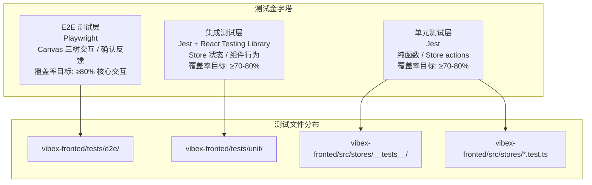
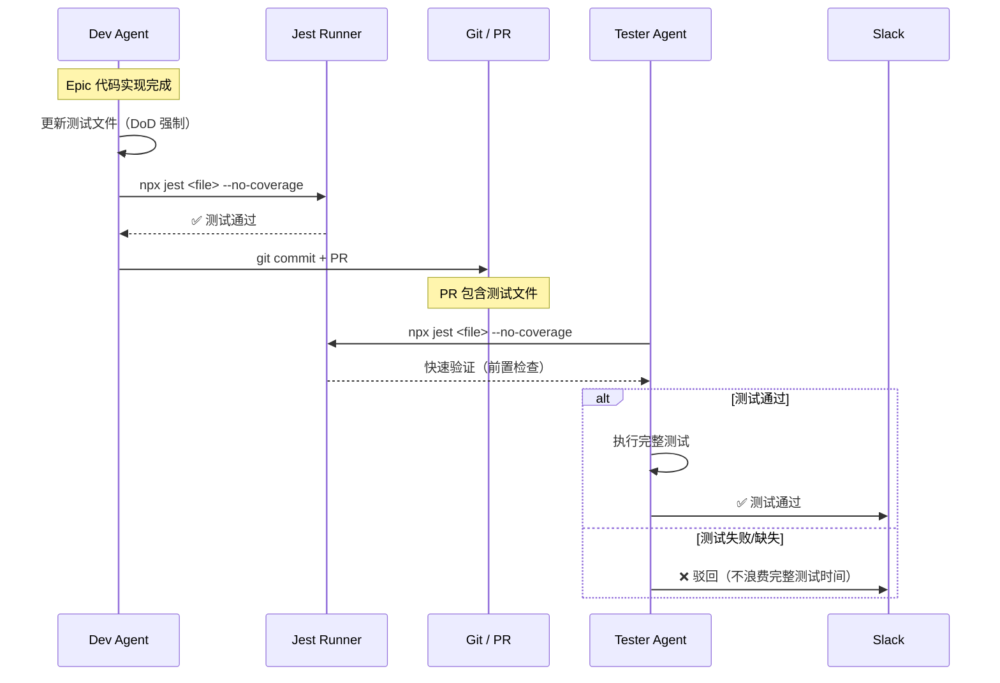
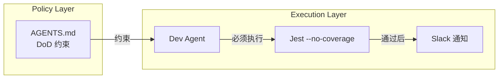
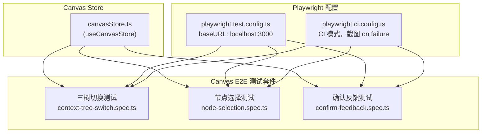
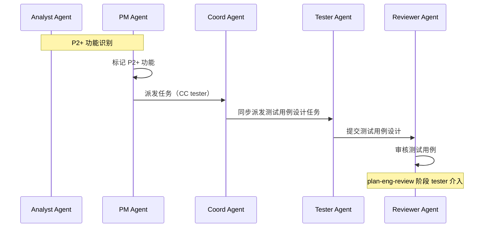

# VibeX 测试流程改进 — 系统架构设计

**文档版本**: v1.0  
**编写日期**: 2026-04-02  
**编写角色**: Architect  
**项目**: vibex-tester-proposals-20260402_201318

---

## 1. 执行决策

- **决策**: 已采纳
- **执行项目**: vibex-tester-proposals-20260402_201318
- **执行日期**: 2026-04-02

---

## 2. Tech Stack

| 类别 | 技术选型 | 版本/备注 | 选型理由 |
|------|---------|-----------|---------|
| 单元测试框架 | **Jest** | vibex-fronted 已内置 | 覆盖已有 store 测试，与现有 `jest.config.ts` 兼容 |
| E2E 测试框架 | **Playwright** | `playwright.test.config.ts` 已配置 | 支持多浏览器，有 CI 模式，满足 Canvas 交互测试需求 |
| 测试通知 | `test-notify.js` | 已有脚本 | 现有 Slack 通知机制复用 |
| 覆盖率工具 | Jest 内置 `--coverage` | babel-jest transform | 已有 jest setup，无需新增依赖 |
| 状态管理 | `team-tasks` JSON | CLI 管理 | 已有基础设施，无需修改 |
| CI/CD | GitHub Actions | 已有 `playwright.ci.config.ts` | 复用现有 pipeline |

**无需引入新技术栈** — 本项目所有工具均已在项目中安装配置。

---

## 3. 架构总览

### 3.1 组件关系图

```mermaid
C4Context
  title 系统上下文 — VibeX 测试流程改进

  Person(dev, "Dev Agent", "代码实现者，需遵循 DoD 约束")
  Person(tester, "Tester Agent", "测试执行者，早期介入设计阶段")
  Person(coord, "Coord Agent", "任务协调者，状态校验")
  Person(pm, "PM Agent", "产品经理，验收决策者")

  System_Boundary(vibex, "VibeX System") {
    System_Ext(slack, "Slack", "消息通知渠道")
    System(frontend, "vibex-fronted")
    System(playwright, "Playwright E2E Runner")
    System(jest, "Jest Unit Runner")
    System(teamtasks, "team-tasks CLI", "任务状态管理")
  }

  Rel(dev, slack, "提交代码通知")
  Rel(dev, jest, "运行单元测试")
  Rel(dev, teamtasks, "更新任务状态")
  Rel(tester, jest, "验证测试通过")
  Rel(tester, playwright, "运行 E2E 测试")
  Rel(tester, slack, "提交驳回/通过报告")
  Rel(coord, teamtasks, "校验任务状态")
  Rel(pm, teamtasks, "审核状态变更")

  UpdateRel(dev, slack, "✅ 已修复，请重新测试")
  UpdateRel(coord, teamtasks, "拒绝派发非 ready 任务")
```

### 3.2 测试分层架构



### 3.3 DoD 约束执行流程



---

## 4. 各 Epic 详细方案

### Epic 1 — 强制测试同步机制（DoD 约束）

**架构要点**: AGENTS.md DoD 约束为**政策层**，不引入代码依赖。



**实现方案**:
- 修改 `vibex/agents/AGENTS.md`（新建路径）或现有 AGENTS.md
- 添加 DoD 章节：每条 Epic 完成后，`npx jest <file> --no-coverage` 必须通过
- Tester 前置检查：收到任务后先运行 jest，失败直接驳回（不浪费完整测试时间）

### Epic 2 — 遗留驳回项修复

**受影响文件**:

| Story | 文件路径 | 操作 |
|-------|---------|------|
| S2.1 | `vibex-fronted/src/stores/__tests__/sessionStore.test.ts` | 新建 |
| S2.1 | `vibex-fronted/src/stores/sessionStore.ts` | 确认存在 |
| S2.2 | `vibex-fronted/src/stores/checkbox-persist*` | 确认 dev commit |

**注意**: `sessionStore` 不在现有 stores 列表中，需要先确认文件路径。若为新 store，按 Epic 3 规范创建。

### Epic 3 — Store 拆分测试覆盖率

**现有 Store 测试状态**:

| Store | 已有测试文件 | 当前覆盖率 | 目标覆盖率 | 优先级 |
|-------|------------|-----------|-----------|------|
| authStore | ✅ `__tests__/authStore.test.ts` | 未知 | ≥80% | 低 |
| visualizationStore | ✅ `__tests__/visualizationStore.test.ts` | 未知 | ≥80% | 低 |
| previewStore | ✅ `__tests__/previewStore.test.ts` | 未知 | ≥80% | 低 |
| navigationStore | ✅ `__tests__/navigationStore.test.ts` | 未知 | ≥80% | 低 |
| contextStore | ⚠️ `contextSlice.ts` / `contextSlice.test.ts` | 0% | ≥80% | 高 |
| uiStore | ❓ 需确认是否存在 | 0% | ≥80% | 高 |
| flowStore | ⚠️ `simplifiedFlowStore.ts` | 0% | ≥80% | 高 |
| componentStore | ❓ 需确认是否存在 | 0% | ≥80% | 高 |
| sessionStore | ❓ 需确认文件路径 | 0% | ≥70% | 高 |

> **架构决策**: 不新增测试框架。每个 store 的 `.test.ts` 文件放置于同目录（`src/stores/__tests__/` 或 `src/stores/*.test.ts`），保持与现有结构一致。

**覆盖率执行方案**:

```bash
# 单个 store 覆盖率检查
npx jest contextStore --coverage --coverageReporters="text" --coverageReporters="lcov"

# 批量覆盖率检查（新增 npm script）
npx jest --coverage --testPathPattern="stores"
```

### Epic 4 — Canvas E2E 测试

**测试文件路径**: `vibex-fronted/tests/e2e/canvas/`



**E2E 测试设计原则**:
1. 每个测试文件对应一个 Epic 交互场景
2. 使用 `data-testid` 选择器（由 dev 在实现时添加）
3. Flaky 防护：同一测试连续运行 3 次均通过才算稳定
4. 截图留存：失败时自动截图保存到 `test-results/`

### Epic 5 — Tester 早期介入机制

**协作流程**:



**无需代码修改** — 机制通过流程约束和 coord CC 机制实现。

### Epic 6 — 状态同步机制

**架构要点**: Coord Agent 侧逻辑修改，不涉及前端代码。

```mermaid
graph TD
    subgraph "Coord Agent"
        C1["任务派发函数"]
        C2["team-tasks CLI 读取"]
        C3["状态校验逻辑"]
        C4["Slack 消息格式化"]
    end

    C1 --> C2
    C2 --> C3
    C3 -->|非 ready| C4
    C3 -->|ready| C5["派发任务"]
    C4 -->|"❌ 拒绝派发<br/>原因: 任务非 ready 状态"]
    C5 -->|"✅ 已修复，请重新测试"
```

**实现位置**: `openclaw/skills/team-tasks/` 或 `openclaw/extensions/*/team-tasks/` 中的 coord 相关逻辑。

---

## 5. 性能影响评估

### 5.1 测试执行时间

| 测试类型 | 当前基准 | 增量影响 | 目标上限 |
|---------|---------|---------|---------|
| 单个 store Jest 测试 | ~5-15s | +1-2s (覆盖率计算) | <60s 全套 |
| 完整 Jest 套件 | ~30-60s | +10-20s (覆盖率) | <120s |
| Canvas E2E (3个场景) | N/A | +30-60s | <120s |

**缓解措施**:
- Jest `--coverage` 仅在 CI/PR 阶段强制，本地开发可跳过
- E2E 测试在 CI pipeline 并行执行（`workers: 1` 改为 `workers: 2`）
- Playwright `retries: 0` 避免重试消耗时间

### 5.2 覆盖率计算开销

```bash
# 覆盖率计算增加约 30-50% 测试时间
# 策略: 开发阶段不强制覆盖率，PR 阶段强制
```

### 5.3 存储影响

| 产物 | 估计大小 | 保留策略 |
|-----|---------|---------|
| Jest coverage report (lcov) | ~500KB | 每次 PR 覆盖，不持久化 |
| Playwright trace | ~1-5MB/次 | 仅失败时保存 |
| Playwright screenshot | ~100-500KB/次 | 仅失败时保存 |

---

## 6. ADR（架构决策记录）

### ADR-001: Jest 作为唯一单元测试框架

**状态**: 已采纳  
**背景**: vibex-fronted 已使用 Jest 作为测试框架，Epic 3-4 无需引入 Vitest 或其他框架。  
**决策**: 继续使用 Jest，新增 store 测试文件遵循现有 `jest.config.ts` 配置。  
**后果**:
- ✅ 无学习成本，团队已有 Jest 使用经验
- ✅ 配置复用，现有 `moduleNameMapper`、`transform` 直接可用
- ❌ Jest 在大型项目速度慢于 Vitest（当前规模可接受）

### ADR-002: Store 测试文件放置位置

**状态**: 已采纳  
**背景**: 现有 stores 目录同时存在 `__tests__/` 子目录和 `.test.ts` 并列文件，分布不一致。  
**决策**: 新建 store 测试文件放置于 `src/stores/__tests__/`，与 `visualizationStore.test.ts` 等并列文件共存（不迁移现有文件）。  
**后果**:
- ✅ 不破坏现有测试路径引用
- ✅ 与 `jest.config.ts` 中 `moduleNameMapper` 兼容
- ❌ 目录结构稍显不一致（可接受的折衷）

### ADR-003: E2E 测试选择器策略

**状态**: 已采纳  
**背景**: E2E 测试需要稳定的选择器，避免因 UI 重构导致测试失败。  
**决策**: 使用 `data-testid` 作为 E2E 测试选择器，dev 实现时必须添加；不允许依赖 CSS 选择器或 XPath。  
**后果**:
- ✅ 选择器稳定，不受 CSS 类名变化影响
- ✅ 明确前端 dev 责任，降低 flaky 率
- ❌ 需要 dev 在实现时配合添加 `data-testid`

### ADR-004: DoD 约束实施方式

**状态**: 已采纳  
**背景**: 需要强制测试同步，但不能引入复杂的 CI hook 增加维护成本。  
**决策**: 通过 AGENTS.md 文档约束 + Tester 前置检查实现，CI 层仅做覆盖率报告。  
**后果**:
- ✅ 无需修改 CI 配置，降低实施复杂度
- ✅ Tester 前置检查直接高效
- ❌ 依赖 agent 遵守文档约定，无硬性技术约束
- ❌ 建议 dev lead 在 PR review 时检查测试文件提交情况

---

## 7. 数据模型

### 7.1 Store 测试覆盖率模型

```
StoreTestCoverage
├── storeName: string
├── testFilePath: string
├── coverage: {
│   ├── lines: number      // 行覆盖率
│   ├── statements: number  // 语句覆盖率
│   ├── functions: number   // 函数覆盖率
│   └── branches: number    // 分支覆盖率
│   }
├── lastUpdated: Date
└── meetsTarget: boolean    // 是否达到目标
```

### 7.2 E2E 测试报告模型

```
E2ETestReport
├── testFile: string
├── scenarios: string[]
├── passCount: number
├── failCount: number
├── flakyRate: number        // 连续运行稳定性
├── lastRun: Date
└── artifacts: {
    ├── screenshots: string[]
    ├── traces: string[]
    └── videos: string[]
    }
```

---

## 8. 验收标准汇总

| Epic | 验收条件 | 验证方式 |
|-----|---------|---------|
| Epic 1 | AGENTS.md DoD 章节存在测试要求 | 文件检查 |
| Epic 1 | Tester 前置检查流程文档化 | 文件检查 |
| Epic 2 | sessionStore.test.ts 存在且通过 | `npx jest sessionStore --coverage` |
| Epic 2 | checkbox-persist 有 dev commit | Git log 检查 |
| Epic 3 | 5 个 store 测试文件存在 | `find` 检查 |
| Epic 3 | 各 store 覆盖率达标 | 覆盖率报告 |
| Epic 4 | 3 个 E2E 测试文件存在 | `ls` 检查 |
| Epic 4 | 3 次连续 E2E 通过 | `npx playwright test` |
| Epic 5 | P2+ tester 介入流程文档化 | 文件检查 |
| Epic 6 | coord 状态校验逻辑存在 | 代码检查 |

---

## 执行决策

- **决策**: 已采纳
- **执行项目**: vibex-tester-proposals-20260402_201318
- **执行日期**: 2026-04-02
