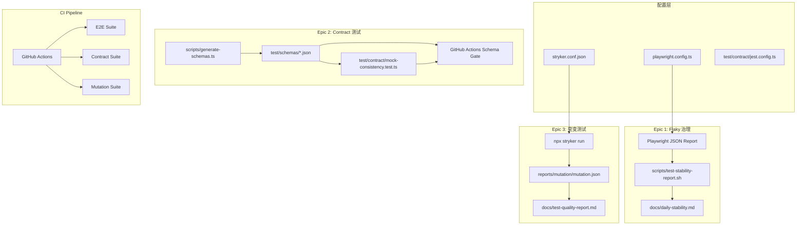
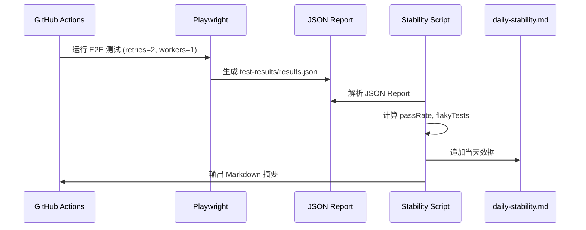
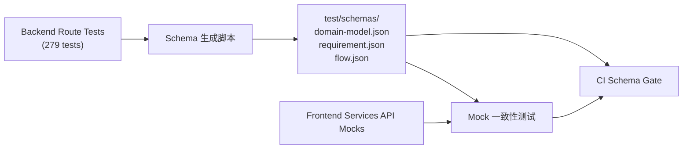
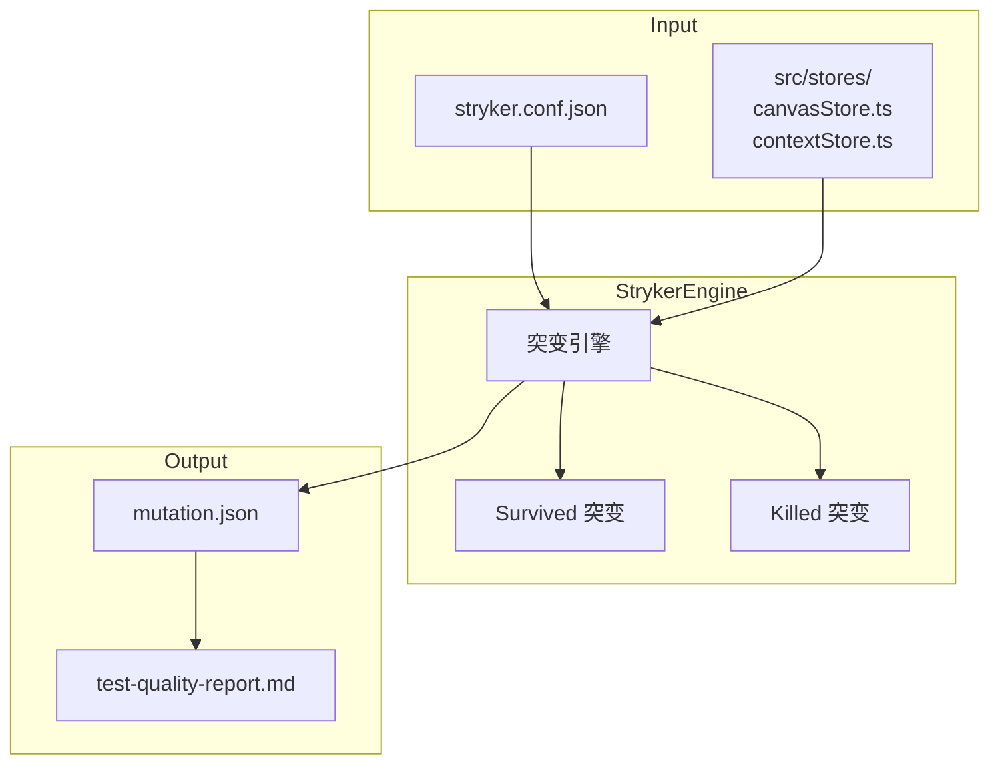

# VibeX 测试质量深化 — 系统架构文档

**项目**: vibex-tester-proposals-20260403_024652
**版本**: v1.0
**日期**: 2026-04-03
**角色**: Architect

---

## 执行决策

- **决策**: 已采纳
- **执行项目**: vibex-tester-proposals-20260403_024652
- **执行日期**: 2026-04-03

---

## 1. Tech Stack

### 1.1 技术选型

| 技术 | 版本 | 用途 | 选型理由 |
|------|------|------|---------|
| **stryker-mutator** | 0.15.x | 突变测试 | Jest 生态，支持 TypeScript，对 store 层突变测试效果好 |
| **jest-stryker** | — | Stryker Jest runner | 替代 stryker-mutator jest runner，兼容性更好 |
| **tsx** | 4.x | Schema 生成脚本 | 直接运行 TypeScript，无需编译 |
| **nock** | 13.x | HTTP mock | 拦截 GitHub/Slack API 用于测试 |
| **playwright** | 1.58.x | E2E 测试（已安装） | — |

### 1.2 决策说明

**Stryker vs 其他突变测试工具**：
- stryker-mutator: 最成熟，Jest/TS 支持好
- jest-mutation: 不维护
- pitest: 仅 Java

选择 stryker-mutator。

**Schema 生成策略**：
不引入额外 schema 生成工具，直接从现有 backend route tests（279个）提取响应结构。理由：避免引入额外依赖，且 route tests 已覆盖所有 API 端点。

---

## 2. 系统架构图

### 2.1 整体架构



### 2.2 E1: Flaky 治理数据流



### 2.3 E2: Contract 测试数据流



### 2.4 E3: 突变测试执行流



---

## 3. Data Model

### 3.1 测试质量指标 Schema

```typescript
// test/schemas/test-quality.ts

export interface E2EStabilityRecord {
  date: string;              // YYYY-MM-DD
  runId: string;
  passRate: number;         // 0.0 - 1.0
  total: number;
  passed: number;
  failed: number;
  flaky: number;            // pass但有retry的测试数
  flakyTests: string[];     // flaky测试名列表
  avgDuration: number;      // ms
}

export interface MutationMetrics {
  runId: string;
  date: string;
  totalMutants: number;
  killed: number;
  survived: number;
  timeout: number;
  noCoverage: number;
  killRate: number;         // killed / (killed + survived)
  threshold: number;        // 0.70
  passed: boolean;
}

export interface ContractTestResult {
  schema: string;            // e.g. "domain-model"
  passingTests: number;
  failingFields: string[];  // 前端mock与schema不一致的字段
  lastUpdated: string;
}

export interface TestQualityDashboard {
  stability: E2EStabilityRecord[];
  mutation: MutationMetrics[];
  contract: ContractTestResult[];
  lastUpdated: string;
}
```

### 3.2 JSON Schema 示例

```json
// test/schemas/domain-model.json
{
  "$schema": "http://json-schema.org/draft-07/schema#",
  "type": "object",
  "required": ["projectId", "contexts", "models", "relations"],
  "properties": {
    "projectId": { "type": "string" },
    "contexts": {
      "type": "array",
      "items": {
        "type": "object",
        "required": ["id", "name", "type"],
        "properties": {
          "id": { "type": "string" },
          "name": { "type": "string" },
          "type": { "type": "string", "enum": ["core", "supporting", "generic", "external"] },
          "description": { "type": "string" }
        }
      }
    },
    "models": { "type": "array" },
    "relations": { "type": "array" }
  }
}
```

---

## 4. API Definitions

### 4.1 测试脚本 API

#### Schema 生成

```typescript
// scripts/generate-schemas.ts

// 使用方式: npx tsx scripts/generate-schemas.ts [api-name]

interface SchemaGenOptions {
  apiName: 'domain-model' | 'requirement' | 'flow';
  outputDir: string;  // 'test/schemas'
  backendTestDir: string;  // 'vibex-backend/src/routes/__tests__'
}

// 输出: test/schemas/{api-name}.json
```

#### Stability Report

```typescript
// scripts/test-stability-report.sh

// 使用方式: bash scripts/test-stability-report.sh [--json]

interface StabilityReportOutput {
  summary: {
    passRate: number;
    total: number;
    passed: number;
    failed: number;
    flaky: number;
    avgDuration: number;  // ms
  };
  flakyTests: Array<{
    name: string;
    attempts: number;
    firstError?: string;
  }>;
  runs: number;  // 连续运行次数
}
```

### 4.2 CI/CD 集成端点

#### Contract Test CI Gate

```
# GitHub Actions Workflow: schema-contract-gate
触发条件: test/schemas/*.json 变更 (on push)
动作: 
  1. npm run test:contract
  2. 若失败 → workflow failed
```

#### Stability Report CI Integration

```
# 在现有 CI workflow 中新增 step
- name: Stability Report
  run: bash scripts/test-stability-report.sh
  # 输出到 CI 日志
```

---

## 5. 文件结构

```
vibex/
├── playwright.config.ts              # 已存在：E1-S1 改为 retries=2, workers=1
├── stryker.conf.json                # 新增：E3 突变测试配置
├── test/
│   ├── schemas/                     # 新增目录：E2 API Schema
│   │   ├── domain-model.json
│   │   ├── requirement.json
│   │   └── flow.json
│   └── contract/
│   │   ├── jest.config.ts          # 新增：contract 测试配置
│   │   └── mock-consistency.test.ts # 新增：E2-S2
├── scripts/
│   ├── generate-schemas.ts          # 新增：E2-S1 Schema 生成
│   └── test-stability-report.sh    # 新增：E1-S2 Stability Report
├── docs/
│   ├── daily-stability.md          # 新增：E1-S3 稳定性记录
│   └── test-quality-report.md      # 新增：E3-S2 质量报告
├── reports/
│   └── mutation/                    # 新增：E3 突变报告输出
│       └── mutation.json
└── .github/
    └── workflows/
        └── schema-contract-gate.yml # 新增：E2-S3 CI Schema Gate
```

---

## 6. 性能影响评估

| 指标 | 影响 | 说明 |
|------|------|------|
| E2E 测试总时长 | +5s per run | retries=2 最多额外执行 2 次失败测试 |
| Contract 测试时长 | < 30s | 仅 20 条 Jest 测试，无网络请求 |
| 突变测试时长 | 5-10 min | 仅 2 个 store 文件，设置 10min timeout |
| CI 总时长 | +5-12 min | E1 stability report (+5s) + E2 contract (+30s) + E3 mutation (可选慢速套件) |
| Playwright 内存 | 无显著影响 | workers=1 降低并行内存使用 |

**总体影响**: 极小。E2E 和 Contract 测试影响可忽略，突变测试安排在慢速 CI 套件，不影响 PR 阻断。

---

## 7. 安全考虑

| 方面 | 考虑 | 缓解 |
|------|------|------|
| Schema 生成脚本 | 读取 backend test 文件，可能暴露测试数据 | Schema 仅包含类型结构，无真实业务数据 |
| Stability Report | 写入 daily-stability.md，可能包含测试名 | 仅记录测试名，无用户数据 |
| GitHub API token | Contract 测试可能调用 GitHub API | 仅读操作，使用 PAT (read-only) |
| 外部依赖 | stryker-mutator npm 包 | 审查 package.json 来源，锁定版本 |
