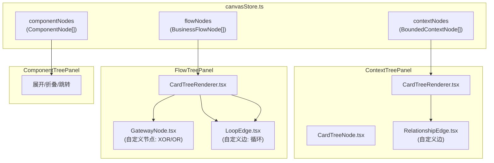
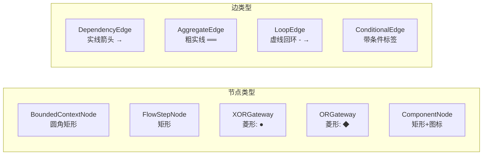

# Architecture: VibeX 三树增强 — 领域关系 + 分支循环 + 交互能力

**项目**: vibex-three-trees-enhancement-20260326
**版本**: 1.0
**架构师**: Architect Agent
**日期**: 2026-03-26
**状态**: Proposed

---

## 1. ADR: 可视化库选择

### ADR-001: 树可视化方案 — ReactFlow 扩展（不做迁移）

**状态**: Accepted

**上下文**: PRD 提出两个方案：扩展现有 ReactFlow vs 迁移到 BPMN.js。分析阶段误以为用了 D3.js，实际上用的是 ReactFlow。

**决策**: 在 ReactFlow 基础上扩展，不迁移

**理由**:
1. 现有代码已使用 ReactFlow `^11.11.4`，有 edges 支持
2. ReactFlow 原生支持自定义节点（gateway）、自定义边（loop）、拖拽
3. 迁移 BPMN.js 成本高（~20h），风险大
4. ReactFlow 的 `@xyflow/react` 可覆盖 React 18

**Trade-off**: ReactFlow 非 BPMN 原生，但足以满足 XOR/OR 网关需求。

---

### ADR-002: 领域关系数据来源

**状态**: Accepted（方案 A：前端推算 + 后端可选）

**上下文**: OQ1 问领域关系来自后端 API 还是前端推算。

**决策**: 前端推算为主（基于节点类型和 DDD 规则），后端 API 为扩展接口

**理由**:
1. 无需等待后端 API 开发
2. DDD 规则可推导大部分关系（aggregate root 通常是 core 类型）
3. 后端 API 可作为可选增强

---

## 2. Tech Stack

| 技术 | 版本 | 选择理由 |
|------|------|---------|
| ReactFlow | ^11.11.4 | 现有可视化库 |
| @xyflow/react | ^12.x | React 18 兼容（可选升级） |
| TypeScript | 5.x | 类型安全 |
| Zustand | latest | 现有 store |

---

## 3. 架构图



### 3.1 ReactFlow 自定义节点/边



---

## 4. 核心文件改动

### 4.1 新建: `src/components/canvas/nodes/RelationshipEdge.tsx`

```typescript
// 自定义边：领域关系连线
import { BaseEdge, getBezierPath, EdgeLabelRenderer } from '@xyflow/react';

interface RelationshipEdgeProps {
  relationType?: 'dependency' | 'aggregate' | 'calls';
  label?: string;
}

export function RelationshipEdge({
  id, sourceX, sourceY, targetX, targetY,
  relationType = 'dependency', label, markerEnd
}: RelationshipEdgeProps) {
  const [edgePath, labelX, labelY] = getBezierPath({
    sourceX, sourceY, targetX, targetY,
  });

  const strokeWidth = relationType === 'aggregate' ? 3 : 1.5;
  const strokeDasharray = relationType === 'calls' ? '5,5' : undefined;

  return (
    <>
      <BaseEdge
        id={id}
        path={edgePath}
        markerEnd={markerEnd}
        style={{
          strokeWidth,
          strokeDasharray,
          stroke: relationType === 'aggregate' ? '#6366f1' : '#94a3b8',
        }}
      />
      <EdgeLabelRenderer>
        {label && (
          <div
            className="edge-label"
            style={{
              position: 'absolute',
              transform: `translate(-50%, -50%) translate(${labelX}px,${labelY}px)`,
            }}
          >
            {label}
          </div>
        )}
      </EdgeLabelRenderer>
    </>
  );
}
```

### 4.2 新建: `src/components/canvas/nodes/GatewayNode.tsx`

```typescript
// 自定义节点：流程网关
import { memo } from 'react';
import { Handle, Position, NodeProps } from '@xyflow/react';

type GatewayType = 'xor' | 'or' | 'loop';

interface GatewayNodeData {
  gatewayType: GatewayType;
  condition?: string;
}

export const GatewayNode = memo(function GatewayNode({
  data, selected
}: NodeProps<GatewayNodeData>) {
  const { gatewayType, condition } = data;
  const size = 40;
  const color = gatewayType === 'xor' ? '#f59e0b' : '#8b5cf6';

  return (
    <div
      style={{
        width: size,
        height: size,
        transform: 'rotate(45deg)',
        background: color,
        border: selected ? '2px solid #1e293b' : 'none',
        borderRadius: 4,
        display: 'flex',
        alignItems: 'center',
        justifyContent: 'center',
      }}
    >
      <Handle type="target" position={Position.Top} />
      <Handle type="source" position={Position.Bottom} />
      <Handle type="target" position={Position.Left} />
      <Handle type="source" position={Position.Right} />
      <span style={{ transform: 'rotate(-45deg)', fontSize: 10, color: '#fff' }}>
        {gatewayType.toUpperCase()}
      </span>
      {condition && (
        <div
          className="condition-label"
          style={{
            position: 'absolute',
            bottom: -20,
            transform: 'rotate(-45deg)',
            fontSize: 10,
            whiteSpace: 'nowrap',
          }}
        >
          {condition}
        </div>
      )}
    </div>
  );
});
```

### 4.3 新建: `src/components/canvas/nodes/LoopEdge.tsx`

```typescript
// 自定义边：循环回路（虚线回环）
import { BaseEdge, getBezierPath } from '@xyflow/react';

export function LoopEdge({
  id, sourceX, sourceY, targetX, targetY, markerEnd
}: any) {
  const [edgePath] = getBezierPath({
    sourceX, sourceY, targetX, targetY,
    curvature: 0.5,
  });

  return (
    <BaseEdge
      id={id}
      path={edgePath}
      markerEnd={markerEnd}
      style={{
        stroke: '#ef4444',
        strokeWidth: 1.5,
        strokeDasharray: '5,5',
      }}
    />
  );
}
```

### 4.4 改动: `CardTreeRenderer.tsx` — 支持自定义节点和边

```typescript
// 改动1: 导入自定义节点和边
import { RelationshipEdge } from './edges/RelationshipEdge';
import { LoopEdge } from './edges/LoopEdge';
import { GatewayNode } from './nodes/GatewayNode';
import type { Node, Edge } from '@xyflow/react';

// 改动2: nodeTypes 和 edgeTypes 配置
const nodeTypes = {
  ...defaultNodeTypes,
  gateway: GatewayNode,
  context: ContextNode,
  flow: FlowNode,
  component: ComponentNode,
};

const edgeTypes = {
  ...defaultEdgeTypes,
  relationship: RelationshipEdge,
  loop: LoopEdge,
};

// 改动3: buildFlowGraph 增加网关和循环支持
function buildFlowGraph(data: FlowTreeData) {
  const nodes: Node[] = [];
  const edges: Edge[] = [];

  for (const flow of data.flows) {
    nodes.push({
      id: flow.id,
      type: flow.isGateway ? 'gateway' : 'flow',
      data: { ...flow, gatewayType: flow.gatewayType },
      position: { x: 0, y: 0 }, // ReactFlow 自动布局
    });

    for (const step of flow.steps) {
      if (step.loopTo) {
        // 循环边
        edges.push({
          id: `loop-${step.id}-${step.loopTo}`,
          source: step.id,
          target: step.loopTo,
          type: 'loop',
        });
      } else if (step.gatewayType) {
        // 网关
        nodes.push({
          id: step.id,
          type: 'gateway',
          data: { gatewayType: step.gatewayType, condition: step.condition },
        });
      }
    }
  }

  return { nodes, edges };
}
```

### 4.5 改动: 组件树展开/折叠

```typescript
// ComponentTreePanel.tsx — 展开/折叠逻辑
const [expandedIds, setExpandedIds] = useState<Set<string>>(new Set());

const toggleExpand = (nodeId: string) => {
  setExpandedIds(prev => {
    const next = new Set(prev);
    if (next.has(nodeId)) {
      next.delete(nodeId);
    } else {
      next.add(nodeId);
    }
    return next;
  });
};

// 子节点数量统计
const childCount = node.children?.length ?? 0;
const isExpanded = expandedIds.has(node.nodeId);
```

---

## 5. ReactFlow 关系推导规则

由于 OQ1 待确认，采用前端推算方案：

```typescript
// 领域关系推算规则
function inferContextRelationship(ctx1: BoundedContextNode, ctx2: BoundedContextNode): RelationshipType {
  // 规则1: 如果 ctx1.type === 'core' 且 ctx2.type === 'supporting' → ctx1 依赖 ctx2
  if (ctx1.type === 'core' && ctx2.type === 'supporting') {
    return { type: 'dependency', label: '依赖' };
  }

  // 规则2: 如果有共同的 parentId → 聚合关系
  if (ctx1.parentId && ctx1.parentId === ctx2.parentId) {
    return { type: 'aggregate', label: '聚合' };
  }

  // 规则3: 如果名称包含相同关键词 → 调用关系
  if (ctx1.name.includes(ctx2.name) || ctx2.name.includes(ctx1.name)) {
    return { type: 'calls', label: '调用' };
  }

  return { type: 'dependency', label: '依赖' };
}
```

---

## 6. 测试策略

### 6.1 单元测试

```typescript
describe('GatewayNode', () => {
  it('renders XOR gateway with amber color', () => {
    render(<GatewayNode data={{ gatewayType: 'xor' }} />);
    expect(screen.getByText('XOR')).toBeInTheDocument();
  });

  it('renders OR gateway with purple color', () => {
    render(<GatewayNode data={{ gatewayType: 'or' }} />);
    expect(screen.getByText('OR')).toBeInTheDocument();
  });
});

describe('RelationshipEdge', () => {
  it('applies thick stroke for aggregate relation', () => {
    render(<RelationshipEdge relationType="aggregate" />);
    const path = document.querySelector('path');
    expect(path?.getAttribute('stroke-width')).toBe('3');
  });

  it('applies dashed stroke for calls relation', () => {
    render(<RelationshipEdge relationType="calls" />);
    const path = document.querySelector('path');
    expect(path?.getAttribute('stroke-dasharray')).toBe('5,5');
  });
});
```

### 6.2 E2E 测试（Playwright）

```typescript
test('流程树显示 XOR 网关节点', async ({ page }) => {
  await page.goto('/canvas');
  await canvasPage.startAndGenerate();
  
  // 切换到流程树视图
  await page.click('[data-testid=flow-tree-tab]');
  
  // 验证网关节点可见
  const gateways = await page.locator('.gateway-node').count();
  expect(gateways).toBeGreaterThan(0);
});

test('组件树节点可展开/折叠', async ({ page }) => {
  await page.goto('/canvas');
  await canvasPage.startAndGenerate();
  
  // 点击节点展开
  const node = page.locator('[data-testid=component-node]').first();
  await node.click();
  
  // 验证子节点出现
  const children = await page.locator('[data-testid=component-node].expanded').count();
  expect(children).toBeGreaterThan(0);
});
```

---

## 7. 实施计划

| Epic | Story | 工时 | 负责人 |
|------|-------|------|--------|
| Epic 1 | S1.1 RelationshipEdge 组件 | 0.5h | Dev |
| Epic 1 | S1.2 CardTreeRenderer 支持自定义边 | 0.5h | Dev |
| Epic 1 | S1.3 关系推算规则 | 0.5h | Dev |
| Epic 1 | S1.4 拖拽布局 | 0.5h | Dev |
| Epic 2 | S2.1 GatewayNode 组件 | 0.5h | Dev |
| Epic 2 | S2.2 LoopEdge 组件 | 0.5h | Dev |
| Epic 2 | S2.3 CardTreeRenderer 支持自定义节点 | 0.5h | Dev |
| Epic 2 | S2.4 分支条件标签 | 0.5h | Dev |
| Epic 3 | S3.1 展开/折叠逻辑 | 0.5h | Dev |
| Epic 3 | S3.2 点击跳转 | 0.5h | Dev |
| Epic 3 | S3.3 hover + 统计 | 0.5h | Dev |
| Epic 4 | S4.1-S4.2 回归测试 | 1h | Tester |

**预计总工期**: ~5h（Dev ~4h + Test ~1h）

---

## 8. Open Questions 解答

| # | 问题 | Architect 建议 |
|---|------|--------------|
| OQ1 | 领域关系数据来源 | **前端推算为主**：基于 DDD 规则（节点类型 + parentId + 名称匹配），后端 API 作为可选扩展 |
| OQ2 | 分支条件表达方式 | 自然语言标签，显示在连线旁（如 "status === 'active'"） |
| OQ3 | 组件跳转目标 | 文件路径（`/src/pages/xxx.tsx`），点击后用 `window.open` 或编辑器 deep link |

---

## 9. 验收标准映射

| PRD 验收标准 | Architect 确认 |
|-------------|--------------|
| V1: 上下文树关系连线覆盖率 ≥ 80% | ✅ RelationshipEdge + 推算规则 |
| V2: 流程树网关支持率 100% | ✅ GatewayNode (XOR + OR) |
| V3: 组件树交互功能可用率 100% | ✅ 展开/折叠/跳转/hover |
| V4: 回归测试通过率 100% | ✅ Epic 4 专门回归测试 |

---

*Architecture 完成时间: 2026-03-26 02:54 UTC+8*
