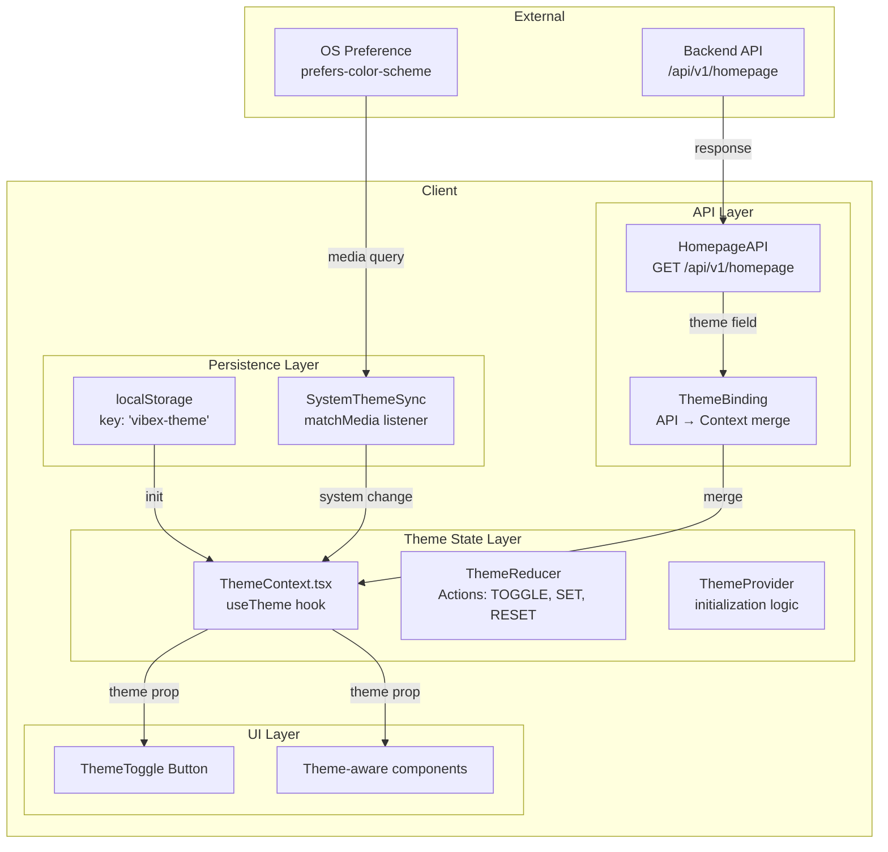
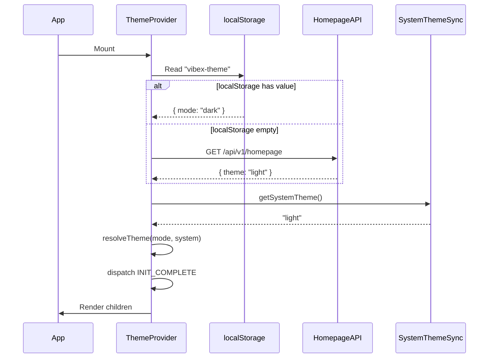

# Architecture Design: homepage-theme-api-analysis

> **Project**: homepage-theme-api-analysis
> **Version**: 1.0
> **Date**: 2026-03-21
> **Status**: ✅ Architecture Complete

---

## 1. Tech Stack

| Technology | Choice | Rationale |
|------------|--------|-----------|
| Theme definition | CSS Variables (`--theme-*`) | Native, zero overhead, easy to debug |
| State management | React Context + `useReducer` | Built-in, no new dep, predictable updates |
| Persistence | `localStorage` with JSON | Simple, synchronous, sufficient for theme |
| System theme detection | `window.matchMedia` + `addEventListener` | Standard Web API, reactive to OS changes |
| TypeScript | Strict mode | Type safety required per PRD non-functional req |

**Why not alternatives:**
- CSS-in-JS (styled-components/emotion): Adds ~15KB bundle, SSR complexity
- Zustand/Redux: Overkill for single feature, too much boilerplate
- `useState` only: No cross-component sync without prop drilling

---

## 2. Architecture Diagram



### File Structure

```
src/
├── contexts/
│   └── ThemeContext.tsx      # Context + Provider + Reducer
├── hooks/
│   ├── useTheme.ts           # Public hook (re-exports from context)
│   └── useSystemTheme.ts     # matchMedia hook
├── services/
│   ├── themeStorage.ts        # localStorage read/write
│   └── homepageAPI.ts        # API client
├── types/
│   └── theme.ts              # Theme types
├── styles/
│   └── theme-variables.css   # CSS custom properties
└── components/
    ├── ThemeToggle/
    └── ThemeWrapper/          # FOUT prevention
```

---

## 3. Data Model

### Theme Type

```typescript
// src/types/theme.ts
export type ThemeMode = 'light' | 'dark' | 'system';

export interface ThemeState {
  mode: ThemeMode;           // User preference
  resolved: 'light' | 'dark'; // Actual resolved value
}

export interface ThemeContextValue {
  theme: ThemeState;
  toggleTheme: () => void;
  setTheme: (mode: ThemeMode) => void;
}
```

### API Response Type

```typescript
// src/services/homepageAPI.ts
export interface HomepageAPIResponse {
  theme: ThemeMode;          // Default from server
  configs: HomepageConfig[];
  userPreferences: {
    theme?: ThemeMode;       // Override if logged in
  };
}

export interface ThemeMergeStrategy {
  priority: ['localStorage', 'API', 'system', 'default'];
  default: 'system';
}
```

### localStorage Schema

```json
{
  "key": "vibex-theme",
  "value": {
    "mode": "dark",
    "timestamp": 1742600000000
  }
}
```

---

## 4. Key Component Designs

### 4.1 ThemeProvider Initialization Flow



### 4.2 Theme Merge Strategy (Epic 3)

Priority order (highest to lowest):
1. `localStorage` — explicit user choice
2. API `userPreferences.theme` — authenticated user override
3. `system` preference — OS setting
4. API `theme` default — server fallback
5. `'system'` — hardcoded default

### 4.3 FOUT Prevention (Epic 2)

```css
/* Injected in <head> before any content */
html {
  background-color: var(--bg-primary, #fff);
  color-scheme: light dark;
}
```

```typescript
// ThemeWrapper.tsx — blocks render until theme resolved
const ThemeWrapper: React.FC = ({ children }) => {
  const { resolved } = useTheme();
  const [hydrated, setHydrated] = useState(false);

  useEffect(() => {
    // Delay render one tick to prevent FOUC
    setHydrated(true);
  }, []);

  if (!hydrated) return null;
  return <>{children}</>;
};
```

---

## 5. API Definitions

### Endpoint: GET /api/v1/homepage

```typescript
// Request
// GET /api/v1/homepage
// Headers: Authorization (optional)

// Response 200
{
  "theme": "light" | "dark" | "system",
  "configs": [...],
  "userPreferences": {
    "theme": "dark" | undefined
  }
}

// Response 4xx/5xx
{
  "error": "string",
  "code": number
}
```

### Internal Service Interfaces

```typescript
// src/services/themeStorage.ts
export const themeStorage = {
  get(): ThemeMode | null;
  set(mode: ThemeMode): void;
  clear(): void;
};

// src/services/homepageAPI.ts
export const homepageAPI = {
  getTheme(): Promise<HomepageAPIResponse>;
};
```

---

## 6. Testing Strategy

| Layer | Test File | Framework | Coverage Target |
|-------|-----------|-----------|----------------|
| Types | `theme.test.ts` | Vitest | 100% |
| Storage | `themeStorage.test.ts` | Vitest | >90% |
| Context | `ThemeContext.test.tsx` | Vitest + React Testing Library | >85% |
| Hook | `useSystemTheme.test.ts` | Vitest | >90% |
| Integration | `theme-binding.test.tsx` | Vitest + MSW | >80% |

### Core Test Cases

```typescript
// theme.test.ts
describe('ThemeMode', () => {
  test('should accept valid theme modes', () => {
    const modes: ThemeMode[] = ['light', 'dark', 'system'];
    modes.forEach(m => expect(typeof m).toBe('string'));
  });
});

// themeStorage.test.ts
describe('themeStorage', () => {
  test('set and get returns same value', () => {
    themeStorage.set('dark');
    expect(themeStorage.get()).toBe('dark');
  });

  test('clear returns null', () => {
    themeStorage.clear();
    expect(themeStorage.get()).toBeNull();
  });
});

// ThemeContext.test.tsx
describe('ThemeContext', () => {
  test('toggleTheme switches between light and dark', () => {
    const { result } = renderHook(() => useTheme(), {
      wrapper: ({ children }) => <ThemeProvider>{children}</ThemeProvider>
    });
    const initial = result.current.theme.resolved;
    act(() => result.current.toggleTheme());
    expect(result.current.theme.resolved).not.toBe(initial);
  });
});
```

---

## 7. Epic-to-Task Mapping

| Epic | Story | Dev Task | Tester Task |
|------|-------|----------|-------------|
| Epic 1 | ST-1.1, ST-1.2, ST-1.3 | `dev-epic1-themectx` | `tester-epic1-themectx` |
| Epic 2 | ST-2.1, ST-2.2, ST-2.3 | `dev-epic2-persistence` | `tester-epic2-persistence` |
| Epic 3 | ST-3.1, ST-3.2, ST-3.3 | `dev-epic3-apibinding` | `tester-epic3-apibinding` |

---

## 8. Non-Functional Requirements Compliance

| Requirement | Implementation | Verification |
|-------------|----------------|-------------|
| Theme switch < 100ms | CSS Variables (no JS re-render of styles) | Performance test with Lighthouse |
| WCAG AA contrast | CSS variable values validated against contrast checker | Manual audit + axe-core |
| TypeScript strict | `tsconfig.json` strict: true | `npm run build` passes |
| No `any` types | ESLint `no-explicit-any: error` | CI fails on violation |

---

*Architecture Design: ✅ Complete*
*Next: Coord decision → Dev implementation*
