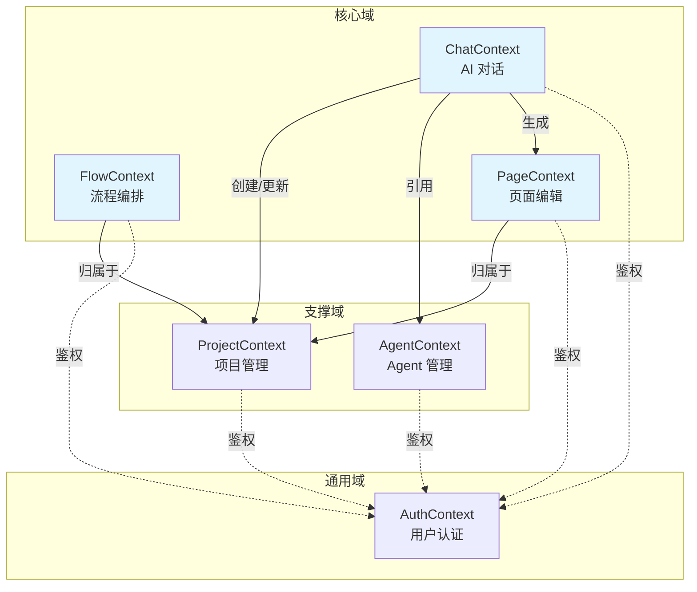
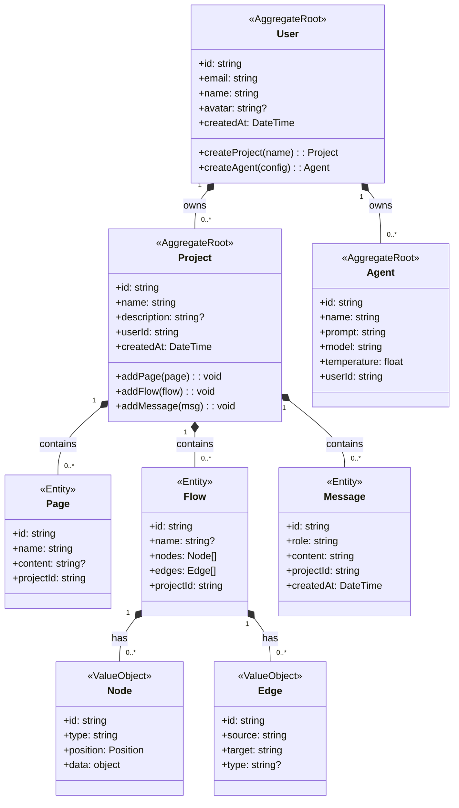
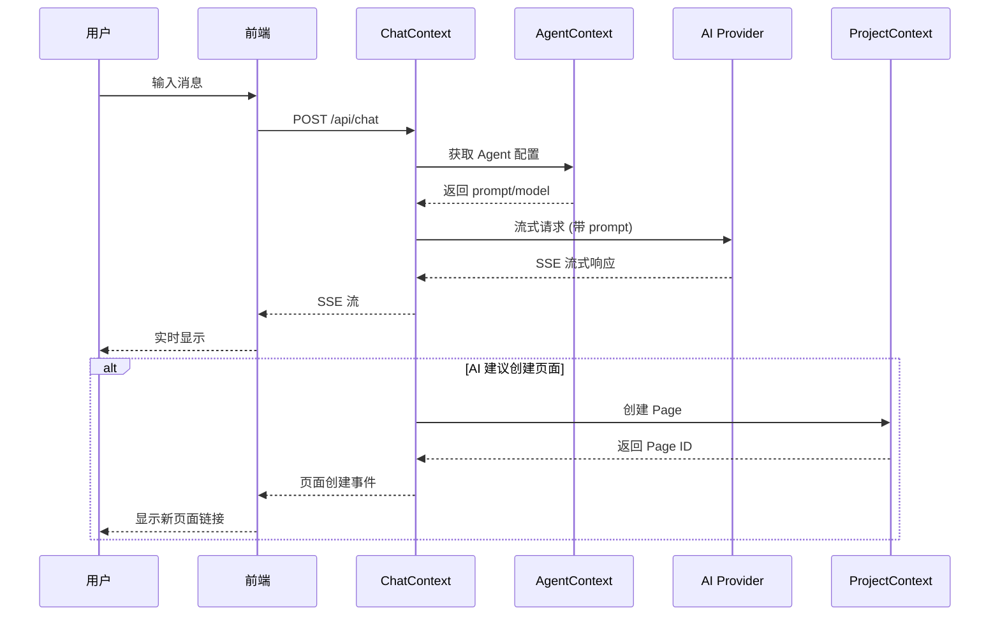
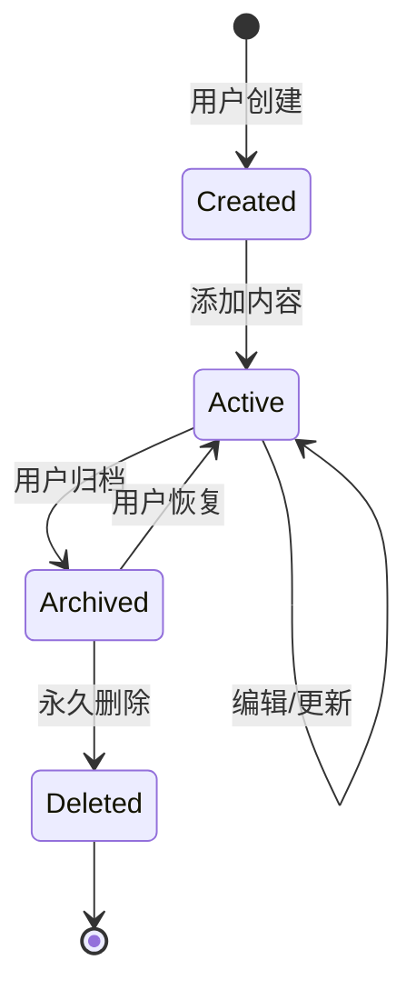

# VibeX 领域模型文档

> 本文档基于 DDD (Domain-Driven Design) 方法论，持续随架构演进更新。
> 
> 最后更新: 2026-03-03 | 负责人: Architect Agent

---

## 一、项目与业务背景

### 1.1 项目基本信息

| 项目属性 | 值 |
|---------|---|
| **项目名称** | VibeX |
| **项目类型** | ☑ 新项目 |
| **当前阶段** | ☑ 开发中 |
| **负责团队** | VibeX Team |
| **技术栈** | Next.js 14 (App Router) + Cloudflare Workers + D1 |

### 1.2 业务目标与问题

**业务背景**：
用户需要一个具备未来科幻风格 (FUI) 的交互式 Web 界面，支持 AI 对话驱动应用构建、流程图编辑和低代码页面创建。

**核心痛点**：
1. 传统低代码平台学习成本高，交互复杂
2. AI 能力与可视化编辑器割裂，无法协同
3. 缺乏统一的领域模型，前后端数据契约不一致

**业务目标**：
- 用户通过 AI 对话快速生成应用原型
- 可视化流程图编排业务逻辑
- 低代码编辑器微调页面细节

**成功指标**：
| 指标 | 目标 |
|------|------|
| AI 对话响应延迟 | < 2s (首字) |
| 流程图渲染流畅度 | 60 FPS |
| 页面原型生成速度 | < 30s |
| 用户完成度 | > 80% |

### 1.3 用户与角色

| 用户角色 | 描述 | 主要诉求 |
|---------|------|----------|
| **产品经理** | 需要快速验证产品想法 | 快速原型、AI 辅助设计 |
| **开发者** | 需要加速开发流程 | 代码生成、流程可视化 |
| **设计师** | 需要交互式原型 | FUI 风格、动效设计 |
| **运营人员** | 需要搭建营销页面 | 低代码、模板复用 |

### 1.4 关键干系人

| 干系人 | 角色 | 关注点 |
|--------|------|--------|
| 产品团队 | 需求方 | 用户体验、功能完整性 |
| 技术团队 | 实现方 | 架构稳定性、可维护性 |
| 运营团队 | 使用方 | 易用性、模板丰富度 |

---

## 二、领域理解与统一语言

### 2.1 领域故事 / 场景描述

#### 场景 A: AI 对话生成原型
> 用户打开 VibeX，进入 AI 对话页面，描述想要的产品原型（如"做一个电商首页"）。AI 理解需求后生成页面结构建议，用户确认后自动创建项目和初始页面。

#### 场景 B: 流程图编排业务逻辑
> 用户在流程图编辑器中拖拽节点，定义用户注册流程（开始 → 填写表单 → 验证邮箱 → 完成）。系统实时渲染流程图，并生成可执行的业务逻辑代码。

#### 场景 C: 页面编辑与预览
> 用户在低代码编辑器中调整页面布局、样式和组件。编辑完成后点击预览，在不同设备尺寸下查看效果，确认后发布。

### 2.2 领域术语表 (Ubiquitous Language)

| 术语 (中文) | 英文名 | 含义 / 定义 | 所属子域 |
|-------------|--------|-------------|----------|
| 项目 | Project | 用户创建的应用容器，包含页面、流程、消息等 | 项目上下文 |
| 页面 | Page | 项目内的单个视图，包含内容 (JSON/HTML) | 页面上下文 |
| 流程图 | Flow | 可视化的业务逻辑编排，由节点和连线组成 | 流程上下文 |
| 节点 | Node | 流程图中的单个步骤或条件 | 流程上下文 |
| 连线 | Edge | 连接两个节点的有向关系 | 流程上下文 |
| 消息 | Message | AI 对话中的单条消息，含角色和内容 | 对话上下文 |
| 会话 | Conversation | 一组相关消息的集合 | 对话上下文 |
| Agent | Agent | AI 助手配置，含提示词、模型、温度等 | Agent 上下文 |
| 用户 | User | 系统使用者，拥有项目和 Agent | 认证上下文 |

---

## 三、战略设计：子域与限界上下文

### 3.1 子域划分

| 子域名称 | 类型 | 说明 | 价值 / 优先级 |
|----------|------|------|---------------|
| **AI 对话** | 核心域 | AI 驱动的需求理解和代码生成 | ⭐⭐⭐ 高 |
| **流程编排** | 核心域 | 可视化业务逻辑设计 | ⭐⭐⭐ 高 |
| **页面编辑** | 核心域 | 低代码页面创建与预览 | ⭐⭐ 中高 |
| **项目管理** | 支撑域 | 项目、页面的 CRUD 管理 | ⭐⭐ 中 |
| **用户认证** | 通用域 | 登录、注册、权限 | ⭐ 低 |

### 3.2 限界上下文清单

| 上下文名称 | 所在子域 | 核心职责 | 关键实体 / 聚合 | 状态 |
|------------|----------|----------|-----------------|------|
| ChatContext | AI 对话 | AI 消息处理、流式响应 | Message, Conversation | 已实现 |
| FlowContext | 流程编排 | 流程图节点管理、连线逻辑 | Flow, Node, Edge | 规划中 |
| PageContext | 页面编辑 | 页面内容管理、组件渲染 | Page, Component | 已实现 |
| ProjectContext | 项目管理 | 项目生命周期管理 | Project | 已实现 |
| AuthContext | 用户认证 | 用户身份验证、权限控制 | User, Session | 部分实现 |
| AgentContext | Agent 管理 | AI 助手配置管理 | Agent | 已实现 |

### 3.3 上下文映射图



### 3.4 上下文关系说明

| 关系 | 类型 | 调用方式 | 协议 |
|------|------|----------|------|
| Chat → Project | 客户-供应商 | 同步 | REST API |
| Chat → Agent | 客户-供应商 | 同步 | REST API |
| Chat → Page | 客户-供应商 | 同步 | REST API |
| Flow → Project | 客户-供应商 | 同步 | REST API |
| Page → Project | 客户-供应商 | 同步 | REST API |
| * → Auth | 遵奉者 | 同步 | JWT Token |

---

## 四、限界上下文设计

### 4.1 ChatContext (AI 对话上下文)

#### 基本信息
| 属性 | 值 |
|------|---|
| 上下文名称 | ChatContext |
| 所属子域 | AI 对话 (核心域) |
| 负责团队 | VibeX Team |
| 当前状态 | ☑ 开发中 |

#### Purpose & Strategic Classification
**目的**：为用户提供 AI 驱动的对话式交互，理解需求并生成代码/结构建议。

**战略分类**：
- ☑ 核心域 (Core Domain)
- ☑ 收入生成 (Revenue Generator)
- ☑ 产品 (Product)

#### Domain Roles
- ☑ 执行型 (Execution Context)：负责对话流程处理

#### Ubiquitous Language
| 术语 | 含义 | 备注 |
|------|------|------|
| Message | 单条对话消息 | 包含 role (user/assistant/system) 和 content |
| Conversation | 会话 | 一组相关消息的集合 (规划中) |
| Stream | 流式响应 | SSE 格式的增量内容 |

#### Inbound Communication
| 协作方 | 消息类型 | 消息名称 | 触发条件 | 协议 |
|--------|----------|----------|----------|------|
| 前端 | Command | SendMessage | 用户发送消息 | POST /api/chat |
| 前端 | Query | GetChatStatus | 检查服务状态 | GET /api/chat |

#### Outbound Communication
| 协作方 | 消息类型 | 消息名称 | 触发条件 | 协议 |
|--------|----------|----------|----------|------|
| AI Provider | Command | GenerateCompletion | 需要生成回复 | MiniMax API |
| ProjectContext | Command | CreateProject | AI 建议创建项目 | REST API |
| AgentContext | Query | GetAgentConfig | 获取 Agent 配置 | REST API |

#### 关键业务规则
1. 消息按时间顺序严格排序
2. 流式响应使用 SSE 格式
3. 每条消息属于且仅属于一个项目

---

### 4.2 FlowContext (流程编排上下文)

#### 基本信息
| 属性 | 值 |
|------|---|
| 上下文名称 | FlowContext |
| 所属子域 | 流程编排 (核心域) |
| 负责团队 | VibeX Team |
| 当前状态 | ☑ 规划中 |

#### Purpose & Strategic Classification
**目的**：提供可视化的业务流程编排能力，让用户通过拖拽节点定义应用逻辑。

**战略分类**：
- ☑ 核心域 (Core Domain)
- ☑ 参与度提升 (Engagement Creator)
- ☑ 定制构建 (Custom Built)

#### Domain Roles
- ☑ 执行型 (Execution Context)：流程编辑和渲染
- ☑ 分析型 (Analysis Context)：流程验证和导出

#### Ubiquitous Language
| 术语 | 含义 | 备注 |
|------|------|------|
| Flow | 流程图 | 包含 nodes 和 edges |
| Node | 节点 | 流程中的单个步骤 |
| Edge | 连线 | 连接两个节点的有向关系 |
| NodeType | 节点类型 | start/end/action/condition 等 |

#### Inbound Communication
| 协作方 | 消息类型 | 消息名称 | 触发条件 | 协议 |
|--------|----------|----------|----------|------|
| 前端 | Command | UpdateFlow | 用户编辑流程图 | PUT /api/flows/:id |
| 前端 | Query | GetFlow | 加载流程图 | GET /api/flows/:id |

#### Outbound Communication
| 协作方 | 消息类型 | 消息名称 | 触发条件 | 协议 |
|--------|----------|----------|----------|------|
| ProjectContext | Query | GetProject | 验证项目归属 | REST API |

#### 关键业务规则
1. 流程图必须有且仅有一个开始节点
2. 连线只能从输出端口连向输入端口
3. 节点位置信息仅用于渲染，不参与业务逻辑

---

### 4.3 ProjectContext (项目管理上下文)

#### 基本信息
| 属性 | 值 |
|------|---|
| 上下文名称 | ProjectContext |
| 所属子域 | 项目管理 (支撑域) |
| 负责团队 | VibeX Team |
| 当前状态 | ☑ 已实现 |

#### Purpose & Strategic Classification
**目的**：管理用户创建的项目，作为页面、流程、消息的聚合根容器。

**战略分类**：
- ☑ 支撑域 (Supporting Domain)
- ☑ 产品 (Product)

#### Ubiquitous Language
| 术语 | 含义 | 备注 |
|------|------|------|
| Project | 项目 | 应用容器 |
| ProjectMeta | 项目元数据 | 名称、描述、创建时间等 |

#### 关键实体
| 实体 | 类型 | 说明 |
|------|------|------|
| Project | 聚合根 | 项目聚合根 |
| Page | 实体 | 属于项目 |
| Flow | 实体 | 属于项目 |
| Message | 实体 | 属于项目 |

---

### 4.4 AgentContext (Agent 管理上下文)

#### 基本信息
| 属性 | 值 |
|------|---|
| 上下文名称 | AgentContext |
| 所属子域 | Agent 管理 (支撑域) |
| 负责团队 | VibeX Team |
| 当前状态 | ☑ 已实现 |

#### Purpose & Strategic Classification
**目的**：管理用户自定义的 AI 助手配置，支持不同的提示词和模型参数。

**战略分类**：
- ☑ 支撑域 (Supporting Domain)
- ☑ 参与度提升 (Engagement Creator)

#### Ubiquitous Language
| 术语 | 含义 | 备注 |
|------|------|------|
| Agent | AI 助手 | 包含 prompt, model, temperature |
| Prompt | 系统提示词 | 定义 Agent 行为 |
| Temperature | 温度参数 | 控制输出随机性 |

---

### 4.5 AuthContext (认证上下文)

#### 基本信息
| 属性 | 值 |
|------|---|
| 上下文名称 | AuthContext |
| 所属子域 | 用户认证 (通用域) |
| 负责团队 | VibeX Team |
| 当前状态 | ☑ 部分实现 |

#### Purpose & Strategic Classification
**目的**：提供用户身份认证和权限控制能力。

**战略分类**：
- ☑ 通用域 (Generic Domain)
- ☑ 合规风控 (Compliance Enforcer)
- ☑ 商品 (Commodity)

#### Ubiquitous Language
| 术语 | 含义 | 备注 |
|------|------|------|
| User | 用户 | 系统使用者 |
| Session | 会话 | 登录状态 |
| Token | 令牌 | JWT 认证凭证 |

#### 关键业务规则
1. 密码使用 bcrypt 加密存储
2. Token 存储在 Cloudflare KV，支持过期
3. 登录后返回 JWT Token

---

## 五、战术设计：领域模型与聚合

### 5.1 领域模型类图



### 5.2 领域对象清单

| 对象名称 | 类型 | 所属聚合 | 核心职责 | 关键属性 |
|----------|------|----------|----------|----------|
| User | 聚合根 | User | 用户身份管理 | id, email, name |
| Project | 聚合根 | Project | 项目容器管理 | id, name, userId |
| Agent | 聚合根 | Agent | AI 助手配置 | id, name, prompt, model |
| Page | 实体 | Project | 页面内容管理 | id, name, content |
| Flow | 实体 | Project | 流程图数据 | id, nodes, edges |
| Message | 实体 | Project | 对话消息 | id, role, content |
| Node | 值对象 | Flow | 流程节点数据 | id, type, position |
| Edge | 值对象 | Flow | 流程连线数据 | id, source, target |

### 5.3 聚合设计：Project 聚合

#### 基本信息
| 属性 | 值 |
|------|---|
| 聚合名称 | Project |
| 所属上下文 | ProjectContext |
| 边界范围 | Project, Page, Flow, Message |

#### Description
- **主要职责**：作为用户创建应用的容器，聚合页面、流程、消息等实体
- **边界选择原因**：Project 是用户交互的核心单元，Page/Flow/Message 紧密相关且生命周期一致

#### State Transitions
```
[Created] --> [Active] : 添加内容
[Active] --> [Archived] : 用户归档
[Active] --> [Deleted] : 用户删除
```

#### Invariants
1. 项目名称不能为空
2. 项目必须关联一个有效用户
3. 页面/流程/消息必须属于一个项目

#### Handled Commands
| 命令名 | 含义 | 前置条件 | 产生的事件 |
|--------|------|----------|------------|
| CreateProject | 创建项目 | 用户已登录 | ProjectCreated |
| UpdateProject | 更新项目 | 项目存在 | ProjectUpdated |
| DeleteProject | 删除项目 | 项目存在 | ProjectDeleted |
| AddPage | 添加页面 | 项目存在 | PageAdded |
| AddFlow | 添加流程 | 项目存在 | FlowAdded |

---

### 5.4 聚合设计：Agent 聚合

#### 基本信息
| 属性 | 值 |
|------|---|
| 聚合名称 | Agent |
| 所属上下文 | AgentContext |
| 边界范围 | Agent (独立聚合根) |

#### Description
- **主要职责**：封装 AI 助手的配置和行为定义
- **边界选择原因**：Agent 独立于项目，可被多个对话复用

#### Invariants
1. Agent 名称不能为空
2. Prompt 不能为空
3. Temperature 范围 [0, 1]

#### Handled Commands
| 命令名 | 含义 | 前置条件 | 产生的事件 |
|--------|------|----------|------------|
| CreateAgent | 创建 Agent | 用户已登录 | AgentCreated |
| UpdateAgent | 更新 Agent | Agent 存在 | AgentUpdated |
| DeleteAgent | 删除 Agent | Agent 存在 | AgentDeleted |

---

## 六、业务流程与状态流转

### 6.1 核心业务流程清单

| 流程名称 | 触发条件 | 主要参与方 | 关键业务规则 |
|----------|----------|------------|--------------|
| AI 对话生成页面 | 用户发送消息 | Chat, Project, Page | 消息归属项目，AI 生成后创建页面 |
| 流程图编排 | 用户拖拽节点 | Flow, Project | 流程必须属于项目，节点位置仅渲染 |
| 项目创建 | 用户创建项目 | Auth, Project | 用户必须已登录 |
| Agent 调用 | 用户选择 Agent 对话 | Chat, Agent | Agent 配置决定 AI 行为 |

### 6.2 关键流程图

#### 6.2.1 AI 对话流程



#### 6.2.2 项目生命周期



### 6.3 关键业务规则与异常处理

| 规则/异常 | 描述 | 处理方式 |
|-----------|------|----------|
| 项目归属验证 | 操作前验证用户对项目的所有权 | 返回 403 Forbidden |
| AI 响应超时 | AI Provider 响应超过阈值 | 返回超时提示，建议重试 |
| 流程图循环依赖 | 节点连线形成死循环 | 前端校验阻止，提示用户 |
| 并发编辑冲突 | 多用户同时编辑同一资源 | 暂不支持，后续考虑乐观锁 |

---

## 七、团队与架构映射

### 7.1 团队与上下文映射

| 团队 | 负责上下文 | 主要职责 | 依赖的上下文 |
|------|------------|----------|--------------|
| VibeX Team | ChatContext | AI 对话处理 | Agent, Project |
| VibeX Team | FlowContext | 流程图编辑 | Project |
| VibeX Team | PageContext | 页面管理 | Project |
| VibeX Team | ProjectContext | 项目管理 | Auth |
| VibeX Team | AgentContext | Agent 配置 | Auth |
| VibeX Team | AuthContext | 用户认证 | - |

### 7.2 技术架构概览

| 架构属性 | 选型 |
|----------|------|
| 整体架构风格 | 事件驱动 + REST API |
| 前端技术栈 | Next.js 14 (App Router), React 18, Zustand |
| 后端技术栈 | Cloudflare Workers, D1, KV |
| 数据库 ORM | Prisma |
| 认证方案 | JWT + KV 存储 |
| AI 集成 | MiniMax API (流式) |

### 7.3 关键集成点与契约

| 集成点 | 源上下文 | 目标上下文 | 方式 | 协议 |
|--------|----------|------------|------|------|
| AI 对话 | ChatContext | AI Provider | 同步 | MiniMax API |
| 项目操作 | 前端 | ProjectContext | 同步 | REST API |
| 流程图保存 | 前端 | FlowContext | 同步 | REST API |
| 认证校验 | 前端 | AuthContext | 同步 | JWT Token |

---

## 八、决策记录与演进

### 8.1 关键设计决策记录

| 决策编号 | 决策内容 | 原因 | 备选方案 | 影响 |
|----------|----------|------|----------|------|
| ADR-001 | 项目作为聚合根 | 简化数据模型，清晰边界 | 以用户为聚合根 | 用户操作需先获取项目 |
| ADR-002 | Flow 数据存储为 JSON | 灵活支持 React Flow 格式 | 独立表结构 | 查询灵活性降低 |
| ADR-003 | 消息归属项目而非会话 | MVP 简化，快速实现 | 独立会话实体 | 后续需支持多会话 |
| ADR-004 | Agent 独立于项目 | 复用性，一个 Agent 可服务多项目 | Agent 归属项目 | 需额外权限控制 |

### 8.2 演进计划

**近期演进**：
- [ ] 完善 AuthContext (登录/注册 API)
- [ ] 实现 Message 持久化存储
- [ ] FlowContext 流程图完整 CRUD

**中长期演进**：
- [ ] 引入 Conversation 聚合，支持多会话
- [ ] 流程图版本控制和协作
- [ ] Agent 市场和共享

**监控指标**：
- AI 响应延迟 (P50/P99)
- 项目创建成功率
- 流程图保存失败率
- 并发编辑冲突次数

---

## 九、文档维护说明

1. **更新触发**：架构变更、新功能添加、重构时更新对应章节
2. **版本管理**：使用 Git 追踪变更，重大变更记录在 ADR 章节
3. **审核周期**：每月审核一次，确保与实现一致
4. **负责人**：Architect Agent

---

*文档版本: 1.0.0*
*最后更新: 2026-03-03*
*维护者: Architect Agent*