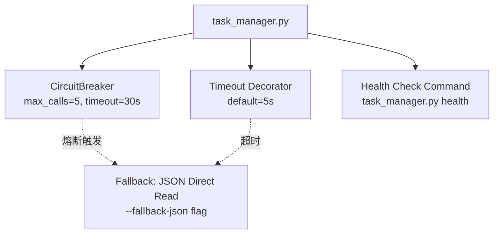
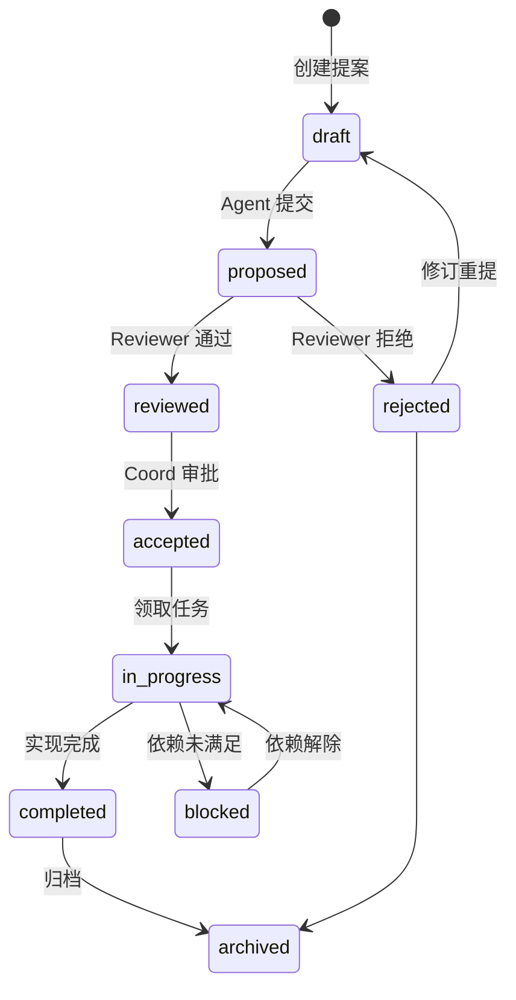
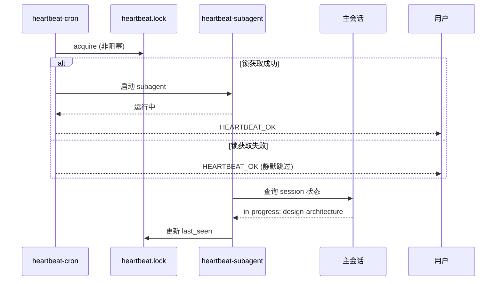
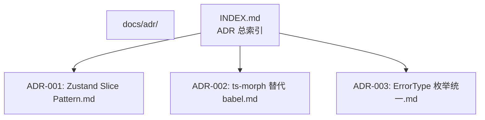

# Architect 提案 — 2026-03-24

**时间**: 2026-03-24 19:27 (UTC+8)  
**来源**: vibex-architect-proposals-20260324_185417/collect-proposals  
**Architect**: architect agent

---

## 今日工作回顾

| 项目 | 任务 | 产出 | 耗时 |
|------|------|------|------|
| vibex-dev-proposals-20260324_185233 | design-architecture | architecture.md（6 提案 + 2 ADR） | ~8min |
| vibex-dev-proposals-20260324_185417 | design-architecture | architecture.md（3 Epic + 2 ADR） | ~8min |
| vibex-architect-proposals-20260324_185417 | collect-proposals | architect-proposal.md | ~3min |

---

## 提案 Arch-001: task_manager.py 稳定性重构（P0）

### 问题
`task_manager.py` 的 `list`/`claim` 命令存在挂起问题，无超时保护、无降级机制，导致心跳流程中断。Analyst 和 Architect 都需要绕过脚本直接修改 JSON。

**根因分析**：
- `subprocess.run` 无默认超时
- 依赖外部进程（`openclaw` CLI）但无熔断保护
- 错误处理缺失（异常直接抛出）

### 架构决策



### 方案

| 组件 | 实现 | 工时 |
|------|------|------|
| Circuit Breaker | Python `circuitbreaker` 库，熔断阈值 5 次/30s | 1h |
| Timeout Decorator | `@timeout(seconds=5)` 装饰器 | 0.5h |
| Fallback Mode | `--fallback-json` 直接读写 `tasks.json` | 1h |
| Health Check | `health` 子命令返回状态 | 0.5h |

### 验收标准
```python
# test_circuit_breaker.py
def test_breaker_opens_after_5_failures():
    for _ in range(5):
        call_api()
    assert get_breaker_state() == "OPEN"
    # 后续调用走 fallback

def test_health_returns_status():
    result = subprocess.run(["python", "task_manager.py", "health"], capture_output=True)
    assert result.returncode == 0
    assert "OK" in result.stdout
```

### 收益
- 心跳流程 0 中断
- 工具链可用性 ≥ 99%
- 估算节省每日 30min 手动绕过时间

---

## 提案 Arch-002: 提案生命周期架构（P1）

### 问题
当前提案在 coord 派发后缺乏统一的生命周期管理：创建 → 分析 → 设计 → 实现 → 归档 全流程无标准化状态机，导致重复提案（如今日出现 2 个 fix 类提案）和提案积压。

### 方案：提案状态机



### 提案元数据 Schema

```json
{
  "id": "arch-20260324-001",
  "title": "task_manager 稳定性重构",
  "agent": "architect",
  "status": "proposed",
  "priority": "P0",
  "createdAt": "2026-03-24T19:27:00+08:00",
  "dependsOn": [],
  "lifecycle": {
    "proposedAt": "2026-03-24T19:27:00+08:00",
    "reviewedAt": null,
    "acceptedAt": null,
    "completedAt": null
  },
  "tags": ["toolchain", "stability", "P0"]
}
```

### 收益
- 提案可追溯、可评估
- 自动检测重复提案（基于 title/bigram 相似度）
- Coord 审批效率提升

---

## 提案 Arch-003: Heartbeat 子 Agent 状态感知提升（P1）

### 问题
心跳脚本作为 cron subagent 运行，无法感知主会话状态。当 subagent 正在执行耗时任务时（如设计架构），心跳可能重复派发同一任务。

### 方案



### 实现

```bash
# heartbeat.lock 文件格式
{
  "pid": 12345,
  "started_at": "2026-03-24T19:25:00+08:00",
  "task": "design-architecture",
  "last_seen": "2026-03-24T19:27:00+08:00"
}

# 逻辑：last_seen 超过 5min 则判定 subagent 僵死，强制释放锁
```

### 验收标准
```bash
# 测试：subagent 运行中，心跳静默跳过
python heartbeat.py --check-lock
# 输出: "subagent active (task=design-architecture, alive=2m), skip"
```

---

## 提案 Arch-004: ADR 体系建设试点推进（P2）

### 问题
当前架构决策散落在各个 architecture.md 中，缺乏统一的 ADR（Architecture Decision Records）索引和版本管理。决策的背景和取舍记录难以追溯。

### 方案



### ADR 模板

```markdown
# ADR-XXX: [决策标题]

## Status
Accepted | Proposed | Deprecated | Superseded

## Context
[问题背景]

## Decision
[所做的决策]

## Consequences
### Positive
### Negative
### Neutral

## Alternatives Considered
- Option A: [描述] → 拒绝原因
- Option B: [描述] → 接受原因
```

### 工时
0.5d（建立目录 + 索引 + 本次决策归档）

---

## 优先级汇总

| ID | 提案 | 优先级 | 工时 | 依赖 |
|----|------|--------|------|------|
| Arch-001 | task_manager 稳定性重构 | **P0** | 3h | 无 |
| Arch-002 | 提案生命周期架构 | P1 | 1d | 无 |
| Arch-003 | Heartbeat 状态感知 | P1 | 4h | Arch-001 |
| Arch-004 | ADR 体系建设 | P2 | 0.5d | 无 |

**关键路径**：Arch-001（3h）→ 解锁 Arch-003（4h）

---

## 技术债务标注

| 债务项 | 风险 | 影响 | 缓解 |
|--------|------|------|------|
| task_manager 无超时 | 🔴 高 | 心跳流程中断 | 紧急修复 |
| 提案无状态机 | 🟡 中 | 重复提案 | Arch-002 |
| ADR 未归档 | 🟢 低 | 决策不可追溯 | Arch-004 |
