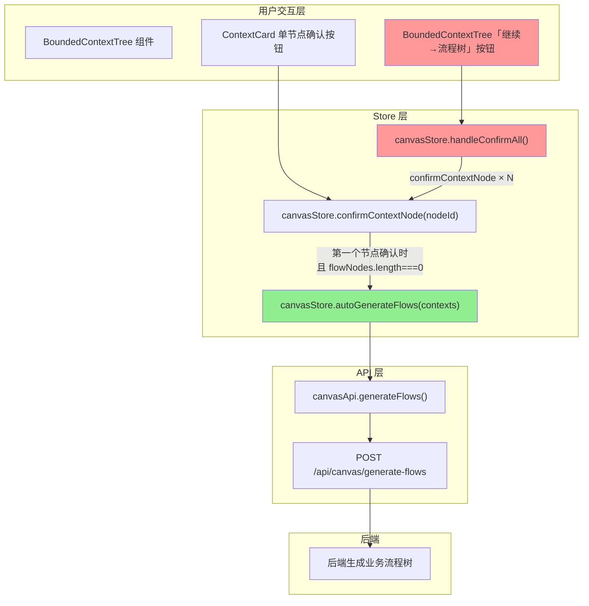

# 📋 需求分析报告：vibex-canvas-context-pass-20260328

**项目**: vibex-canvas-context-pass-20260328
**角色**: analyst
**日期**: 2026-03-28
**目标**: 修复「继续·流程树」按钮点击后没有携带用户编辑确认的上下文树信息请求后端的问题

---

## 一、问题描述

用户点击「继续 → 流程树」按钮后，系统应该将**用户已编辑并确认的限界上下文树数据**发送到后端，触发 `POST /api/canvas/generate-flows` 接口以生成业务流程树。

当前行为：**上下文数据未正确传递到后端**，导致业务流程树无法生成或生成不完整。

---

## 二、上下文数据传递链路分析

### 2.1 数据流向图（Mermaid）



### 2.2 链路追踪

#### 路径 A：通过单节点「确认」按钮（✅ 正确）

**触发条件**：用户逐个点击 ContextCard 上的「确认」按钮

```typescript
// BoundedContextTree.tsx - ContextCard
<button onClick={() => onConfirm(node.nodeId)}>确认</button>

// BoundedContextTree.tsx - onConfirm prop
const confirmContextNode = useCanvasStore((s) => s.confirmContextNode);

// canvasStore.ts - confirmContextNode 核心逻辑
confirmContextNode: (nodeId) => {
  const newContextNodes = get().contextNodes.map((n) =>
    n.nodeId === nodeId ? { ...n, confirmed: true, status: 'confirmed' } : n
  );
  set({ contextNodes: newContextNodes });
  // 自动触发流程生成（仅在第一个确认时）
  const allConfirmed = cascade.areAllConfirmed(newContextNodes);
  if (allConfirmed && newContextNodes.length > 0 && get().flowNodes.length === 0) {
    get().autoGenerateFlows(newContextNodes);  // ← 调用后端
  }
}
```

**数据传递**：✅ 完整，用户编辑后的 `contextNodes` 传入 `autoGenerateFlows`

```typescript
// canvasStore.ts - autoGenerateFlows 发送的数据
const mappedContexts = contexts.map((ctx) => ({
  id: ctx.nodeId,
  name: ctx.name,
  description: ctx.description ?? '',
  type: ctx.type,
}));
// POST /api/canvas/generate-flows { contexts: [...], sessionId }
```

#### 路径 B：通过「继续 → 流程树」按钮（❌ 缺失）

**触发条件**：用户点击 BoundedContextTree 顶部的「继续 → 流程树」按钮

```typescript
// BoundedContextTree.tsx - handleConfirmAll
const handleConfirmAll = useCallback(() => {
  contextNodes.forEach((n) => {
    if (!n.confirmed) confirmContextNode(n.nodeId);  // ← 逐个确认
  });
  const allConfirmed = contextNodes.every((n) => n.confirmed);
  if (allConfirmed && contextNodes.length > 0) {
    advancePhase();  // ← 仅推进阶段
    // ❌ 缺失：没有调用 autoGenerateFlows
  }
}, [contextNodes, confirmContextNode, advancePhase]);
```

**问题**：虽然 `handleConfirmAll` 内部调用了 `confirmContextNode`（会触发 `autoGenerateFlows`），但存在竞态条件：

```
时序问题：

T0: handleConfirmAll() 开始
T1: confirmContextNode(node-1) → 触发 autoGenerateFlows → API 请求发出
T2: confirmContextNode(node-2) → 条件不满足（allConfirmed 可能为 false）
...
T3: advancePhase() 被调用

在 T1 时 autoGenerateFlows 被触发，但：
- 如果 flowNodes.length !== 0（例如之前已生成过），条件不满足
- 第一个确认节点可能已被标记为 confirmed（来自之前的部分确认），导致 allConfirmed 检查失效
```

#### 路径 C：Tab 模式下的「→ 继续 → 流程树」按钮（⚠️ 部分缺失）

**位置**：`CanvasPage.tsx` 中 `renderTabContent` 的 context 分支

```typescript
// CanvasPage.tsx - renderTabContent - context 分支
<button
  onClick={() => autoGenerateFlows(contextNodes)}  // ← 调用 API ✅
  // ⚠️ 缺失：没有 advancePhase()
>
  {flowGenerating ? `◌ ${flowGeneratingMessage ?? '生成中...'}` : '→ 继续 → 流程树'}
</button>
```

**问题**：该按钮调用了 `autoGenerateFlows`，但没有调用 `advancePhase()`，导致 UI 阶段不更新。

---

## 三、数据丢失点定位

### 丢失点 1：「继续 → 流程树」按钮缺少 `autoGenerateFlows` 调用

| 文件 | 行号 | 问题 |
|------|------|------|
| `src/components/canvas/BoundedContextTree.tsx` | 313-321 | `handleConfirmAll` 只调用 `advancePhase()`，未调用 `autoGenerateFlows` |

```typescript
// BoundedContextTree.tsx - 当前实现（有问题）
const handleConfirmAll = useCallback(() => {
  contextNodes.forEach((n) => {
    if (!n.confirmed) confirmContextNode(n.nodeId);
  });
  const allConfirmed = contextNodes.every((n) => n.confirmed);
  if (allConfirmed && contextNodes.length > 0) {
    advancePhase();  // ❌ 只推进阶段，没有触发 API
  }
}, [contextNodes, confirmContextNode, advancePhase]);
```

**根因**：`advancePhase` 是纯 UI 阶段推进，不携带任何数据；而 `autoGenerateFlows` 才是实际调用后端 API 的函数。`handleConfirmAll` 混淆了两者的职责。

### 丢失点 2：Tab 模式按钮缺少 `advancePhase` 调用

| 文件 | 行号 | 问题 |
|------|------|------|
| `src/components/canvas/CanvasPage.tsx` | 270-280 | 调用 `autoGenerateFlows` 但未调用 `advancePhase` |

### 丢失点 3：条件检查缺陷

在 `confirmContextNode` 的自动触发逻辑中：

```typescript
if (allConfirmed && newContextNodes.length > 0 && get().flowNodes.length === 0) {
  get().autoGenerateFlows(newContextNodes);
}
```

**问题**：`flowNodes.length === 0` 条件导致重复点击时不重新生成流程，用户修改上下文后无法更新已生成的流程树。

---

## 四、根本原因总结

```
用户点击「继续 → 流程树」
    ↓
handleConfirmAll() 遍历确认所有节点
    ↓
调用 confirmContextNode(nodeId) × N
    ↓
第一个 confirmContextNode 检查条件：
  allConfirmed && flowNodes.length === 0
    ↓
如果 flowNodes 非空（之前已生成过）→ ❌ 不调用 autoGenerateFlows
如果 flowNodes 为空 → ✅ 调用 autoGenerateFlows（但这是竞态的）
    ↓
advancePhase() 被调用（无论 API 是否被调用）
    ↓
用户看到阶段切换，但流程树未生成或数据过时
```

---

## 五、修复方案建议

### 方案 A（推荐）：修复 `handleConfirmAll`

**修改文件**：`src/components/canvas/BoundedContextTree.tsx`

```typescript
// 修改 handleConfirmAll，增加 autoGenerateFlows 调用
const autoGenerateFlows = useCanvasStore((s) => s.autoGenerateFlows);

const handleConfirmAll = useCallback(() => {
  contextNodes.forEach((n) => {
    if (!n.confirmed) confirmContextNode(n.nodeId);
  });
  const allConfirmed = contextNodes.every((n) => n.confirmed);
  if (allConfirmed && contextNodes.length > 0) {
    // 显式调用 autoGenerateFlows，确保 API 被调用
    autoGenerateFlows(contextNodes);
    advancePhase();
  }
}, [contextNodes, confirmContextNode, advancePhase, autoGenerateFlows]);
```

**优点**：改动最小，逻辑清晰
**缺点**：需要确保 `autoGenerateFlows` 在 `advancePhase` 之前完成（或使用 async/await）

### 方案 B：重构 `advancePhase` 支持携带数据

**修改文件**：`src/lib/canvas/canvasStore.ts`

```typescript
advancePhase: (contexts?: BoundedContextNode[]) => {
  const { phase } = get();
  const phaseOrder: Phase[] = ['input', 'context', 'flow', 'component', 'prototype'];
  const idx = phaseOrder.indexOf(phase);
  if (idx < phaseOrder.length - 1) {
    // 如果是从 context 进入 flow，且传入了 contexts，则触发生成
    if (phase === 'context' && phaseOrder[idx + 1] === 'flow' && contexts) {
      get().autoGenerateFlows(contexts);
    }
    set({ phase: phaseOrder[idx + 1] });
    get().recomputeActiveTree();
  }
},
```

**优点**：API 语义统一
**缺点**：改动较大，影响面广

### 方案 C（最彻底）：统一两处按钮的调用链

修复 `handleConfirmAll`（BoundedContextTree） + 修复 Tab 按钮（CanvasPage）：

```typescript
// CanvasPage.tsx - Tab 模式按钮
<button onClick={() => {
  if (contextNodes.length > 0) {
    autoGenerateFlows(contextNodes);  // 已有
    advancePhase();                    // 补充：推进阶段
  }
}}>
  {flowGenerating ? `◌ ${flowGeneratingMessage ?? '生成中...'}` : '→ 继续 → 流程树'}
</button>
```

---

## 六、影响范围评估

| 文件 | 改动量 | 风险 |
|------|--------|------|
| `BoundedContextTree.tsx` | 小（1 处） | 低 |
| `CanvasPage.tsx` | 小（1 处） | 低 |
| `canvasStore.ts`（可选） | 中 | 中 |

**无破坏性变更**：所有修改都是增量式的，不影响现有功能路径。

---

## 七、验收标准

1. 用户在 BoundedContextTree 中点击「继续 → 流程树」按钮后，Network 面板中出现 `POST /api/canvas/generate-flows` 请求
2. 请求体中包含用户编辑后的 `contexts` 数组（含 name、description、type）
3. 流程树正确生成并显示
4. 阶段从 `context` 正确推进到 `flow`

---

*报告作者: architect/analyst*
*下一步: create-prd → design-architecture → coord-decision*
