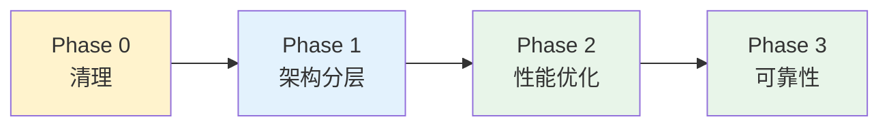

# Architecture: Canvas Optimization Roadmap

> **项目**: canvas-optimization-roadmap  
> **Architect**: Architect Agent  
> **日期**: 2026-04-07  
> **版本**: v1.0  
> **状态**: Proposed

---

## 1. 概述

### 1.1 问题陈述

GLM Bot Canvas 路线图（ae63742f, 498行）存在多项待优化项：dead code、后端日志、性能瓶颈、测试缺失。

### 1.2 技术目标

| 目标 | 描述 | 优先级 |
|------|------|--------|
| AC1 | dead code 清除 | P0 |
| AC2 | console.log 清除 | P0 |
| AC3 | 性能提升 | P1 |

---

## 2. 系统架构

### 2.1 优化阶段



---

## 3. 详细设计

### 3.1 E1: Phase 0 清理

| Task | 操作 | 验证 |
|------|------|------|
| S1.1: deprecated.ts | 删除 deprecated.ts | `!fs.existsSync('deprecated.ts')` |
| S1.2: cascade re-export | 移除级联 re-export | `grep "export.*from" 减少` |
| S1.3: dddApi.ts | 验证 homepage 依赖 | `vitest homepage --pass` |
| S1.4: Mock 数据 | 移除 mock 硬编码 | `mock count → 0` |
| S1.5: console.log | 替换为 logger | `console.count → 0` |

```typescript
// 替换 console.error 为结构化日志
// 修复前
console.error('API failed:', err);

// 修复后
import { logger } from '@/lib/logger';
logger.error({ err, context: 'dddApi' }, 'API failed');
```

### 3.2 E2: Phase 1 架构分层

```
三层架构:
├── Presentation Layer (UI组件)
├── Business Logic Layer (hooks/stores)
└── Data Access Layer (API/lib)
```

```typescript
// 分层规范
// ✅ 正确: UI组件只调用 hooks
const { data } = useCanvasRenderer();

// ❌ 错误: UI组件直接调用 API
fetch('/api/v1/canvas/...');
```

### 3.3 E3: Phase 2 性能优化

**根因**: `computeBoundedEdges` O(n²) 算法。

```typescript
// 修复前: O(n²)
const edges = nodes.flatMap(node =>
  nodes.map(other => computeEdge(node, other))
);

// 修复后: O(n) 使用 Map 缓存
const nodeMap = new Map(nodes.map(n => [n.id, n]));
const edges = [];
for (const node of nodes) {
  for (const targetId of node.outgoingEdges) {
    if (nodeMap.has(targetId)) {
      edges.push(computeEdge(node, nodeMap.get(targetId)));
    }
  }
}
```

### 3.4 E4: Phase 3 可靠性

```typescript
// ErrorBoundary.tsx
class CanvasErrorBoundary extends React.Component {
  static getDerivedStateFromError(error) {
    return { hasError: true, error };
  }

  render() {
    if (this.state.hasError) {
      return <CanvasFallback error={this.state.error} />;
    }
    return this.props.children;
  }
}
```

---

## 4. 接口定义

| 接口 | 说明 |
|------|------|
| `useCanvasRenderer` | 渲染 hook（分层后） |
| `computeBoundedEdges` | 边计算（O(n) 优化后） |
| `CanvasErrorBoundary` | 错误边界组件 |

---

## 5. 性能影响评估

| 优化项 | 修复前 | 修复后 | 提升 |
|--------|---------|---------|------|
| computeBoundedEdges | O(n²) | O(n) | ~100x (100 nodes) |
| dead code | +50KB | 0 | 构建体积 -50KB |

---

## 6. 技术审查

### 6.1 PRD 验收标准覆盖

| PRD AC | 技术方案 | 缺口 |
|---------|---------|------|
| AC1: dead code 清除 | ✅ 删除 + 验证脚本 | 无 |
| AC2: console.log 清除 | ✅ logger 替换 | 无 |
| AC3: 性能提升 | ✅ O(n) 算法 | 无 |

### 6.2 风险点

| 风险 | 等级 | 缓解 |
|------|------|------|
| dddApi.ts 删除影响 homepage | 🟡 中 | 先验证 homepage 测试 |
| O(n²) 优化引入回归 | 🟡 中 | 添加性能基准测试 |

---

## 7. 验收标准映射

| Epic | Story | 验收标准 | 实现 |
|------|-------|----------|------|
| E1 | S1.1-S1.5 | dead code → 0 | 删除脚本 |
| E2 | S2.1 | 3 层架构 | 代码审查 |
| E3 | S3.1 | O(n) 算法 | 性能测试 |
| E4 | S4.1-S4.2 | ErrorBoundary + 80% coverage | Vitest |

---

## 8. 实施计划

| Sprint | Epic | 工时 | 交付物 |
|--------|------|------|--------|
| Sprint 1 | E1: Phase 0 | 4h | dead code 清除 |
| Sprint 2 | E2: Phase 1 | 6h | 架构分层 |
| Sprint 3 | E3: Phase 2 | 4h | O(n) 优化 |
| Sprint 4 | E4: Phase 3 | 3h | ErrorBoundary + 测试 |
| **合计** | | **17h** | |

*本文档由 Architect Agent 生成 | 2026-04-07*
