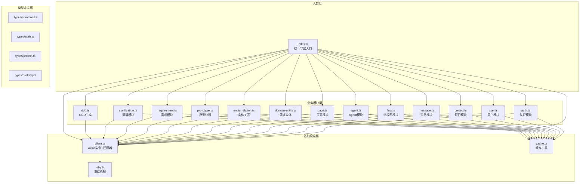

# API 服务层重构架构设计

**项目**: vibex-api-service-refactor  
**版本**: 1.0  
**日期**: 2026-03-05  
**作者**: Architect Agent

---

## 1. 概述

本文档定义了 `api.ts` (1471 行) 模块化拆分的架构方案，包括模块接口定义、依赖关系分析和共享层设计。

---

## 2. 技术选型

| 技术 | 版本 | 选择理由 |
|------|------|---------|
| TypeScript | 5.x | 项目已有，强类型支持 |
| Axios | 1.x | 现有依赖，功能完善 |
| React Flow | 11.x | FlowData 类型依赖 |

---

## 3. 架构图



---

## 4. 目录结构

```
src/services/api/
├── index.ts                    # 统一导出入口
├── client.ts                   # Axios 实例 + 拦截器
├── cache.ts                    # 缓存工具
├── retry.ts                    # 重试机制
├── types/
│   ├── index.ts                # 类型统一导出
│   ├── common.ts               # 通用类型
│   ├── auth.ts                 # 认证相关类型
│   ├── user.ts                 # 用户相关类型
│   ├── project.ts              # 项目相关类型
│   ├── message.ts              # 消息相关类型
│   ├── flow.ts                 # 流程图相关类型
│   ├── agent.ts                # Agent 相关类型
│   ├── page.ts                 # 页面相关类型
│   └── prototype/              # AI 原型类型
│       ├── index.ts
│       ├── requirement.ts
│       ├── domain.ts
│       ├── analysis.ts
│       └── ui-schema.ts
└── modules/
    ├── index.ts                # 模块统一导出
    ├── auth.ts                 # 认证 API
    ├── user.ts                 # 用户 API
    ├── project.ts              # 项目 API
    ├── message.ts              # 消息 API
    ├── flow.ts                 # 流程图 API
    ├── agent.ts                # Agent API
    ├── page.ts                 # 页面 API
    ├── domain-entity.ts        # 领域实体 API
    ├── entity-relation.ts      # 实体关系 API
    ├── prototype.ts            # 原型快照 API
    ├── requirement.ts          # 需求 API
    ├── clarification.ts        # 澄清 API
    └── ddd.ts                  # DDD 生成 API
```

---

## 5. 模块接口定义

### 5.1 基础设施模块

#### 5.1.1 client.ts - HTTP 客户端

```typescript
import { AxiosInstance, AxiosError, AxiosResponse, InternalAxiosRequestConfig } from 'axios';

// ==================== 接口定义 ====================

export interface HttpClientConfig {
  baseURL?: string;
  timeout?: number;
}

export interface HttpClient {
  readonly instance: AxiosInstance;
  get<T>(url: string, config?: AxiosRequestConfig): Promise<T>;
  post<T>(url: string, data?: unknown, config?: AxiosRequestConfig): Promise<T>;
  put<T>(url: string, data?: unknown, config?: AxiosRequestConfig): Promise<T>;
  patch<T>(url: string, data?: unknown, config?: AxiosRequestConfig): Promise<T>;
  delete<T>(url: string, config?: AxiosRequestConfig): Promise<T>;
}

// ==================== 工厂函数 ====================

export function createHttpClient(config?: HttpClientConfig): HttpClient;

// ==================== 错误转换 ====================

export function transformError(error: AxiosError | Error): Error;

// ==================== 单例导出 ====================

export const httpClient: HttpClient;
```

#### 5.1.2 cache.ts - 缓存工具

```typescript
// ==================== 接口定义 ====================

export interface CacheOptions {
  prefix?: string;
}

export interface CacheService {
  get<T>(key: string): T | null;
  set<T>(key: string, value: T): void;
  remove(key: string): void;
  clear(): void;
}

// ==================== 单例导出 ====================

export const cache: CacheService;

// ==================== 工具函数 ====================

export function getCacheKey(resource: string, id?: string): string;
```

#### 5.1.3 retry.ts - 重试机制

```typescript
// ==================== 接口定义 ====================

export interface RetryConfig {
  maxRetries: number;
  baseDelay: number;
  retryableStatusCodes: number[];
}

export interface RetryService {
  execute<T>(fn: () => Promise<T>, config?: Partial<RetryConfig>): Promise<T>;
  isRetryable(error: unknown): boolean;
}

// ==================== 默认配置 ====================

export const DEFAULT_RETRY_CONFIG: RetryConfig = {
  maxRetries: 3,
  baseDelay: 1000,
  retryableStatusCodes: [500, 502, 503, 504],
};

// ==================== 单例导出 ====================

export const retry: RetryService;
```

### 5.2 业务模块

#### 5.2.1 auth.ts - 认证模块

```typescript
import { User, LoginRequest, RegisterRequest, AuthResponse } from '../types/auth';
import { SuccessResponse } from '../types/common';

// ==================== 接口定义 ====================

export interface AuthApi {
  /**
   * 用户登录
   */
  login(credentials: LoginRequest): Promise<AuthResponse>;
  
  /**
   * 用户注册
   */
  register(data: RegisterRequest): Promise<AuthResponse>;
  
  /**
   * 获取当前用户信息
   */
  getCurrentUser(): Promise<User>;
  
  /**
   * 用户登出
   */
  logout(): Promise<SuccessResponse>;
}

// ==================== 工厂函数 ====================

export function createAuthApi(): AuthApi;

// ==================== 单例导出 ====================

export const authApi: AuthApi;
```

#### 5.2.2 user.ts - 用户模块

```typescript
import { User, UserUpdate } from '../types/user';

// ==================== 接口定义 ====================

export interface UserApi {
  /**
   * 获取用户信息
   */
  getUser(userId: string): Promise<User>;
  
  /**
   * 更新用户信息
   */
  updateUser(userId: string, data: UserUpdate): Promise<User>;
}

// ==================== 工厂函数 ====================

export function createUserApi(): UserApi;

// ==================== 单例导出 ====================

export const userApi: UserApi;
```

#### 5.2.3 project.ts - 项目模块

```typescript
import { Project, ProjectCreate, ProjectUpdate, ProjectRole } from '../types/project';
import { SuccessResponse } from '../types/common';

// ==================== 接口定义 ====================

export interface ProjectApi {
  // CRUD
  getProjects(userId: string): Promise<Project[]>;
  getProject(projectId: string): Promise<Project>;
  createProject(project: ProjectCreate): Promise<Project>;
  updateProject(projectId: string, data: ProjectUpdate): Promise<Project>;
  deleteProject(projectId: string): Promise<SuccessResponse>;
  
  // 软删除
  softDeleteProject(projectId: string): Promise<Project>;
  restoreProject(projectId: string): Promise<Project>;
  permanentDeleteProject(projectId: string): Promise<SuccessResponse>;
  getDeletedProjects(): Promise<Project[]>;
  clearDeletedProjects(): Promise<SuccessResponse>;
  
  // 角色
  getProjectRole(projectId: string): Promise<{ role: ProjectRole }>;
}

// ==================== 工厂函数 ====================

export function createProjectApi(): ProjectApi;

// ==================== 单例导出 ====================

export const projectApi: ProjectApi;
```

#### 5.2.4 message.ts - 消息模块

```typescript
import { Message, MessageCreate } from '../types/message';
import { SuccessResponse } from '../types/common';

// ==================== 接口定义 ====================

export interface MessageApi {
  getMessages(projectId: string): Promise<Message[]>;
  createMessage(message: MessageCreate): Promise<Message>;
  deleteMessage(messageId: string): Promise<SuccessResponse>;
}

// ==================== 工厂函数 ====================

export function createMessageApi(): MessageApi;

// ==================== 单例导出 ====================

export const messageApi: MessageApi;
```

#### 5.2.5 flow.ts - 流程图模块

```typescript
import { FlowData, FlowDataUpdate } from '../types/flow';
import { SuccessResponse } from '../types/common';

// ==================== 接口定义 ====================

export interface FlowApi {
  getFlow(flowId: string): Promise<FlowData>;
  updateFlow(flowId: string, data: FlowDataUpdate): Promise<FlowData>;
  generateFlow(description: string): Promise<FlowData>;
  deleteFlow(flowId: string): Promise<SuccessResponse>;
}

// ==================== 工厂函数 ====================

export function createFlowApi(): FlowApi;

// ==================== 单例导出 ====================

export const flowApi: FlowApi;
```

#### 5.2.6 agent.ts - Agent 模块

```typescript
import { Agent, AgentCreate, AgentUpdate } from '../types/agent';
import { SuccessResponse } from '../types/common';

// ==================== 接口定义 ====================

export interface AgentApi {
  getAgents(userId?: string): Promise<Agent[]>;
  getAgent(agentId: string): Promise<Agent>;
  createAgent(agent: AgentCreate): Promise<Agent>;
  updateAgent(agentId: string, data: AgentUpdate): Promise<Agent>;
  deleteAgent(agentId: string): Promise<SuccessResponse>;
}

// ==================== 工厂函数 ====================

export function createAgentApi(): AgentApi;

// ==================== 单例导出 ====================

export const agentApi: AgentApi;
```

#### 5.2.7 page.ts - 页面模块

```typescript
import { Page, PageCreate, PageUpdate } from '../types/page';
import { SuccessResponse } from '../types/common';

// ==================== 接口定义 ====================

export interface PageApi {
  getPages(projectId?: string): Promise<Page[]>;
  getPage(pageId: string): Promise<Page>;
  createPage(page: PageCreate): Promise<Page>;
  updatePage(pageId: string, data: PageUpdate): Promise<Page>;
  deletePage(pageId: string): Promise<SuccessResponse>;
}

// ==================== 工厂函数 ====================

export function createPageApi(): PageApi;

// ==================== 单例导出 ====================

export const pageApi: PageApi;
```

#### 5.2.8 domain-entity.ts - 领域实体模块

```typescript
import { DomainEntity } from '../types/prototype/domain';
import { SuccessResponse } from '../types/common';

// ==================== 接口定义 ====================

export interface DomainEntityApi {
  getDomainEntities(requirementId: string): Promise<DomainEntity[]>;
  getDomainEntity(entityId: string): Promise<DomainEntity>;
  createDomainEntity(entity: Omit<DomainEntity, 'id' | 'createdAt'>): Promise<DomainEntity>;
  updateDomainEntity(entityId: string, data: Partial<DomainEntity>): Promise<DomainEntity>;
  deleteDomainEntity(entityId: string, requirementId: string): Promise<SuccessResponse>;
}

// ==================== 工厂函数 ====================

export function createDomainEntityApi(): DomainEntityApi;

// ==================== 单例导出 ====================

export const domainEntityApi: DomainEntityApi;
```

#### 5.2.9 entity-relation.ts - 实体关系模块

```typescript
import { EntityRelation } from '../types/prototype/domain';
import { SuccessResponse } from '../types/common';

// ==================== 接口定义 ====================

export interface EntityRelationApi {
  getEntityRelations(requirementId: string): Promise<EntityRelation[]>;
  getEntityRelation(relationId: string): Promise<EntityRelation>;
  createEntityRelation(
    relation: Omit<EntityRelation, 'id'>,
    requirementId?: string
  ): Promise<EntityRelation>;
  updateEntityRelation(
    relationId: string,
    data: Partial<EntityRelation>,
    requirementId?: string
  ): Promise<EntityRelation>;
  deleteEntityRelation(relationId: string, requirementId: string): Promise<SuccessResponse>;
}

// ==================== 工厂函数 ====================

export function createEntityRelationApi(): EntityRelationApi;

// ==================== 单例导出 ====================

export const entityRelationApi: EntityRelationApi;
```

#### 5.2.10 prototype.ts - 原型快照模块

```typescript
import { PrototypeSnapshot, PrototypeSnapshotCreate } from '../types/prototype';
import { SuccessResponse } from '../types/common';

// ==================== 接口定义 ====================

export interface PrototypeApi {
  getPrototypeSnapshots(projectId: string): Promise<PrototypeSnapshot[]>;
  getPrototypeSnapshot(snapshotId: string): Promise<PrototypeSnapshot>;
  createPrototypeSnapshot(snapshot: PrototypeSnapshotCreate): Promise<PrototypeSnapshot>;
  updatePrototypeSnapshot(
    snapshotId: string,
    data: Partial<PrototypeSnapshotCreate>
  ): Promise<PrototypeSnapshot>;
  deletePrototypeSnapshot(snapshotId: string, projectId: string): Promise<SuccessResponse>;
}

// ==================== 工厂函数 ====================

export function createPrototypeApi(): PrototypeApi;

// ==================== 单例导出 ====================

export const prototypeApi: PrototypeApi;
```

#### 5.2.11 requirement.ts - 需求模块

```typescript
import { 
  Requirement, 
  RequirementCreate, 
  RequirementUpdate,
  AnalysisResult 
} from '../types/prototype';
import { SuccessResponse } from '../types/common';

// ==================== 接口定义 ====================

export interface RequirementApi {
  // CRUD
  getRequirements(userId: string): Promise<Requirement[]>;
  getRequirement(requirementId: string): Promise<Requirement>;
  createRequirement(requirement: RequirementCreate): Promise<Requirement>;
  updateRequirement(
    requirementId: string,
    data: RequirementUpdate,
    userId?: string
  ): Promise<Requirement>;
  deleteRequirement(requirementId: string, userId: string): Promise<SuccessResponse>;
  
  // 分析
  analyzeRequirement(requirementId: string): Promise<Requirement>;
  reanalyzeRequirement(
    requirementId: string,
    context?: Record<string, unknown>
  ): Promise<Requirement>;
  getAnalysisResult(requirementId: string): Promise<AnalysisResult | null>;
}

// ==================== 工厂函数 ====================

export function createRequirementApi(): RequirementApi;

// ==================== 单例导出 ====================

export const requirementApi: RequirementApi;
```

#### 5.2.12 clarification.ts - 澄清模块

```typescript
import { Clarification } from '../types/prototype';

// ==================== 接口定义 ====================

export interface ClarificationApi {
  getClarifications(requirementId: string): Promise<Clarification[]>;
  answerClarification(
    requirementId: string,
    clarificationId: string,
    answer: string
  ): Promise<Clarification>;
  skipClarification(
    requirementId: string,
    clarificationId: string
  ): Promise<Clarification>;
}

// ==================== 工厂函数 ====================

export function createClarificationApi(): ClarificationApi;

// ==================== 单例导出 ====================

export const clarificationApi: ClarificationApi;
```

#### 5.2.13 ddd.ts - DDD 生成模块

```typescript
import { BoundedContext, BoundedContextResponse } from '../types/prototype/domain';

// ==================== 接口定义 ====================

export interface DddApi {
  generateBoundedContext(
    requirementText: string,
    projectId?: string
  ): Promise<BoundedContextResponse>;
  
  generateDomainModel(
    boundedContexts: BoundedContext[],
    requirementText: string,
    projectId?: string
  ): Promise<{ success: boolean; domainModels?: unknown[]; mermaidCode?: string; error?: string }>;
  
  generateBusinessFlow(
    domainModels: unknown[],
    requirementText: string,
    projectId?: string
  ): Promise<{ success: boolean; businessFlow?: unknown; mermaidCode?: string; error?: string }>;
}

// ==================== 工厂函数 ====================

export function createDddApi(): DddApi;

// ==================== 单例导出 ====================

export const dddApi: DddApi;
```

---

## 6. 统一导出入口设计

### 6.1 index.ts - 主入口

```typescript
// ==================== 类型导出 ====================
export * from './types';

// ==================== 基础设施导出 ====================
export { httpClient, createHttpClient } from './client';
export { cache, CacheService } from './cache';
export { retry, RetryService, DEFAULT_RETRY_CONFIG } from './retry';

// ==================== 业务模块导出 ====================
export { authApi, createAuthApi, AuthApi } from './modules/auth';
export { userApi, createUserApi, UserApi } from './modules/user';
export { projectApi, createProjectApi, ProjectApi } from './modules/project';
export { messageApi, createMessageApi, MessageApi } from './modules/message';
export { flowApi, createFlowApi, FlowApi } from './modules/flow';
export { agentApi, createAgentApi, AgentApi } from './modules/agent';
export { pageApi, createPageApi, PageApi } from './modules/page';
export { domainEntityApi, createDomainEntityApi, DomainEntityApi } from './modules/domain-entity';
export { entityRelationApi, createEntityRelationApi, EntityRelationApi } from './modules/entity-relation';
export { prototypeApi, createPrototypeApi, PrototypeApi } from './modules/prototype';
export { requirementApi, createRequirementApi, RequirementApi } from './modules/requirement';
export { clarificationApi, createClarificationApi, ClarificationApi } from './modules/clarification';
export { dddApi, createDddApi, DddApi } from './modules/ddd';

// ==================== 兼容层：模拟原有 ApiService ====================
import { authApi } from './modules/auth';
import { userApi } from './modules/user';
import { projectApi } from './modules/project';
import { messageApi } from './modules/message';
import { flowApi } from './modules/flow';
import { agentApi } from './modules/agent';
import { pageApi } from './modules/page';
import { domainEntityApi } from './modules/domain-entity';
import { entityRelationApi } from './modules/entity-relation';
import { prototypeApi } from './modules/prototype';
import { requirementApi } from './modules/requirement';
import { clarificationApi } from './modules/clarification';
import { dddApi } from './modules/ddd';
import { httpClient } from './client';

/**
 * @deprecated 使用具名导入代替
 * 例如: import { authApi, projectApi } from '@/services/api'
 */
export const apiService = {
  // 认证
  login: authApi.login.bind(authApi),
  register: authApi.register.bind(authApi),
  getCurrentUser: authApi.getCurrentUser.bind(authApi),
  logout: authApi.logout.bind(authApi),
  
  // 用户
  getUser: userApi.getUser.bind(userApi),
  updateUser: userApi.updateUser.bind(userApi),
  
  // 项目
  getProjects: projectApi.getProjects.bind(projectApi),
  getProject: projectApi.getProject.bind(projectApi),
  createProject: projectApi.createProject.bind(projectApi),
  updateProject: projectApi.updateProject.bind(projectApi),
  deleteProject: projectApi.deleteProject.bind(projectApi),
  softDeleteProject: projectApi.softDeleteProject.bind(projectApi),
  restoreProject: projectApi.restoreProject.bind(projectApi),
  permanentDeleteProject: projectApi.permanentDeleteProject.bind(projectApi),
  getDeletedProjects: projectApi.getDeletedProjects.bind(projectApi),
  clearDeletedProjects: projectApi.clearDeletedProjects.bind(projectApi),
  getProjectRole: projectApi.getProjectRole.bind(projectApi),
  
  // 消息
  getMessages: messageApi.getMessages.bind(messageApi),
  createMessage: messageApi.createMessage.bind(messageApi),
  deleteMessage: messageApi.deleteMessage.bind(messageApi),
  
  // 流程图
  getFlow: flowApi.getFlow.bind(flowApi),
  updateFlow: flowApi.updateFlow.bind(flowApi),
  generateFlow: flowApi.generateFlow.bind(flowApi),
  deleteFlow: flowApi.deleteFlow.bind(flowApi),
  
  // Agent
  getAgents: agentApi.getAgents.bind(agentApi),
  getAgent: agentApi.getAgent.bind(agentApi),
  createAgent: agentApi.createAgent.bind(agentApi),
  updateAgent: agentApi.updateAgent.bind(agentApi),
  deleteAgent: agentApi.deleteAgent.bind(agentApi),
  
  // 页面
  getPages: pageApi.getPages.bind(pageApi),
  getPage: pageApi.getPage.bind(pageApi),
  createPage: pageApi.createPage.bind(pageApi),
  updatePage: pageApi.updatePage.bind(pageApi),
  deletePage: pageApi.deletePage.bind(pageApi),
  
  // 领域实体
  getDomainEntities: domainEntityApi.getDomainEntities.bind(domainEntityApi),
  getDomainEntity: domainEntityApi.getDomainEntity.bind(domainEntityApi),
  createDomainEntity: domainEntityApi.createDomainEntity.bind(domainEntityApi),
  updateDomainEntity: domainEntityApi.updateDomainEntity.bind(domainEntityApi),
  deleteDomainEntity: domainEntityApi.deleteDomainEntity.bind(domainEntityApi),
  
  // 实体关系
  getEntityRelations: entityRelationApi.getEntityRelations.bind(entityRelationApi),
  getEntityRelation: entityRelationApi.getEntityRelation.bind(entityRelationApi),
  createEntityRelation: entityRelationApi.createEntityRelation.bind(entityRelationApi),
  updateEntityRelation: entityRelationApi.updateEntityRelation.bind(entityRelationApi),
  deleteEntityRelation: entityRelationApi.deleteEntityRelation.bind(entityRelationApi),
  
  // 原型快照
  getPrototypeSnapshots: prototypeApi.getPrototypeSnapshots.bind(prototypeApi),
  getPrototypeSnapshot: prototypeApi.getPrototypeSnapshot.bind(prototypeApi),
  createPrototypeSnapshot: prototypeApi.createPrototypeSnapshot.bind(prototypeApi),
  updatePrototypeSnapshot: prototypeApi.updatePrototypeSnapshot.bind(prototypeApi),
  deletePrototypeSnapshot: prototypeApi.deletePrototypeSnapshot.bind(prototypeApi),
  
  // 需求
  getRequirements: requirementApi.getRequirements.bind(requirementApi),
  getRequirement: requirementApi.getRequirement.bind(requirementApi),
  createRequirement: requirementApi.createRequirement.bind(requirementApi),
  updateRequirement: requirementApi.updateRequirement.bind(requirementApi),
  deleteRequirement: requirementApi.deleteRequirement.bind(requirementApi),
  analyzeRequirement: requirementApi.analyzeRequirement.bind(requirementApi),
  reanalyzeRequirement: requirementApi.reanalyzeRequirement.bind(requirementApi),
  getAnalysisResult: requirementApi.getAnalysisResult.bind(requirementApi),
  
  // 澄清
  getClarifications: clarificationApi.getClarifications.bind(clarificationApi),
  answerClarification: clarificationApi.answerClarification.bind(clarificationApi),
  skipClarification: clarificationApi.skipClarification.bind(clarificationApi),
  
  // DDD
  generateBoundedContext: dddApi.generateBoundedContext.bind(dddApi),
  generateDomainModel: dddApi.generateDomainModel.bind(dddApi),
  generateBusinessFlow: dddApi.generateBusinessFlow.bind(dddApi),
  
  // 工具方法
  isOnline: () => typeof navigator !== 'undefined' ? navigator.onLine : true,
};

export default apiService;
```

---

## 7. 依赖关系分析

### 7.1 依赖矩阵

| 模块 | client | cache | retry | types |
|------|--------|-------|-------|-------|
| auth | ✅ | ✅ | ❌ | auth |
| user | ✅ | ✅ | ❌ | user |
| project | ✅ | ✅ | ❌ | project |
| message | ✅ | ✅ | ❌ | message |
| flow | ✅ | ✅ | ❌ | flow |
| agent | ✅ | ✅ | ❌ | agent |
| page | ✅ | ✅ | ❌ | page |
| domain-entity | ✅ | ✅ | ❌ | prototype |
| entity-relation | ✅ | ✅ | ❌ | prototype |
| prototype | ✅ | ✅ | ❌ | prototype |
| requirement | ✅ | ✅ | ❌ | prototype |
| clarification | ✅ | ✅ | ❌ | prototype |
| ddd | ✅ | ❌ | ❌ | prototype |

### 7.2 模块分层

```
┌─────────────────────────────────────────────────────┐
│                    应用层                            │
│  (index.ts - 统一导出 + 兼容层)                       │
├─────────────────────────────────────────────────────┤
│                    业务模块层                        │
│  auth, user, project, message, flow, agent, page,  │
│  domain-entity, entity-relation, prototype,        │
│  requirement, clarification, ddd                    │
├─────────────────────────────────────────────────────┤
│                    基础设施层                        │
│  client (HTTP), cache, retry                       │
├─────────────────────────────────────────────────────┤
│                    类型定义层                        │
│  types/common, types/auth, types/project, ...      │
└─────────────────────────────────────────────────────┘
```

### 7.3 无循环依赖保证

1. **单向依赖**: 上层依赖下层，下层不依赖上层
2. **类型隔离**: 类型定义层无运行时依赖
3. **模块独立**: 业务模块之间无直接依赖

---

## 8. 共享层设计

### 8.1 共享资源

| 资源 | 提供者 | 消费者 | 共享方式 |
|------|--------|--------|---------|
| Axios 实例 | client.ts | 所有业务模块 | 单例注入 |
| 缓存服务 | cache.ts | 所有业务模块 | 单例注入 |
| 重试机制 | retry.ts | client.ts | 内部集成 |
| 类型定义 | types/* | 所有模块 | ES 导出 |

### 8.2 单例模式实现

```typescript
// client.ts
let _httpClient: HttpClient | null = null;

export function createHttpClient(config?: HttpClientConfig): HttpClient {
  if (_httpClient) {
    return _httpClient;
  }
  
  const instance = axios.create({
    baseURL: config?.baseURL || process.env.NEXT_PUBLIC_API_BASE_URL || 'https://api.vibex.top/api',
    timeout: config?.timeout || 10000,
    headers: { 'Content-Type': 'application/json' },
  });
  
  // 添加拦截器...
  
  _httpClient = { instance, ... };
  return _httpClient;
}

export const httpClient = createHttpClient();
```

### 8.3 缓存键命名规范

```typescript
// cache.ts
const CACHE_PREFIX = 'vibex_cache_';

export function getCacheKey(resource: string, id?: string): string {
  return id ? `${CACHE_PREFIX}${resource}_${id}` : `${CACHE_PREFIX}${resource}`;
}

// 使用示例
// 用户缓存: vibex_cache_user_123
// 项目列表: vibex_cache_projects_456
// 消息列表: vibex_cache_messages_789
```

---

## 9. 迁移兼容性

### 9.1 导入路径兼容

```typescript
// 旧代码（继续支持）
import { apiService } from '@/services/api';
await apiService.login({ email, password });

// 新代码（推荐）
import { authApi } from '@/services/api';
await authApi.login({ email, password });
```

### 9.2 类型兼容

所有现有类型定义保持不变，仅移动到独立文件：

```typescript
// 旧代码
import { User, Project } from '@/services/api';

// 新代码（类型导入路径不变）
import { User, Project } from '@/services/api';
```

### 9.3 响应格式兼容

保持原有响应适配逻辑：

```typescript
// 处理嵌套响应 { data: { ... } }
const data = response.data.data || response.data;
```

---

## 10. 测试策略

### 10.1 测试框架

- **框架**: Jest + @testing-library/react
- **覆盖率要求**: > 60%
- **Mock 策略**: Mock Axios 实例

### 10.2 测试分层

| 层级 | 测试类型 | 覆盖目标 |
|------|---------|---------|
| 类型定义 | 编译时检查 | TypeScript 编译通过 |
| 基础设施 | 单元测试 | client, cache, retry |
| 业务模块 | 单元测试 | 每个 API 方法 |
| 集成测试 | E2E 测试 | 完整请求流程 |

### 10.3 测试用例示例

```typescript
// __tests__/modules/auth.test.ts
import { authApi } from '@/services/api/modules/auth';
import { httpClient } from '@/services/api/client';

jest.mock('@/services/api/client');

describe('AuthApi', () => {
  beforeEach(() => {
    jest.clearAllMocks();
  });

  describe('login', () => {
    it('should return AuthResponse on successful login', async () => {
      const mockResponse = {
        data: {
          data: {
            token: 'test-token',
            user: { id: '1', name: 'Test', email: 'test@example.com' },
          },
        },
      };
      
      (httpClient.post as jest.Mock).mockResolvedValue(mockResponse);
      
      const result = await authApi.login({
        email: 'test@example.com',
        password: 'password',
      });
      
      expect(result.token).toBe('test-token');
      expect(result.user.email).toBe('test@example.com');
    });

    it('should store token in localStorage', async () => {
      // ...
    });

    it('should throw user-friendly error on 401', async () => {
      // ...
    });
  });
});
```

### 10.4 Mock 策略

```typescript
// __mocks__/client.ts
export const httpClient = {
  get: jest.fn(),
  post: jest.fn(),
  put: jest.fn(),
  patch: jest.fn(),
  delete: jest.fn(),
};

// __mocks__/cache.ts
export const cache = {
  get: jest.fn(),
  set: jest.fn(),
  remove: jest.fn(),
  clear: jest.fn(),
};
```

---

## 11. 验证清单

### 11.1 功能验证

- [ ] 所有 API 调用正常工作
- [ ] 认证拦截器正确注入 token
- [ ] 401 响应正确触发登出
- [ ] 缓存读写正常
- [ ] 重试机制正常
- [ ] 所有导入路径更新
- [ ] TypeScript 编译通过
- [ ] 无循环依赖警告

### 11.2 质量验证

- [ ] 单元测试覆盖率 > 60%
- [ ] ESLint 检查 0 errors
- [ ] 无功能回归

---

## 12. 风险缓解

| 风险 | 等级 | 缓解措施 |
|-----|------|---------|
| 导入路径变更 | 🟡 中 | 统一导出入口 + 兼容层 |
| 单例破坏 | 🟡 中 | 严格单例模式 |
| 缓存键冲突 | 🟢 低 | 统一命名规范 |
| 循环依赖 | 🟡 中 | 模块边界清晰 |
| 测试覆盖缺失 | 🟡 中 | 先补充测试 |

---

## 13. 产出物清单

| 文件 | 路径 | 说明 |
|------|------|------|
| 架构设计 | `docs/architecture.md` | 本文档 |
| 模块接口 | `src/services/api/modules/*.ts` | 13 个业务模块 |
| 基础设施 | `src/services/api/client.ts` 等 | 3 个基础设施模块 |
| 类型定义 | `src/services/api/types/*.ts` | 类型拆分 |

---

*架构设计完成于 2026-03-05 07:30 (Asia/Shanghai)*
*Architect Agent*