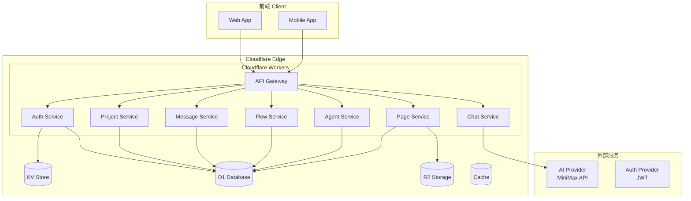

# VibeX Backend Architecture

## 1. Overview

VibeX 后端架构设计，基于 Cloudflare Workers 部署方案，支持用户认证、项目管理、对话历史、流程图数据等核心功能。

## 2. Architecture Diagram



## 3. Technology Stack

| 组件 | 技术选型 | 说明 |
|------|----------|------|
| 运行时 | Cloudflare Workers | Edge 部署，低延迟 |
| 框架 | Next.js 14 (standalone) | API Routes |
| 数据库 | D1 (SQLite) | Cloudflare SQL 数据库 |
| ORM | Prisma | 数据库抽象层 |
| 认证 | JWT + Cloudflare KV | Token 存储 |
| 缓存 | Cloudflare Cache | 热点数据缓存 |
| 文件存储 | R2 | 静态资源存储 |
| AI | MiniMax API | 流式对话支持 |

## 4. Database Schema

### 4.1 Users 表
```prisma
model User {
  id        String   @id @default(uuid())
  email     String   @unique
  password  String   // 加密存储
  name      String
  avatar    String?
  createdAt DateTime @default(now())
  updatedAt DateTime @updatedAt

  projects  Project[]
  messages  Message[]
  flows     FlowData[]
  agents    Agent[]
}
```

### 4.2 Projects 表
```prisma
model Project {
  id          String   @id @default(uuid())
  name        String
  description String?
  userId      String
  user        User     @relation(fields: [userId], references: [id])
  createdAt   DateTime @default(now())
  updatedAt   DateTime @updatedAt

  pages       Page[]
  messages    Message[]
  flows       FlowData[]
}
```

### 4.3 Messages 表
```prisma
model Message {
  id        String   @id @default(uuid())
  role      String   // user, assistant, system
  content   String
  projectId String
  project   Project  @relation(fields: [projectId], references: [id])
  createdAt DateTime @default(now())
}
```

### 4.4 FlowData 表
```prisma
model FlowData {
  id        String   @id @default(uuid())
  name      String?
  nodes     String   // JSON string
  edges     String   // JSON string
  projectId String
  project   Project  @relation(fields: [projectId], references: [id])
  createdAt DateTime @default(now())
  updatedAt DateTime @updatedAt
}
```

### 4.5 Agents 表
```prisma
model Agent {
  id         String   @id @default(uuid())
  name       String
  prompt     String
  model      String   @default("abab6.5s-chat")
  temperature Float   @default(0.7)
  userId     String
  createdAt  DateTime @default(now())
  updatedAt  DateTime @updatedAt
}
```

### 4.6 Pages 表
```prisma
model Page {
  id        String   @id @default(uuid())
  name      String
  content   String?  // JSON or HTML
  projectId String
  project   Project  @relation(fields: [projectId], references: [id])
  createdAt DateTime @default(now())
  updatedAt DateTime @updatedAt
}
```

## 5. API Endpoints

### 5.1 认证 API
| Method | Path | Description |
|--------|------|-------------|
| POST | /api/auth/login | 用户登录 |
| POST | /api/auth/register | 用户注册 |
| POST | /api/auth/logout | 用户登出 |

### 5.2 用户 API
| Method | Path | Description |
|--------|------|-------------|
| GET | /api/users/:id | 获取用户信息 |
| PUT | /api/users/:id | 更新用户信息 |

### 5.3 项目 API
| Method | Path | Description |
|--------|------|-------------|
| GET | /api/projects | 获取项目列表 |
| POST | /api/projects | 创建项目 |
| GET | /api/projects/:id | 获取项目详情 |
| PUT | /api/projects/:id | 更新项目 |
| DELETE | /api/projects/:id | 删除项目 |

### 5.4 消息 API
| Method | Path | Description |
|--------|------|-------------|
| GET | /api/messages | 获取消息列表 |
| POST | /api/messages | 创建消息 |
| DELETE | /api/messages/:id | 删除消息 |

### 5.5 流程图 API
| Method | Path | Description |
|--------|------|-------------|
| GET | /api/flows/:id | 获取流程图 |
| PUT | /api/flows/:id | 更新流程图 |
| DELETE | /api/flows/:id | 删除流程图 |

### 5.6 Chat API
| Method | Path | Description |
|--------|------|-------------|
| POST | /api/chat | AI 对话（流式） |
| GET | /api/chat | API 状态 |

### 5.7 Agent API
| Method | Path | Description |
|--------|------|-------------|
| GET | /api/agents | 获取 Agent 列表 |
| POST | /api/agents | 创建 Agent |
| GET | /api/agents/:id | 获取 Agent 详情 |
| PUT | /api/agents/:id | 更新 Agent |
| DELETE | /api/agents/:id | 删除 Agent |

### 5.8 Page API
| Method | Path | Description |
|--------|------|-------------|
| GET | /api/pages | 获取页面列表 |
| POST | /api/pages | 创建页面 |
| GET | /api/pages/:id | 获取页面详情 |
| PUT | /api/pages/:id | 更新页面 |
| DELETE | /api/pages/:id | 删除页面 |

## 6. Security

### 6.1 认证方案
- JWT Token 认证
- Token 存储在 Cloudflare KV，设置过期时间
- 密码使用 bcrypt 加密存储

### 6.2 CORS 配置
```typescript
// next.config.ts
async headers() {
  return [
    {
      source: '/api/:path*',
      headers: [
        { key: 'Access-Control-Allow-Origin', value: '*' },
        { key: 'Access-Control-Allow-Methods', value: 'GET,POST,PUT,DELETE,OPTIONS' },
        { key: 'Access-Control-Allow-Headers', value: 'Content-Type, Authorization' },
      ],
    },
  ]
}
```

### 6.3 错误处理
- 所有 API 返回统一格式 `{ success, data, error, code }`
- 敏感错误信息不暴露给客户端
- 日志记录所有错误

## 7. Testing Strategy

### 7.1 单元测试
- Service 层函数测试
- Utility 函数测试
- 数据库操作测试

### 7.2 集成测试
- API 端点测试
- 认证流程测试
- 数据库 CRUD 测试

### 7.3 边界条件测试
- 空输入处理
- 超长字符串处理
- 并发请求处理

### 7.4 覆盖率目标
- 语句覆盖率 >= 80%
- 分支覆盖率 >= 70%

## 8. Deployment

### 8.1 Cloudflare Workers 配置
- 使用 `@cloudflare/next-on-pages` 适配
- 环境变量管理
- 自动扩缩容

### 8.2 环境变量
```
DATABASE_URL=
JWT_SECRET=
MINIMAX_API_KEY=
NODE_ENV=production
```
