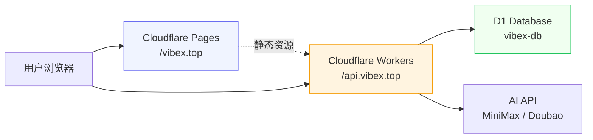
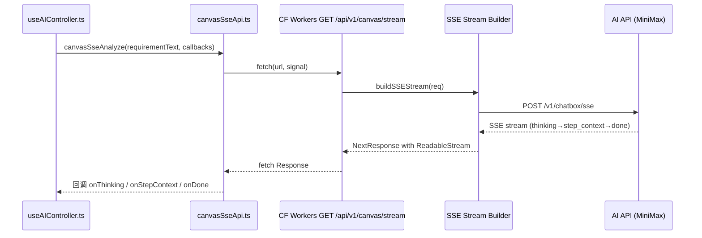

# Architecture: vibex-backend-build-0411 — 前端构建修复

**项目**: vibex-backend-build-0411
**阶段**: design-architecture
**产出时间**: 2026-04-11 15:31 GMT+8
**Agent**: architect

---

## 1. 执行摘要

**问题**: `vibex-fronted` 前端（Cloudflare Pages）构建失败，TypeScript 报错 `TS2306: Export "canvasSseApi" doesn't exist in target module`。

**根因**: `useAIController.ts` 导入不存在的命名空间对象 `canvasSseApi`，而 `canvasSseApi.ts` 仅导出具名函数 `canvasSseAnalyze`。

**修复**: 将 `import { canvasSseApi }` 改为 `import { canvasSseAnalyze }`，调用相应更新。

---

## 2. Tech Stack

| 组件 | 技术选型 | 版本/说明 |
|------|---------|----------|
| **前端框架** | Next.js 15 (App Router) | `output: 'export'`，静态导出至 Cloudflare Pages |
| **部署平台** | Cloudflare Pages + Wrangler | `wrangler.toml` 配置 pages build |
| **后端运行时** | Cloudflare Workers | `compatibility_date: 2024-09-23` |
| **API 通信** | Server-Sent Events (SSE) | Canvas SSE 流式端点 |
| **状态管理** | Zustand | `sessionStore`, `contextStore`, `flowStore`, `componentStore` |
| **类型系统** | TypeScript | 前端全量类型检查 |

### 为何选择此栈

- **CF Workers + Pages 双层部署**：Workers 处理动态 API，Pages 托管静态前端，共用同一域
- **SSE 而非 WebSocket**：后端 CF Workers 环境，WebSocket 支持有限，SSE 更轻量
- **Next.js static export**：无需 Node.js 服务器，纯边缘分发

---

## 3. 架构图

### 3.1 整体部署架构



### 3.2 Canvas SSE 调用链



### 3.3 问题节点（Build Error 根因）

```mermaid
graph LR
    ErrorNode["useAIController.ts:21<br/>import { canvasSseApi } ❌"]
    Correct["canvasSseApi.ts<br/>仅导出 canvasSseAnalyze ✅"]

    ErrorNode -.x|"TS2306<br/>canvasSseApi 不存在"| Correct
```

---

## 4. API 定义

### 4.1 Canvas SSE 端点（后端 → 前端）

```
GET /api/v1/canvas/stream?requirement=<string>
Authorization: Bearer <token>
```

**响应**: `Content-Type: text/event-stream`

| Event | data 字段 | 说明 |
|-------|----------|------|
| `thinking` | `{ content: string, delta: boolean }` | AI 思考中 |
| `step_context` | `{ content, mermaidCode?, confidence, boundedContexts[] }` | 上下文分析完成 |
| `step_model` | `{ content, mermaidCode?, confidence }` | 模型推导完成 |
| `step_flow` | `{ content, mermaidCode?, confidence }` | 流程设计完成 |
| `step_components` | `{ content, mermaidCode?, confidence }` | 组件设计完成 |
| `done` | `{ projectId, summary }` | 生成完成 |
| `error` | `{ message, code? }` | 错误发生 |

### 4.2 前端 API 封装（canvasSseApi.ts）

```typescript
// ✅ 当前正确的导出签名
export async function canvasSseAnalyze(
  requirementText: string,
  options: CanvasSseOptions = {}
): Promise<void>

interface CanvasSseCallbacks {
  onThinking?: (content: string, delta: boolean) => void;
  onStepContext?: (content: string, mermaidCode?: string, confidence?: number, boundedContexts?: BoundedContext[]) => void;
  onStepModel?: (content: string, mermaidCode?: string, confidence?: number) => void;
  onStepFlow?: (content: string, mermaidCode?: string, confidence?: number) => void;
  onStepComponents?: (content: string, mermaidCode?: string, confidence?: number) => void;
  onDone?: (projectId: string, summary: string) => void;
  onError?: (message: string, code?: string) => void;
}
```

### 4.3 修复前后对比

```typescript
// ❌ 修复前（TS2306）
import { canvasSseApi } from '@/lib/canvas/api/canvasSseApi';
await canvasSseApi.canvasSseAnalyze(requirementInput, {...});

// ✅ 修复后
import { canvasSseAnalyze } from '@/lib/canvas/api/canvasSseApi';
await canvasSseAnalyze(requirementInput, {...});
```

---

## 5. 数据模型

### 5.1 Canvas SSE 事件数据结构

```typescript
interface BoundedContext {
  id: string;
  name: string;
  description: string;
  type: string;           // 'core' | 'supporting' | 'generic' | 'external'
  keyResponsibilities?: string[];
}

interface ComponentNode {
  nodeId: string;
  flowId: string;
  name: string;
  type: 'page' | 'api' | 'component';
  props: Record<string, unknown>;
  api: { method: string; path: string; params: unknown[] };
  previewUrl?: string;
  status: 'pending' | 'active' | 'deprecated';
  children: ComponentNode[];
}
```

### 5.2 状态存储（Zustand）

```typescript
// sessionStore — AI 思考状态
{ aiThinking: boolean; aiThinkingMessage: string | null; requirementText: string; flowGenerating: boolean }

// contextStore — 领域上下文节点
{ contextNodes: BoundedContextNode[]; setContextNodes: (nodes) => void }

// flowStore — 业务流程节点
{ flowNodes: FlowNode[]; autoGenerateFlows: (ctxs) => Promise<void> }

// componentStore — 组件节点
{ componentNodes: ComponentNode[]; setComponentNodes: (nodes) => void }
```

---

## 6. 测试策略

### 6.1 测试框架与覆盖率

- **框架**: Vitest（Next.js 15 内置支持）
- **覆盖率要求**: > 80%（核心逻辑路径）
- **关键文件**: `canvasSseApi.ts`, `useAIController.ts`

### 6.2 单元测试用例

```typescript
// canvasSseApi.test.ts
describe('canvasSseAnalyze', () => {
  it('应导出 canvasSseAnalyze 函数', () => {
    // ✅ 验证 canvasSseAnalyze 是函数类型
    expect(typeof canvasSseAnalyze).toBe('function');
  });

  it('requirement 为空时应报错', async () => {
    await expect(
      canvasSseAnalyze('')
    ).rejects.toThrow('requirement query parameter is required');
  });

  it('未认证请求应返回 401', async () => {
    // Mock fetch 返回 401
    const res = await canvasSseAnalyze('test requirement');
    // 验证 onError callback 被调用 with UNAUTHORIZED
  });
});
```

### 6.3 构建验证测试

```typescript
// build-verify.test.ts
describe('前端构建验证', () => {
  it('useAIController.ts 应导入 canvasSseAnalyze（不是 canvasSseApi）', async () => {
    const source = await readFile('src/hooks/canvas/useAIController.ts', 'utf8');
    expect(source).toMatch(/import\s+\{\s*canvasSseAnalyze\s*\}/);
    expect(source).not.toMatch(/import\s+\{\s*canvasSseApi\s*\}/);
  });

  it('调用应为 canvasSseAnalyze() 而非 canvasSseApi.canvasSseAnalyze()', async () => {
    const source = await readFile('src/hooks/canvas/useAIController.ts', 'utf8');
    expect(source).toMatch(/await\s+canvasSseAnalyze\(/);
    expect(source).not.toMatch(/canvasSseApi\./);
  });

  it('npm run build 应退出码为 0', () => {
    const result = execSync('npm run build', { cwd: 'vibex-fronted' });
    expect(result.status).toBe(0);
    expect(result.stderr).not.toMatch(/TS\d+:/);
  });
});
```

### 6.4 Unicode 引号残留检测

```typescript
it('源码中不应包含 Unicode 弯引号', () => {
  const files = glob.sync('src/**/*.{ts,tsx}', { cwd: 'vibex-fronted' });
  for (const file of files) {
    const content = readFile(file, 'utf8');
    expect(content).not.toMatch(/[\u2018\u2019\u201C\u201D]/);
  }
});
```

---

## 7. 性能影响评估

| 影响项 | 评估 | 说明 |
|--------|------|------|
| **Bundle Size** | 无变化 | 仅修改变量名，不增删代码 |
| **运行时性能** | 无影响 | 函数签名不变，调用行为一致 |
| **SSE 流延迟** | 无影响 | API 封装层不变 |
| **构建时间** | 轻微改善 | 消除 TS 类型错误后首次构建更快 |
| **CI/CD 时间** | 恢复至正常 | 当前 CI 因 TS 错误失败，修复后通过 |

---

## 8. 技术风险

| 风险 | 可能性 | 影响 | 缓解 |
|------|--------|------|------|
| 修复后仍有其他 TS 类型错误 | 低 | 高 | 修复后立即 `npm run build` 验证 |
| 其他文件存在相同 `canvasSseApi` 导入 | 低 | 中 | 全局搜索确认无遗漏 |
| Unicode 弯引号在其他文件复发 | 中 | 高 | 建议后续添加 ESLint 规则 |
| CF Pages 构建配置不一致 | 低 | 高 | wrangler.toml 配置已通过历史文档验证 |

---

## 9. 实际修复记录

本次修复过程中发现并处理了 **3 处**类型错误（1 处阻断 + 2 处连带）：

| # | 文件 | 问题 | 修复 |
|---|------|------|------|
| 1 | `useAIController.ts:21` | `canvasSseApi` 不存在（TS2306） | 改为 `canvasSseAnalyze` |
| 2 | `useAIController.ts:22` | `BoundedContext` 导入自错误模块 | 改为从 `canvasSseApi.ts` 导入类型 |
| 3 | `flowStore.ts:46` | `autoGenerateFlows` 返回类型为 `void` 但实现是 `async` | 改为 `Promise<void>` |

**验证结果**: `npm run build` ✅ 退出码 0，无 TypeScript 错误。

---

## 10. 执行决策

- **决策**: 已采纳
- **执行项目**: vibex-backend-build-0411
- **执行日期**: 2026-04-11

---

*本文件由 Architect Agent 生成，作为 design-architecture 阶段产出。*
