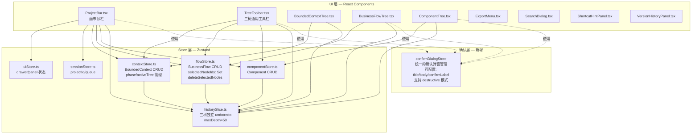

# Architecture: Canvas 按钮审查与清理

> **项目**: vibex-canvas-button-audit-proposal
> **版本**: 1.0
> **日期**: 2026-04-10
> **角色**: Architect
> **输入**: prd.md（Analyst 需求澄清报告）

---

## 一、问题诊断

### 1.1 根因分析

通过代码审查，发现以下根因：

| 问题 | 根因定位 | 严重度 |
|------|----------|--------|
| P0: Flow 删除无 undo | `flowStore.deleteFlowNode` 已有 `recordSnapshot`；但 `deleteSelectedNodes('flow')` 对 flow 树只清空选择、不删节点 | P0 |
| P1: 语义混淆 | 三树 Toolbar 按钮文案不统一：`✓全选` / `○取消` / `✕清空` — "取消"语义模糊 | P1 |
| P2: 清空无确认 | `componentStore.clearComponentCanvas` 无确认弹窗；`flowStore.resetFlowCanvas` 无确认弹窗 | P1 |
| P3: 重新生成文案 | `BusinessFlowTree` 中按钮文案为 "🔄 重新生成流程树"，无 tooltip 说明覆盖行为 | P2 |
| P4: Context 重置语义不明 | `TreeToolbar` 中 `onReset` prop 传入但未在任何树中使用；`resetFlowCanvas` 语义不清 | P2 |
| P5: ProjectBar 按钮拥挤 | `ProjectBar.tsx` 当前有 10+ 个按钮/图标直接展示，无收拢机制 | P2 |

### 1.2 P0 核心问题确认

**`deleteSelectedNodes('flow')` 的 bug**：在 `contextStore.deleteSelectedNodes` 中，flow 分支只清空 `selectedNodeIds.flow`，没有实际删除 flowStore 中的节点。

```ts
// contextStore.ts — 问题代码
if (tree === 'flow' && selectedNodeIds.flow.length > 0) {
  // ❌ 只清空了选择状态，没有调用 flowStore.deleteSelectedNodes()
  set({ selectedNodeIds: { ...selectedNodeIds, flow: [] } });
}
```

Flow 树的实际删除路径是 `FlowCard` 组件中的 `deleteFlowNode`（每张卡片自己的删除按钮），该函数**已有** `recordSnapshot`，所以单卡删除有 undo。但 TreeToolbar 的批量删除按钮对 flow 树无效（只清选择，不删节点）。

---

## 二、架构图



---

## 三、技术决策

### ADR-001: 统一确认弹窗机制

**状态**: Proposed

**上下文**: 当前三树清空/删除操作使用 `window.confirm()`，行为不一致且无法统一控制样式。

**决策**:
- 新增 `useConfirmDialog` hook / `confirmDialogStore`，提供统一 API
- 签名：`confirm({ title, body, destructive?, confirmLabel? }): Promise<boolean>`
- P2（破坏性操作）使用 destructive 样式（红色确认按钮）
- 三树所有高危操作（清空、删除全部、批量删除）均通过此 API

**后果**:
- 正面：统一 UX，便于样式管理和行为追踪
- 负面：引入新 store，需确保 SSR 安全（client-only）

### ADR-002: Flow 树批量删除修复

**状态**: Proposed

**上下文**: `contextStore.deleteSelectedNodes('flow')` 对 flow 树只清空选择状态，不调用 `flowStore.deleteSelectedNodes()`。

**决策**:
- 修改 `contextStore.deleteSelectedNodes`，对 flow 分支调用 `flowStore.deleteSelectedNodes()`
- `flowStore.deleteSelectedNodes` 已调用 `recordSnapshot`，无需额外修改

**后果**:
- 正面：flow 树批量删除可 undo
- 负面：需要从 contextStore 引用 flowStore（打破 store 边界，但符合现有模式，如 ProjectBar.tsx）

### ADR-003: 语义统一规范

**状态**: Proposed

**上下文**: 三树工具栏按钮文案不一致。

**决策**:

| 操作 | 规范文案 | 说明 |
|------|----------|------|
| 全选 | `✓ 全选` | 保持不变 |
| 取消选择 | `○ 取消选择` | 原 "取消" → "取消选择"，消除歧义 |
| 清空画布 | `✕ 清空画布` | 改为带"画布"字样，明确作用范围 |
| 重新生成 | `🔄 重新生成` + tooltip="基于已确认上下文重新生成流程树，清空后重建" | 明确覆盖行为 |
| 重置画布（Flow） | `↺ 清空流程` | 明确语义为"清空"而非"撤销" |

### ADR-004: ProjectBar 按钮收拢

**状态**: Proposed（依赖 UX 设计）

**上下文**: ProjectBar 有 10+ 个按钮，影响核心操作发现性。

**决策**:
- 核心按钮（≤5）直接展示：`项目名称` / `UndoRedo` / `搜索` / `导出` / `创建项目`
- 次要按钮收拢到下拉菜单：`?` / `历史` / `消息` / `需求`
- ZoomControls 在有 canvas 时展示（由父组件控制）

**后果**:
- 正面：减少视觉噪音，提高核心操作效率
- 负面：低频操作多一步点击

---

## 四、修改清单

### P0 修复（Must Have）

| # | 文件 | 修改内容 |
|---|------|----------|
| P0-1 | `contextStore.ts` | `deleteSelectedNodes('flow')` 分支调用 `flowStore.deleteSelectedNodes()` |

### P1 修复（Must Have）

| # | 文件 | 修改内容 |
|---|------|----------|
| P1-1 | `TreeToolbar.tsx` | "取消" → "取消选择" |
| P1-2 | `TreeToolbar.tsx` | "清空" → "✕ 清空画布" |
| P1-3 | `TreeToolbar.tsx` | 传入 `treeLabel` prop，动态生成文案（如"清空上下文树"） |

### P2 修复（Must Have）

| # | 文件 | 修改内容 |
|---|------|----------|
| P2-1 | `confirmDialogStore.ts`（新增） | 统一确认弹窗 store/hook |
| P2-2 | `componentStore.ts` | `clearComponentCanvas` 使用统一 confirm 替代 `window.confirm` |
| P2-3 | `flowStore.ts` | `resetFlowCanvas` 使用统一 confirm |
| P2-4 | `ComponentTree.tsx` | `handleClearCanvas` 使用 confirmDialogStore |
| P2-5 | `BusinessFlowTree.tsx` | TreeToolbar 的 `onReset` 使用 confirmDialogStore |
| P2-6 | `TreeToolbar.tsx` | `onReset` 使用 confirmDialogStore |

### P3 修复（Should Have）

| # | 文件 | 修改内容 |
|---|------|----------|
| P3-1 | `BusinessFlowTree.tsx` | "重新生成流程树" → "🔄 重新生成" + `title="基于已确认上下文重新生成，清空后重建"` |

### P4 修复（Should Have）

| # | 文件 | 修改内容 |
|---|------|----------|
| P4-1 | `TreeToolbar.tsx` | `onReset` 改为明确文案 `↺ 清空流程` + tooltip |
| P4-2 | `flowStore.ts` | `resetFlowCanvas` 重命名为 `clearFlowCanvas`，docstring 明确语义 |

### P5 设计方案（Should Have，依赖 UX）

| # | 文件 | 修改内容 |
|---|------|----------|
| P5-1 | `ProjectBar.tsx` | 实现下拉菜单，核心按钮 ≤5 个直接展示 |
| P5-2 | `Figma`（待设计） | 收拢菜单样式设计稿 |

---

## 五、API 定义

### 5.1 新增 — confirmDialogStore

```ts
// src/stores/confirmDialogStore.ts
interface ConfirmDialogOptions {
  title: string;           // 对话框标题
  body: string;            // 说明文字
  destructive?: boolean;   // true = 红色确认按钮
  confirmLabel?: string;   // 确认按钮文案，默认"确认"
  cancelLabel?: string;    // 取消按钮文案，默认"取消"
}

interface ConfirmDialogStore {
  isOpen: boolean;
  options: ConfirmDialogOptions | null;
  resolve: ((result: boolean) => void) | null;

  // Actions
  confirm: (options: ConfirmDialogOptions) => Promise<boolean>;
  resolveAndClose: (result: boolean) => void;
}

// Usage:
const confirmed = await useConfirmDialog.getState().confirm({
  title: '清空组件树',
  body: '确定清空全部组件节点吗？此操作不可撤销。',
  destructive: true,
  confirmLabel: '确认清空',
});
```

### 5.2 修改 — flowStore.deleteSelectedNodes

```ts
// flowStore.ts — 已有，验证签名兼容
deleteSelectedNodes: () => {
  // ✅ 已调用 recordSnapshot
  // ✅ 返回 selectedNodeIds: new Set()
  // ✅ 幂等（空集时无操作）
}
```

### 5.3 修改 — contextStore.deleteSelectedNodes

```ts
// contextStore.ts — 修改 flow 分支
deleteSelectedNodes: (tree: TreeType) => {
  if (tree === 'flow' && selectedNodeIds.flow.length > 0) {
    // ✅ 修复：调用 flowStore 的批量删除
    useFlowStore.getState().deleteSelectedNodes();
    set({ selectedNodeIds: { ...selectedNodeIds, flow: [] } });
    return;
  }
  // ... context 分支保持不变
}
```

### 5.4 修改 — TreeToolbar props

```ts
// TreeToolbar.tsx — 新增/修改 props
interface TreeToolbarProps {
  // ...existing
  treeLabel?: string;  // 新增：用于动态生成文案，如"上下文树"

  // onClear 语义改为"清空画布"
  onClear: () => void;  // ✅ 已有

  // onReset 改为明确语义
  onReset?: () => void; // 重新命名 docstring：清空当前树内容
}
```

---

## 六、数据模型

本次修改不涉及数据模型变更。三树节点类型保持不变：

```ts
// src/lib/canvas/types.ts — 已有，不修改
type BoundedContextNode = { nodeId, name, description, type, status, isActive, children }
type BusinessFlowNode = { nodeId, contextId, name, steps, status, isActive, children }
type ComponentNode = { nodeId, flowId, name, type, props, api, previewUrl, status, children }
```

historySlice 不需要修改，`recordSnapshot` / `undo` / `redo` 接口不变。

---

## 七、测试策略

### 7.1 测试框架

- 单元测试：**Vitest** + `@testing-library/react`
- E2E 测试：**Playwright**
- 覆盖目标：**> 80%** 核心路径

### 7.2 核心测试用例

```ts
// tests/unit/stores/flowStore.test.ts

describe('P0: Flow 树删除 undo', () => {
  it('flowStore.deleteSelectedNodes 应记录 history 快照', () => {
    const store = createFlowStore();
    store.setFlowNodes([mockNode('a'), mockNode('b')]);
    store.selectAllNodes(); // selectedNodeIds = { 'a', 'b' }

    const beforeCount = getHistoryStore().getState().flowHistory.past.length;
    store.deleteSelectedNodes();
    const afterCount = getHistoryStore().getState().flowHistory.past.length;

    expect(afterCount).toBe(beforeCount + 1);
    expect(store.getState().flowNodes).toHaveLength(0);
  });

  it('flowStore.deleteSelectedNodes 应幂等（空集无操作）', () => {
    const store = createFlowStore();
    store.deleteSelectedNodes(); // 无节点，无选中
    // 不应报错
  });

  it('contextStore.deleteSelectedNodes(flow) 应调用 flowStore.deleteSelectedNodes', () => {
    const ctxStore = createContextStore();
    const flowStore = getFlowStore(); // 已有节点
    ctxStore.setSelectedNodeIds({ context: [], flow: ['f1'] });

    ctxStore.deleteSelectedNodes('flow');
    // 验证 flowStore 中节点已删除
    expect(flowStore.getState().flowNodes).toHaveLength(0);
  });
});

// tests/unit/components/canvas/TreeToolbar.test.tsx

describe('P1: 语义统一', () => {
  it('三树 Toolbar 文案统一：取消选择 / 清空画布', () => {
    render(<TreeToolbar treeType="context" treeLabel="上下文树" ... />);
    expect(screen.getByText('✓ 全选')).toBeInTheDocument();
    expect(screen.getByText('○ 取消选择')).toBeInTheDocument();
    expect(screen.getByText('✕ 清空画布')).toBeInTheDocument();
  });
});

// tests/unit/stores/confirmDialogStore.test.ts

describe('P2: 统一确认弹窗', () => {
  it('confirm 应返回 Promise<boolean>', async () => {
    const result = useConfirmDialog.getState().confirm({
      title: '测试',
      body: '测试内容',
    });
    expect(useConfirmDialog.getState().isOpen).toBe(true);
    useConfirmDialog.getState().resolveAndClose(true);
    expect(await result).toBe(true);
  });

  it('destructive=true 确认按钮应为红色', () => {
    useConfirmDialog.getState().confirm({ title: 'X', body: '', destructive: true });
    // 验证渲染的按钮 class 包含 destructive 样式
  });
});
```

### 7.3 E2E 测试用例

```ts
// tests/e2e/canvas-button-audit.spec.ts

test('P0: Flow 树批量删除后 Ctrl+Z 可撤销', async ({ page }) => {
  await page.goto('/canvas');
  // 生成 flow 节点
  await generateFlowNodes(page);
  // 全选
  await page.click('[aria-label="全选"]');
  // 批量删除
  await page.click('[aria-label="删除 (2)"]');
  // 验证节点消失
  await expect(page.locator('[data-testid="flow-card"]')).toHaveCount(0);
  // Ctrl+Z 撤销
  await page.keyboard.press('Control+z');
  // 验证节点恢复
  await expect(page.locator('[data-testid="flow-card"]')).toHaveCount(2);
});

test('P2: 清空画布前弹出确认对话框', async ({ page }) => {
  await page.goto('/canvas');
  await generateComponentNodes(page);
  await page.click('[aria-label="清空画布"]');
  // 验证确认对话框
  await expect(page.locator('dialog')).toBeVisible();
  await expect(page.locator('dialog')).toContainText('清空组件树');
  await expect(page.locator('dialog')).toContainText('此操作不可撤销');
});
```

---

## 八、技术风险

| 风险 | 等级 | 缓解措施 |
|------|------|----------|
| 新增 confirmDialogStore 引入状态复杂度 | 中 | 使用简单 zustand store，不引入外部依赖 |
| contextStore 引用 flowStore 打破 store 边界 | 低 | 已有先例（ProjectBar.tsx），遵循现有模式 |
| P5 需要 Figma 设计稿阻塞开发 | 中 | P0/P1/P2 可并行开发，P5 独立 Epic |
| 回归风险：修改 TreeToolbar 文案影响现有测试 | 低 | 已有测试用例名称基于 aria-label，不依赖文案 |

---

## 九、依赖关系

```
P0 (deleteSelectedNodes 修复)
    │
    ├── 修改: contextStore.ts
    └── 测试: flowStore.test.ts

P1 (语义统一)
    │
    ├── 修改: TreeToolbar.tsx
    └── 测试: TreeToolbar.test.tsx

P2 (统一确认弹窗) ← P0/P1 可并行
    │
    ├── 新增: confirmDialogStore.ts
    ├── 修改: componentStore.ts / flowStore.ts
    ├── 修改: ComponentTree.tsx / BusinessFlowTree.tsx / TreeToolbar.tsx
    └── 测试: confirmDialogStore.test.ts / e2e/canvas-button-audit.spec.ts

P3/P4 (文案 + 语义明确)
    │
    ├── 修改: BusinessFlowTree.tsx / TreeToolbar.tsx / flowStore.ts
    └── 低风险，可与 P2 并行

P5 (ProjectBar 收拢) ← 依赖 UX 设计
    │
    ├── Figma 设计稿
    ├── 修改: ProjectBar.tsx
    └── 测试: e2e/ProjectBar.spec.ts
```

---

## 执行决策

- **决策**: 已采纳
- **执行项目**: vibex-canvas-button-audit-proposal
- **执行日期**: 2026-04-10
