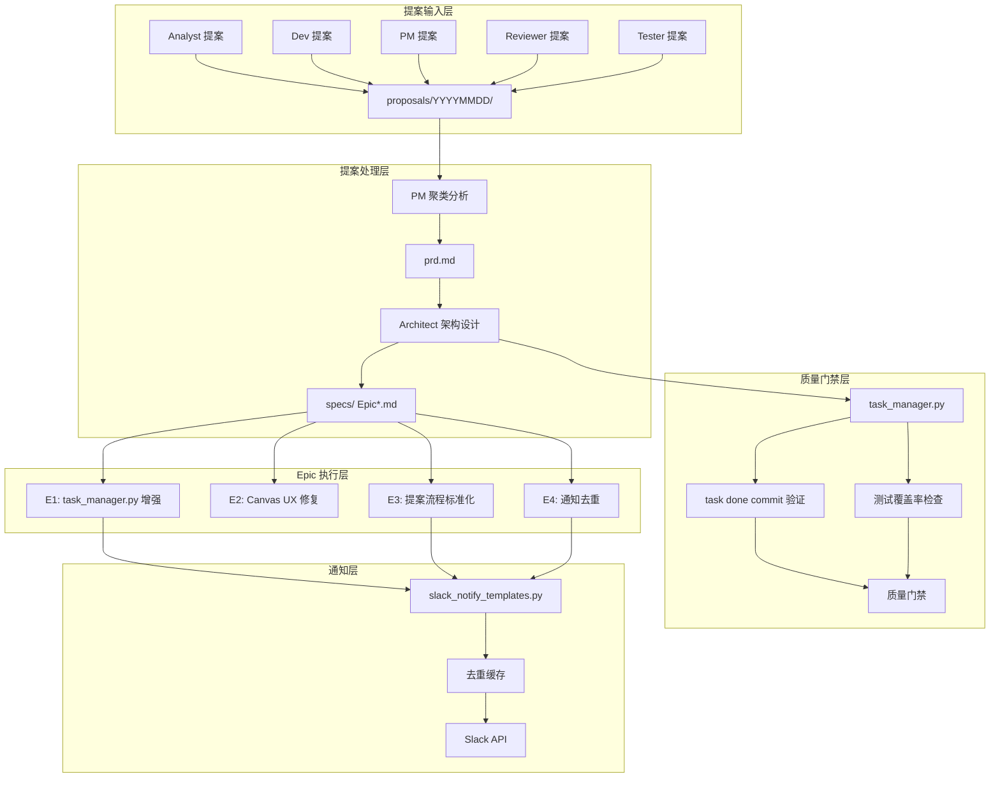
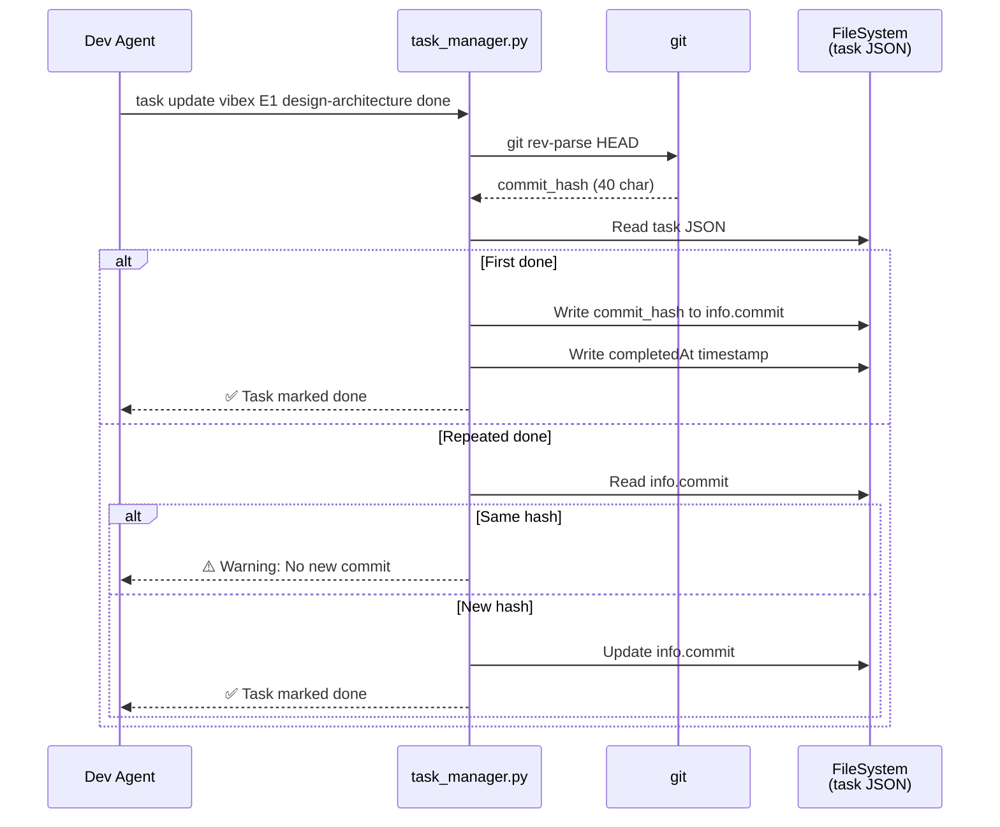
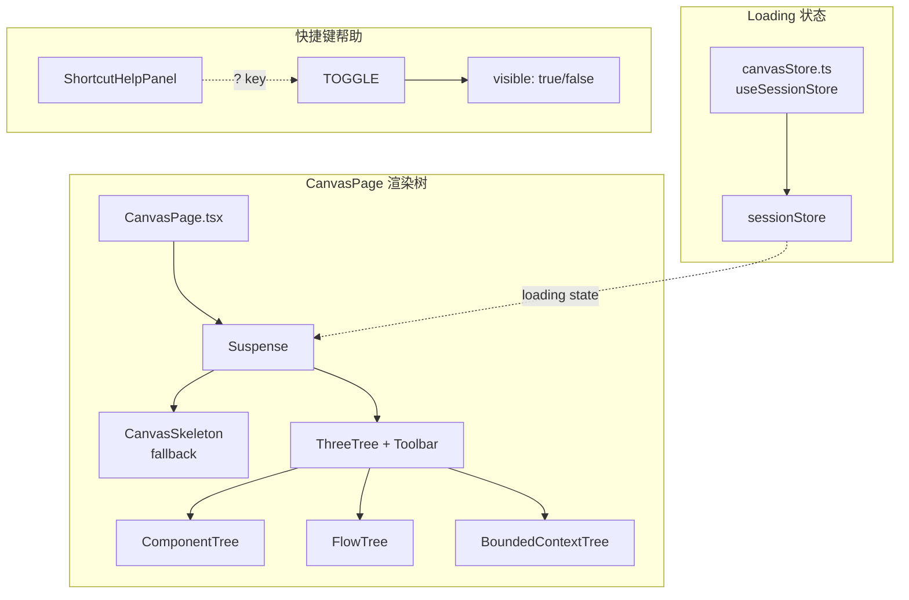
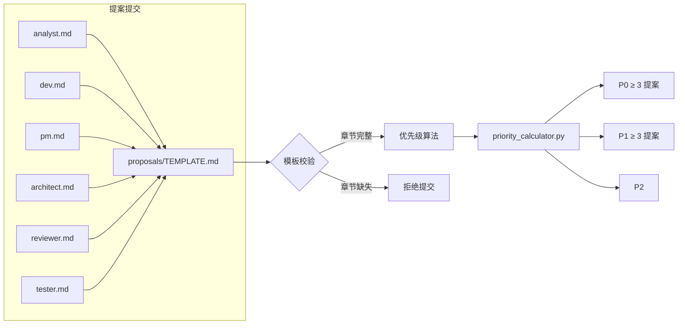

# Architecture — vibex-proposals-20260404

**项目**: vibex-proposals-20260404
**Architect**: Architect Agent
**日期**: 2026-04-04
**仓库**: /root/.openclaw/vibex

---

## 1. 执行摘要

本架构覆盖 4 个 Epic，从提案转化为可执行任务：

| Epic | 名称 | 影响文件 | 工时 | 风险 |
|------|------|----------|------|------|
| E1 | 任务质量门禁 | `task_manager.py` | 3-4h | 低 |
| E2 | Canvas UX 修复 | `CanvasPage.tsx` / `canvasStore.ts` | 4-5h | 低 |
| E3 | 提案流程优化 | `proposals/` / `AGENTS.md` | 5-6h | 低 |
| E4 | 通知体验优化 | `slack_notify_templates.py` | 1-2h | 低 |

**总工时**: 13-17h（2-3 Sprint 天）

---

## 2. 系统架构图

### 2.1 整体架构



### 2.2 Epic1: 任务质量门禁数据流



### 2.3 Epic2: Canvas UX 修复组件结构



### 2.4 Epic3: 提案流程优化



### 2.5 Epic4: 通知去重架构

```mermaid
sequenceDiagram
    participant CALLER as 调用方<br/>(coord/dev/architect)
    participant SN as slack_notify_templates.py
    participant CACHE as /tmp/slack_notify_dedup.json
    participant SLACK as Slack Web API

    CALLER->>SN: send_slack(channel, message)
    SN->>SN: compute_hash = md5(message)
    SN->>SN: cache_key = f"{channel}:{hash}"
    SN->>CACHE: read cache
    alt Cache hit &lt; 5min
        SN-->>CALLER: {skipped: True}
    else Cache miss or &gt; 5min
        SN->>SLACK: POST /api/chat.postMessage
        SLACK-->>SN: {ok: true}
        SN->>CACHE: write cache_key: timestamp
        SN-->>CALLER: {ok: true}
    end
```

---

## 3. 技术栈

| Epic | 技术 | 选择理由 |
|------|------|---------|
| E1 | Python 3.8+ / subprocess / JSON | 复用现有 task_manager.py |
| E2 | React 19 / CSS Modules / Suspense | 复用现有 Canvas 架构 |
| E3 | Python 3 / Markdown / JSON | 无新依赖 |
| E4 | Python 3 / hashlib / json / time | 无新依赖 |

**无新依赖引入** — 所有 Epic 均可利用现有技术栈实现。

---

## 4. 接口定义

### 4.1 task_manager.py 新增接口

```python
# 新增环境变量
GIT_REPO = os.environ.get('GIT_REPO', '/root/.openclaw')

# 新增 info 字段
class TaskInfo(TypedDict):
    project: str
    stage: str
    agent: str
    status: str
    createdAt: str
    updatedAt: str
    startedAt: Optional[str]
    completedAt: Optional[str]
    commit: Optional[str]      # E1-F1: 新增，SHA-1 hash
    blockedReason: Optional[str]
    failureReason: Optional[str]

# 新增函数
def check_test_files_in_diff(repo: str) -> tuple[bool, list[str]]:
    """检查 git diff 是否包含测试文件，返回 (has_test, changed_files)"""
    ...

def warn_if_no_new_commit(repo: str, info: dict) -> bool:
    """若 commit 未变返回 True（应警告）"""
    ...
```

### 4.2 slack_notify_templates.py 新增接口

```python
# E4-F1 新增
DEDUP_WINDOW: int = 300  # 5 分钟
DEDUP_CACHE: Path = Path('/tmp/slack_notify_dedup.json')

def _should_send(channel: str, message: str) -> bool:
    """相同 channel+message_hash 在 DEDUP_WINDOW 内返回 False"""
    ...

def send_slack(channel: str, message: str, token: str = None) -> dict:
    """发送 Slack 消息（去重后）"""
    ...
```

### 4.3 Canvas UX 组件接口

```typescript
// E2-F1 新增
interface CanvasSkeletonProps {
  testId?: string;  // default: 'canvas-skeleton'
}

// E2-F3 新增
interface ShortcutHelpPanelProps {
  visible: boolean;
  onClose: () => void;
  shortcuts: Array<{ key: string; description: string; testId: string }>;
}
```

### 4.4 proposals/priority_calculator.py（新增）

```python
from enum import Enum

class Priority(Enum):
    P0 = "P0"
    P1 = "P1"
    P2 = "P2"

def calculate_priority(impact: int, urgency: int, effort: int) -> Priority:
    """
    impact:   1-10 (用户影响范围 × 频次)
    urgency:  1-10 (紧急程度)
    effort:   1-10 (实现成本，越高越难)
    
    score = (impact * urgency) / effort
    P0: score > 0.7 × max_possible
    P1: 0.3 < score ≤ 0.7 × max_possible
    P2: score ≤ 0.3 × max_possible
    """
    ...
```

---

## 5. 数据模型

### 5.1 任务 JSON（E1 扩展）

```json
{
  "project": "vibex-proposals-20260404",
  "stage": "E1-design-architecture",
  "agent": "architect",
  "status": "done",
  "createdAt": "2026-04-04T10:00:00Z",
  "updatedAt": "2026-04-04T12:00:00Z",
  "startedAt": "2026-04-04T11:00:00Z",
  "completedAt": "2026-04-04T12:00:00Z",
  "commit": "8d6eb70f3a1b4c5d6e7f8a9b0c1d2e3f4a5b6c7"
}
```

### 5.2 提案优先级评分

```
score = (impact × urgency) / effort

其中 impact ∈ [1,10], urgency ∈ [1,10], effort ∈ [1,10]
max_score = 100 (impact=10, urgency=10, effort=1)

P0: score > 70  (impact 高且紧急且低成本)
P1: 30 < score ≤ 70
P2: score ≤ 30 (impact 低或高成本)
```

### 5.3 通知去重缓存

```json
// /tmp/slack_notify_dedup.json
{
  "#architect:abc123def456": 1712223456.789,
  "#coord:def789ghi012": 1712223512.345
}
// key: "{channel}:{md5(message)}"
// value: Unix timestamp (秒)
```

---

## 6. 性能影响评估

| Epic | 性能影响 | 评估 |
|------|---------|------|
| E1 | `git rev-parse HEAD` + 1次 JSON 写入 | < 50ms，可忽略 |
| E2 | Suspense 边界触发 skeleton 渲染 | < 10ms DOM 开销 |
| E3 | 优先级计算（纯内存） | < 1ms |
| E4 | MD5 hash + JSON read/write | < 5ms |

**结论**: 四个 Epic 均无显著性能影响。

---

## 7. 测试策略

| Epic | 测试框架 | 覆盖率要求 | 核心测试用例 |
|------|---------|-----------|------------|
| E1 | pytest | > 80% | commit 记录 / 重复 done 警告 / 测试文件检查 |
| E2 | Vitest + Playwright | > 70% | skeleton 可见消失 / ? 键快捷键面板 |
| E3 | pytest | > 80% | 优先级计算 / 模板校验 |
| E4 | pytest | > 80% | 首次发送 / 5min 内重复跳过 / 5min 后重新发送 |

### 测试文件位置

```
vibex/
├── skills/team-tasks/scripts/
│   └── test_task_manager.py          # E1
├── proposals/
│   └── test_priority_calculator.py    # E3
├── services/
│   └── test_slack_notify.py           # E4
└── vibex-fronted/src/
    └── lib/canvas/
        └── __tests__/
            └── canvasSkeleton.test.tsx   # E2
            └── shortcutHelpPanel.test.tsx # E2
```

---

*本文档由 Architect Agent 生成于 2026-04-04 18:20 GMT+8*
