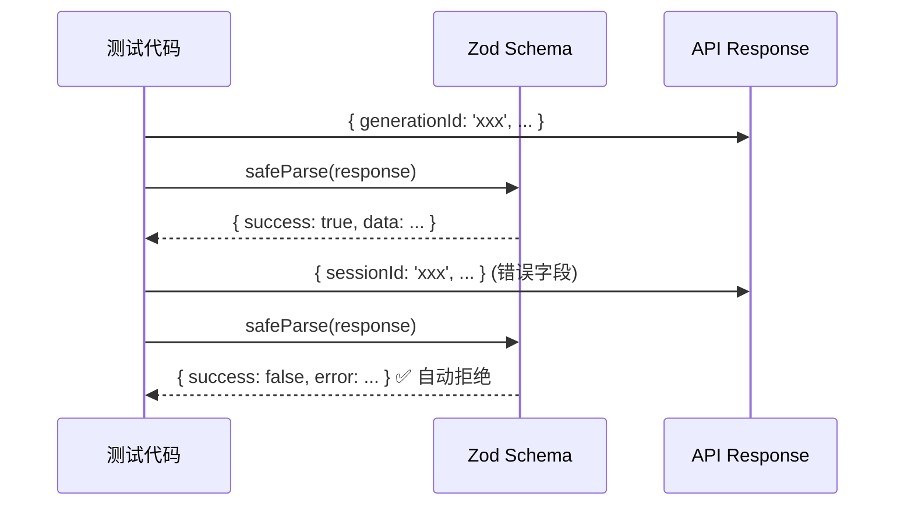

# Architecture — vibex-proposals-20260405-2

**项目**: vibex-proposals-20260405-2
**Architect**: Architect Agent
**日期**: 2026-04-05
**仓库**: /root/.openclaw/vibex

---

## 1. 执行摘要

第二轮提案聚焦 Schema 验证统一、Canvas API Mock 清理追踪和提案优先级机制。

| Epic | 名称 | 工时 | 优先级 |
|------|------|------|--------|
| E1 | Schema 验证统一（Zod） | 1h | P0 |
| E2 | Canvas API Mock 清理追踪 | 2-3h | P1 |
| E3 | API 错误处理规范 | 2h | P1 |
| E4 | 提案优先级机制 | 1h | P2 |

**总工时**: 6-7h

---

## 2. 系统架构图

### 2.1 Schema 验证演进

```mermaid
graph LR
    subgraph "旧方案：手写 validator"
        HV[手写 isValidXXX()<br/>if (obj.field) return true]
        P1["❌ 字段名硬编码 → sessionId vs generationId 不匹配"]
    end

    subgraph "新方案：Zod Schema"
        ZS["Zod Schema<br/>z.object({ field: z.string() })"]
        P2["✅ 类型推导 + 自动校验<br/>generationId 字段存在即验证通过"]
    end

    HV --> P1
    ZS --> P2

    style HV fill:#ef4444,color:#fff
    style ZS fill:#22c55e,color:#fff
```

### 2.2 Zod Schema 验证流程



---

## 3. 技术方案

### 3.1 E1: Zod Schema 替代手写 Validator

```typescript
// canvasApiValidation.ts — 改造后
import { z } from 'zod';

export const GenerateContextsResponseSchema = z.object({
  success: z.boolean(),
  contexts: z.array(BoundedContextSchema),
  generationId: z.string(),  // ✅ 正确字段
  confidence: z.number(),
});

// 手写 validator 移除
export function isValidGenerateContextsResponse(obj: unknown): boolean {
  const result = GenerateContextsResponseSchema.safeParse(obj);
  return result.success;
}
```

**与前端共享**: Zod schema 定义在 `packages/types/src/api/canvas.ts`，前后端共享同一 schema。

### 3.2 E2: Canvas API Mock 清理追踪

```python
# task_manager.py 新增命令
# task mock-coverage <project>
# 输出: 每个 API 端点的 mock/real 状态

MOCK_COVERAGE = {
    'generate-contexts': 'real',      # canvas-api-500-fix 已修复
    'generate-flows': 'mock',         # 待实现
    'generate-components': 'mock',    # 待实现
    'canvas-status': 'mock',         # 待确认
}

def report_mock_coverage():
    for endpoint, status in MOCK_COVERAGE.items():
        icon = '✅' if status == 'real' else '❌'
        print(f"{icon} {endpoint}: {status}")
```

### 3.3 E3: API 错误处理规范

```typescript
// 所有 Canvas API 统一错误响应
interface CanvasAPIError {
  success: false;
  data: null;
  error: string;      // 人类可读错误
  code?: string;      // 机器可读错误码
  generationId: '';    // 失败时为空字符串
}

// 错误码规范
type ErrorCode =
  | 'VALIDATION_ERROR'   // 400
  | 'API_KEY_MISSING'    // 500
  | 'AI_SERVICE_ERROR'   // 500
  | 'INTERNAL_ERROR';    // 500
```

### 3.4 E4: 提案优先级机制

```python
# proposals/priority_calculator.py
def calculate_priority(impact: int, urgency: int, effort: int) -> str:
    """
    优先级评分公式
    score = (impact * urgency) / effort
    P0: score > 0.7 * max(100)
    P1: 0.3 * max(100) < score <= 0.7 * max(100)
    P2: score <= 0.3 * max(100)
    """
    score = (impact * urgency) / effort
    max_score = 100
    if score > 0.7 * max_score:
        return 'P0'
    elif score > 0.3 * max_score:
        return 'P1'
    else:
        return 'P2'
```

---

## 4. 接口定义

### 4.1 Zod Schema 共享

```typescript
// packages/types/src/api/canvas.ts
export const GenerateContextsResponseSchema = z.object({
  success: z.boolean(),
  contexts: z.array(BoundedContextSchema),
  generationId: z.string(),
  confidence: z.number(),
});

export type GenerateContextsResponse = z.infer<typeof GenerateContextsResponseSchema>;
```

---

## 5. 测试策略

| Epic | 测试方式 | 覆盖率目标 |
|------|---------|-----------|
| E1 | Vitest 单元测试 | > 90% |
| E2 | mock-coverage 命令 | 手动 |
| E3 | API E2E 测试 | > 80% |
| E4 | pytest 边界用例 | > 80% |

---

## 6. 性能影响评估

无负面性能影响。Zod schema 校验比手写 validator 更快（native code）。

---

*本文档由 Architect Agent 生成于 2026-04-05 02:25 GMT+8*
